# Journalist Bot 2.0 - Product Requirements Document

## Document Information
- **Version:** 2.1
- **Date:** December 26, 2025
- **Status:** Approved for Implementation
- **Author:** System Design
- **Reviewers:** Senior Architect

---

## Executive Summary

This document outlines the transformation of the Journalist bot from a reactive journaling companion into a proactive **Lifelog-Aware Journaling System**. The system leverages automatically-captured life data (calendar events, fitness activities, emails, media consumption, etc.) to generate insightful morning summaries and contextual follow-up questions that help users document their lives effortlessly.

### Key Architectural Principles

- **Multi-User First**: Full integration with UserDataService, UserResolver, and per-user data isolation
- **User-Namespaced Storage**: All lifelog data stored at `users/{username}/lifelog/*`
- **Existing Infrastructure**: Leverages proven harvest.js pattern, state/cron.yml scheduling
- **Hierarchical AI Summarization**: Prevents context window explosion with multi-stage summarization
- **Graceful Degradation**: Functions intelligently even when data sources are incomplete
- **Lifelog Context is Essential**: Generic questions without lifelog integration would not differentiate this product
- **Extensible by Design**: New harvesters easily added via configuration

### Product Context

- **User Validation**: Target user has confirmed that detailed morning summaries are a critical feature
- **Historical Performance**: Prior to 2024 system failure, users had daily engagement with high retention
- **Cost Budget**: $0.90/month per user is acceptable for MVP
- **Success Metrics**: Increased user engagement and retention (entries per week, session duration)

---

## Part 1: Current System Analysis

### 1.1 Architecture Overview

The existing Journalist bot follows a clean hexagonal architecture:

```
journalist/
├── container.mjs          # Dependency Injection Container
├── server.mjs             # Express Router
├── adapters/
│   └── JournalistInputRouter.mjs
├── application/
│   ├── ports/             # Repository interfaces
│   └── usecases/          # Business logic
├── domain/
│   ├── entities/          # JournalEntry, ConversationMessage
│   ├── services/          # PromptBuilder, QueueManager
│   └── value-objects/     # EntrySource, PromptType
└── handlers/
    ├── journal.mjs        # Journal export
    └── trigger.mjs        # HTTP trigger
```

### 1.2 Current Capabilities

| Use Case | Description |
|----------|-------------|
| ProcessTextEntry | Core journaling - saves text, generates AI follow-ups |
| ProcessVoiceEntry | Transcribes voice → delegates to ProcessTextEntry |
| InitiateJournalPrompt | Starts journaling with opening question |
| HandleCallbackResponse | Processes button selections |
| GenerateTherapistAnalysis | AI emotional analysis of entries |
| ExportJournalMarkdown | Exports entries as markdown |

### 1.3 Multi-User Support (Already Implemented)

✅ **Existing multi-user infrastructure:**
- UserResolver mapping Telegram user IDs to system usernames
- User-namespaced storage via `storage.getJournalPath(userId)`
- Integration with ConfigService.getAllUserProfiles()
- Per-user lifelog data at `users/{username}/lifelog/*`

### 1.4 Current Limitations

1. **Reactive Only**: Bot only responds when user initiates contact
2. **No Context Awareness**: Unaware of user's calendar, activities, location
3. **No Daily Structure**: No morning briefing or daily review concept
4. **Generic Questions**: AI generates questions without external context
5. **No Lifelog Integration**: Doesn't leverage existing harvester infrastructure

---

## Part 2: Vision & Requirements

### 2.1 Core Concept: The Morning Debrief

Every morning (or user's preferred time), Journalist will:

1. **Aggregate Yesterday's Lifelog Data** from all connected sources
2. **Generate an Insightful AI Summary** highlighting patterns and anomalies
3. **Present an Interactive Briefing** via Telegram
4. **Offer Contextual Reflection Categories** based on what was tracked
5. **Enable Easy Response** via voice, text, or keyboard buttons

### 2.2 User Experience

**Note:** Users do NOT see raw metrics. The AI analyzes lifelog data and generates an insightful, conversational summary.

```
┌─────────────────────────────────────────────────────────────────────┐
│                    MORNING DEBRIEF (8:00 AM)                        │
├─────────────────────────────────────────────────────────────────────┤
│  📅 Good morning! Let's review yesterday (Dec 25)                   │
│                                                                     │
│  Yesterday you spent 4 hours at Korean School, then went to church  │
│  for 2 hours. You listened to a lot of Christmas music - including  │
│  "Carol of the Bells" which I noticed you haven't played in a while.│
│  Your activity was lighter than usual (under 7,000 steps), and your │
│  sleep was a bit short at 6 hours.                                  │

    I have some specific question areas about what I observed from yesterday:
    1) Playlist and Media
    2) Health and Fitness
    3) Events and People

│  Also I’d like to know more about what you did and how you felt yesterday.|
│  Here are some topics I’d like to hear you talk about:              │

|  🅰: “What I did when the kids were at Korean School”
|  🅱: “Health and fitness update”
|  🅲: “Music and Movies I’ve been into recently”
|  🅳: “Work and tasks I completed”
|  🅴: “Home life and antics from the Kids”
│                                                                     │
│  Or tell me what's on your mind...                                  │
└─────────────────────────────────────────────────────────────────────┘
```

**Key UX Principles:**
- AI acts as a research assistant analyzing raw data
- Surfaces trends, consistencies, anomalies ("first time in a while", "lighter than usual")
- Conversational tone, not metric dumps
- Suggests 3 specific reflection areas based on what happened
- User can choose a category or free-write

### 2.3 Multi-User Architecture

**Per-User Debriefs:**
- Each user gets their own debrief based on personal lifelog data
- User profiles specify preferred debrief time via `preferences.morningDebriefTime`
- UserResolver maps Telegram user ID → system username
- Lifelog data is user-namespaced: `users/{username}/lifelog/*`
- Cron jobs trigger per-user debrief generation

**Shared Calendar Handling:**
- Events are per-user, even if family attends together
- Each user's calendar harvester fetches THEIR calendar
- Questions reference "you" (2nd person) because data is personal

**Per-User Scheduling:**
- Some journal first thing in the morning (6-8 AM)
- Others prefer lunch time (12-1 PM)
- Some reflect before bed (9-11 PM)
- System supports all use cases via user profile configuration

---

## Part 3: Technical Design

### 3.1 Enhanced Architecture

```
journalist/
├── container.mjs              # Enhanced DI Container
├── server.mjs                 # Express Router + /morning endpoint
├── config.yaml                # Bot configuration
│
├── adapters/
│   ├── JournalistInputRouter.mjs
│   └── LifelogAggregator.mjs  # NEW: Reads lifelog YAML files
│
├── application/
│   ├── ports/
│   │   ├── IJournalEntryRepository.mjs
│   │   ├── ILifelogRepository.mjs     # NEW
│   │   └── ISummaryGenerator.mjs      # NEW
│   │
│   └── usecases/
│       │── ProcessTextEntry.mjs
│       │── ProcessVoiceEntry.mjs
│       │── InitiateJournalPrompt.mjs
│       │
│       │── # Morning Debrief Use Cases (NEW)
│       │── GenerateMorningDebrief.mjs
│       │── SendMorningReport.mjs
│       │── HandleCategorySelection.mjs
│       │── GenerateContextualQuestions.mjs
│       │
│       │── # Analysis Use Cases
│       │── GenerateTherapistAnalysis.mjs
│       └── ExportJournalMarkdown.mjs
│
├── domain/
│   ├── entities/
│   │   ├── JournalEntry.mjs
│   │   ├── DailyLifelog.mjs           # NEW
│   │   └── MorningDebrief.mjs         # NEW
│   │
│   ├── services/
│   │   ├── PromptBuilder.mjs          # Enhanced with lifelog prompts
│   │   ├── LifelogSummarizer.mjs      # NEW
│   │   └── CategoryRouter.mjs         # NEW
│   │
│   └── value-objects/
│       ├── DebriefCategory.mjs        # NEW
│       └── LifelogSource.mjs          # NEW
│
├── handlers/
│   ├── journal.mjs
│   └── morning.mjs                    # NEW: HTTP endpoint for cron
│
└── infrastructure/
    └── LifelogFileRepository.mjs      # NEW: Reads lifelog YAML files
```

### 3.2 New Domain Entities

#### DailyLifelog Entity
```javascript
/**
 * Aggregates all lifelog data for a single day
 */
class DailyLifelog {
  #username;       // System username
  #date;           // YYYY-MM-DD
  #calendar;       // Array of events
  #fitness;        // Garmin/Strava data
  #health;         // Withings measurements
  #music;          // Last.fm scrobbles
  #media;          // Letterboxd/Plex
  #tasks;          // Todoist/ClickUp completions
  #emails;         // Gmail sent/received
  #locations;      // Check-ins/geolocation
  
  getAvailableSourceCount() {
    // Returns count of non-empty sources
  }
  
  hasMinimumData() {
    // Returns true if >= 2 sources have data
  }
}
```

#### MorningDebrief Entity
```javascript
/**
 * Structured morning report with categories
 */
class MorningDebrief {
  #username;
  #date;
  #lifelog;                // DailyLifelog reference
  #summaryText;            // AI-generated summary
  #availableCategories;    // Categories with sufficient data
  #suggestedQuestions;     // Pre-generated per category
  #messageId;              // Telegram message ID
  #sentAt;                 // Timestamp
}
```

### 3.3 Hierarchical AI Summarization

**Problem:** A single day could have 50+ events, 100+ music tracks, 20+ emails = massive token cost

**Solution: Three-Stage Hierarchical Summarization**

#### Stage 1: Source-Specific Summarizers (Deterministic, 0 tokens)

```javascript
// domain/services/summarizers/CalendarSummarizer.mjs
export class CalendarSummarizer {
  summarize(events) {
    // Group by time of day, filter trivial events
    // Return: { morning: [...], afternoon: [...], evening: [...] }
    // Max 200 tokens
  }
}

// domain/services/summarizers/FitnessSummarizer.mjs  
export class FitnessSummarizer {
  summarize(activities, garminData) {
    // Extract: total steps, workouts, sleep quality, heart rate
    // Max 150 tokens
  }
}
```

#### Stage 2: Daily Summary (AI, 800 tokens)

```javascript
/**
 * Generate natural language summary from source summaries
 * Input: Pre-summarized data (600 tokens)
 * Output: Friendly 3-5 sentence summary (200 tokens)
 */
function buildDailySummaryPrompt(sourceSummaries): ChatPrompt {
  const systemPrompt = `You are a thoughtful journaling companion.
  Generate a friendly summary of yesterday's activities.
  Focus on notable events, health metrics, and interesting patterns.
  Highlight anomalies: "first time in a while", "lighter than usual", etc.
  Keep it conversational and concise (3-5 sentences).`;
  
  return [
    { role: 'system', content: systemPrompt },
    { role: 'user', content: formatSummaries(sourceSummaries) }
  ];
}
```

#### Stage 3: All Contextual Questions (AI, 1,400 tokens - Single Structured Call)

```javascript
/**
 * Generate all category questions in ONE AI call
 * Input: Source summaries + daily summary (600 tokens)
 * Output: Structured JSON with 3 questions per category (800 tokens)
 */
async function generateAllCategoryQuestions(
  sourceSummaries,
  dailySummary
): Promise<CategoryQuestions> {
  const systemPrompt = `Generate 3 specific, insightful follow-up questions 
  for each category based on lifelog data. Reference actual activities, 
  patterns, and anomalies. Avoid generic questions.
  
  Return JSON:
  {
    "events": ["question1", "question2", "question3"],
    "health": ["question1", "question2", "question3"],
    "media": ["question1", "question2", "question3"],
    "tasks": ["question1", "question2", "question3"],
    "thoughts": ["question1", "question2", "question3"],
    "freewrite": ["question1", "question2", "question3"]
  }`;
  
  const response = await aiGateway.chat([
    { role: 'system', content: systemPrompt },
    { role: 'user', content: `Summary: ${dailySummary}\nData: ${JSON.stringify(sourceSummaries)}` },
  ], { 
    response_format: { type: "json_object" },
    maxTokens: 800
  });
  
  return JSON.parse(response);
}
```

#### Token Budget

| Stage | Operation | Max Tokens | Cost (Claude Sonnet) |
|-------|-----------|------------|----------------------|
| Stage 1 | Source summarization (deterministic) | 0 | $0 |
| Stage 2 | Daily summary generation | 800 | ~$0.008 |
| Stage 3 | All questions (single call) | 1,400 | ~$0.014 |
| **Total** | **Per user per day** | **2,200** | **~$0.022** |

**Monthly cost:** ~$0.66/user (well under $0.90 budget)

**Key optimizations:**
- Single AI call generates all category questions at once (eliminates 5 redundant calls)
- 27% cost savings vs. per-category approach
- Faster generation time (1 call vs. 6 sequential calls)

### 3.4 Telegram Keyboard Strategy

**Reply Keyboards for Main Interactions:**
- User responses appear in chat history (provides journaling context)
- One-time keyboards auto-hide after selection
- Persistent, discoverable UI without requiring command memorization

```javascript
// Morning debrief category selection
{
  keyboard: [
    [{ text: '📆 Events & People' }, { text: '🏃 Health & Fitness' }],
    [{ text: '🎬 Media & Culture' }, { text: '✅ Work & Tasks' }],
    [{ text: '💭 Thoughts & Reflections' }, { text: '✍️ Free Write' }]
  ],
  resize_keyboard: true,
  one_time_keyboard: true,
  input_field_placeholder: "Choose a category or type freely..."
}
```

**Inline Keyboards for Meta-Actions:**
- Only for actions that shouldn't pollute chat history
- Examples: "change subject", "skip this", "done for now"

```javascript
{
  inline_keyboard: [
    [{ text: '🎲 Different question', callback_data: 'journal:change' }],
    [{ text: '⏭️ Skip this', callback_data: 'journal:skip' }],
    [{ text: '✅ Done for now', callback_data: 'journal:done' }]
  ]
}
```

### 3.5 Comprehensive Error Handling

**Graceful Degradation at Every Level:**

| Level | Failure Scenario | Recovery Strategy |
|-------|------------------|-------------------|
| 1 | Harvester file missing | Return null, mark source unavailable |
| 2 | Insufficient data (< 2 sources) | Fall back to generic journal prompt |
| 3 | AI summary fails | Use deterministic template summary |
| 4 | AI questions fail | Use category-specific generic questions |
| 5 | Telegram delivery fails (rate limit) | Retry after 1 minute |
| 6 | Telegram delivery fails (bot blocked) | Log for admin review, don't retry |
| 7 | Cron job misses window | Support manual trigger via API |

```javascript
// Example: Partial data handling
const lifelog = await this.aggregateLifelog(username, yesterday);

if (lifelog.getAvailableSourceCount() < 2) {
  logger.info('debrief.insufficient-data', { username, sources: lifelog.getAvailableSourceCount() });
  return this.initiateGenericPrompt(username);
}

// Example: AI failure fallback
try {
  const summary = await this.aiGateway.chat(summaryPrompt, { timeout: 10000 });
} catch (error) {
  logger.error('debrief.ai-summary-failed', { username, error });
  summary = this.generateFallbackSummary(sourceSummaries);
}
```

### 3.6 Logging & Observability

**Following DaylightStation Chatbot Logging Pattern (from NutriBot):**

```javascript
import { createLogger } from '../../../../_lib/logging/index.mjs';

export class GenerateMorningDebrief {
  #logger;
  
  constructor(deps) {
    this.#logger = deps.logger || createLogger({ 
      source: 'usecase', 
      app: 'journalist' 
    });
  }
  
  async execute(input) {
    this.#logger.info('debrief.generate.start', { username, date });
    // ... implementation
    this.#logger.info('debrief.generate.complete', { username, duration });
  }
}
```

**Key Log Events:**

| Event | Level | Data | Usage |
|-------|-------|------|-------|
| `debrief.generate.start` | info | username, date | Track requests |
| `debrief.lifelog-loaded` | debug | username, sources[] | Debug availability |
| `debrief.summary-generated` | info | username, tokens | Track AI usage |
| `debrief.sent` | info | username, messageId | Track delivery |
| `debrief.category-selected` | info | username, category | Track preferences |
| `debrief.generate.failed` | error | username, error, stack | Alert on failures |

**Performance Benchmarks:**
- Lifelog aggregation: < 3s
- AI summary generation: < 5s
- Total debrief generation: < 10s

---

## Part 4: Data Sources & Integration

### 4.1 Existing Harvesters

| Source | Data Type | Endpoint | Storage Path |
|--------|-----------|----------|--------------|
| Google Calendar | Events, meetings | `/harvest/gcal?user={username}` | `users/{username}/lifelog/events.yml` |
| Gmail | Sent emails | `/harvest/gmail?user={username}` | `users/{username}/lifelog/gmail.yml` |
| Garmin | Steps, HR, sleep | `/harvest/garmin?user={username}` | `users/{username}/lifelog/garmin.yml` |
| Strava | Workouts, routes | `/harvest/strava?user={username}` | `users/{username}/lifelog/strava.yml` |
| Fitness Sync | Aggregated activity | `/harvest/fitness?user={username}` | `users/{username}/lifelog/fitness.yml` |
| Withings | Weight, body comp | `/harvest/withings?user={username}` | `users/{username}/lifelog/withings.yml` |
| Last.fm | Music history | `/harvest/lastfm?user={username}` | `users/{username}/lifelog/lastfm.yml` |
| Letterboxd | Movies watched | `/harvest/letterboxd?user={username}` | `users/{username}/lifelog/letterboxd.yml` |
| Todoist | Tasks completed | `/harvest/todoist?user={username}` | `users/{username}/lifelog/todoist.yml` |
| ClickUp | Work tasks | `/harvest/clickup?user={username}` | `users/{username}/lifelog/clickup.yml` |

### 4.2 New Harvesters Needed

| Harvester | Data Source | Priority |
|-----------|-------------|----------|
| `plex` | Plex Media Server | High |
| `swarm` | Swarm/Foursquare API | Medium |
| `photos` | Google Photos API | Medium |
| `notifications` | Phone notification export | Low |
| `locations` | Google Timeline / Overland | Low |

### 4.3 Harvest Endpoint Behavior

**From `backend/harvest.js` analysis:**
- Harvesters return JSON via HTTP GET
- Accept `?user={username}` query parameter (defaults to head of household)
- Harvesters BOTH return data AND persist to user-namespaced YAML files
- File writes use `userSaveFile(username, 'service', data)` from `io.mjs`
- LifelogAggregator reads from cached YAML files, not live API calls

### 4.4 Category Configuration

```javascript
// backend/chatbots/bots/journalist/config/categories.mjs
export const DEBRIEF_CATEGORIES = {
  events: {
    sources: ['events', 'todoist', 'clickup'],
    icon: '📆',
    label: 'Events & People',
    minItems: 1,
  },
  health: {
    sources: ['garmin', 'strava', 'withings', 'fitness', 'health'],
    icon: '🏃',
    label: 'Health & Fitness',
    minItems: 1,
  },
  media: {
    sources: ['lastfm', 'letterboxd', 'plex'],
    icon: '🎬',
    label: 'Media & Culture',
    minItems: 3,
  },
  tasks: {
    sources: ['todoist', 'clickup', 'gmail'],
    icon: '✅',
    label: 'Work & Tasks',
    minItems: 1,
  },
  thoughts: {
    sources: [],
    icon: '💭',
    label: 'Thoughts & Reflections',
    minItems: 0,  // Always available
  },
  freewrite: {
    sources: [],
    icon: '✍️',
    label: 'Free Write',
    minItems: 0,  // Always available
  },
};
```

---

## Part 5: Scheduling & Cron Integration

### 5.1 Cron System Architecture

**From `backend/cron.mjs` analysis:**
- Cron jobs defined in `state/cron.yml`
- Each job: `{ name, url, cron_tab, window, nextRun, last_run }`
- Uses CronExpressionParser with America/Los_Angeles timezone
- Jobs trigger HTTP GET requests to backend endpoints

### 5.2 Per-User Cron Jobs

**Architecture: Per-User Configurable Debrief Time**

```yaml
# state/cron.yml

# User {username}: Morning journaler (8:00 AM)
- name: journalist_morning_{username}
  url: http://localhost:3000/journalist/morning?user={username}
  cron_tab: "0 8 * * *"
  window: 15
  nextRun: null
  last_run: 0

# User spouse: Lunchtime journaler (12:00 PM)
- name: journalist_morning_spouse
  url: http://localhost:3000/journalist/morning?user=spouse
  cron_tab: "0 12 * * *"
  window: 15
  nextRun: null
  last_run: 0

# User teen: Evening journaler (9:00 PM)
- name: journalist_morning_teen
  url: http://localhost:3000/journalist/morning?user=teen
  cron_tab: "0 21 * * *"
  window: 15
  nextRun: null
  last_run: 0
```

### 5.3 User Profile Configuration

```yaml
# data/users/{username}/profile.yml
username: {username}
preferences:
  timezone: America/Los_Angeles
  morningDebriefTime: "08:00"  # HH:MM format
  # Supports any time: morning, lunch, evening
```

### 5.4 Dynamic Job Creation

- When user profile created/updated with `preferences.morningDebriefTime`
- ConfigService writes/updates corresponding cron job in `state/cron.yml`
- Cron system auto-loads changes on next cycle

### 5.5 API Endpoints

| Endpoint | Method | Description |
|----------|--------|-------------|
| `/journalist/webhook` | POST | Telegram webhook (existing) |
| `/journalist/journal` | GET | Export journal (existing) |
| `/journalist/trigger` | GET | Trigger prompt (existing) |
| `/journalist/morning` | GET | Trigger morning debrief for current user |
| `/journalist/morning?user={username}` | GET | Trigger debrief for specific user |
| `/journalist/morning?user={username}&date=YYYY-MM-DD` | GET | Debrief for specific date |

---

## Part 6: Implementation Roadmap

### Phase 1: Multi-User Foundation & Lifelog Aggregation (Weeks 1-3)
- [ ] Add UserResolver dependency to JournalistContainer
- [ ] Update all use cases to accept username parameter
- [ ] Create DailyLifelog entity with user field
- [ ] Create LifelogFileRepository using userLoadFile(username, service)
- [ ] Create LifelogAggregator adapter with per-user data fetching
- [ ] Add ILifelogRepository port
- [ ] Implement source-specific summarizers (Calendar, Fitness, Media, Email)
- [ ] Design harvester extensibility pattern (config-driven)
- [ ] Unit tests for aggregation and summarization logic
- [ ] Integration tests with real lifelog file samples

### Phase 2: Morning Debrief Core (Weeks 4-6)
- [ ] Create MorningDebrief entity
- [ ] Implement GenerateMorningDebrief use case
- [ ] Implement SendMorningReport use case
- [ ] Build hierarchical AI summarization (3 stages)
- [ ] Implement single-call structured question generation
- [ ] Create morning.mjs handler endpoint
- [ ] Add reply keyboard support for category selection
- [ ] Add inline keyboard for meta-actions
- [ ] Implement HandleCategorySelection use case
- [ ] Unit tests for all new use cases
- [ ] Integration tests with mocked AI responses

### Phase 3: Cron Integration & User Profiles (Weeks 7-8)
- [ ] Add preferences.morningDebriefTime to user profile schema
- [ ] Implement dynamic cron job creation from user profiles
- [ ] Create per-user cron jobs in state/cron.yml
- [ ] Test cron trigger → morning endpoint → Telegram delivery
- [ ] Implement timezone handling for traveling users
- [ ] Add manual trigger support for missed debriefs
- [ ] Document cron setup process

### Phase 4: Error Handling & Graceful Degradation (Weeks 9-10)
- [ ] Implement 5-level error handling strategy
- [ ] Add fallback templates for AI failures
- [ ] Implement retry logic for Telegram delivery
- [ ] Add insufficient data fallback to generic prompt
- [ ] Comprehensive error logging with createLogger pattern
- [ ] Integration tests for all failure scenarios
- [ ] Load testing with multiple users

### Phase 5: New Harvesters (Weeks 11-12)
- [ ] Implement Plex harvester
- [ ] Implement Swarm/Foursquare harvester
- [ ] Implement Google Photos harvester (metadata only)
- [ ] Test new harvesters with real data
- [ ] Update category configurations
- [ ] Documentation for adding new harvesters

### Phase 6: Testing & Polish (Weeks 13-14)
- [ ] End-to-end testing with real household data
- [ ] User acceptance testing with target user
- [ ] Performance optimization (debrief generation < 10s)
- [ ] Documentation updates (README, API docs)
- [ ] Migration guide from 1.0 to 2.0
- [ ] Deployment to production

---

## Part 7: Success Metrics

### 7.1 Primary Success Criteria

**From Product Owner:**
- **User Engagement**: Increased entries per week (from ~3 days/week to 5+ days/week)
- **Retention Rate**: Maintain high retention seen before 2024 system failure
- **User Satisfaction**: Post-MVP surveys to validate feature value

### 7.2 Operational Metrics

| Metric | Current | Target |
|--------|---------|--------|
| Morning debrief open rate | N/A | 80% |
| Category selection rate | N/A | 60% |
| Questions answered per session | ~2 | 4-5 |
| Voice entry usage | ~10% | 30% |
| Daily active journaling | ~3 days/week | 5+ days/week |
| Average session duration | 2-3 min | 5-7 min |

### 7.3 Cost Metrics

- AI cost per user per month: Target < $0.90 (approved budget)
- Token usage per debrief: Target 2,200 tokens ($0.022)
- Monthly active users: Scale with acceptable cost envelope

### 7.4 Technical Metrics

- Debrief generation latency: < 10 seconds (p95)
- Lifelog aggregation latency: < 3 seconds (p95)
- AI API success rate: > 95%
- Telegram delivery success rate: > 99%

---

## Part 8: Edge Case Handling

### 8.1 User Ignores Morning Debrief


**Design Decision:**
- Debriefs don't expire - user can respond days later
- Each debrief is independent (no queue buildup)
- Old debrief buttons remain functional
- Lifelog context available all day, not just at 8 AM

### 8.2 User Starts Journaling Hours After Debrief

```mermaid
sequenceDiagram
    participant Cron
    participant System
    participant User
    
    Note over Cron,User: 8:00 AM
    Cron->>System: Trigger morning debrief
    System->>User: 📅 Yesterday: Dec 25...<br/>[📆 Events][🏃 Fitness][💭 Thoughts]
    
    Note over User: User busy, ignores message
    
    Note over Cron,User: 2:00 PM (6 hours later)
    User->>System: "I want to journal about yesterday"
    System->>System: Load yesterday's lifelog
    System->>User: "What would you like to reflect on?"<br/>[📆 Events][🏃 Fitness][💭 Thoughts]
    
    User->>System: Clicks [📆 Events]
    System->>System: Generate contextual questions<br/>using yesterday's calendar data
    System->>User: "How was Korean School yesterday?"<br/>[Quick response buttons]
```



**Design Decision:**
- Lifelog context remains available all day
- User can manually request catch-up for missed days
- System doesn't nag or resend debriefs
- Questions generated on-demand (fresh, not stale)

### 8.3 User Sends Random Message Mid-Debrief

```mermaid
sequenceDiagram
    participant User
    participant System
    participant AI
    
    System->>User: "How was Korean School?"<br/>[Quick response buttons]
    
    User->>System: "What's the weather today?"
    
    System->>AI: Is this about the journal?
    AI->>System: Different request (weather)
    System->>User: "🌤️ Currently 72°F"<br/><br/>"Want to continue journaling<br/>about Korean School?"
    
    User->>System: "Yes"
    System->>User: "How was Korean School?"<br/>[Quick response buttons]
```



**Design Decision:**
- System doesn't force linear conversation
- AI evaluates if message answers current question or changes topic
- Topic changes pause journaling, offer to resume
- Conversation state persists (can resume later)

### 8.4 Multiple Debriefs Queued (System Downtime)

```mermaid
sequenceDiagram
    participant Cron
    participant System
    participant User
    
    Note over System: System down for 2 days<br/>(Dec 25-26)
    
    Note over System: System restored: Dec 27
    
    System->>User: 📅 Dec 26 (today)<br/>"Welcome back! Here's today's debrief"<br/>[Category Buttons]<br/><br/>"Missed debriefs available:<br/>/debrief 2024-12-24<br/>/debrief 2024-12-25"
```



**Design Decision:**
- Only send most recent debrief automatically
- Provide list of missed dates with `/debrief YYYY-MM-DD` command
- Don't overwhelm user with multiple messages
- Missed debriefs remain accessible indefinitely

### 8.5 Timezone Handling for Travelers

```javascript
// User profile
{
  username: "{username}",
  preferences: {
    timezone: "America/Los_Angeles",  // Home timezone
    morningDebriefTime: "08:00"
  }
}

// Smart detection
async function getEffectiveTimezone(username) {
  const profile = configService.getUserProfile(username);
  const recentLocation = await getRecentLocationData(username);
  
  if (recentLocation && recentLocation.timezone !== profile.timezone) {
    // User is traveling, adjust debrief time to local timezone
    return recentLocation.timezone;
  }
  
  return profile.timezone;  // Use home timezone
}
```

**Design Decision:**
- Jobs scheduled in home timezone by default
- When travel detected, temporarily adjust job schedule
- After user returns home, revert to home timezone

---

## Part 9: Category-Specific Question Examples

### 9.1 Events & People (Calendar/Check-ins)

**Data-driven examples:**
- "How was School yesterday? Anything memorable happen?"
- "Church was from 3-5pm. What stood out from the service?"
- "I see you were at Starbucks on Main Street. Who were you with?"
- "You had a meeting with Dr. Smith. How did it go?"
- "Looks like you spent the evening at home. Quiet night in?"

### 9.2 Health & Fitness (Garmin/Strava/Withings)

**Data-driven examples:**
- "Your sleep was a bit short at 6 hours. Did anything keep you up?"
- "You hit 6,847 steps. Was that from the church activities or something else?"
- "Your resting heart rate was 68, higher than usual. Stressful day?"
- "I noticed you didn't log any workouts. Taking a rest day?"
- "Your stress level was elevated in the afternoon. What was going on?"

### 9.3 Media & Culture (Last.fm/Letterboxd/Plex)

**Data-driven examples:**
- "You listened to a lot of Christmas music. Getting into the holiday spirit?"
- "You watched 'The Crown' S5E3. What did you think of that episode?"
- "You played 'Carol of the Bells' 3 times - that's unusual for you. Special reason?"
- "I see you finished reading 'Project Hail Mary'. Worth recommending?"
- "No music yesterday - were you on a silent retreat? 😊"

### 9.4 Work & Tasks (Todoist/ClickUp/Gmail)

**Data-driven examples:**
- "You completed 2 tasks yesterday. How's the [project name] coming along?"
- "I saw you emailed the team about Q1 planning. What's the status?"
- "You closed the 'Website Redesign' ticket. How did that go?"
- "Looks like you worked late (last email at 11pm). What kept you up?"
- "No tasks completed yesterday. Was it a planning/meeting day?"

### 9.5 Thoughts & Reflections (Always Available)

**Generic examples:**
- "What's on your mind today?"
- "Any thoughts you'd like to capture from yesterday?"
- "Is there something you've been meaning to reflect on?"

### 9.6 Free Write (Always Available)

**No questions - just prompt:**
- "Tell me about anything that's on your mind..."

---

## Appendix A: Glossary

| Term | Definition |
|------|------------|
| **Lifelog** | Automatically-captured life data from various sources, stored per-user |
| **Harvester** | Backend service that fetches data from external APIs and persists to user YAML files |
| **Morning Debrief** | Personalized daily summary message sent at user's preferred time |
| **Category** | Grouping of lifelog sources (Events, Health, Media, etc.) |
| **Contextual Question** | AI-generated question based on specific lifelog data |
| **Free Write** | Unstructured journaling without guided questions |
| **Hierarchical Summarization** | 3-stage process to prevent AI context window explosion |
| **UserResolver** | Service mapping Telegram user IDs to system usernames |
| **User-Namespaced Storage** | Data isolation pattern: `users/{username}/lifelog/*` |

---

## Appendix B: Sample Lifelog Data

**Note:** All paths are user-namespaced at `users/{username}/lifelog/`

### events.yml (Calendar)
**Path:** `users/{username}/lifelog/events.yml`

```yaml
- id: 3j8go6he0dbs4s7q9u23fd1qfl_20251221T200000Z
  start: '2025-12-21T15:00:00-05:00'
  end: '2025-12-21T17:00:00-05:00'
  duration: 2
  summary: Church
  type: calendar
  calendarName: Family Calendar
  location: Church
```

### garmin.yml (Fitness)
**Path:** `users/{username}/lifelog/garmin.yml`

```yaml
2025-12-25:
  - activityId: 12345678
    activityName: "Morning Walk"
    startTimeLocal: "2025-12-25T08:00:00"
    distance: 2.5
    duration: 1800
    averageHR: 95
    steps: 3200
```

### todoist.yml (Tasks)
**Path:** `users/{username}/lifelog/todoist.yml`

```yaml
- id: '9338612970'
  start: null
  summary: Wagen
  description: Biography of Konrad Wagner...
  type: todoist
  url: https://app.todoist.com/app/task/9338612970
```

---

*End of Document - Version 2.1*
