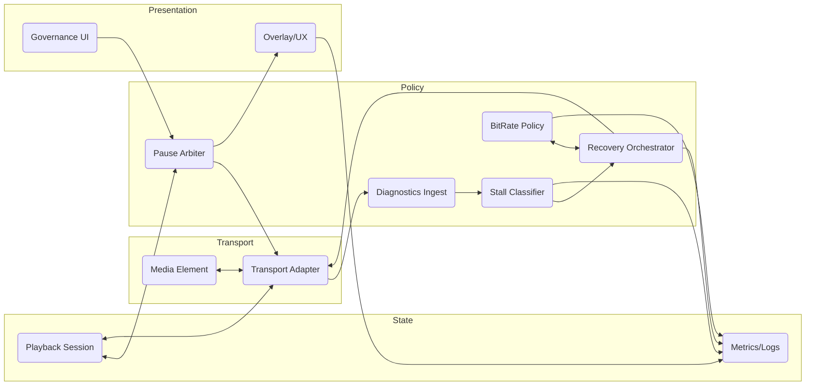

**Player Resilience Review (Player.jsx, useMediaResilience.js, FitnessPlayer.jsx)**

- **Scope**: Single-player flow (`Player.jsx`), resilience hook (`useMediaResilience.js`), consumer wiring (`FitnessPlayer.jsx`), plus overlays, governance, playback session plumbing.

**User Stories / Functional Expectations (inferred)**
- Resume playback reliably through stalls/hiccups; recover automatically with minimal user intervention.
- Preserve position, volume, playback rate across reloads/remounts; resume near last known time.
- Honor governance/locking rules (may force pause/block) and reflect status in UI overlays.
- Allow user controls (seek/play/pause/prev/next, keyboard arrows) to work even during resilience events.
- Provide operators/devs with diagnostics: stall classification, buffer/decoder metrics, bitrate changes, recovery attempts; expose in logs/overlays.
- Support Plex-specific metadata (thumbs, IDs) and adaptive bitrate ceilings.

**Scorecard (10 = strong, 1 = weak)**
- Layer abstraction: **4/10** — Control plane (policy), data plane (media element), presentation (overlays) are intertwined inside one hook; `Player` blends queue, resilience, and transport concerns.
- DRY/consistency: **5/10** — Media identity/duration normalization duplicated (`resolveMediaIdentity` vs. similar logic in `Player`); multiple no-op fallbacks instead of shared utilities/guards.
- Modularity/reuse: **5/10** — `useMediaResilience` is a monolith with many inputs; difficult to reuse outside current stack; inline item resilience merges legacy fields implicitly.
- Encapsulation: **4/10** — Imperative handles expose transport and resilience controllers directly; callers can bypass resilience; governance/pause invariants leak across layers.
- Interface clarity: **5/10** — Required capabilities (`getMediaEl`, `fetchVideoInfo`, `nudgePlayback`, diagnostics provider, meta shape) are optional and silently ignored; merge precedence between inline/queue/root configs is implicit and undocumented.
- Observability/telemetry: **6/10** — Event logging via `playbackLog` exists, but no structured counters/histograms for stalls, recovery attempts, bitrate changes, or decoder nudges; some error paths swallow exceptions.
- Resilience correctness: **6/10** — Stall detection, backoff, bitrate reduction, hard-reset loops are present, but complexity plus silent fallbacks risk missed recoveries; timers/backoffs lack guardrails.
- UX coherence: **6/10** — Overlays/loading/paused handling exists; governance pause, resilience pause, and user pause can conflict; fullscreen/blocker logic spread across components.
- Testability: **4/10** — Timer-heavy hook without evident unit/integration tests; difficult to mock due to implicit dependencies and global logging.
- Dependency boundaries: **5/10** — Hook depends on `playbackLog`, session store, and player transport details; not isolated behind a narrow adapter.

**Key Findings (expanded)**
- **Monolithic hook**: `useMediaResilience` mixes stall classification, startup watchdog, bitrate adaptation, overlay state, playback session persistence, and element IO. Lacks separation between policy and transport, making reasoning and changes risky.
- **Implicit contracts**: Consumers must supply several callbacks and meta fields; missing ones degrade gracefully (no-ops) instead of failing fast, so misconfigurations are silent. Meta identity resolution is ad-hoc and repeated elsewhere.
- **Surface sprawl in Player**: `Player.jsx` accepts many resilience-related props, merges inline/legacy configs, and exposes controllers; precedence and expected shapes are not documented, raising integration risk for new callers.
- **Overlap of authorities**: Governance pause (Fitness), resilience pause, and user pause operate independently; no arbiter defines precedence, risking state flips or blocked playback when recovering.
- **Telemetry gaps**: Logging is event-based and unstructured; lacks counters for stall duration, recovery attempts, decoder nudges, bitrate steps, and success/failure rates. Errors during hard reset or nudge are caught and ignored.
- **Encapsulation leaks**: Imperative handle exposes transport and resilience controllers directly, allowing bypass of resilience decisions; resilience state is also reported via composite channel, increasing coupling.
- **Duplication**: Media identity/duration normalization and thumb logic appear in multiple places without shared helpers, risking inconsistency.
- **Resilience paths**: Hard-recovery backoff, decoder nudge grace/cooldowns, and bitrate reduction exist, but timers and state refs are numerous; without tests/metrics, regressions are likely (e.g., seek intent during stall, startup watchdog during governance pause).

**Recommendations (prioritized)**
1) **Split responsibilities**: Extract policy engine (stall detection, recovery decisions, bitrate policy) from transport adapter (media element IO) and from presentation (overlays). Keep `useMediaResilience` as a thin orchestrator composing these parts.
2) **Define contracts**: Specify required meta fields and provider callbacks; validate at init and fail fast (or warn loudly). Document merge precedence for resilience configs (root vs. inline vs. legacy).
3) **Centralize utilities**: Create shared helpers for media identity resolution, duration normalization, and Plex thumb handling; use across `Player`, `FitnessPlayer`, resilience code.
4) **Telemetry/metrics**: Add structured counters/timers (stall counts, stall duration, recovery attempts, decoder nudges, bitrate overrides with reasons/tags). Standardize log tags and include waitKey/media identity.
5) **Pause/governance arbiter**: Introduce a single pause authority that merges user/governance/resilience intents with clear precedence; expose derived state to UI and recovery logic.
6) **Hardening**: Guard required capabilities, avoid silent no-ops; surface warnings when providers are missing. Add guardrails for timers/backoffs and ensure errors in nudge/hard-reset are logged with outcomes.
7) **Testing**: Add unit tests for stall classification, backoff logic, recovery triggers, bitrate override lifecycle, and interactions with seek intents. Add integration tests for governed playback + resilience overlays.
8) **Interface tightening**: Narrow imperative handle exposure; prefer capability-scoped methods (e.g., `resilience.forceReload`) over raw transport access. Document prop shapes and defaults.
9) **Docs**: Produce a short ADR/diagram showing data/control flows: transport → diagnostics → policy → actions (reload/nudge/bitrate) → overlays; include governance interaction points.

**Quick wins** (low-risk, high-signal)
- Add runtime validation for required providers/meta and emit structured warnings.
- Introduce shared `resolveMediaIdentity` + duration helper; replace duplicates in `Player`/`FitnessPlayer`.
- Add counters for stall/recovery attempts and decoder nudge outcomes; include in logs.
- Clarify pause precedence in code and docs; log when an authority overrides another.

---

## Re-architecture Design Specification (proposed)

### Objectives
- Decouple policy (resilience decisions), transport (media element IO), and presentation (overlays/UI).
- Make contracts explicit: required providers, meta shape, and pause/governance precedence.
- Improve observability with structured metrics and consistent log tags.
- Reduce duplication with shared utilities and typed adapters.
- Harden recovery with guarded timers/backoffs and validated capabilities.

### Target State (high-level)



### Files to be altered
| File | Purpose |
|---|---|
| `frontend/src/modules/Player/hooks/useMediaResilience.js` | Split into policy, transport adapter, overlay presenter; expose a minimal orchestrator. |
| `frontend/src/modules/Player/Player.jsx` | Wire new adapters, restrict imperative handle, document prop contracts, pass typed capabilities. |
| `frontend/src/modules/Fitness/FitnessPlayer.jsx` | Consume narrowed interface; replace duplicated media identity/duration helpers; adopt pause arbiter output. |
| `frontend/src/modules/Player/hooks/policy/useResiliencePolicy.js` (new) | Encapsulate stall detection, backoff, bitrate policy, recovery decisions. |
| `frontend/src/modules/Player/hooks/transport/useMediaTransportAdapter.js` (new) | Bridge to media element/transport; provides diagnostics, nudge, reload, seek with guardrails. |
| `frontend/src/modules/Player/hooks/presentation/useResiliencePresentation.js` (new) | Map policy state to overlays; honor governance/pause arbiter. |
| `frontend/src/modules/Player/utils/mediaIdentity.js` (new) | Shared helpers for media identity, duration normalization. |
| `frontend/src/modules/Player/utils/telemetry.js` (new) | Structured metrics/log wrappers and counters. |
| `frontend/src/modules/Player/__tests__/resiliencePolicy.test.js` (new) | Unit tests for stall classification, backoff, recovery triggers. |
| `frontend/src/modules/Player/__tests__/pauseArbiter.test.js` (new) | Tests for precedence between user/governance/resilience pauses. |

### Architectural slices

**Policy (pure, testable)**
- **State Machine**: Explicitly defined states (`IDLE`, `PLAYING`, `STALLED`, `RECOVERING`, `LOCKED`) and transitions to prevent impossible states (e.g., `RECOVERING` while `LOCKED`).
- Inputs: `diagnostics`, `userIntent`, `governanceState`, `sessionTarget`, `config`.
- Outputs: `actions` (reload, nudge, bitrateOverride, remount with seek), `overlays` (loading, stalled), `pauseDecision` (who holds pause), `telemetry` events.
- No direct DOM/transport access; talks via adapter interface.

**Transport Adapter**
- Encapsulates media element IO and controller plumbing (`getMediaEl`, `hardReset`, `seek`, `play/pause`, `fetchVideoInfo`, `nudgePlayback`, diagnostics snapshot).
- **Normalization**: Smooths out browser quirks (e.g., inconsistent `stalled` event firing) so Policy sees a consistent event stream.
- Validates capabilities at init; emits warnings when missing.
- Exposes a narrow surface consumed by policy.

**Presentation**
- Consumes policy state + pause arbiter and governance; renders overlays; keeps UX separate from policy decisions.

### Pause Arbiter (precedence)
Returns a **Reason Code** to decouple UI from logic:
1) `PAUSED_GOVERNANCE` (Governance block/pause) -> Show lock icon/message.
2) `PAUSED_BUFFERING` (Resilience-required pause) -> Show spinner.
3) `PAUSED_USER` (User pause) -> Show big play button.
4) `PLAYING` (System default)

### Pseudocode Sketches

**useResiliencePolicy (new)**
```js
function useResiliencePolicy({ diagnostics$, config, intents, session, transport }) {
	const state = useState({ status: 'startup', recoveryAttempts: 0, bitrate: null });

	const classify = useCallback((diag) => {
		// buffer gap, dropped frames, readyState; returns { kind, severity }
	}, []);

	const decide = useCallback((diag) => {
		const stall = classify(diag);
		if (stall.kind === 'decoder-stall') return action.nudge();
		if (stall.kind === 'network-stall' && stall.severity === 'hard') return action.reload({ keepSeek: true });
		return action.none();
	}, [classify]);

	useEffect(() => diagnostics$.subscribe((d) => {
		const action = decide(d);
		apply(action, transport);
		emitTelemetry(action, d);
	}), [decide, transport]);

	return { state, overlays, pauseDecision, actions: exposedActions };
}
```

**useMediaTransportAdapter (new)**
```js
function useMediaTransportAdapter({ controllerRef }) {
	const getEl = () => controllerRef.current?.transport?.getMediaEl?.() || null;
	const guard = (fn, label) => (...args) => {
		try { return fn(...args); } catch (err) { logWarn(label, err); }
	};

	return {
		diagnostics: guard(readDiagnostics, 'diag'),
		nudge: guard(requestNudge, 'nudge'),
		reload: guard(forceReload, 'reload'),
		seek: guard((s) => controllerRef.current?.transport?.seek?.(s), 'seek'),
		play: guard(() => controllerRef.current?.transport?.play?.(), 'play'),
		pause: guard(() => controllerRef.current?.transport?.pause?.(), 'pause')
	};
}
```
**Pause Arbiter (utility)**
```js
function resolvePause({ governance, resilience, user }) {
	if (governance.blocked) return { paused: true, reason: 'PAUSED_GOVERNANCE' };
	if (resilience.requiresPause) return { paused: true, reason: 'PAUSED_BUFFERING' };
	if (user.paused) return { paused: true, reason: 'PAUSED_USER' };
	return { paused: false, reason: 'PLAYING' };
}
```
```

### Code sample: applying shared media identity
```js
// frontend/src/modules/Player/utils/mediaIdentity.js
export const resolveMediaIdentity = (meta) => {
	const candidate = meta?.media_key ?? meta?.key ?? meta?.plex ?? meta?.id ?? meta?.guid ?? meta?.media_url ?? null;
	return candidate != null ? String(candidate) : null;
};

// Player.jsx and FitnessPlayer.jsx
import { resolveMediaIdentity } from '../utils/mediaIdentity';
const mediaIdentity = resolveMediaIdentity(currentItem);
```

### Metrics/Logging (structured)
```js
// frontend/src/modules/Player/utils/telemetry.js
export const logResilience = (event, ctx) => playbackLog(`resilience.${event}`, ctx);
export const metrics = {
	stall_count: counter('player_stall_total'),
	stall_duration_ms: histogram('player_stall_duration_ms'),
	recovery_attempts: counter('player_recovery_total'),
	bitrate_override: counter('player_bitrate_override_total')
};
```

### Work plan (phased - Strangler Fig Pattern)

**Phase 1: Foundation & Utilities (Safety First)**
- [ ] Create `frontend/src/modules/Player/utils/mediaIdentity.js` with `resolveMediaIdentity` and `normalizeDuration`.
- [ ] Create `frontend/src/modules/Player/utils/telemetry.js` with structured logging wrappers.
- [ ] Refactor `FitnessPlayer.jsx` to use `resolveMediaIdentity`.
- [ ] Refactor `Player.jsx` to use `resolveMediaIdentity`.
- [ ] Refactor `useMediaResilience.js` to use `resolveMediaIdentity`.
- [ ] Verify no regressions in media ID resolution.

**Phase 2: The Pause Arbiter (Fixing the biggest bug)**
- [ ] Create `frontend/src/modules/Player/utils/pauseArbiter.js` implementing `resolvePause` with reason codes (`PAUSED_GOVERNANCE`, `PAUSED_BUFFERING`, `PAUSED_USER`, `PLAYING`).
- [ ] Add unit tests for `pauseArbiter.js` covering precedence logic.
- [ ] Integrate `pauseArbiter` into `FitnessPlayer.jsx` to replace ad-hoc governance/pause logic.
- [ ] Integrate `pauseArbiter` into `Player.jsx` to drive the UI state (overlays).
- [ ] Ensure `useMediaResilience` respects the arbiter's decision (e.g., don't count governance pause as a stall).

**Phase 3: Transport Adapter (Isolation)**
- [ ] Create `frontend/src/modules/Player/hooks/transport/useMediaTransportAdapter.js`.
- [ ] Implement capability validation (warn if `getMediaEl` is missing).
- [ ] Implement "guard" wrappers for `seek`, `play`, `pause`, `nudge`.
- [ ] Implement `readDiagnostics` with normalization for browser quirks.
- [ ] Refactor `Player.jsx` to initialize this adapter and pass it down instead of raw refs.

**Phase 4: Policy Extraction (The Brain)**
- [ ] Create `frontend/src/modules/Player/hooks/policy/useResiliencePolicy.js`.
- [ ] Implement the State Machine (`IDLE`, `PLAYING`, `STALLED`, `RECOVERING`, `LOCKED`).
- [ ] Move stall classification logic from `useMediaResilience.js` to this new hook.
- [ ] Move recovery decision logic (reload vs nudge) to this new hook.
- [ ] Wire up `useResiliencePolicy` to consume `useMediaTransportAdapter`.

**Phase 5: Cleanup & Presentation**
- [x] Create `frontend/src/modules/Player/hooks/presentation/useResiliencePresentation.js` for overlay logic.
- [x] Refactor `useMediaResilience.js` to become a thin orchestrator that just calls Policy, Transport, and Presentation hooks.
- [x] Remove legacy code and unused props from `Player.jsx` (dropped legacy `playbackrate` shim; transport-driven overlay is now handled by the presentation hook).
- [x] Update documentation.

Notes: Overlay handling now lives in `useResiliencePresentation`, keeping `useMediaResilience` focused on orchestration/policy wiring. Player no longer rewrites legacy lowercase `playbackrate` props.

### Risks and mitigations
- **Regression in recovery timing**: Add feature flag to toggle new policy; ship with metrics comparison.
- **Governance conflicts**: Pause arbiter centralizes precedence; add logs when overrides occur.
- **Missing providers**: Runtime validation with warnings; fail fast in dev.

### Acceptance criteria
- Clear, documented contracts for resilience inputs/outputs.
- Metrics visible for stalls, recovery attempts, bitrate overrides, decoder nudges.
- Pause precedence enforced consistently across `Player` and `FitnessPlayer`.
- Unit tests covering stall classification, backoff, pause arbitration; integration smoke for governed playback + resilience overlays.
