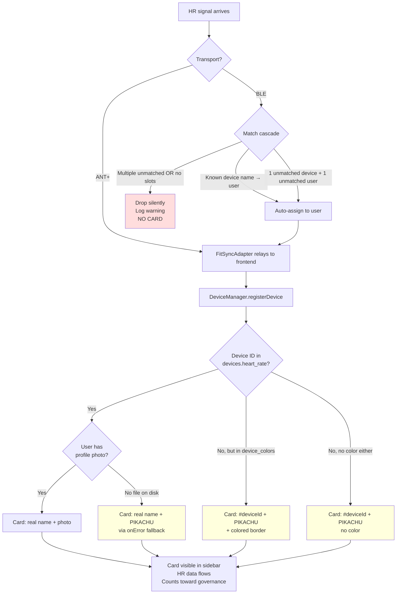
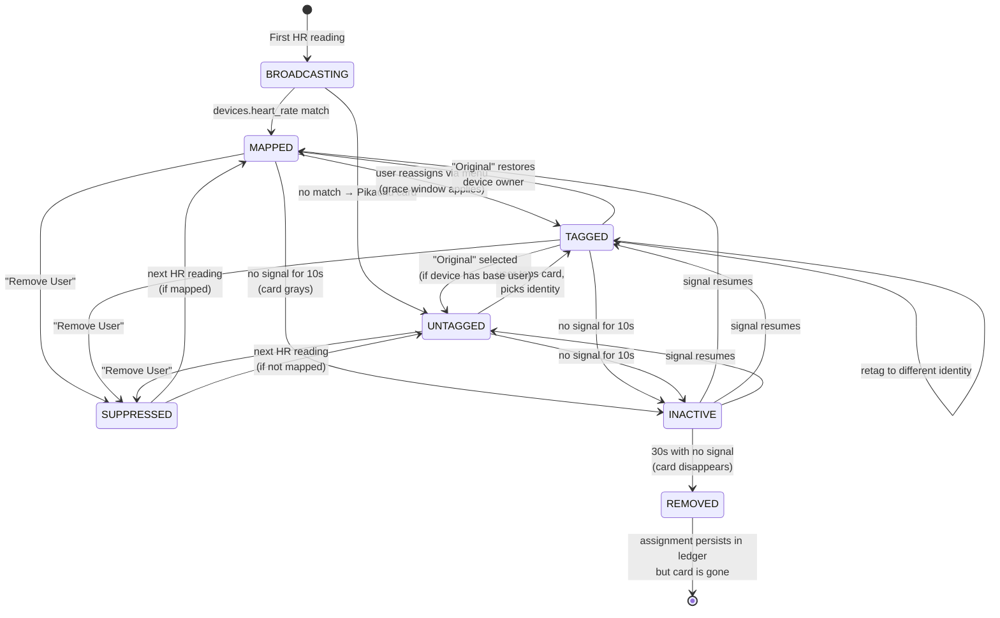

# Guest Mode UX Audit

**Date:** 2026-05-26
**Author:** Claude
**Purpose:** Map every permutation of how a guest can join, change, leave, or fail to join a fitness session — surface the UX gaps that need work.

---

## Scope

In-scope:
- Every way a non-primary participant enters the participant roster (own device, borrowed, BLE, ANT+, color-slot, generic Guest)
- Every transition during a session (tag, retag, swap, suppress, drop, return)
- The points where the system silently does the wrong thing
- The points where the user has no signal that something is happening

Out of scope:
- Persistence schema details (covered in [`fitness-system-architecture.md`](../../reference/fitness/fitness-system-architecture.md))
- Governance evaluation mechanics (covered in [`governance-engine.md`](../../reference/fitness/governance-engine.md))
- BLE GATT internals (covered in [`ble-heart-rate.md`](../../reference/fitness/ble-heart-rate.md))

---

## Glossary

| Term | Meaning |
|------|---------|
| **Primary** | Household member with a profile under `users.primary` in `fitness.yml` (user-primary, user-b, user-c, user-d, user-a) |
| **Family / Friends** | Inline-defined non-primary users in `users.family` / `users.friends` |
| **Mapped device** | ANT+/BLE device ID with a `devices.heart_rate: id: user` binding |
| **Color-slot** | Device ID with `device_colors.heart_rate: id: color` but NO user mapping (e.g. 10366=purple). Pre-allocated for recurring unknowns. |
| **Pikachu** | Visual fallback — generic `/static/img/users/user.jpg` (literally a Pikachu face) rendered when no `profileId` resolves OR when a mapped user's photo is missing |
| **Tagged** | A device card has a guest assignment OR resolves to a configured user |
| **Untagged** | A device card with no resolved user — Pikachu face, `#<deviceId>` label |
| **Grace window** | First 60 seconds after assignment creation; replacements within this window transfer data, replacements after end the previous entity as `dropped` |
| **Silent swap** | A physical strap changes wearer without the menu being touched — undetectable |
| **Entity** | In-memory bookkeeping object for one (device, occupant, window) tuple; ends up flattened to per-user series in saved YAML |

---

## Part 1: The Joining Decision Tree

What happens when a new HR signal arrives at the system:



**Three notable branches:**
- **F (BLE silent drop)** — the user has zero signal that their watch is broadcasting and being ignored
- **K (named Pikachu)** — confusing: name says "Family A", face says Pikachu
- **L/M (unknown ANT+)** — appears immediately, counts toward governance whether you want it to or not

---

## Part 2: Per-Device In-Session State Machine



**Underspecified transitions** (areas the audit should clarify):
- When `REMOVED` → next HR reading arrives, does the **assignment** re-attach automatically, or does the device come back as Mapped/Untagged with the assignment cleared?
- Does `INACTIVE` (gray card) still count toward governance `active: all` evaluations? (Suspected: no, but unverified.)
- Does the entity end at `INACTIVE` or only at `REMOVED`? Does it end at session end if the device never goes inactive?

---

## Part 3: Canonical User Journeys

Eight named journeys cover the main shapes. Each can be parameterized by timing (pre-session / start / mid / late).

### Journey A — Pre-registered guest, own device

**Setup:** Family A has `88888: family-a` mapping and a `family-a.jpg` photo. He arrives with his orange strap.

```
HR signal #88888  ──→  card: "Family A" + photo + orange border
                       earns coins as family-a
                       counts toward governance (but exempt — config exemption)
                       on strap removal: 10s gray, 30s removed
                       saved YAML: participants.family-a = { ... }
```

**Status:** Works as intended. The "happy path."

### Journey B — Pre-registered guest, own UN-registered device

**Setup:** Friend C is in `users.friends` but her ANT+ strap (#99999) is not in `devices.heart_rate`.

```
HR signal #99999  ──→  PIKACHU card: "#99999" + no color
                  ──→  someone notices, taps card
                  ──→  menu opens (mode='guest', target=99999)
                  ──→  Friends tab → tap Friend C
                  ──→  card swaps to: "Friend C" + Friend C's photo
                       data attribution depends on grace window:
                         < 1 min: Friend C inherits Pikachu coins/timeline
                         ≥ 1 min: BOTH "#99999" Pikachu AND Friend C in saved YAML
```

**Status:** Works but with footguns — see gaps G2, G4, G7, G12.

### Journey C — Known guest borrows household device

**Setup:** Friend C has no strap. User B lends his (#22222 → mapped to user-b, red).

```
HR signal #22222  ──→  card: "User B" + photo + red border (already mapped)
                  ──→  someone taps User B's card
                  ──→  menu opens
                  ──→  Friends tab → Friend C
                  ──→  card swaps: "Friend C" + photo (red border PRESERVED)
                       baseUserName = "User B" preserved
                       grace window: same as Journey B
                       "Original" now appears as top option in menu
```

**Status:** Works. Returning User B's identity later via "Original" is a real-world common case.

### Journey D — Unknown guest, never tagged

**Setup:** Visitor arrives with own ANT+ strap, nobody tags them all session.

```
HR signal #51234  ──→  PIKACHU card: "#51234" + no color
                  ──→  ... 45 minutes of workout, nobody tags ...
                       earns coins under synthetic user-id (`#51234`)
                       counts toward governance "active: all"
                       saved YAML: participants["#51234"] = phantom
```

**Status:** Functionally works but creates phantom participants and confuses governance.

### Journey E — Visitor with own BLE Apple Watch

**Setup:** Grannie has `ble_users: [grannie]` and a synthetic `ble_grannie: grannie` device entry.

```
Grannie opens Workout app on watch
                  ──→  BLE manager scans, finds new 0x180D advertiser
                  ──→  Best-effort match cascade:
                       a) Name-known? if "Grannie's Watch" → assign
                       b) Single unmatched device + grannie unmatched? → auto-pair
                       c) Multiple unmatched? → DROPPED, only log warning
                  ──→  If matched: card "Grannie" + photo, normal flow
                  ──→  If dropped: NO CARD APPEARS AT ALL
                       Grannie watches her watch say "HR 95" and her card never shows
                       no error visible to anyone
```

**Status:** Footgun on failure path. See gap G6.

### Journey F — Late-joiner (mid-session)

**Setup:** Alice/Bob/Charlie session running 15 min; Friend C walks in with own ANT+ strap.

```
t=15:00  Session in progress, governance unlocked
t=15:30  Friend C's strap broadcasts → Pikachu #99999 card appears
         ⚠️ Friend C just entered governance pool with HR=0
         ⚠️ If policy is "active: all", her HR=0 will LOCK the video
t=15:45  Friend C's HR climbs to active zone
         ⚠️ Governance evaluates her as a participant; she must clear active
t=16:30  Someone tags Pikachu → Friend C
         ⚠️ AFTER grace window since first reading (60s)
         ⚠️ Phantom #99999 participant persists in saved YAML
```

**Status:** Multiple issues per join. Late-joiners reliably trigger governance lock-outs.

### Journey G — Mid-session silent owner swap (THE BIG ONE)

**Setup:** Alice has her own strap. She hands it to Bob without anyone touching the menu.

```
t=00:00 - 10:00  card: "Alice" + photo, HR=140, earning coins as Alice
t=10:00  Alice removes strap, hands to Bob (off-screen, off-app)
t=10:05  Bob has strap on, HR=150
         ──→  card STILL says "Alice"
         ──→  HR=150 attributed to Alice in series, coins, governance
         ──→  No system signal
         ──→  Saved YAML: alice.hr_stats includes Bob's effort
                          alice.coins_earned is sum of both
                          NO record that a swap occurred
```

**Status:** Critical UX gap. Currently undetectable. See gap G3.

### Journey H — Color-slot visitor

**Setup:** Visitor uses a strap with ID 10366 (in `device_colors.heart_rate` as purple, not in `devices.heart_rate`).

```
HR signal #10366  ──→  PIKACHU card: "#10366" + PURPLE border
                  ──→  identical UX to Journey B
                       purple border helps human eye distinguish from other Pikachus
                       still requires manual tap-to-tag
                       no hint that "purple" has any pre-allocated meaning
```

**Status:** Color helps disambiguate but the config-side intent is invisible to the user. See gap G19.

### Journey I — Tagged guest leaves and returns

**Setup:** Friend C was tagged to device #99999, leaves for water, returns 90s later.

```
t=00:00  Friend C tagged to #99999
t=05:00  Friend C removes strap
t=05:10  card grays (INACTIVE)
t=05:30  card removed (REMOVED)
         ✅ deviceAssignments ledger PRESERVES #99999 → Friend C across removal
t=06:30  Friend C puts strap back on
         ✅ Card returns as "Friend C" automatically (assignment intact)
         ↪ HR data continues into Friend C's existing series
         ↪ The off-strap period writes nulls into Friend C's series
```

**Status:** Works as desired. The persistent assignment is the right call — you don't lose your tag when you grab a water bottle.

### Journey J — Two simultaneous generic "Guest" assignments

**Setup:** Two visitors arrive simultaneously, both get tagged as generic "Guest" (the always-available top option).

**Design directive:** "Guest" should be an **alias on top of the device ID**, not a shared user identity. Two `Guest` tags on different devices = two distinct anonymous participants, keyed by device.

```
Visitor 1 device #A → tag "Guest" → identity = "guest@#A"
Visitor 2 device #B → tag "Guest" → identity = "guest@#B"

         → Each gets its own series, entity, and saved-YAML participant entry
         → Governance min_participants counts them as 2
         → Sidebar shows two separate "Guest" cards, each with its own HR/zone
```

**Status:** This is the desired behavior; current implementation needs verification (the `'guest'` profileId may currently collapse both into one identity — see [Decisions](#part-7--decisions-from-review-2026-05-26) §2). To disambiguate visually, the cards must surface the device color (see Journey H, Gap G19, and Decision §3).

### Journey K — Returnee: primary's device has been guest-assigned, primary arrives

**Setup:** User B's strap (#22222 → user-b) was given to Friend C at the start. User B arrives mid-session ready to exercise.

```
Current state: device 22222 → Friend C (active), User B is in the returnee pool
User B appears with... nothing? He needs a strap.

Options:
  a) Take strap back from Friend C → tap card → "Original" (User B). Friend C now strapless.
  b) Grab a different unused household strap → if mapped, appears as that owner.
     If User A is away and User B grabs #11111 (→ user-a) → card says "User A" until retagged.
  c) User B uses a Pikachu device → manual tag → "User B" (returnee path)

         ❓ Does the returnee pool surface in the UX as "User B is waiting for a device"?
         ❓ Is there a one-tap "give User B back his device" anywhere?
```

**Status:** Returnee logic exists in code (`allowWhileAssigned: true` for displaced primaries) but its UX surfacing is minimal. See gap G16.

---

## Part 4: Permutation Matrix

The full space is roughly **timing × device source × identity source**. Cells marked with status:

| | Pre-session | t=0 start | Mid-session | Late |
|---|---|---|---|---|
| **Own mapped device** | n/a (no card pre-broadcast) | ✅ A | ✅ A + F-mild | ✅ A + F-strong |
| **Own BLE auto-matched** | n/a | ✅ E-happy | ✅ E-happy + F-mild | ✅ E-happy + F-strong |
| **Own BLE unmatched** | n/a | ❌ E-silent-drop | ❌ E-silent-drop | ❌ E-silent-drop |
| **Own unmapped ANT+** | n/a | ⚠️ B (Pikachu, tag) | ⚠️ B + F (governance impact) | ⚠️ B + F |
| **Color-slot ANT+** | n/a | ⚠️ H (purple Pikachu) | ⚠️ H + F | ⚠️ H + F |
| **Borrow household device** | n/a (need active device) | ✅ C | ✅ C | ✅ C |
| **Borrow other guest's device** | n/a | ⚠️ C-variant | ⚠️ C-variant | ⚠️ C-variant |
| **Generic "Guest" tag** | n/a | ⚠️ J (uncertain) | ⚠️ J | ⚠️ J |
| **Pre-tag before broadcast** | ❌ **NOT POSSIBLE** | n/a | n/a | n/a |

Legend: ✅ works · ⚠️ works with caveats · ❌ broken or impossible · n/a invalid combo

**Two whole columns are unreachable:**
- "Pre-session" — there's no pre-session UI to act in
- "BLE unmatched" — silent drop has no recovery

---

## Part 5: Lifecycle Event Reference

Every event that can happen to a device card, with system state and persistence consequences:

| Event | UX trigger | System effect | Saved YAML effect |
|-------|-----------|---------------|-------------------|
| First HR reading from unknown ANT+ | Pikachu card animates in via FlipMove (300ms, no toast) | DeviceManager registers; synthetic user created | New participant entry on save |
| First HR reading from mapped ID | Real-name card animates in | DeviceManager registers; UserManager resolves | Participant entry as configured user |
| BLE auto-match success | Card animates in as matched user | Match logged in `hrMatched` map | Same as mapped |
| BLE auto-match failure | **Nothing visible** | Drop at `ble.mjs:~415`; warning in extension logs | Nothing |
| Tap card → assign guest | Menu opens, mode='guest', target=deviceId | GuestAssignmentService.assignGuest → entity created | New entity in `events:` log (ASSIGN_GUEST) |
| Tag within grace window | Card avatar/name swap | `transferUserSeries` + `transferSessionEntity` | Old identity disappears; new inherits |
| Tag after grace window | Card avatar/name swap | Old entity ended `status: 'dropped'`; new entity created | Both identities in `participants:`; old has partial stats |
| Select "Original" | Card swaps back to base user | `clearGuestAssignment` → entity ended | Guest's entity persists; base user resumes |
| Select "Remove User" | Card disappears immediately | `suppressDeviceUntilNextReading` | Final entity state preserved |
| Strap removed (no HR for 10s) | Card grays (`inactiveSince` set) | Still in roster, no new data | Final values preserved as-of last reading |
| 30s no HR | Card disappears (`removed` flag) | Removed from active set | Assignment ledger state **unclear** (Open Q1) |
| Strap put back on after timeout | Card returns | DeviceManager re-registers | Behavior depends on Open Q1 |
| Session ends (autosave + final save) | Roster frozen | All entities finalized | Full `participants:` block persisted |
| Avatar image 404s mid-session | Avatar swaps to Pikachu via onError | No data change | No persistence change |
| Camera/pose mode activates | Sidebar margin shrinks | No guest-mode interaction | No change |
| Silent owner swap | **Nothing visible** | **No detection** | Effort attributed to wrong user |

---

## Part 6: UX Gap Analysis

Twenty gaps identified, prioritized by impact.

### Critical

**G1. No pre-session lobby / check-in.**
You cannot tag any guest before they put on a strap. If three guests arrive together, you must wait for all three Pikachus to appear, then tap-tag each one individually. Severely complicates real-world setup ("everybody put your straps on, then I'll go figure out who's who").
*Fix idea:* Pre-session "expected participants" picker that pre-allocates guest slots, so the first matching unknown device auto-assigns.

**G3. Silent owner swap is undetectable.**
The single most dangerous footgun. Data attribution silently breaks; saved sessions become unreliable for any analysis that depends on per-person history.
*Fix idea:* HR-pattern anomaly detection (sudden 40+ bpm shift in <30s with no zone-change-event explanation) raises a "did someone swap?" prompt. Or: every N minutes, a sampling prompt asks "is Alice still wearing #22222?"

**G6. BLE auto-match failure is silent.**
A guest opens their Apple Watch, starts a Workout, watches their HR climb to 130 — and nothing happens on the TV. There's zero feedback to distinguish "watch is broken" from "you're not in `ble_users`" from "the match cascade ambiguity dropped you." The user troubleshoots the wrong thing.
*Fix idea:* Surface "BLE: 1 unmatched device detected — N candidates" in a sidebar status row. Allow the user to claim it via the menu even without auto-match.

### High

**G2. Pikachu cards have no introductory animation or toast.**
A new device appearing during a busy workout (video fullscreen) is easy to miss. The card slides in via FlipMove (300ms, 20ms stagger) with no other affordance.
*Fix idea:* Brief animated "new device" badge on the card for ~5s, or a one-line toast at the top of the sidebar.

**G4. Grace window is invisible to the user.**
The system has a 60-second backfill window — but the UX never tells you "tap within 47 seconds to inherit data." Users miss the window because they don't know it exists.
*Fix idea:* Show a soft countdown badge on Pikachu cards (and reassignment menu items): "55s • Tag now to inherit data."

**G7. Pikachu meaning is implicit.**
A new user seeing a Pikachu card has no idea why or what to do. There's no tooltip, no first-time hint, no documentation surfaced in-product.
*Fix idea:* Tap-to-open menu shows a header explanation: "Unidentified heart-rate device on channel #99999. Pick a person below or 'Guest' if unknown."

**G10. No in-app workflow to promote a stranger to permanent config.**
If a Pikachu visits twice and you want to make them permanent, you must SSH to the server, edit `fitness.yml`, and restart Docker. High friction discourages the cleanup.
*Fix idea:* In the assign menu, a "Save as new friend/family member" action that writes to `fitness.yml` via API (with restart-prompt at end of session).

**G11. Stray ANT+ devices count toward governance immediately.**
A neighbor's broadcast or a forgotten strap on a shelf can lock the video unless someone tags it as Guest or removes it.
*Fix idea:* Untagged Pikachus default-excluded from `active: all` for the first 60s; or auto-exempt all Pikachus until tagged, with a visible "1 untagged device not affecting governance" indicator.

**G12. Phantom participants in saved sessions.**
Late tagging leaves a `#99999` participant alongside the real user in saved YAML. Aggregate stats and historical charts treat the phantom as a separate person.
*Fix idea:* Post-session "review participants" step that lets you merge phantoms into tagged users. Or: extend grace window for the explicit case "Pikachu → identified for the first time."

### Medium

**G5. Three causes of Pikachu look identical.**
Untagged unknown, missing photo file, and color-slot visitor all render the same yellow face. The user can't troubleshoot.
*Fix idea:* Small status icon overlay on the avatar — `?` for untagged, `📷` for missing photo, etc.

**G8. `#<deviceId>` is a meaningless label.**
"`#99999`" tells you nothing about which physical strap is which. In a 5-device household with a borrower's strap, all you see is numbers.
*Fix idea:* When `device_colors.heart_rate` has an entry, show the color name ("Purple strap") as the label instead of the numeric ID.

**G9. No batch tagging.**
3 visitors → 3 sequential menu interactions. No "tag multiple devices at once" mode.
*Fix idea:* Pre-session lobby (G1) solves this. Otherwise: long-press a Pikachu to enter "tag mode" with all Pikachus highlighted, then tap each.

**G13. No detection of ghost assignments.**
If someone wears the wrong strap (e.g. family-a's #88888 on family-b), no system signal that the HR profile doesn't match the user's baseline.
*Fix idea:* Same as G3 — anomaly detection comparing live HR to historical baseline per user.

**G14. Multi-device guests have unclear cadence/equipment attribution.**
A guest using their own HR strap PLUS a household exercise bike — the bike's cadence isn't visibly tied to the guest's identity in the sidebar.
*Fix idea:* Equipment cards display "currently used by: <user>" derived from `equipment.eligible_users` + active devices.

**G15. Generic "Guest" identity ambiguity** (depends on Open Q2).
Two simultaneous "Guest" tags — are they one person with two devices or two anonymous people? Behavior unclear.
*Fix idea:* Numbered generics ("Guest 1", "Guest 2") that the system auto-picks based on first-untagged-slot.

**G16. Returnee surfacing is weak.**
When User B's device has been Friend C's for 12 minutes and User B shows up wanting to exercise, the UI doesn't proactively suggest "User B is here, want to swap him back in?"
*Fix idea:* When a primary's device has been guest-assigned for >5 min, show a subtle "[primary] is offline" badge somewhere; or detect their presence and surface a swap prompt.

**G17. No graceful guest exit flow.**
A guest finishing early just removes their strap. No "Friend C is done" button that ends her entity cleanly, sends a summary, etc.
*Fix idea:* Long-press card → "End session for this person" — flushes entity, optionally prints receipt.

**G18. Avatar fallback edge cases (named Pikachu).**
"Family A" name + Pikachu face from missing file is confusing — looks like a bug, isn't.
*Fix idea:* Different fallback for "user resolved but image missing" vs "no user resolved." E.g. initials-on-color avatar for the former.

**G19. Color-slot intent is invisible.**
The user creating `10366: purple # guest1` knew what they meant, but the running system has no surfacing of "purple slot reserved for visitor #1."
*Fix idea:* In the assign menu for a color-slot device, show "Reserved color-slot 'purple' (guest1) — pick a person to bind." Optionally let user write the binding back to config.

**G20. Config changes require container restart.**
Adding a new recurring visitor to `fitness.yml` is a multi-step ops chore. Discourages permanent fixes; encourages relying on ad-hoc Pikachu tagging.
*Fix idea:* Hot-reload `fitness.yml` on file change (already a small file, fast parse); or an in-app "manage participants" UI that writes the file via an API.

---

## Part 7 — Decisions From Review (2026-05-26)

The open questions from the first draft have been resolved. Several answers turned into design directives that reshape the audit.

### 1. Assignment persistence across device removal — RESOLVED ✅

**Decision:** Guest assignments **persist** across the 30s removal lifecycle. When a tagged user removes their strap, walks away, and returns, the card resumes under their tagged identity.

**Implication for previous gaps:** Journey I now shows desired behavior. No fix needed.

### 2. Generic "Guest" is a per-device alias, not a shared identity — DIRECTIVE 🛠

**Decision:** "Guest" must be an **alias on top of the device ID**, not a singleton user. Two simultaneous `Guest` tags = two distinct anonymous participants, each keyed by the device they're on.

**What this changes:**
- Series, entities, and saved-YAML participants must be device-keyed for generic Guest, not user-keyed
- Governance `min_participants` thresholds count each Guest card as a distinct person
- Gap G15 is now a concrete implementation task — verify current behavior, fix if `'guest'` profileId collapses identities

**Code areas to inspect:** `UserManager.#ensureUserFromAssignment`, generic-Guest path in `FitnessSidebarMenu`, participant roster builder, `allowWhileAssigned` semantics.

### 3. Color of physical sticker must be visible on the card — DIRECTIVE 🛠

**Decision:** Each unregistered/color-allocated HR strap has a **physical colored sticker** on it; the matching color is configured in `device_colors.heart_rate`. The card UI must surface this color prominently enough that a human in the room can match physical sticker → on-screen card at a glance.

**Why this matters:** When three guests turn on three straps simultaneously, all you currently see is three Pikachus with different `#<deviceId>` labels — useless for "Friend C, you're the purple one." With visible color (avatar ring, card border, color name as label), the disambiguation is immediate.

**Scope of work:**
- Avatar ring or card-border treatment in a saturated, recognizable color (not the subtle existing border)
- Color **name** displayed alongside or instead of `#<deviceId>` when no name resolves (e.g. "Purple strap" instead of "#10366")
- Same treatment applies to **all** unmapped devices, even ones without a `device_colors` entry — fall back to a deterministic per-deviceId color (hash-based) so each Pikachu is at least *visually distinct* from the others

This subsumes / reshapes gaps **G5, G8, G19** into a single coordinated piece of work.

### 4. Inactive (gray) cards should NOT count toward governance — DIRECTIVE 🛠

**Decision:** An INACTIVE card (no signal for 10s+) is **not** a current participant for governance evaluation. The 10s gray period is treated as "not currently here."

**Code area to inspect/fix:** `GovernanceEngine.evaluate` + `ActivityMonitor`'s definition of "active." Likely already correct (the gap was flagged as unverified), but the directive locks in the intent.

### 5. Late-tagged Pikachus should de-duplicate at session close — DIRECTIVE 🛠

**Decision:** When a Pikachu earns data and is later tagged as a real user, the Pikachu identity should **merge into the tagged user** in the saved session — no phantom `#<deviceId>` participant in the YAML.

**This is the same mechanism as the grace-period transfer**, but applied retroactively at session save time. Late tagging = "I'm telling you now who this was the whole time" = merge.

**Combined with Decision §6 (below):** the mechanism is actually subsumed by the continuous-usage threshold.

### 6. BLE silent-drop surfacing — DEFERRED ⏸

the user doesn't have working BLE devices currently. Gap G6 stays in the doc but drops in priority. Revisit when BLE hardware is in active use.

### 7. **CONTINUOUS-USAGE THRESHOLD** — major design directive 🛠🛠🛠

This is the biggest change from the first-draft model.

**Decision:** Replace the 60-second grace window with a **configurable continuous-usage threshold** (proposed default: **5 minutes**). The threshold governs which device-occupant segments are "honored" as real participants in the saved session vs. which segments are absorbed into the next segment via backfill.

#### The rule

> A device-occupant segment is **honored** (appears as its own participant in the saved session) only if it ran for at least `T` continuous seconds.
> Segments shorter than `T` are **absorbed** into the next segment via backfill (their data attributes to the next occupant).

#### Worked examples

`T = 5 min`:

| Segment sequence | Saved participants |
|------------------|--------------------|
| User A 1 min → Guest 30 min | Guest only (User A absorbed; Guest's series starts at t=0) |
| User A 30 min → Guest 30 min | User A AND Guest (both honored) |
| User A 3 min → User B 2 min → Guest 30 min | Guest only (both User A and User B absorbed forward) |
| User A 3 min → User B 30 min → Guest 2 min | User B only? (User A absorbed forward into User B; Guest also short — **see open issue below**) |
| Alice 2m → Bob 2m → Alice 2m → Bob 2m → Alice 2m | All sub-T — **see open issue below** |

#### Implementation sketch

- Each "segment" = `(deviceId, occupantId, start, end)` tuple maintained in memory
- On occupant change: previous segment's duration evaluated against `T`
  - `< T`: data backfills into the new segment (extends the new segment backward in time)
  - `≥ T`: previous segment is sealed as an honored participant; new segment starts clean
- On session end: same evaluation runs on the final segment

#### Why this generalizes the grace period

The current 60s grace window is a special case of `T = 60`. The directive is to:
1. Make `T` configurable in `fitness.yml` (e.g. `governance.usage_threshold_seconds: 300`)
2. Raise the default to ~5 min so the common "wrong owner at start" mistake auto-corrects without user action
3. Apply the rule symmetrically to ALL transitions (not just guest-mode reassignments) — Decision §5 (late-tagged Pikachus) falls out automatically

#### Open issues with this rule

These need a decision before implementation:

**OI-1. What happens to a short FINAL segment with no next user?**
e.g. `User A 3min → User B 30min → Guest 2min` (session ends with Guest still on).
- Option A: Guest segment is honored anyway (last-segment exemption)
- Option B: Backfill *backward* into User B (the previous honored user)
- Option C: Drop the data (probably wrong — silent loss)

**OI-2. What about cycling/turn-taking where ALL segments are sub-T?**
e.g. `Alice 2m → Bob 2m → Alice 2m → Bob 2m → Alice 2m` with T=5min.
- Strict reading: each segment absorbs into the next → everything lands on the final Alice. All data attributed to Alice.
- Probably-desired reading: "this is a special case — multiple short segments by the same set of users → keep them all as separate honored participants regardless of T"
- Needs detection heuristic: if the same two+ users alternate, treat the whole device timeline as a multi-user shared device with proportional attribution

**OI-3. Does T apply identically across all transitions?**
- Mapped → Guest tag: clearly yes (the motivating case)
- Guest → different Guest: yes
- Guest → Original (restore): probably yes (Guest segment absorbed if short)
- Mapped → Mapped (different household member): probably yes (e.g. User A's strap accidentally on by User B briefly, then handed to User A)

**OI-4. What about the in-session UI during a sub-T segment?**
- The card shows the current occupant in real time (that's correct)
- But should the sidebar show "tentative — will be backfilled at T=5min if changed"?
- Probably no extra UI; just let the rule run silently

---

## Part 8 — Updated Gap Status

Several gaps shift status based on Part 7 decisions:

| Gap | Old status | New status |
|-----|-----------|------------|
| **G3** Silent owner swap | Critical | **Critical, partially mitigated by §7** — short un-tagged windows get absorbed automatically; long undetected swaps still misattribute |
| **G4** Grace window invisible | High | **Re-scoped:** the threshold (§7) is much longer (5 min), and most segments end with the right user via backfill — the countdown may not be needed at all. Replace with a "this segment will be permanent in N min" indicator visible only for borderline-duration segments |
| **G5 + G8 + G19** Pikachu disambiguation | Medium cluster | **Subsumed by §3** — one coordinated "device color visibility" pass |
| **G12** Phantom participants | High | **Resolved by §5 / §7** — late-tag merge happens automatically via threshold rule |
| **G15** Generic Guest ambiguity | Medium | **Resolved by §2** — device-keyed alias |
| **G18** Named Pikachu (missing photo) | Medium | Unchanged |
| **G16** Returnee surfacing | Medium | Unchanged |
| **G1** Pre-session lobby | Critical | Unchanged — still the biggest leap |
| **G6** BLE silent drop | Critical | **Deferred (§6)** until BLE hardware is in use |
| **G11** Stray-Pikachu governance | High | Unchanged (orthogonal to §7) |

---

## Recommended Next Steps (Updated)

Priority order rewritten based on Part 7:

1. **Decisions §7 OI-1 / OI-2 / OI-3** — get answers before implementing the threshold (1 conversation)
2. **Decision §7 implementation** — continuous-usage threshold rule, replacing the current 60s grace window. This single change resolves G12 and reshapes G4. Configurable in `fitness.yml`.
3. **Decision §3 implementation** — device color visibility pass (G5+G8+G19 cluster). Three components: avatar ring color, color-name labeling for un-named devices, deterministic per-deviceId color fallback.
4. **Decision §2 verification + fix** — confirm/fix that generic Guest is device-keyed not user-keyed (G15).
5. **Decision §4 verification** — confirm INACTIVE cards are already excluded from governance, or fix if not.
6. **G3 silent-swap detection** — HR-baseline anomaly check (still needed; threshold helps but doesn't cover long swaps).
7. **G11 stray-Pikachu governance opt-out** — default-exclude untagged devices for first `T` seconds (now aligned with the new threshold).
8. **G1 pre-session lobby** — biggest UX leap; enables expected-participants pre-allocation.
9. **G10 in-app promotion to config** — closes "discovered → permanent" loop.
10. **G18 named-Pikachu fix** — initials-on-color avatar for resolved-but-image-missing case.
11. **G16 returnee surfacing** — small polish.

(G6 deferred per §6.)

---

## See Also

- [`guest-mode.md`](../../reference/fitness/guest-mode.md) — umbrella reference
- [`assign-guest.md`](../../reference/fitness/assign-guest.md) — borrowed-device flow specification
- [`unknown-hr-monitors.md`](../../reference/fitness/unknown-hr-monitors.md) — Pikachu detail
- [`ble-heart-rate.md`](../../reference/fitness/ble-heart-rate.md) — BLE matching cascade
- [`display-name-resolver.md`](../../reference/fitness/display-name-resolver.md) — naming priority chain
