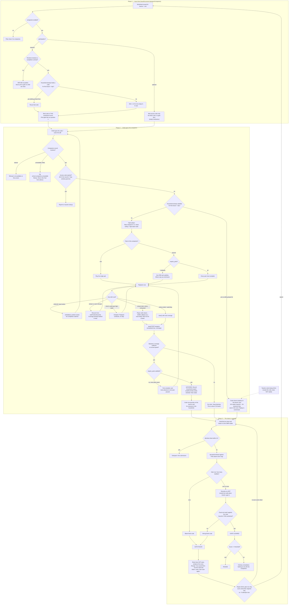

# Companion media gating — requirements

**Date:** 2026-08-27
**Status:** requirements settled (§0, 13 decisions). Nothing here is built.
**Supersedes nothing.** Extends `docs/_wip/plans/2026-08-25-school-worksheet-readalong-requirements.md`,
which specified the read-along companion as *optional and never a grading event*. This
document specifies the other half: what happens when a companion is **required**.

---

## 0. Decisions taken — 2026-08-27

Settled in conversation. Where a later section still reads as a recommendation, this
table wins.

| # | Decision | Section |
|---|---|---|
| D1 | **Code space is all 31 non-empty A–E combinations.** Singles, pairs, triples, quads and all-five are every one of them mintable. Only the empty set is excluded — a blank row is how the sheet says "not answered". | §4.1 |
| D2 | **The gate row is its own item type**, with its own decode branch and its own grade call. It is not a `multi_select` borrowed from the question bank, and it never touches `ambiguityLeniency`. The decoder knows which row it is from the sheet's own form map, so no exemption logic is needed — it simply is not on that path. | §14.1 |
| D3 | **Scope is `(household, lesson, day)`.** Worksheets are scoped `(lesson, user, day)`; codes are one level broader. Same household, same lesson, same day → one code, even when two siblings hold different worksheets with different questions. | §6 |
| D4 | **Satisfaction propagates across the household.** Whoever plays it first satisfies it for everyone on that lesson. The next child opens the companion and the code is already there — no playback, no replay prompt. The assumption is they were in the room. | §6.1 |
| D5 | **Storage is one record per code**, at `school/records/companion-codes/<id>.yml`. Each worksheet's companion record carries a `codeRef`. One file per code means two children finishing different chapters never write the same file. | §6.2 |
| D6 | **Codes are pinned, not rotated.** A lesson keeps its code for the curriculum cycle, so catch-up work weeks later inherits what a sibling already earned. | §6.2 |
| D7 | **One code per lesson companion**, not per part. Any part that satisfies `require_parts` releases it — a child who prefers Psalm 77 to Psalm 70 has still done the work. | §9 |
| D8 | **Satisfaction requires ≥95% played-ranges coverage** at rate ≤ 1.0, banked incrementally server-side. This is the only thing separating a real ending from a dead stream. | §7 |
| D9 | **The code is a pure veto, outside the score.** A 10-question sheet is scored out of 10; the gate can only ever block, never subtract. | §4.3 |
| D10 | **Repair is a re-scan of the same sheet, gate row only.** The original score stands untouched. Paper is append-only, so brute force is bounded to a short chain of supersets. | §13.1 |
| D11 | **A teacher can reveal the code, but not satisfy the companion.** Satisfaction stays false and the records keep the line between "listened" and "was told". Needs a code-lookup surface in the teacher panel. | §10 |
| D12 | **A required companion with no document is refused at publish.** So is one on a renderer that declares no completion contract. Authoring errors belong to the author, not to a child holding a gate with no lock. | §11, §13.6 |
| D13 | **The record's 7-day window governs a required companion** — the access code lives as long as the record. *Assumed, not discussed; easy to reverse.* | §14.8 |

---

## 1. The idea in one paragraph

A lesson companion is a second piece of media attached to an issued worksheet. Today it
is always enrichment — an audiobook you may listen to alongside the textbook. Sometimes
it should be the opposite: a piece of music, a demonstration, a reading that the child
**must** consume before the worksheet can pass. When a companion is required, finishing
it mints a short **finish code**, and that code is the answer to question 1 on the OMR
sheet. A worksheet whose finish code is missing or wrong does not pass, no matter how
well the other questions scored. The code is minted at issue time, is shared across the
household for the same piece of media, and is not a secret once earned.

---

## 2. Vocabulary

| Term | Meaning |
|---|---|
| **Companion** | The optional/required second media attached to an issued worksheet. Already modelled: `companion: {enabled, participation, handler, label}` (`docs/reference/school/README.md:99`). |
| **Handler** | What kind of companion it is. Only `readalong` exists (`backend/src/3_applications/school/companions/LessonCompanionHandlers.mjs:17`). |
| **Part** | One atomic unit of the companion playlist. For read-along, one chapter. |
| **Finish code** | The 2–4 letter code (from A–E) minted for a required companion and answered on the sheet. |
| **Satisfaction** | The household has consumed enough of the companion to release the finish code. |

### Naming the code

Candidates: *exit code*, *listen code*, *finish code*, *unlock code*. Recommend
**finish code** — child-facing, says what earns it, and stays honest for media that is
watched, listened to, or read. The printed question then reads roughly:

> **1.** Finish code — fill in the code shown at the end of *Psalm 70*.

---

## 3. Participation levels

`participation` already exists on the companion record with values `optional | required`.
This document gives `required` teeth.

- **`optional`** (today's behaviour, unchanged). Opening and progress are recorded for
  information. Never affects the score, the pass threshold, retry, or completion.
- **`required`**. A finish-code item is printed on the sheet, and the sheet cannot pass
  without it. Playback integrity rules (§7) apply.

A third level is worth considering but is **not** specified here: `bonus`, where the
companion adds credit rather than gating. Deliberately deferred — see §12.

Participation is a property of the **offering**, not of the media. The same psalm
recording can be required in Come Follow Me and optional in a music course.

---

## 4. The finish code

### 4.1 Shape

Five bubbles, A–E, one printed row, **multi-select**. The answer is a *set*, so the code
is any combination of those five letters.

**Mintable set: every non-empty combination — 31 permutations.** Any size from one letter
to all five: `A`, `BC`, `ADE`, `ABCE`, `ABCDE`. The only excluded value is the empty set,
because a blank row is already how the sheet says "not answered" and the gate must be able
to tell a missing code from a wrong one.

Blind-guess probability is 1 in 31, about 3%. Two consequences of the full set are
accepted deliberately rather than designed around:

- **A single-letter code is a legal answer.** It is indistinguishable on paper from an
  ordinary single-choice answer, which is fine — the item type, not the mark count, is
  what tells the decoder how to read the row.
- **`ABCDE` is a legal answer**, so a child who fills every bubble clears the gate 1 time
  in 31. That is the same 3% as any other guess. §8 explains why guessing is not the
  threat model this gate is built against.

Both have implementation consequences in §14 — the validator's two-answer minimum and the
leniency exemption — but neither is a reason to shrink the code space.

### 4.2 Grading

Exact-set match, full credit or zero. This already exists:
`gradeAnswer`'s `multi_select` branch (`backend/src/2_domains/school/grading.mjs:63`)
compares given and expected as sets, order-insensitive and duplicate-tolerant.

### 4.3 The code is a gate, not a score

The finish-code item occupies question slot 1 on the paper, but it must **not** be graded
as one of the questions.

- It is **excluded from the score denominator.** A worksheet with 10 questions plus a
  finish code is still scored out of 10.
- It is a **veto**. Wrong or blank → the sheet does not pass, whatever the percentage.
- The result receipt must say *which* rule failed, in words a child can act on:
  "You scored 9/10 — but the Read Along code was blank. Listen to Psalm 70, then scan
  this sheet again."

Rationale: mixing the two makes the failure illegible. A child who listened and scored
7/10 and a child who scored 10/10 and skipped the audio have different problems, and a
single percentage cannot tell them apart.

**Repair (D10, §13.1):** the same sheet is re-scanned and only the gate row is re-read.
The score does not move.

---

## 5. Minting and binding

The code is minted **when the worksheet is issued**, in the same breath as the companion
access code — `IssueDocument.#prepareCompanion` (`backend/src/3_applications/school/usecases/IssueDocument.mjs:693`)
already mints the six-digit access code and the companion record there.

Ordering matters and is already right: the companion offer is prepared *before* rendering,
"so the retained PDF owns its code". The finish code must be known before the form map is
built, because it is the answer key for a row the renderer prints.

The companion record grows a field; the answer key for item 1 is that field.

---

## 6. Household scope and sharing

### 6.1 The rule

**One piece of media, one finish code, per household.** If two siblings are both on
Psalm 70 today, their worksheets differ in every other question but carry the *same*
finish code. Whoever's worksheet is issued first mints it; later issues for the same
media reuse it.

Corollary, and it is intended: **if one child listens, their sibling is satisfied too.** The evidence
is household-scoped, so playing the audio in the room clears it for everyone whose
worksheet points at the same media. One child telling the other the code is not a defect.

### 6.2 The scope key and its storage (D3, D5, D6)

**Key: `(householdId, lessonId, lessonDay)`.** One level broader than a worksheet, which
is scoped `(lesson, user, day)`. That one extra degree of freedom — dropping the user — is
the entire sharing mechanism.

`lessonDay` is the day the lesson *belongs to*, not the day it was played. Codes are
pinned (D6): the lesson keeps its code for the curriculum cycle, so a child catching up
the following week inherits what a sibling already earned rather than replaying audio the
household has finished. Rotation was considered and rejected — it defends against
memorisation, which §8 says is not a threat we are defending against.

**One file per code**, so no two household members ever write the same file:

```
records/
  companions/
    ral_a1b2c3.yml            # per worksheet — exists today
      codeRef: cmc_9f2e...
  companion-codes/            # new
    cmc_9f2e.yml
      code: [A, C, E]
      household: <hid>
      lesson: cfm-ot-2026-08-26
      requireParts: 1
      satisfiedAt: 2026-08-26T18:40:12-07:00
      satisfiedBy: learner-a
      satisfiedVia: readalong:scripture/ot/nirv/14712
      coverage: { ... }
```

This shape is deliberate. `YamlLessonCompanionStore`'s own header records what happened on
2026-08-26 when two progress saves one millisecond apart interleaved across their await
points and left a child locked out of their read-along. A single shared index keyed by
media would reproduce exactly that contention across siblings; a file per code does not.

### 6.3 Configurable scope

Default `household`. The field must exist from day one even though only one value is
implemented, because private-headphone companions are foreseeable:

```yaml
companion:
  participation: required
  scope: household   # household | learner
```

`learner` would mint per learner and satisfy per learner. Not built in the first pass.

---

## 7. Playback integrity

When `participation: required`:

- **No rate increase.** Speed controls are hidden or clamped to 1.0.
- **No seeking forward past the high-water mark.** A learner may rewind freely and
  fast-forward back through material already played, but not skip ahead of the furthest
  point actually reached.
- **The frontend enforces it; the backend verifies it.** A reload, a hand-typed URL, or a
  posted completion must not be able to buy a finish code that playback did not earn.

This is not new machinery. It is the media-lesson checkpoint gate, aimed at a different
target:

- `backend/src/2_domains/school/mediaCheckpoints.mjs` — `seekCeilingFor`, pure, no clock,
  no I/O, and explicitly the *authority*.
- `frontend/src/modules/School/lesson/useCheckpointGate.js` — the hand-copied twin that
  makes the stop happen in front of the child.
- `frontend/src/lib/Player/gate/` — `GATE_ID`, `mediaGate`, `pauseArbiter`, `useMediaGate`.
  Two gate ids exist today (`governance`, `checkpoint`); a required companion is a third.

**Recommended verification evidence:** coverage of watched intervals, not a final
playhead. `RecordMediaCompletion.mjs` already distinguishes two confidences —
`verified: 'playhead'` (a screen reporting position) and `verified: 'duration'` (a
headset where elapsed time is the only evidence). The finish code should require the
stronger one, and the weaker one should be a configurable fallback for hub playback
rather than a silent equivalent.

**Threshold (D8, §13.3): ≥95% of merged played ranges, at rate ≤ 1.0.** The tolerance is
there for trailing silence and a final sample lost to a reload — a strict 100% would
strand a child who genuinely listened and has no way to explain themselves. The evidence
is the media element's own `played` TimeRanges, banked incrementally server-side, because
the Player remounts on resilience and `played` resets with the element.

---

## 8. What this gate actually proves — and what it does not

State this plainly so nobody later "fixes" it into something else.

The finish code proves **the household played the media to the end at normal speed**. It
does not prove that a particular child listened, and it is not designed to. The code is
deliberately visible after satisfaction, siblings can tell each other, and it may even be
printable. What it removes is the ability to skip the media entirely and still pass paper.

If per-child evidence is ever wanted, that is `scope: learner` plus comprehension
checkpoints — the media-lesson model — not a harder secret.

---

## 9. Satisfaction across multiple parts

A daily read-along is commonly several chapters (Psalms 70–72; 77 is four parts). Requiring
all four to release the code is heavier than the curriculum intends.

Configurable per offering:

```yaml
companion:
  participation: required
  require_parts: 1        # integer, or `all`
```

- `require_parts: 1` — any single part played to completion satisfies the requirement.
  The remaining parts stay available as enrichment and are recorded, but do not gate.
- `require_parts: all` — every part.
- **Which** part is not specified: any one counts. A child who prefers Psalm 77 to Psalm 70
  has still done the work.

**Settled (D7): one code per lesson companion, not per part.** Four chapters share one
code, and whichever part satisfies `require_parts` releases it. The part actually played
is recorded alongside as `satisfiedVia`, so the evidence still shows *which* — but the
sheet holds one code, because one code is what a sheet can hold.

---

## 10. Code visibility and recovery

Once satisfied, the code must be trivially recoverable. A child who watched on Monday and
scans on Wednesday must not be stuck.

- **Post-completion card.** When the last required part finishes, the player shows a
  completion card displaying the code prominently. This is the moment of minting from the
  child's point of view, even though the code was minted at issue time.
- **Persistent on the launch card.** Every subsequent open of that companion shows the
  code at the top — for anyone in the household, not only the child who earned it.
  A child who is only *revisiting* must not have to replay to see it.
- **Before satisfaction, the code is not shown anywhere a child can reach.** It is on the
  answer key, and the answer key is not child-facing.
- **Printable.** Should be recoverable on paper (a small slip, or on the next receipt).
  Not required in the first pass.

### 10.1 The teacher's lookup (D11)

When the media is broken — dead file, Plex down, a renderer bug — a child holds a
worksheet that cannot pass. The grown-up's remedy is to **read them the code**, and that is
all it is:

- The teacher panel gains a **code-lookup surface**, behind the existing teacher gate,
  showing the code whether or not it has been earned.
- **Satisfaction stays `false`.** The teacher does not mark the companion consumed, and
  the record does not claim anyone listened.
- The lookup is **recorded as a teacher action**, so a sheet that passed its gate against
  an unsatisfied companion is explicable afterwards rather than mysterious.

This keeps a real line in the evidence between *listened* and *was told* — the reports can
still tell those apart, which they could not if an override wrote `satisfiedAt`. It also
means the grown-up unblocks one child at a time; siblings on the same lesson get the code
from the panel too, or from each other, which §8 already permits.

---

## 11. Companion media is any renderer

Read-along is the first handler, not the shape of the feature. A companion may be
anything the Player can render: `frontend/src/modules/Player/renderers/` holds
`AudioPlayer`, `VideoPlayer`, `RemuxPlayer`, `ReadalongScroller`, `SingalongScroller`,
`ContentScroller`, `FlowReader`, `PagedReader`, `ImageFrame`, `SlideShow`,
`TitleCardRenderer`, `WebViewRenderer`.

Two consequences:

1. **The gate belongs in the Player's gate layer, not in the read-along handler.**
   `frontend/src/lib/Player/gate/` is where a rule that applies to every renderer lives.
2. **Renderers must declare a completion contract.** Timed media (audio, video) can report
   coverage. Untimed media cannot: `SlideShow.jsx` is currently a stub with no timeline at
   all, and `PagedReader`/`FlowReader` have position but no duration. A required companion
   on an untimed renderer needs a different definition of finished — last slide reached,
   last page turned, dwell time — declared by the renderer rather than assumed by the gate.

**A required companion on a renderer that declares no completion contract must be refused
at publish time**, not discovered by a child staring at a card that will never appear.

---

## 12. Relationship to what already exists

| Existing | Relationship |
|---|---|
| **Media lessons** (`4_api/v1/routers/mediaLesson.mjs`, `School/lesson/MediaLessonScreen.jsx`) — video with in-stream comprehension checkpoints, hard-gated by `RecordMediaCompletion` | The **screen-native** version of the same idea. Companion gating is its **paper** counterpart: the checkpoint is asked on the OMR sheet instead of an overlay. Reuse the seek-ceiling and completion machinery; do not duplicate the rule. |
| **Piano lesson gate** (`GetPianoLessonGate.mjs`) | The precedent the user cited for "emits completion criteria automatically". Its stated principle — *the rule has one owner*, the launcher's `status()`, never re-derived by a caller — applies here verbatim. Completion must have exactly one authority. |
| **Optional read-along** (2026-08-25 requirements) | Unchanged. `participation: optional` keeps every guarantee in that document, including "opening must not count as listening" and "never changes an OMR score". |
| **`bonus` participation** | Not specified. The user raised extra credit for non-required parts; deferred until the required path ships. |

---

## 13. Resolved questions

All seven are now decided (§0). Kept here with the reasoning, since the reasoning is what
a later reader will want.

### 13.1 Repair path — re-scan the same sheet, gate row only (D10)

The child listens, fills in the code bubbles, and feeds the same sheet again. **Only the
gate row is re-read; the original score stands untouched.**

Re-grading the whole sheet was rejected for a specific reason: the result receipt already
tells the child which questions were wrong (`marks[]`, one entry per question), and eraser
leniency credits a two-mark row containing the correct answer. A child could add the right
bubble to a wrong question and gain credit through the leniency rule. Full re-grading would
turn a gate repair into a score repair.

Brute force is bounded by physics: **paper is append-only.** Marks can be added, not
removed, so a child can only walk up a chain of supersets — `A`, `AB`, `ABC`, `ABCD`,
`ABCDE` — five attempts at most, and only successful if the code happens to lie on that
exact chain. After the row is full it is permanently wrong and a reprint is the only way
forward.

### 13.2 Rotation — pinned (D6). See §6.2.
### 13.3 Coverage threshold — ≥95% of played ranges (D8). See §7.
### 13.4 Code scope — one per lesson companion (D7). See §9.
### 13.5 Teacher access — reveal only, never satisfy (D11). See §10.1.
### 13.6 A required companion with no document — refused at publish (D12)

Validation rejects it, exactly as it rejects a required companion on a renderer that
declares no completion contract (§11). Both are authoring errors and belong to the author
at publish time. Falling back to the screen-native checkpoint gate was considered and
deferred: it is real reuse of `RecordMediaCompletion`, but it would make `required` mean
two different mechanisms depending on whether a sheet happened to be attached.

### 13.7 Where the code lives — its own record (D5). See §6.2.

---

## 14. Known implementation gaps

Findings from reading the current code. These are the concrete things that do not exist
yet, as distinct from decisions still to be made.

### 14.1 The gate row is its own item type (D2) — one piece of work, not four

An earlier draft listed four separate problems here: the decoder collapsing multi-mark rows
to `ambiguous`, eraser leniency crediting a near-miss, the validator's two-answer minimum
blocking single-letter codes, and the label-vs-letter mismatch. **They are all the same
problem, and D2 dissolves them.** The decoder knows which row is the gate row — the item
id and its answer come off the sheet's own form map — so the gate row never enters the
generic path at all.

What that means concretely:

- **Its own decode branch.** `decodeOmrSheet`
  (`backend/src/2_domains/school/documents/omrForm.mjs:116`) currently classifies *any* row
  with two or more filled bubbles as `ambiguous`, with no branch for item type. The gate
  row instead reports the full set of hits. This is the one real change to the decoder,
  and it is a branch, not a rewrite.
- **Its own grade call.** Exact-set match. `gradeAnswer`'s `multi_select` branch
  (`grading.mjs:63`) already does exactly this and can be reused directly.
- **It never reaches `ambiguityLeniency`.** No exemption flag, no cap of zero — it is not
  on that code path. This matters because both leniency rules are actively wrong here:
  rule 1 would credit `A+B` against a code of `A+C`, and rule 3 would refuse a legitimate
  `ABCDE`.
- **It is not bank-validated.** `questionBankValidation.mjs:155` (a `multi_select` needs
  ≥2 answers) and `:158` (must not carry `answer`) do not apply, because the item is not
  drawn from a question bank. Its answer key comes from the companion code record. This is
  what makes single-letter codes legal under D1.
- **Its bubbles are labelled `A`…`E` literally.** `omrForm.mjs`'s header is explicit that
  the decoder reports `mark.label` — the choice text printed under the bubble — not the
  bubble's position letter. The answer key must be stored in the same alphabet or a
  perfectly filled row scores zero.

Still true and unchanged: `multi_select` is already in `ROW_MAPPABLE_TYPES`
(`documents/allocation.mjs:19`), so the renderer can lay the row out today.

### 14.2 The remaining gaps

2. **No household-scoped storage.** `YamlLessonCompanionStore` writes
   `school/records/companions/<ral_*>.yml`, one file per issued worksheet, keyed by
   learner and session. D5's `companion-codes/` store is new construction.

3. **No coverage tracking anywhere.** Progress today is a throttled position sample every
   10s (`THROTTLE_MS`). D8 needs the media element's `played` TimeRanges reported and
   merged into banked server-side coverage — and banked *incrementally*, because the
   Player remounts on resilience and `played` resets with the element.

4. **No rate or seek restriction in the read-along player.** `usePlayerController.js`
   exposes an unconditional `seek`; `ReadalongPlaylistPlayer` offers rewind/forward
   transport with no ceiling. The checkpoint gate's `seekCeiling` is applied by
   `useMediaGate`, which the read-along path does not currently use.

5. **No completion card, and `clear` cannot be trusted to trigger one.** See §16 — the
   last-part branch is empty, and `handleResilienceExhausted` routes a dead stream through
   the same callback as a real ending.

6. **The progress endpoint returns no verdict.** `{ok, tracked}` today; the card needs
   `{satisfied, code?, remainingParts}` and the write needs to be awaited.

7. **No teacher code-lookup surface** (D11).

8. **The 7-day / study-day expiry split.** `IssueDocument.#prepareCompanion` gives the
   companion record 7 days but the access code only until the 4am study-day boundary.
   **D13: for a required companion the record's window governs** — a code that expires at
   4am while the worksheet is still in the child's folder wedges them for nothing.
   Assumed rather than discussed; easy to reverse.

9. **`SlideShow.jsx` is a stub.** It renders a placeholder div and has no timeline. Any
   requirement that a slideshow can be a *required* companion is a request to implement
   the renderer first — or, under D12, to refuse it at publish.

---

## 15. Out of scope

- Per-verse audio timing, word highlighting, and seeking to a cited verse — still deferred
  from the 2026-08-25 document.
- Any change to how the other worksheet questions are selected, rendered, or scored.
- Points, rewards, or coin-economy consequences for companion completion.
- `bonus`/extra-credit participation.

---

## 16. What actually fires at end of playback today

The completion card has to hang off an existing signal. This is that signal, traced
through the shipped code, because two of its properties are hostile to a gate.

### 16.1 The current chain

1. **`<audio>` fires native `ended`.** Or, when it doesn't —
   `useEndOfContentWatchdog` synthesises it (`ContentScroller.jsx:370`), a fallback added
   for DASH streams whose zero-byte trailing fragment leaves the element paused at
   duration with `seeking` stuck true.
2. **`ContentScroller.handleEnded` → `onAdvance()`** (`ContentScroller.jsx:362`).
3. **`Player.singleAdvance`** (`Player.jsx:1093`). The companion plays one part at a time,
   not a queue, and it is not `continuous`, so this falls straight through to **`clear()`**
   (`Player.jsx:1105`).
4. **`clear` is the prop the playlist passed in**:
   `<Player key={part.id} clear={ended} … />` in `ReadalongPlaylistPlayer.jsx`.
5. **`ReadalongPlaylistPlayer.ended`** logs `readalong.part-complete`, calls `write(true)`
   → `POST /self-service/companions/:id/progress` with `completed: true`, then
   `if (index < parts.length - 1) changePart(index + 1)`.
6. **Backend**: `RecordLessonCompanionProgress` → `LessonCompanionHandlers.recordProgress`
   → `ReadalongLessonCompanionHandler.recordProgress` writes
   `state.parts[partId].completedAt`.

### 16.2 Three problems this creates for a gate

**(a) The last-part branch is empty — there is no card to hook.** Step 5 advances only
when a later part exists. On the final part, `ended` writes progress and then *nothing
renders*. The finished player stays mounted; the sole visible change is the derived
`complete` flag relabelling the play button to "Play again". **The completion card is new
UI, not a modification of an existing one.**

**(b) `clear` cannot tell finishing from giving up.** `Player.handleResilienceExhausted`
(`Player.jsx:979`) calls the same `clear()` when playback has failed and retries are
exhausted, with no next queue item. `useMediaKeyboardHandler` also wires `onEnd` and
`onClear` to key bindings. So a stream that died and a stream that finished arrive at
`ended` through the identical callback — and a child who pulls the network at 0:05 would
mint a finish code. **The gate must not trust `clear`.** It must confirm against
coverage evidence (§7) before revealing anything.

**(c) The completion write is fire-and-forget.** `ended` does not await `onProgress`, and
the endpoint answers `{ok, tracked}` — nothing about satisfaction and no code. Revealing
a code requires the write to become awaited and the response to carry the verdict, so the
card renders server-confirmed state rather than a client's optimistic guess.

### 16.3 The proposed sequence

Native `ended` (or watchdog) → **await** the progress write with `completed: true` and the
watched-coverage record → backend recomputes satisfaction for the *household* scope →
response carries `{satisfied, code?, remainingParts}` → **only then** the card renders,
showing the code when `satisfied`. A resilience-exhausted `clear` takes the same path and
is refused by coverage, landing on "keep listening" instead of a code.

---

## 17. Flow diagram

Three phases, one diagram. Bold-ish terminal nodes are the states a child can actually
end up in.



### 17.1 Edge cases the diagram encodes, called out

| Case | Where | Behaviour |
|---|---|---|
| **Sibling went first** | `I7`, `C6` | Second worksheet reuses the code; the second child sees it without replaying. Intended (§8). |
| **Scanned before ever playing** | `S5` | Blank gate row → failed gate, regardless of a perfect score. |
| **Stream died mid-play** | `C19 → C22` | Reaches the same `clear()` as a real ending, and is caught only by the coverage check. This is the load-bearing reason coverage exists. |
| **Crash / reload mid-part** | `C17` | Resume from `lastPositionSeconds`; banked coverage survives. Already implemented for position (`readalong.resume-applied`); coverage is new. |
| **Seek-ahead attempt** | `C18` | Clamped to the high-water mark. Rewinding stays free. |
| **Multi-part, only one needed** | `C12` | Extra parts recorded as enrichment, never gating. |
| **Curriculum revision changed between print and scan** | `S7` | Grade against the code **bound to that sheet's own record**, never the currently-minted household code. An old sheet in a backpack must still grade correctly. |
| **Duplicate feed / hand re-feed** | `S1` | Existing 2s dedup window applies unchanged. |
| **Companion file corrupt** | `C3` | Existing `school.companion.unreadable` path: refuse loudly rather than infer. |
| **Code expired but record alive** | `C4` | D13: the record's 7-day window governs a required companion. |
| **Media is broken** | `T0` | Teacher reads the code out; satisfaction stays false and the lookup is recorded (D11). |
| **Renderer with no timeline** | `I5` | Refused at publish, not discovered by a child. |
