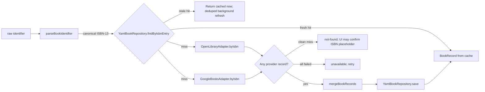
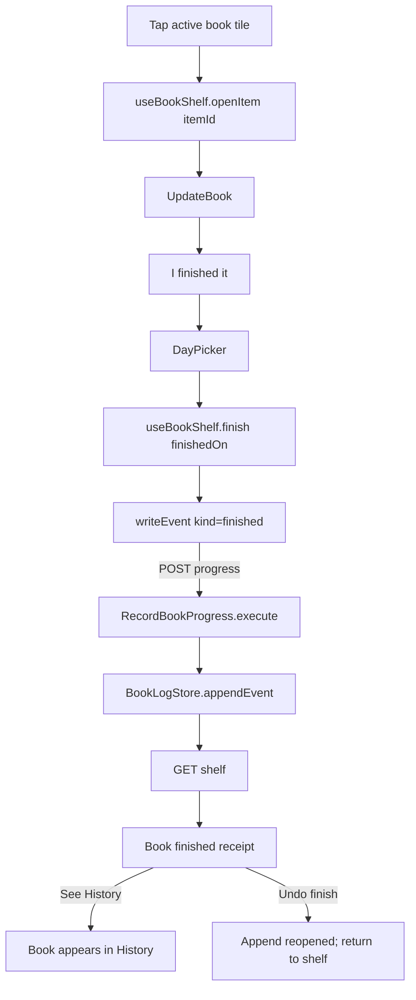

# User_4 reading shelf: end-to-end contract, simulation, and adversarial UX audit

**Date:** 2026-09-03
**Implementation update:** 2026-09-03, after the production enrollment write, remediation pass, and frontend-only browser contract
**Scope:** the locked school panel flow from a six-digit access code through ISBN entry and a finished-book record, including the alternate path for finishing a book already on the shelf.
**Audit posture:** implementation audit. The enrollment was changed through the production lifecycle API; the code changes described as fixed are isolated on `feat/user_4-book-log-ux` and are not production behavior until that branch is reviewed and deployed.

## Executive verdict

The transaction now has strong seams at both ends: the access code resolves without writing, the action is recomputed before it is honored, the shelf receives a learner-bound signed grant, ISBNs are checksum-validated before lookup, writes carry stable idempotency IDs, dates use the household study day, and completion is projected from append-only evidence. The remediation pass also adds conservative metadata presentation, many-author handling, cover letterboxing/fallback, physical keyboard/scanner input, explicit save receipts, finish correction, stale-while-revalidate metadata, bounded lookup waits, mixed English-track arbitration, and an adult enrollment editor that names the two reading experiences by audience rather than hiding both behind “English.”

It is still not honest to call the production experience complete:

1. **User_4 is enrolled correctly, but production currently cannot launch it.** The lifecycle write replaced his preschool `story-time` assignment with the intended `book-log` assignment. The next live agenda read uncovered an interface mismatch: `BookLogProgramLauncher` called a nonexistent `assignments.listForLearner`; the real assignment store exposes `get(learnerId)`. Commit `ebd5500fd1` fixes and regression-tests that exact fault, but it still needs an authorized deploy/restart and live verification.
2. **The composed data path and the real React browser path are now automated locally; the deployed panel is not yet certified.** `tests/isolated/flow/school/reading-shelf.test.mjs` proves code → program choice → signed grant → ISBN/cache → one idempotent finished record → obligation/history projection → undo against fresh YAML. `tests/live/flow/school/reading-shelf-contract.runtime.test.mjs` drives the actual `/school` shell at 1280×800 through code → launch card → shelf → ISBN → cleaned confirmation → finished receipt → History, with the HTTP boundary made disposable. It verifies exact request bodies and headers plus portrait, landscape, broken, and missing cover behavior. It deliberately does not prove the undeployed production container, a real metadata provider, physical touch hardware, or a durable production write.
3. **Two adult-repair edges remain product work, but neither blocks logging.** A clean provider miss now continues under an explicit ISBN placeholder rather than promising a nonexistent grown-up action; there is still no teacher-gated editor to supply its title/author/cover. Stale metadata refreshes in the background and a failed forced refresh keeps the known-good cache, but changing a page count already snapshotted onto an existing shelf item still requires an explicit migration policy.

In short: the hostile-data and child-trust failures found in the first audit are now substantially remediated and covered, including local pixel evidence. Deployment, actual-panel inspection, real-provider verification, and the adult repair workflow remain open evidence—not assumed success.

## Enrollment and current production blocker

The intended program entry is:

```yaml
programId: book-log
corpusId: null
subject: english
title: Reading
obligation:
  metric: checkins
  quantity: 1
  per: day
schedule:
  daysOfWeek: [1, 2, 3, 4, 5]
```

The production lifecycle record was updated to exactly this entry while preserving User_4's courses, unit assignments, and Piano program. `story-time` and `book-log` both belong under English, but they are different programs for different age groups; the former is a screen-reading program for preschoolers, while the latter records the physical books a grade-school reader handles independently.

In the data model this is a **program enrollment**, not a curriculum course document: its synthetic agenda entry is `book-log:shelf`, supplied by `appendAssignedProgramEntries` and `BookLogProgramLauncher`. Calling it User_4's “reading course” is sensible product language, but creating a document under `2_domains/school/documents` would not enroll it and would put the responsibility in the wrong domain. The book identity/cache model remains under `2_domains/books`; School owns only the learner shelf, obligation, and launch wiring.

The enrollment write itself succeeded. Its immediate agenda read returned `programUnavailable` because the launcher called the wrong assignment-port method. That failure is valuable evidence: the earlier tests used a permissive fake that implemented the invented method, so the unit boundary was green while the composed production boundary was broken. The hotfix changes the launcher contract to `assignments.get(learnerId)`, rejects the old fake shape in its constructor, and tests the real assignment shape. Until that hotfix is deployed, User_4's production assignment is correct but his agenda must be treated as unavailable rather than silently routed elsewhere.

### How the wrong program was accepted

This was not an ISBN-domain or course-document mapping error. It was a configuration error that the current contracts were unable to identify:

1. `subject: english` is taxonomy, not an age or instructional-method policy. Both `story-time` and `book-log` legitimately use it.
2. `validateStoryTimeEnrollment(raw)` and `validateBookLogEnrollment(raw)` validate their own target, subject, schedule, and obligation shapes. Neither receives a learner record or declares an intended audience such as preschool/independent reader.
3. `createSchoolProgramEnrollmentValidators(...)` dispatches entirely from the explicitly assigned `programId`; the assignment lifecycle therefore asks “is this a valid Story Time enrollment?” but never “is Story Time the intended reading experience for this learner?”
4. The persisted program assignment contains no grade/audience discriminator. User_4's roster age or grade cannot participate in validation at that seam, even if another part of the system happens to know it.
5. Both programs could present as English/Reading in adult-facing plan output, making the pedagogical difference easy to miss during manual authoring.
6. One adult planner did not carry `programs` in its PUT contract at all, so editing an unrelated course could silently erase the reading enrollment. The teacher planner preserved program objects but did not render or edit them, making the mistake invisible.

The immediate correction is the explicit `book-log` enrollment and program-aware English-token arbitration described here. The isolated branch now also presents one mutually exclusive Reading choice on both adult planners: **Preschool story time — pre-readers with a grown-up** or **Independent reading — book log — grade-school readers**. It preserves unrelated program objects byte-for-byte, carries `programs` across the admin HTTP client, and the backend refuses both reading experiences together. That prevents the concrete invisible/erasing failure without guessing from age. A future learner-profile policy can compare a structured reading stage with the chosen program and require an intentional override for a mismatch; hard-coding “older children may never use Story Time” from birth year would be too blunt and would erase legitimate exceptions. A production assignment test using the real store shape is also necessary—the launcher incident showed that a permissive fake can hide a second, unrelated operational failure.

## What “every method” means here

The ledgers below include every application-owned method or function that carries, validates, transforms, authorizes, persists, or renders a major value on the requested path. They intentionally omit React internals, Express internals, generic `fetch`, generic YAML parsing, logging calls, and CSS engine behavior. The provider image requests and metadata HTTP calls are included because they materially affect what User_4 sees.

## End-to-end flowchart

```mermaid
flowchart TD
  A[Locked panel: Type your code] -->|six digits| B[Keypad.submit]
  B --> C[useSelfService.submit code]
  C -->|POST self-service/resolve| D[ResolveAccessCode.execute]
  D --> E[TokenRegistry.getByAccessCode]
  E --> F[PlanProjection.project]
  F --> G{Token explicitly names a program?}
  G -->|book-log and eligible| H[Select book-log:shelf]
  G -->|no| X1[Use ordinary English next entry]
  H --> H2[buildContextualLaunchCard]
  H2 --> I[Launch card: Reading / Open my books]
  I -->|tap program action| J[useSelfService.runAction]
  J -->|POST self-service/act| K[RunSelfServiceAction.execute]
  K --> L[ResolveAccessCode.resolve again]
  L --> M[BookLogProgramLauncher.issueLaunchTarget]
  M --> N[HmacSchoolBookGrantIssuer.issue]
  N --> O[SchoolApp.onPortalLaunch]
  O --> P[BookShelf / useBookShelf]
  P -->|required, starts immediately| Q[GET learner shelf]
  P -->|optional, starts in parallel| R[GET school roster]
  Q --> S[Active shelf and Add a book]
  S --> T[NumberPad: ISBN]
  T --> U[checkIsbn]
  U -->|valid + Look it up| V[GET books/resolve]
  V --> W[ResolveBook.execute]
  W --> Y[(Book cache)]
  W --> Z[Open Library adapter]
  W --> AA[Google Books adapter]
  Z --> AB{Any provider record?}
  AA --> AB
  AB -->|yes| AC[mergeBookRecords]
  AC --> Y
  Y --> AC3[Clean presentation + contain/fallback cover]
  AB -->|clean miss| AC1[Explicit Book ISBN placeholder]
  AC1 --> AC3
  AB -->|all failed| X2[Keep ISBN + Try again]
  AC3 --> AC2[Confirm metadata or physical ISBN]
  AC2 -->|Yes| AD[Mint entryId + progressEntryId]
  AD --> AE[I already finished it]
  AE --> AF[DayPicker: That's the day]
  AF -->|POST learner shelf| AG[OpenBookShelfItem.execute]
  AG --> AH[ResolveBook.execute again; normally cache hit]
  AH --> AI[BookLogStore.openItem: started]
  AI --> AJ[BookLogStore.appendEvent: finished]
  AJ --> AK[GET learner shelf again]
  AK --> AL[projectShelfItem + measureObligation]
  AL --> AM[Explicit Book finished receipt]
  AM -->|See History| AN[Book appears in History]
  AM -->|Undo finish| AO[Append reopened event]
  AO --> AP[Book returns to shelf; completion/check-in withdrawn]
```



The `X1` branch is intentional rather than accidental. `book-log` and ordinary curriculum share `subject: english`, so the token must disambiguate which independent track the printed code represents. When `subject.program` is present, both access-code and scan resolution now select that eligible program even if an ordinary English lesson sorts first. When it is absent, ordinary English `section.next` remains authoritative. Agenda service is entry-aware: finishing one independent track does not hide a still-pending sibling track, and an unavailable required program still faults instead of being masked by a completed lesson.

## Concrete simulated run

The literals below are examples, not User_4's real current code or a real grant.

| Variable | Example | Minted/read by | Where it goes next |
|---|---|---|---|
| `code` | `482913` | Printed agenda / keypad | `/self-service/resolve`, then `/self-service/act` |
| `learnerId` | `user_4` | token record | card, launch target, grant payload, route path |
| `subject` | `english` | token record | plan section lookup and launch-card taxonomy |
| `continueToday` | `true` | `BuildAgenda` for a subject containing `book-log` | lets a served English code reopen something |
| `program` | `book-log` | same token record | tells the served continuation which English program to reopen |
| `programId` | `book-log` | plan entry/resolution | action target and launcher lookup |
| `unitId` | `book-log:shelf` | assigned-program projection | launch-card lesson identity |
| `bookGrant` | `<HMAC token>` | `BookLogProgramLauncher.issueLaunchTarget` | every `/school/books/...` request header |
| grant payload `learnerId` | `user_4` | `HmacSchoolBookGrantIssuer.issue` | authoritative learner identity at shelf router |
| grant `exp` | `<issue time + 8h>` | grant issuer default | grant verification; independent of 90s UI idle close |
| `entry` | `9780064400558` | ISBN NumberPad | local ISBN judgment |
| `isbn13` / `bookId` | `9780064400558` | `checkIsbn` and `ResolveBook` | cache key, log book identity, item ID |
| `resolved.book` | merged `BookRecord` | `ResolveBook.execute` | confirmation card and opening write |
| `cachedAt` | resolver clock ISO | `YamlBookRepository.save` | 30-day stale-while-revalidate decision |
| presentation `title` | cleaned title + subtitle | `presentBook` | confirmation, shelf, update, receipt, History |
| presentation `author` | first two names + remaining count | `authorsLabel` | compact visible line; `allAuthors` remains the expansion |
| `entryId` | `<UUID-A>` | `confirmCover(true)` | idempotency key for item open / `started` event |
| `progressEntryId` | `<UUID-B>` | `confirmCover(true)` | idempotency key for first `finished` event |
| `finishedOn` | `2026-09-03` | `DayPicker` seeded from server `studyDay` | finished-event timestamp |
| `openedAt` | `2026-09-03T12:00:00.000Z` | `OpenBookShelfItem` for the finished door | `started` event timestamp |
| `itemId` | `user_4:9780064400558:<UUID-A>` | `YamlBookLogStore.openItem` | later progress route and shelf projection |
| projected `status` | `finished` | `projectShelfItem` | filters item out of active shelf and into History |
| obligation `actual` | `1` | `measureObligation` | shelf line `1 of 1 check-in today` if finished on today's study day |
| `receipt.kind` | `finished` | `openBook` / `writeEvent` | explicit success view and History/undo choices |
| `undoEntryId` | `<UUID-C>` | successful finish handler | stable idempotency key for a retried `reopened` correction |

### Step 1: enter the panel code

User_4 sees `Type your code`, six visible slots, digits, Clear, `0`, and Backspace. There is no Go button. Touch or a HID keyboard can enter the code. The sixth digit starts a 300 ms settle timer, then submits automatically. The entry is cleared before the round trip so another child cannot inherit it.

For the example:

```text
Keypad.press('4') ... Keypad.press('3')
Keypad.submit()
useSelfService.submit('482913')
```

Wire request:

```http
POST /api/v1/school/self-service/resolve
Content-Type: application/json

{"code":"482913"}
```

The token registry accepts only an exact six-character decimal string. It verifies the shorter access-code expiry and revocation state, then returns a record shaped approximately as:

```json
{
  "tokenClass": "subject_next",
  "subject": {
    "learnerId": "user_4",
    "subject": "english",
    "continueToday": true,
    "program": "book-log"
  },
  "accessCode": "482913",
  "accessCodeExpiresAt": "<next household 4am boundary or earlier token expiry>"
}
```

`ResolveAccessCode` performs a read-only plan projection. Assuming the corrected enrollment is the English next entry, it creates a program resolution:

```json
{
  "kind": "program",
  "programId": "book-log",
  "unit": {
    "unitId": "book-log:shelf",
    "title": "Reading",
    "subject": "english",
    "program": "book-log",
    "programInstance": "shelf"
  }
}
```

Representative 200 response:

```json
{
  "ok": true,
  "learner": "user_4",
  "subject": "english",
  "title": "Reading",
  "sentence": null,
  "schema": "school.self-service-card/v2",
  "context": {
    "learner": {
      "id": "user_4",
      "displayName": "User_4",
      "avatar": { "kind": "learner", "id": "user_4" }
    },
    "taxonomy": {
      "subject": { "id": "english", "label": "English & Literature" },
      "course": null,
      "module": null,
      "lesson": { "id": "book-log:shelf", "title": "Reading" }
    },
    "trail": [
      { "kind": "subject", "id": "english", "label": "English & Literature" },
      { "kind": "lesson", "id": "book-log:shelf", "label": "Reading" }
    ],
    "progress": []
  },
  "presentation": { "status": "ready", "message": null },
  "actions": [
    { "kind": "program", "label": "Open Reading", "target": "book-log", "role": "primary" },
    { "kind": "exit", "label": "Go back", "role": "secondary" }
  ]
}
```

The wire action still says `Open Reading`; action semantics stay server-owned. `LaunchCard` now has the explicit `book-log` presentation mapping `{icon:'english', label:'Open my books'}`, so the child-facing button uses the task-specific words while submitting the unchanged `action:'program'` contract.

Failure behavior is deliberately child-facing:

- unknown, malformed, expired, or revoked code: HTTP 200, `{ "ok": false, "reason": "unknown_code", "sentence": "Try again." }`; the slots animate `NONONO`;
- backend/lifecycle failure: a non-2xx response or `{ok:false, reason:"not_answering"}`; the panel says the school computer is not answering and offers Retry;
- the code lookup itself does not create a session or write a record.

### Step 2: open the reading shelf

User_4 taps the primary program action. This is a second request, not an automatic consequence of code entry:

```http
POST /api/v1/school/self-service/act
Content-Type: application/json

{"code":"482913","action":"program"}
```

`RunSelfServiceAction` resolves the code and recomputes the offered buttons again. This prevents a stale rendered card from authorizing an action that is no longer offered. It finds the `book-log` launcher, sees `surface === 'portal'`, and asks it for a launch target.

Representative 200 response:

```json
{
  "outcome": "mount",
  "sentence": "Opening it here on the screen.",
  "action": "program",
  "sessionId": null,
  "transition": "mount",
  "effect": {
    "kind": "program",
    "program": "book-log",
    "programId": "book-log",
    "unitId": "book-log:shelf",
    "learnerId": "user_4",
    "bookGrant": "<signed learner-bound grant>"
  }
}
```

`useSelfService.launchTarget` copies `bookGrant` through an explicit allowlist. `SchoolApp.onPortalLaunch` refuses the mount if either learner or grant is absent. Only after `onPortalLaunch` returns exactly `true` does the self-service card close behind the newly mounted shelf.

The grant payload is signed, has purpose `book-shelf`, names `user_4`, carries a random `jti`, and expires after eight hours by default. It is sent only as `X-School-Book-Grant`, never in a query string or request body.

### Step 3: load User_4's shelf

`useBookShelf.load()` starts both requests together, but only the shelf request gates rendering:

```http
GET /api/v1/school/books/user_4/shelf
X-School-Book-Grant: <signed grant>
```

```http
GET /api/v1/school/roster
```

The shelf router verifies that the grant's learner equals the URL learner. It discards any body-supplied identity on writes; the signed grant is authoritative.

The roster request is optional enrichment for User_4's display name/avatar. Its rejection is normalized immediately and a slow roster response cannot hold a valid shelf behind the loading view; the chip temporarily falls back to the authoritative learner ID.

Representative shelf response:

```json
{
  "learnerId": "user_4",
  "studyDay": "2026-09-03",
  "items": [],
  "obligation": {
    "label": "0 of 1 check-in",
    "met": false,
    "actual": 0,
    "target": 1,
    "metric": "checkins",
    "incompatibleBooks": [],
    "per": "day"
  }
}
```

The UI turns that into `0 of 1 check-in today`, shows a User_4 identity chip, an always-visible Done button, `Add your first book`, and a History link. The workspace closes after 90 seconds of no interaction by default; any click inside it re-arms the timer.

### Step 4: type and resolve the ISBN

User_4 taps `Add your first book`. The state becomes `view='add'`, `step='number'`. He sees 13 slots and the prompt `Type the number under the barcode`.

Important interaction difference from the access-code keypad: ISBN entry does **not** auto-submit. User_4 must tap `Look it up`.

Each tap runs:

```text
NumberPad.press(character)
useBookShelf.typeIsbn(nextValue)
checkIsbn(nextValue)
```

For `9780064400558`:

```json
{ "state": "valid", "isbn13": "9780064400558" }
```

The button then runs `useBookShelf.lookup()` and sends:

```http
GET /api/v1/books/resolve?id=9780064400558
```

The endpoint is intentionally not grant-gated because it returns book facts, not learner data.

`ResolveBook.execute(identifier, {refresh:false})` performs:



Provider calls on a cache miss are:

```http
GET https://openlibrary.org/api/books?bibkeys=ISBN:9780064400558&format=json&jscmd=data
GET https://openlibrary.org/isbn/9780064400558.json
GET https://openlibrary.org/works/<work-key>.json
GET https://www.googleapis.com/books/v1/volumes?q=isbn:9780064400558[&key=<books-only-key>]
```

The first Open Library call is required; the edition/work enrichment calls are best-effort. Both provider adapters have an eight-second request timeout and are queried in parallel. The browser bounds the composed lookup at 30 seconds so a broken socket cannot survive until the workspace's idle close. `ResolveBook` distinguishes:

| Domain status | HTTP | UI consequence |
|---|---:|---|
| `ok` | 200 | show confirmation card |
| `invalid` | 400 | explain checksum/prefix problem |
| `not-found` | 404 | show an unidentified ISBN confirmation; after confirmation the shelf write independently validates the ISBN and accepts a minimal `unresolved-isbn` record |
| `unavailable` | 503 | keep ISBN, show Try again |

The merged `BookRecord` has one stable shape. Major fields include `isbn13`, `isbn10`, `title`, `subtitle`, `authors[]`, `publisher`, `publishedYear`, `pageCount`, `language`, `description`, `coverUrl`, series identifiers, subjects/categories, people/places, excerpts, library/provider IDs, and ratings.

Current merge behavior:

| Field | Preferred source | Fallback/merge behavior |
|---|---|---|
| title, subtitle | Open Library | Google |
| authors | Open Library first | domain union; presentation humanizes `Last, First` and de-duplicates punctuation variants |
| page count | Open Library | Google; zero becomes null |
| cover URL | explicitly declared Open Library edition cover | Google when Open Library did not actually declare one; old `http` URLs are upgraded at render |
| description | Google | Open Library work record |
| list fields | per-field ordering | union, then exact de-duplication |

### Step 5: confirm the real-world book record

The confirmation view passes provider values through `presentBook` without mutating the cached record. It shows:

- cover letterboxed with `object-fit:contain` on a neutral portrait backing, or a labeled placeholder for missing, unsafe, or failed images;
- title plus nonduplicate subtitle, with HTML/control/whitespace debris and conservative trailing catalogue/binding brackets removed;
- one or two humanized author names plus `N more`, with the complete list in the title/accessibility expansion;
- HTML-to-text description, whitespace-normalized and bounded before the four-line clamp;
- `Is this your book?` with Yes and No.

If the same ISBN is already in `reading` status, it instead says `You've already got this one` and offers `Open it`. A finished or set-aside copy does not block a reread. No returns to the populated number pad (`No, edit number`); rejecting provider data no longer costs thirteen fresh taps.

On Yes, the client mints two different UUIDs before any write:

```text
entryId         = crypto.randomUUID()
progressEntryId = crypto.randomUUID()
```

Those exact IDs survive retries. They must differ because opening the item writes a `started` event and finishing writes a second event; the store de-duplicates events by ID.

### Step 6: mark the new book finished

User_4 chooses `I already finished it`. No request is sent yet. The UI advances to `step='when'` and shows `When did you finish it?`.

`DayPicker` receives the server's `studyDay`, not the browser's calendar date. It starts collapsed on `Today · <weekday> <day>` and requires a final `That's the day` tap. `pick a day` exposes three weeks at a time, covering roughly the preceding school year while keeping the oldest visible cell within 364 days; future dates are absent.

For the default day, the request is:

```http
POST /api/v1/school/books/user_4/shelf
X-School-Book-Grant: <signed grant>
Content-Type: application/json

{
  "bookId": "9780064400558",
  "entryId": "<UUID-A>",
  "where": "finished",
  "finishedOn": "2026-09-03",
  "progressEntryId": "<UUID-B>"
}
```

The router removes any `learnerId` supplied in the body, then calls:

```text
OpenBookShelfItem.execute({
  learnerId: 'user_4',
  bookId: '9780064400558',
  entryId: '<UUID-A>',
  where: 'finished',
  finishedOn: '2026-09-03',
  progressEntryId: '<UUID-B>'
})
```

The use case validates the day against the household study day, resolves the ISBN again (normally a cache hit), infers `progressMode='page'` when the book has a positive page count and `check` otherwise, and performs two durable operations:

```json
{
  "itemId": "user_4:9780064400558:<UUID-A>",
  "bookId": "9780064400558",
  "progressMode": "page",
  "pageCount": 184,
  "openedAt": "2026-09-03T12:00:00.000Z",
  "events": [
    {
      "kind": "started",
      "at": "2026-09-03T12:00:00.000Z",
      "entryId": "<UUID-A>"
    },
    {
      "kind": "finished",
      "at": "2026-09-03T12:00:00.000Z",
      "entryId": "<UUID-B>"
    }
  ]
}
```

The client then re-fetches the shelf while retaining its single-write lock. `projectShelfItem` sees the current, uncorrected finish and returns `status='finished'`, `percent=100`, and one distinct day read. `started` is not reading evidence; `measureObligation` counts only the finish date, once.

If `finishedOn` is today's study day, the result is `1 of 1 check-in today`. If it is backdated, today's obligation remains `0 of 1`.

The successful result displays an explicit `Book finished!` receipt with the cleaned cover/title/author, saved day, `Back to my books`, `See History`, and `Undo finish`. History contains the finished item. Undo appends an idempotent `reopened` event instead of deleting evidence; projection returns the item to the active shelf and withdraws the corrected finish from book counts, check-ins, and `daysRead`.

## Alternate path: finish a book already on the shelf



Wire request:

```http
POST /api/v1/school/books/user_4/shelf/<encoded-itemId>/progress
X-School-Book-Grant: <signed grant>
Content-Type: application/json

{
  "kind": "finished",
  "finishedOn": "2026-09-03",
  "entryId": "<UUID minted when UpdateBook opened>"
}
```

The update overlay's one `entryId` is reused if the write is retried. `RecordBookProgress` verifies that the item really belongs to the grant learner before appending the event.

## HTTP API contract ledger

| API | Client signature | Request | Success | Failure/recovery | Mutation |
|---|---|---|---|---|---|
| Resolve panel code | `schoolApi.selfServiceResolve(code)` | `POST /api/v1/school/self-service/resolve`, `{code}` | HTTP 200 launch card | bad code is also 200 with `ok:false`; transport/non-2xx is degraded UI | no |
| Run card action | `schoolApi.selfServiceAct({code, action})` | `POST /api/v1/school/self-service/act`, `{code,action:'program'}` | HTTP 200 `outcome:'mount'` plus effect | stale/unoffered action becomes child-facing refusal | may issue launch grant; no book write |
| Roster | `schoolApi.roster()` | `GET /api/v1/school/roster` | roster array/envelope | optional; name falls back to learner ID and shelf rendering never waits for it | no |
| Read shelf | `schoolApi.books.shelf(learnerId, grant)` | `GET /api/v1/school/books/:learnerId/shelf` + grant header | shelf projection | 403 bad/expired/mismatched grant; other errors use common `{ok:false,error,traceId}` | no |
| Resolve ISBN | `schoolApi.books.resolve(id)` | `GET /api/v1/books/resolve?id=...`, browser timeout 30s | `{status:'ok',book,fromCache?,refreshing?}` | 400 invalid, 404 not found, 503 unavailable; old cache survives refresh failure | cache may be written/refreshed |
| Add/open item | `schoolApi.books.open(learnerId, grant, body)` | `POST /api/v1/school/books/:learnerId/shelf` | `{item,event,book}` | 400 validation, 403 grant, 500 persistence; client stays on current step and reuses IDs | yes |
| Add progress/finish/correction | `schoolApi.books.progress(learnerId, grant, itemId, body)` | `POST .../shelf/:itemId/progress` with `progress|finished|reopened|set-aside` | `{item,event}` | same common error shape; stable retry ID | yes, append-only |
| Change progress mode | `schoolApi.books.mode(learnerId, grant, itemId, progressMode)` | `POST .../shelf/:itemId/mode`, `{progressMode}` | updated item | validates ownership and `page|minutes|check` | yes |
| Open Library edition | `OpenLibraryAdapter.byIsbn(isbn13)` | external `GET /api/books?...` | provider-normalized record | empty envelope is miss; HTTP/transport failure throws | no |
| Open Library enrichment | private `#enrich(isbn13)` | external edition + work GETs | description, series, work key | best-effort: failure keeps edition record | no |
| Google Books | `GoogleBooksAdapter.byIsbn(isbn13)` | external `GET /volumes?q=isbn:...` | provider-normalized record | no items is miss; HTTP/transport failure throws | no |
| Cover image | shared `BookCover` `` | same-origin root path or HTTPS image GET | whole image contained in neutral 2:3 frame | rejects unsafe/opaque schemes, upgrades HTTP, `onError` swaps to labeled placeholder | no |

All shelf endpoints require `X-School-Book-Grant`. The lookup endpoint does not. All client wrappers use the never-throw `{ok,status,data}` shape; backend exceptions become the application's standard error envelope.

## Method-signature ledger

### Panel and launch

| Order | Owner | Signature | Contract relevant to this flow |
|---:|---|---|---|
| 1 | `Keypad.jsx` | `Keypad({length=6,onSubmit,busy,message,degraded,onRetry,onReload,screenId,screenOffTimeoutSeconds,screenOffSuppressed,onActivity,onEngagedChange})` | renders and owns code entry |
| 2 | `Keypad` private callback | `press(digit)` | appends at most six visible digits |
| 3 | `Keypad` private callback | `submit()` | clears entry, calls `onSubmit(entry)`, interprets verdict |
| 4 | `useSelfService.js` | `useSelfService({idleTimeoutSeconds,claim,onLaunch,printConfirmTimeoutMs,printerPollMs})` | owns keypad/card state machine |
| 5 | `useSelfService` action | `submit(code)` | calls resolve API; card or refusal/degraded state |
| 6 | `schoolApi.js` | `selfServiceResolve(code)` | HTTP resolve contract |
| 7 | `school.selfservice.mjs` | `createSchoolSelfServiceRouter({...})` | mounts `/resolve` and `/act` when enabled |
| 8 | `ResolveAccessCode` | `execute({code}={})` | returns only the card |
| 9 | `ResolveAccessCode` | `resolve({code}={})` | returns `{card,resolution}` for action reuse |
| 10 | `ITokenRegistry` / YAML adapter | `getByAccessCode(code)` | exact lookup plus live-code check |
| 11 | access-code domain | `normalizeAccessCode(value)` | exact six-digit string or validation error |
| 12 | token domain | `isAccessCodeLive(record,{now}={})` | class, shape, expiry, revocation gate |
| 13 | `PlanProjection` | `project({learnerId,attested=true,exceptions=true,assignedPrograms=true,programStatuses=null,now=null,augmentPlan=null,...}={})` | builds current plan and sections |
| 14 | assigned-program plan | `appendAssignedProgramEntries(plan,assignment)` | adds `book-log:shelf` from corrected enrollment |
| 15 | agenda domain | `programStatusFor(programStatuses,entry)` | gets launcher status for the program instance |
| 16 | assigned-program plan | `projectProgramEntry(entry,status)` | overlays launcher context when present |
| 17 | book-log launcher | `status({userId}={})` | reads enrollment/log and reports daily obligation |
| 18 | launch-card domain | `buildContextualLaunchCard({resolution,learner,subjectId,course,module,lesson,progress,options}={})` | creates v2 card |
| 19 | offered-actions domain | `offeredCard(resolution,options)` | produces semantic `Open Reading` program action plus exit |
| 20 | `LaunchCard.jsx` | `LaunchCard({card,view,sentence,busy,preview,confirmRemainingMs,confirmTotalMs,onAction,onConfirm,onExit})` | renders card; `book-log` presentation says `Open my books` with English icon |
| 21 | `useSelfService` action | `runAction(action)` | sends action and handles mount result |
| 22 | `schoolApi.js` | `selfServiceAct({code,action})` | HTTP action contract |
| 23 | `RunSelfServiceAction` | `execute({code,action}={})` | invariant response with outcome/sentence/effect/transition |
| 24 | `RunSelfServiceAction` private | `#program({programId,unitId,corpusId=null,learnerId})` | local mount vs external dispatch |
| 25 | book-log launcher | `issueLaunchTarget({userId}={})` | returns learner and signed book grant |
| 26 | grant issuer | `issue({learnerId})` | signs purpose, learner, expiry, `jti` |
| 27 | `useSelfService` private | `launchTarget(action,effect)` | copies allowed program fields including `bookGrant` |
| 28 | `SchoolApp.jsx` | `onPortalLaunch(target,launchedLearnerId=null)` | validates and mounts `book-shelf` |

### Shelf load, ISBN, metadata, and confirmation

| Order | Owner | Signature | Contract relevant to this flow |
|---:|---|---|---|
| 29 | `BookShelf.jsx` | `BookShelf({learnerId,grant,idleTimeoutSeconds,onExit})` | workspace shell and view renderer |
| 30 | `useBookShelf.js` | `useBookShelf({learnerId,grant,idleTimeoutSeconds=90,onExit})` | shelf/add/update state machine |
| 31 | hook action | `load()` | parallel shelf + roster read |
| 32 | API client | `books.shelf(learnerId,grant)` | authenticated shelf GET |
| 33 | grant issuer | `verify(token,{learnerId})` | verifies signature, purpose, expiry, route learner |
| 34 | shelf router | `learnerFromGrant(req)` | returns authoritative learner or throws 403 |
| 35 | `GetBookShelf` | `execute({learnerId}={})` | returns enriched/projected items and obligation |
| 36 | book-log store | `listForLearner(learnerId)` | reads learner's durable item/event list |
| 37 | book repository | `findByIsbn(isbn13)` | reads cached facts for each item |
| 38 | shelf domain | `projectShelfItem(item,{dayOf=isoDay}={})` | derives status/progress/day count |
| 39 | book-log launcher | `dayOf(iso)` | applies household timezone and 4am boundary |
| 40 | shelf component | `Shelf({shelf,error,actions})` | keeps only reading/unread items |
| 41 | hook action | `startAdd()` | enters `add:number` |
| 42 | `AddBook.jsx` | `AddBook({step,add,today,error,busy,actions})` | renders each add step |
| 43 | `NumberPad.jsx` | `NumberPad({label,maxLength=6,allowX=false,submitLabel='Go',canSubmit=true,hint,value,onChange,onSubmit,disabled=false})` | controlled touch/HID/scanner entry; all controls freeze while busy |
| 44 | NumberPad private | `press(char)` / `backspace()` / `clear()` / `submit()` / scoped `keydown` | updates value; Enter explicitly submits; CR from a scanner is handled |
| 45 | hook action | `typeIsbn(value)` | stores input and logs new local verdict |
| 46 | ISBN frontend domain | `checkIsbn(input,{submit=false}={})` | typing/valid/invalid judgment; ISBN-10 to ISBN-13 |
| 47 | ISBN frontend domain | `hintFor(check)` | maps invalid verdict to child copy |
| 48 | hook action | `lookup()` | validates stopped input and calls resolve API once |
| 49 | API client | `books.resolve(id)` | household book lookup GET |
| 50 | books router | `createBooksRouter({resolveBook}={})` | maps domain status to HTTP status |
| 51 | `ResolveBook` | `execute(identifier,{refresh=false}={})` | validate, freshness-aware cache, parallel providers, merge, save; stale returns now and refreshes once in background |
| 52 | identifier domain | `parseBookIdentifier(input)` | canonical ISBN-13 and named invalid reasons |
| 53 | book repository | `findByIsbn(isbn13)` / `findByIsbnEntry(isbn13)` / `save(record)` | household cache plus `cachedAt`; records do not disappear when stale |
| 54 | Open Library adapter | `byIsbn(isbn13)` | edition plus best-effort work enrichment |
| 55 | Google adapter | `byIsbn(isbn13)` | exact-declared-ISBN item or first-ranked fallback |
| 56 | BookRecord domain | `createBookRecord(fields={})` | trims blanks, fills complete shape, freezes record |
| 57 | BookRecord domain | `mergeBookRecords(records=[])` | scalar precedence and list union |
| 57a | presentation | `presentBook(book={})` / `cleanBookText(value,{html=false})` | cleans render-time title/subtitle/description while preserving cached provider facts |
| 57b | presentation | `cleanAuthors(authors)` / `authorsLabel(authors,{visible=2})` / `allAuthorsLabel(authors)` | humanizes/de-duplicates many-to-one author input and provides compact/full labels |
| 57c | `BookCover.jsx` | `BookCover({book,className='',loading='eager'})` | one safe URL/fallback/orientation policy in every book view |
| 58 | hook action | `confirmCover(yes)` | No retains the ISBN for editing; Yes mints two IDs and advances |

### Finished write and projection

| Order | Owner | Signature | Contract relevant to this flow |
|---:|---|---|---|
| 59 | hook action | `choose(where)` | `finished` advances to day selection |
| 60 | `DayPicker.jsx` | `DayPicker({today,value,onConfirm,onChange=null,busy=false})` | selects real nonfuture day, freezes while writing, pages up to one year back |
| 61 | day-grid domain | `buildDayGrid(todayKey,{offsetDays=0}={})` | Monday-first three-week window at a deterministic offset |
| 62 | hook action | `submitDay(key)` | stores day and calls finished open |
| 63 | hook private action | `openBook(where,extra={})` | builds exact write body and retains lock through refetch |
| 64 | API client | `books.open(learnerId,grant,body)` | authenticated item-open POST |
| 65 | shelf router | `createSchoolBooksRouter({grants,getBookShelf,openBookShelfItem,recordBookProgress}={})` | grant enforcement and body identity stripping |
| 66 | `OpenBookShelfItem` | `execute({learnerId,bookId,entryId,where='starting',page=null,finishedOn=null,progressEntryId=null}={})` | validates and creates item plus optional initial event; a clean miss accepts only a domain-validated ISBN under explicit `unresolved-isbn` provenance |
| 67 | shelf domain | `isDayKey(value)` / `noonOf(day)` | real date validation and stable timestamp |
| 68 | shelf domain | `inferProgressMode(book)` | positive page count -> page, otherwise check |
| 69 | book-log store | `openItem({learnerId,bookId,progressMode,pageCount,openedAt,entryId})` | idempotent item plus started event |
| 70 | book-log store | `appendEvent({itemId,kind,at,entryId,...})` | idempotent finished/progress/reopened event; corrupt evidence refuses writes |
| 71 | hook private action | `refetch({receipt=null}={})` | reads authoritative post-write projection, then shows explicit receipt |
| 72 | shelf domain | `measureObligation(obligation,items=[],window=null,{dayOf=isoDay}={})` | derives daily check-in completion |
| 73 | hook action | `done()` / private `close(reason)` | returns shared panel to anonymous keypad |
| 74 | `SaveReceipt.jsx` | `SaveReceipt({receipt,onBack,onHistory,onUndo,busy=false,error=null})` | explicit saved state; finish offers History and correction |
| 75 | hook action | `undoFinish()` | retries one stable `reopened` event ID and refetches projection |

The alternate existing-book path substitutes `openItem(itemId)`, `finish(finishedOn)`, `writeEvent(event)`, `books.progress(...)`, and `RecordBookProgress.execute({learnerId,itemId,kind,page,minutes,finishedOn,note,rating,entryId})` for steps 58–70.

## State-machine ledger

| State | What User_4 sees | Forward gesture | Back/retry behavior |
|---|---|---|---|
| `keypad` | six code slots | sixth digit auto-submits | Clear/backspace; rejected code animates |
| `card` | User_4, English & Literature, Reading, action | tap `Open my books` | Go back returns to keypad |
| `loading` | `Getting your shelf…` | automatic shelf + roster read | load failure gets Try again |
| `shelf` | active covers, obligation, Add, History, Done | tap Add | Done closes workspace |
| `add:number` | 13 ISBN slots | tap `Look it up` | Back to shelf; failed lookup preserves digits |
| `add:lookup` | `Looking it up…` | response advances | Back abandons response and keeps digits |
| `add:cover` | whole/fallback cover and cleaned metadata, or an explicit `Book <ISBN>` clean-miss card | confirm book or physical ISBN | No returns to the populated ISBN; duplicate offers Open it |
| `add:where` | starting / partway / finished | finished | Back returns to ISBN with digits preserved |
| `add:when` | finish date | `That's the day` | Back returns to the three choices |
| write/refetch | same overlay, primary guards no-op | response | write failure stays put and reuses IDs |
| `receipt` after success | saved outcome, book identity, exact detail | Back to my books or History | finished writes offer idempotent Undo finish |
| `history` | finished/set-aside tiles by month | Back | read-only |
| `closed` | component renders nothing; SchoolApp goes home | — | keypad remounts |

## Real-world metadata and presentation audit

### Do covers show up?

The code and a 1280×800 Chromium contract now cover the primary shape/failure cases; the physical Portal and real provider pixels still need post-deploy evidence.

- Open Library contributes a cover only when the returned edition declares one; it no longer manufactures an ISBN cover URL that can mask a real Google cover with a successful missing-cover image.
- `BookCover` is shared by confirmation, shelf, update, History, and receipt. It upgrades legacy HTTP/protocol-relative URLs, accepts only same-origin root paths or HTTPS, caps URL length, and falls back to a labeled calm placeholder for missing/unsafe/failed images.
- Every context uses `object-fit:contain` and a neutral 2:3 backing. Portrait, square, landscape, and unusually tall art remain whole; letterboxing is preferable to removing the title/character a child recognizes.
- Failure state resets when a keyed item's cover URL changes, so an in-session metadata repair can recover without remounting the whole shelf.
- The frontend-only browser contract rendered an intrinsic portrait SVG, an intrinsic 2:1 landscape SVG, a 404 cover, and a null cover in the actual shelf route. It asserts that the landscape remains whole inside a 2:3 frame and that both failed/missing images become labeled placeholders. History waits for its lazy image to finish before accepting the screenshot.
- Still open: images are fetched from provider URLs rather than a durable house image cache/proxy; the local fixture is not a real metadata-provider request; tiny, transparent, enormous, slow, square, tall, and malformed payloads still need physical-panel evidence.

### Are title and author presented well?

The provider record remains raw evidence; a pure presentation layer now makes it child-facing.

- `presentBook` normalizes Unicode/whitespace/control characters, decodes common/numeric entities, removes HTML-like tags from text, and conservatively strips only known trailing bracketed catalogue/binding labels. It does not guess away arbitrary parentheses in a real title.
- A useful nonduplicate subtitle is composed into the title. The shelf API now carries `subtitle` forward instead of dropping it after confirmation.
- Visible titles are clamped/overflow-safe, while every book context carries the complete clean title in an expansion attribute and cover alternative text.
- Authors are humanized from obvious `Last, First` forms, punctuation-insensitively de-duplicated, and rendered on confirmation, shelf, update, receipt, and History. One or two names are visible; larger lists become `A, B & N more`, with the full label retained for expansion/accessibility. Browser review caught the remainder phrase being cut by the old one-line ellipsis; shelf/History author labels now reserve two bounded lines and visibly retain the count.
- Description is converted to bounded plain text (600 characters before CSS's visual clamp), so huge markup-like provider values neither execute nor flood the DOM.
- Remaining ambiguity is semantic, not geometric: provider roles such as illustrator/translator are not modeled, and two genuinely different people with near-identical names should not be aggressively collapsed without source identifiers.

### How well are many adapters mapped to one book?

The many-to-one architecture is sound and now has an explicit freshness policy.

- Both provider requests run in parallel; adapters map provider envelopes into one complete `BookRecord`; failure remains distinct from a clean miss; scalar precedence and list union stay declarative in the domain.
- Google's exact-edition check canonicalizes every declared ISBN-10/ISBN-13 before comparison, so a correct ISBN-10-only item beats an unrelated first-ranked package.
- Repository entries store `cachedAt`. A record younger than 30 days returns normally; a stale record returns immediately and triggers one de-duplicated background refresh per ISBN. The old record participates in the merge so a partial provider response cannot erase a good older author, cover, description, or page count.
- `refresh:true` still awaits providers for an adult/tool repair path, but all-provider failure returns the usable cached record with `refreshFailed:true` rather than turning known metadata into an outage.
- Remaining risks: Google still has to use its first result when no declared identifier matches; provider disagreement still relies on the explicit precedence plus child confirmation; no adult record editor exists; and a corrected `pageCount` does not automatically rewrite the copy snapshotted on an existing shelf item.

### What happens with messy descriptions?

- Raw provider descriptions may still cross the API and remain in the cache for provenance.
- At rendering, `cleanBookText(...,{html:true})` strips tag-like markup, decodes supported entities, removes controls, folds whitespace/newlines, and caps the presented value at 600 characters.
- React still renders the result as text. Presentation cleanup is not HTML interpretation and never uses `dangerouslySetInnerHTML`.

### Portrait versus landscape

| Shape | Staged result | Residual risk |
|---|---|---|
| ordinary portrait near 2:3 | contained on matching neutral frame; rendered in 1280×800 contract | actual panel sharpness uninspected |
| tall/narrow cover | whole cover with side letterbox | tiny details can still be unreadable |
| square board book | whole cover with vertical letterbox | more neutral backing is visible |
| landscape picture book | whole cover with vertical letterbox; intrinsic 2:1 fixture verified | art is smaller, but not mistaken through cropping |
| no/unsafe image or HTTP error | labeled app placeholder; null and HTTP 404 fixtures verified | no provider art |
| Open Library did not declare a cover | field remains null; Google may win | provider can still declare a bad/non-book image |

## Findings, prioritized

The detailed findings below preserve the original audit evidence and recommendations. This implementation ledger is authoritative about what changed afterward; “fixed” means covered in the isolated branch, not deployed unless the row explicitly says so.

| Finding | Implementation status | Evidence / remaining gate |
|---|---|---|
| F-01 wrong preschool enrollment | **Enrollment fixed; runtime deploy blocked** | Live lifecycle assignment now contains weekday `book-log`, 1 check-in/day, and no `story-time`; production exposed F-21 immediately afterward. |
| F-02 English sibling arbitration | **Fixed and tested** | Access-code and scan resolvers honor an explicitly named eligible program; agenda tests cover curriculum-done/program-pending and the inverse, including unavailable-program fail-closed behavior. |
| F-03 corrupt shelf becomes empty | **Fixed and tested** | `BookLogShelfUnreadableError` blocks reads and writes for corrupt/unreadable/wrong-root YAML; missing remains the only empty case. |
| F-04 invisible/irreversible success | **Fixed and tested** | `SaveReceipt` names each write; finish has History and append-only `reopened` correction with stable retry ID. |
| F-05 nonexistent grown-up add flow | **Child dead end fixed; adult editor open** | A checksum-valid clean miss proceeds through an honest `Book <ISBN>` confirmation and can be logged; provider outages remain retryable. Teacher-gated metadata repair is still absent. |
| F-06 no composed proof | **Local composed + browser proof added; production gate open** | Isolated journey covers durable YAML and undo; the actual React `/school` route covers exact mocked HTTP contracts and 1280×800 layout. Deployed routes, real providers, and physical hardware remain. |
| F-07 cover precedence/cropping | **Core fixed; local visual gate passed** | Open Library no longer invents missing covers; shared safe `BookCover` uses contain/fallback and resets on URL repair. Browser fixtures prove portrait/landscape/404/null; real-provider and physical-panel matrix remains. |
| F-08 metadata permanence | **Mostly fixed; migration edge open** | 30-day stale-while-revalidate, per-entry `cachedAt`, deduped refresh, known-good merge fallback. Adult edit and existing-item `pageCount` migration remain. |
| F-09 messy metadata | **Fixed and tested** | Pure presentation cleaner handles HTML/entities/controls/whitespace, conservative trailing format labels, subtitle composition, and bounded descriptions. |
| F-10 many authors | **Fixed at presentation seam** | Lists still union in the domain; UI humanizes/dedupes and shows two plus a remainder count while retaining the full label. Roles remain future modeling work. |
| F-11 keyboard/scanner ignored | **Fixed and tested** | Scoped key handler accepts digits/X, Backspace/Delete/Escape, and Enter; modifiers/input targets are ignored; Clear added. |
| F-12 cover rejection retype | **Fixed and tested** | `No, edit number` retains the ISBN. |
| F-13 three-week history ceiling | **Fixed and tested** | Three-week pages cover roughly the preceding school year; the oldest visible cell stays within 364 days. |
| F-14 roster gates shelf | **Fixed and tested** | Required shelf and optional roster start together; shelf renders as soon as its own response succeeds. |
| F-15 generic book-log CTA | **Fixed and tested** | `book-log` maps to English icon + `Open my books`. |
| F-16 starting equals reading | **Fixed and tested** | Only `progress` and active `finished` events provide check-in/day evidence; `started`, `set-aside`, and `reopened` do not. |
| F-17 busy controls stay live | **Fixed and tested** | Back, number keys, clear, submit, date cells, date navigation, and confirmation all disable/freeze during writes. |
| F-18 unbounded browser lookup | **Fixed and tested** | Book resolve uses `AbortController` with a 30-second composed-path bound. |
| F-19 page-count conflict unexplained | **Fixed for child; adult repair open** | Receipt explicitly says when the entered page exceeds the provider total and explains edition metadata may be wrong. No adult denominator editor yet. |
| F-20 impossible daily check-in target | **Fixed and tested** | Enrollment validation rejects `checkins` quantities other than one when `per:'day'`; multi-check-in weekly targets remain valid. |
| F-21 launcher/assignment port mismatch | **Hotfix committed, not deployed** | Live log: `this[#assignments].listForLearner is not a function`. Launcher now requires/calls `assignments.get(learnerId)` and the regression test rejects the invented interface. |
| F-22 progress-mode contract was advisory | **Fixed and tested** | API now requires page-mode progress to carry `page`, minute mode to carry `minutes`, and check mode to carry neither; partway add explicitly chooses page mode even when metadata lacks a page count. |
| F-23 adult planners hid or erased reading programs | **Fixed and tested; deploy pending** | Both planners render one audience-specific Reading choice, preserve every unrelated program object, carry `programs` over HTTP, surface legacy double-enrollment, and backend validation refuses both reading experiences together. |
| F-24 author remainder was visually truncated | **Fixed from screenshot review** | The browser capture exposed `& 2 m…` despite correct accessible text. Tile author summaries now use a bounded two-line clamp; the contract asserts the clamp and captures the full visible remainder. |

### P0 — operational blocker

#### F-01: User_4's enrollment routed to the preschool program

**Original evidence:** production plan audit found `story-time`, while every shelf path is gated by a `book-log:shelf` plan resolution.
**Impact:** the first branch in this document was unreachable for User_4.
**Resolution:** the lifecycle API replacement preserved all courses/units/Piano, removed `story-time`, and added the exact `book-log` assignment above. A fresh agenda is required after F-21's hotfix is deployed.

#### F-21: the launcher depended on an assignment method the real adapter does not expose

**Live evidence:** immediately after enrollment, the agenda returned `programUnavailable`; production logged `school.book-log.assignments-unreadable` with `this[#assignments].listForLearner is not a function`. `YamlAssignmentStore` implements the application port's `get(learnerId)`.
**Impact:** the correct enrollment fails closed and User_4 cannot open the shelf from his agenda.
**Resolution staged:** commit `ebd5500fd1` changes the launcher to `get`, searches `assignment.programs`, and makes the constructor reject the obsolete fake interface. Production deploy/restart and a new live agenda/code are mandatory acceptance steps.

#### F-22: the progress-mode API contract could be bypassed with an empty progress event

**Evidence found during composed review:** `RecordBookProgress` rejected a wrong supplied field, but did not require the field promised by the item's mode. A bare `{kind:'progress'}` against a page/minutes item therefore counted as reading without a page/minute. Separately, add-partway accepted a page but inferred `check` when provider metadata lacked `pageCount`, hiding the child's page afterward.
**Impact:** a UI regression or direct client could satisfy a check-in without supplying the evidence the screen asked for; real books with missing page-count metadata lost useful page tracking.
**Resolution:** progress now requires exactly the mode's evidence, lifecycle events reject page/minute payloads, and a child-supplied partway page forces page mode while allowing a null denominator/no percentage bar.

#### F-23: adult planner saves could hide or erase the reading program

**Evidence found during enrollment-policy review:** `CurriculumPlanner` loaded only `courses` and `units`, and `schoolAdminApi.putAssignment` destructured only those fields. Because the lifecycle PUT defaults an omitted `programs` array to empty, changing an unrelated course from that screen would remove User_4's book-log enrollment. `AssignmentsView` round-tripped `record.data.programs` but rendered none of them, so a teacher could neither identify the wrong reading experience nor correct it.

**Impact:** the newly corrected enrollment could be silently removed by a routine plan edit; the original story-time/book-log error remained effectively unauditable from both grown-up surfaces.

**Resolution staged:** both adult planners now render a mutually exclusive, audience-specific Reading choice, show the active target, preserve unrelated program policy objects, and surface a legacy record containing both as a blocking conflict. Newly chosen defaults are weekday story-time (two stories) or weekday book-log (one check-in). The admin HTTP client and lifecycle route test pin the complete `programs` contract, while `SetAssignments` refuses both reading experiences together.

### P1 — correctness or trust risks

#### F-02: `book-log` and ordinary English work can hide or displace each other

**Evidence:** both are `subject: english` and both default to `timingPriority: 3`. The plan's own final review measured lesson-before-shelf when both are available, and a met program can mark the whole section served.
**Impact:** a “reading” code can open an English lesson instead of the shelf, or logging a book can remove another English obligation from today's agenda.
**Recommendation:** retain `subject: english` as required, but make subject completion entry-aware: a program's `doneToday` should retire that program entry, not automatically serve unrelated English entries. Resolve a token explicitly minted with `program:'book-log'` to the matching available program entry even before `servedToday`, rather than using the program only in the continuation fallback.

#### F-03: a corrupt log is silently projected as an empty shelf

**Evidence:** `BookLogProgramLauncher` promises `enrolled:null,error:true` when the shelf is unreadable, but `YamlBookLogStore.listForLearner()` catches `corrupt` and `unreadable` and returns `[]`. The launcher therefore sees a successful empty list and reports zero.
**Impact:** User_4 can appear to have lost every book and to owe a check-in; adding a book after parse corruption replaces the primary file after copying the original aside.
**Recommendation:** make the store return a typed read result or throw a typed unreadable error to application readers. Let the UI show a recoverable “shelf needs a grown-up” state and block writes until the record is repaired or intentionally recovered.

#### F-04: success looks like disappearance and is irreversible in the UI

**Evidence:** successful finish immediately refetches; active shelf filters out `finished`; History is read-only; `projectShelfItem` makes any finished event permanently decisive.
**Impact:** a child can believe the save failed. A mistaken finish/date cannot be undone, corrected, or reopened on the same item and can incorrectly satisfy an obligation.
**Recommendation:** show a brief success receipt containing cover/title/date and `Added to History`, with Undo/Correct available behind an appropriate policy. Model correction as a new append-only event rather than deleting evidence; projection must recognize that correction.

#### F-05: a catalog miss promised a nonexistent grown-up path

**Original evidence:** the not-found copy promised a grown-up action, but no book metadata create/edit endpoint or UI existed and `OpenBookShelfItem` refused every unresolved book.
**Original impact:** a valid long-tail, self-published, old, or locally cataloged book was a hard dead end.
**Resolution staged:** a clean miss for a checksum-valid ISBN now opens an explicit unidentified confirmation card. Confirming creates only a minimal `unresolved-isbn` record for presentation and stores the canonical ISBN as reading evidence; malformed identifiers and provider outages still fail. A later successful lookup can populate the shared metadata cache without migrating the log. The adult-gated editor (title required; author/cover/page count optional) remains useful repair work, but its absence no longer prevents the child from logging the physical book.

#### F-06: no composed live end-to-end proof

**Evidence:** the implementation plan specifies `tests/live/flow/school/reading-shelf.runtime.test.mjs`, but the file is absent.
**Impact:** green component/use-case tests cannot detect route mounting, production config, provider credentials, cover-network policy, viewport layout, or persistence-path mistakes as one system.
**Recommendation:** implement the planned flow only after the enrollment correction and run it against a safe non-production record or a transactionally disposable learner. It should cover code → action → shelf → real ISBN → confirmation → finished → History and verify the durable YAML event.

**Resolution staged:** the isolated composed test now verifies the durable YAML path through append-only undo. A separate frontend-only Playwright contract drives the real `/school` React route and exact HTTP headers/bodies through finished History at 1280×800, saving six audit screenshots. The only remaining “live” proof is deliberately the production deployment/provider/hardware/write gate, not an untested UI seam.

#### F-07: cover precedence and cropping can defeat visual confirmation

**Evidence:** Open Library always supplies a synthesized non-null URL and wins cover precedence; every cover class uses fixed 2:3 plus `object-fit:cover`.
**Impact:** blank/default Open Library art can suppress a good Google cover; nonportrait books can look wrong.
**Recommendation:** request Open Library covers with a reliable missing-image signal, prefer an actually declared/verified cover, proxy/cache images, and use `object-fit:contain` on a neutral 2:3 backing. Add visual fixtures for common and hostile aspect ratios.

**Resolution staged:** cover precedence now starts only from declared provider art, all child views share the safe/fallback `BookCover`, and local Chromium verifies intrinsic portrait and landscape art plus 404/null fallbacks at the target viewport. Provider proxy/cache work and the physical-device matrix remain.

#### F-08: partial or bad metadata becomes effectively permanent

**Evidence:** cache has no TTL; partial successes are saved; frontend never requests `refresh=1`; item `pageCount` is a snapshot.
**Impact:** rate limits or one bad provider response can permanently remove descriptions, preserve bad titles/covers, or leave a wrong progress denominator.
**Recommendation:** store per-field provenance and refresh metadata in the background after partial failure; expose adult refresh/edit; decide how corrected page counts migrate existing items.

### P2 — substantial UX resilience gaps

#### F-09: metadata cleaning stops at trim-and-clamp

**Impact:** real catalog title debris and markup-like descriptions reach a child-facing screen.
**Recommendation:** add a pure presentation-normalization layer with raw values retained for evidence. Normalize whitespace/control characters, conservative catalog brackets/suffixes, HTML-to-text descriptions, subtitle composition, and bounded lengths. Never destructively rewrite the cached raw source without provenance.

#### F-10: many authors are modeled but not designed

**Impact:** confirmation can become tall/noisy; shelf and update views omit author completely; exact-only de-duplication produces repeats.
**Recommendation:** canonicalize obvious punctuation variants, keep roles where sources expose them, render one/two names plus `and N more`, and show a compact author line on shelf/update for coverless or similarly titled books.

**Resolution staged:** the presentation seam humanizes, de-duplicates, bounds, and preserves a full expansion label. Screenshot review found the initial one-line tile style cut the visible remainder phrase, so shelf/History tiles now reserve two compact lines; confirmation, update, and receipt have their wider bounded layouts. Structured contributor roles remain future domain work.

#### F-11: ISBN entry ignores the physical keyboard/scanner path

**Evidence:** `Keypad` binds `window.keydown`; `NumberPad` does not render an input or bind key events. Its parser strips scanner whitespace, but the screen cannot receive scanner/keyboard digits through that component.
**Impact:** User_4 must tap 13 digits even if the panel's paired HID keyboard or a barcode scanner is available.
**Recommendation:** give `NumberPad` a scoped keydown handler for digits, X, Backspace, and Enter, active only while mounted. Add a clear-all affordance.

#### F-12: rejecting the cover forces a complete retype

**Evidence:** `confirmCover(false)` resets `EMPTY_ADD`; the test explicitly asserts the ISBN becomes empty.
**Impact:** the moment provider ambiguity produces the wrong book, User_4 pays the maximum 13-tap recovery cost.
**Recommendation:** return to the populated ISBN pad with the whole number selected/retained, plus Clear and Edit choices.

#### F-13: finish-date history is limited to roughly three weeks

**Impact:** “I already finished it” cannot honestly log an older book.
**Recommendation:** either name the limit in the copy, add `Earlier` with an adult/date extension, or provide month navigation with a bounded earliest school-year date.

#### F-14: nonessential roster lookup gates initial rendering

**Evidence:** shelf and roster are awaited in one `Promise.all`; the name has a learner-ID fallback.
**Impact:** a hanging roster request prevents a perfectly good shelf response from rendering.
**Recommendation:** render on shelf completion and enrich the chip independently, or impose a bounded roster timeout.

#### F-15: the book-log card uses generic wording/iconography

**Evidence:** backend emits `Open Reading`; `LaunchCard.PROGRAM_CTA` has no `book-log` mapping, while the integration fixture says `Open my books`.
**Impact:** behavior and test prose disagree, and the button does not use the task-specific language already chosen in the test.
**Recommendation:** add a book-log CTA/icon mapping and assert it using a real `ResolveAccessCode` card rather than a hand-written fixture.

#### F-16: adding a merely “starting” book satisfies a check-in

**Evidence:** `openItem` always creates `started`; check-ins count every event except `set-aside`.
**Impact:** cataloging a book can complete the daily reading obligation without an explicit “I read” action.
**Recommendation:** decide the pedagogy explicitly. If opening is not reading evidence, exclude `started` from check-ins and require progress/check-in/finished.

### P3 — polish and defensive gaps

#### F-17: busy day-picker and Back controls remain visually active

The parent guards confirmation while busy, but `DayPicker` has no `busy`/disabled contract and the overlay Back button is not guarded. Taps during a write can appear accepted while doing nothing or navigate to another step before the response arrives.

#### F-18: lookup has no client-side abort/timeout

Provider calls are bounded server-side, but the browser fetch is not. Back drops the late response from state but does not abort the network request. A broader server/socket hang lasts until the 90-second workspace idle close.

#### F-19: page count accepts implausible real-world conflict without explanation

Pages beyond `pageCount` are allowed and the bar clamps at 100 while the book remains active. This is defensible when metadata is wrong, but the UI gives no hint that the denominator is suspect and offers no page-count correction.

#### F-20: `checkins/day` validation allows impossible targets

The validator defaults check-ins to one but accepts higher quantities up to 50. Because a daily check-in counts distinct study days inside one day, `quantity: 2` for `per: day` can never be met. User_4's intended quantity of one is safe; the general enrollment grammar is not.

#### F-24: correct many-author text was clipped at the useful suffix

The first 1280×800 capture showed a correct `A, B & 2 more` DOM/accessibility label as `A, B & 2 m…` on the tile. The data model and cleaner were right, but the one-line presentation hid the meaning a child needed. The tile now uses a two-line clamp; the rerun visibly preserves `& 2 more` without making author height unbounded.

## Positive controls worth preserving

- Access-code resolve is read-only; action execution re-resolves and rechecks the offered button.
- Unknown code and backend outage are visually and semantically distinct.
- The sixth code digit auto-submits after a cancelable settle; abandoned partial codes clear after 60 seconds.
- The card-to-shelf handoff explicitly carries `bookGrant`; missing identity/grant fails closed.
- Shelf routes derive identity from a signed learner-bound header and discard a body learner.
- ISBN-10 and ISBN-13 checksum logic runs locally and is mirrored by backend validation.
- Provider miss and provider failure remain distinct: a clean miss is loggable under an explicit ISBN placeholder, while an outage remains retryable and cannot create one.
- A failed lookup preserves 13 typed digits; a failed write preserves state and idempotency IDs.
- Double taps are guarded with refs, not asynchronous React state.
- Late responses cannot reopen a closed shared-panel workspace.
- Finished dates use server `studyDay` with the household 4am boundary.
- Add-finished writes use distinct event IDs, and retries append once.
- Book status, progress, and obligation are derived from append-only evidence.
- Missing cached metadata does not erase the child's shelf item.
- Remote text is escaped by React; there is no `dangerouslySetInnerHTML` in the book UI.
- Broken image requests fall back to a placeholder when they actually emit an error.

## Test and execution evidence

Targeted remediation run on 2026-09-03:

```text
29 non-listener test files: 487 test cases passed
2 HTTP contract test files: 11 test cases passed with localhost-bind permission
31 unique test files / 498 passing test cases total
reading-enrollment remediation: 6 test files / 79 passing test cases
post-screenshot frontend regression: 5 test files / 97 passing test cases
frontend-only Chromium contract: 1 end-to-end journey passed
```

Coverage included:

- keypad auto-submit and refusal behavior;
- self-service launch-target grant preservation;
- SchoolApp book-log mount handoff;
- every book UI component and `useBookShelf` state transition;
- ISBN frontend/backend validation;
- access-code resolution and book-log launcher status;
- shelf get/open/progress use cases;
- projection and obligation measurement;
- YAML book record/log persistence and idempotency;
- HMAC book grants;
- Open Library and Google Books mappings;
- metadata resolution/merge/cache behavior;
- clean catalog misses continuing under a canonical unresolved-ISBN placeholder, while malformed identifiers and outages remain refusals;
- the composed disposable-data journey from program-aware code resolution through a durable finish, fresh projection, and append-only undo;
- books and school-books HTTP route contracts with the real error middleware.
- both adult assignment surfaces, their shared Reading-choice model, the admin HTTP client,
  lifecycle route carriage, and the mutually-exclusive backend write invariant.
- the frontend-only 1280×800 browser contract through the real `/school` React route, exact code/action/shelf HTTP contracts, hostile metadata cleanup, portrait/landscape/404/null covers, explicit finish receipt, and History.

The two Supertest router suites initially could not bind an ephemeral localhost port inside the restricted sandbox (`listen EPERM`). They were rerun with permission to bind locally and all 11 route assertions passed. This was a test-environment restriction, not an application failure.

Additional static/build gates passed: all School SCSS compiled, the repository JavaScript/JSX parse gate passed, the layer audit stayed at or below every baseline, the direct-filesystem audit passed, the UI token audit passed/improved, targeted changed-production frontend lint reported no errors, `git diff --check` was clean, and the production frontend build completed. The build emitted only the repository's existing Sass-deprecation and chunk-size warnings.

The frontend-only browser contract passed in headless Chromium and saved these ignored local audit artifacts under `docs/_wip/audits/user_4-reading-shelf/`: `01-panel-code.png`, `02-reading-launch-card.png`, `03-hostile-data-shelf.png`, `04-isbn-confirmation.png`, `05-finished-receipt.png`, and `06-history.png`. The first review found F-24; a second clean pass after the CSS correction regenerated all six and waited for the lazy History cover before capture.

Executed against production data:

- User_4's lifecycle assignment was replaced with weekday `book-log` at one check-in/day, while preserving his courses, units, and Piano assignment.
- The immediate live agenda read failed closed and exposed F-21; no book-log entry or reading evidence was written.
- No second backend was started, in accordance with the repository's live-controller warning.

Not yet executed:

- deployment/restart of the isolated launcher and UX changes;
- a fresh live agenda and real panel-code launch after that deployment;
- an in-app-browser/physical-Portal walkthrough; that controller was unavailable, so the repo-native frontend-only Playwright contract was used instead;
- a real-provider metadata/cover request and the square/tall/transparent/slow/malformed-image portion of the physical 1280×800 matrix (local portrait/landscape/404/null fixtures passed);
- a production book write for User_4. The composed code-to-YAML test instead uses a disposable data root and proves exactly one `started`, exactly one `finished`, the resulting daily check-in/history state, and the `reopened` correction.

## Recommended acceptance gate

Do not call this flow complete merely because the local suites are green. The remaining production acceptance sequence is:

1. Review and deploy the isolated branch commits, then restart only the existing homeserver service—never a second backend.
2. Read User_4's live lifecycle record and confirm `book-log`, weekday schedule, one check-in/day, no `story-time`, and no collateral course/unit/Piano changes.
3. Build a fresh live agenda and verify the launcher no longer reports `programUnavailable`; resolve and act on a current English code explicitly tied to `book-log` and inspect the signed learner-bound target.
4. Repeat on the physical 1280×800 panel the locally passing code → `Open my books` → ISBN → cleaned confirmation → already finished → date → explicit receipt → History flow. Exercise real keyboard/scanner input, back/edit, double taps, slow lookup, failed image, and page-count conflict.
5. Extend the local portrait/landscape/404/null evidence with real hostile provider examples—no title, catalog debris, subtitle-dependent title, 12 variant author names, HTML-like/huge description, missing Open Library cover with a Google cover, and square/tall/transparent/slow/malformed art—and save physical-panel screenshots of each meaningful layout.
6. With an explicitly approved production test book (or a disposable live learner), verify exactly one durable `started` and one durable `finished` event, one daily check-in, no effect on unrelated English work, then exercise Undo and verify `reopened` withdraws completion/check-in without deleting evidence.
7. Add the remaining adult-gated metadata repair flow. If automatic audience mismatch warnings are desired beyond the new explicit adult choice, first add a structured reading-stage/override field to the learner profile rather than inferring pedagogy from birth year.

## Source map

Primary frontend:

- `frontend/src/modules/School/selfService/Keypad.jsx`
- `frontend/src/modules/School/selfService/useSelfService.js`
- `frontend/src/modules/School/selfService/LaunchCard.jsx`
- `frontend/src/modules/School/SchoolApp.jsx`
- `frontend/src/modules/School/schoolApi.js`
- `frontend/src/modules/School/readingPrograms.js`
- `frontend/src/modules/Admin/School/CurriculumPlanner.jsx`
- `frontend/src/modules/School/teacher/panels/AssignmentsView.jsx`
- `frontend/src/modules/School/books/BookShelf.jsx`
- `frontend/src/modules/School/books/useBookShelf.js`
- `frontend/src/modules/School/books/AddBook.jsx`
- `frontend/src/modules/School/books/NumberPad.jsx`
- `frontend/src/modules/School/books/DayPicker.jsx`
- `frontend/src/modules/School/books/UpdateBook.jsx`
- `frontend/src/modules/School/books/History.jsx`
- `frontend/src/modules/School/books/ShelfTile.jsx`
- `frontend/src/modules/School/books/isbn.js`
- `frontend/src/modules/School/books/dayGrid.js`
- `frontend/src/modules/School/School.scss`
- `tests/live/flow/school/reading-shelf-contract.runtime.test.mjs`
- `playwright.reading.config.mjs`
- `package.json` (`test:reading-ui`)

Primary backend:

- `backend/src/4_api/v1/routers/school.selfservice.mjs`
- `backend/src/4_api/v1/routers/books.mjs`
- `backend/src/4_api/v1/routers/schoolBooks.mjs`
- `backend/src/3_applications/school/usecases/ResolveAccessCode.mjs`
- `backend/src/3_applications/school/usecases/RunSelfServiceAction.mjs`
- `backend/src/3_applications/school/PlanProjection.mjs`
- `backend/src/3_applications/school/assignedProgramPlan.mjs`
- `backend/src/3_applications/school/BookLogProgramLauncher.mjs`
- `backend/src/3_applications/school/usecases/GetBookShelf.mjs`
- `backend/src/3_applications/school/usecases/OpenBookShelfItem.mjs`
- `backend/src/3_applications/school/usecases/RecordBookProgress.mjs`
- `backend/src/3_applications/books/ResolveBook.mjs`
- `backend/src/2_domains/books/BookIdentifier.mjs`
- `backend/src/2_domains/books/BookRecord.mjs`
- `backend/src/2_domains/school/bookLog.mjs`
- `backend/src/2_domains/school/bookShelf.mjs`
- `backend/src/2_domains/school/sessions/accessCode.mjs`
- `backend/src/2_domains/school/sessions/tokens.mjs`
- `backend/src/2_domains/school/selfService/contextualLaunchCard.mjs`
- `backend/src/2_domains/school/selfService/offeredActions.mjs`
- `backend/src/1_adapters/books/OpenLibraryAdapter.mjs`
- `backend/src/1_adapters/books/GoogleBooksAdapter.mjs`
- `backend/src/1_adapters/persistence/yaml/YamlBookRepository.mjs`
- `backend/src/1_adapters/persistence/yaml/YamlBookLogStore.mjs`
- `backend/src/1_adapters/persistence/yaml/YamlTokenRegistry.mjs`
- `backend/src/1_adapters/school/actions/HmacSchoolBookGrantIssuer.mjs`
- `backend/src/5_composition/modules/booksApi.mjs`
- `backend/src/5_composition/modules/schoolLifecycle.mjs`
- `backend/src/app.mjs`
