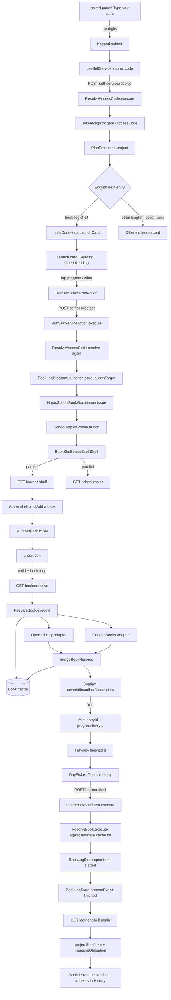
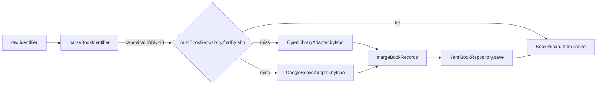
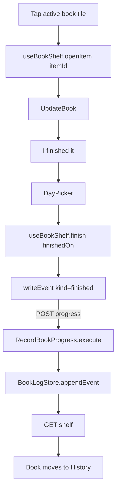

# User_4 reading shelf: end-to-end contract, simulation, and adversarial UX audit

**Date:** 2026-09-03  
**Scope:** the locked school panel flow from a six-digit access code through ISBN entry and a finished-book record, including the alternate path for finishing a book already on the shelf.  
**Audit posture:** read-only. This document does not change User_4's production enrollment or book records.

## Executive verdict

The core transaction is thoughtfully constructed: the access code resolves without writing, the action is recomputed before it is honored, the shelf receives a learner-bound signed grant, ISBNs are checksum-validated before lookup, writes carry stable idempotency IDs, dates use the household study day, and a successful finish is projected from append-only events.

It is not ready to treat as a fully proven child-facing flow yet.

1. **The production precondition is false today.** User_4 is enrolled in `story-time`, not `book-log`, so his English panel code cannot follow the flow documented below. The simulation begins at the intended corrected enrollment.
2. **The happy-path pieces are heavily unit-tested, but the promised live flow test is absent.** There is no `tests/live/flow/school/reading-shelf.runtime.test.mjs`, so no automated test currently proves one real code, real composed server, real metadata lookup, real cover, and real durable write in a single run.
3. **Real book metadata is only structurally normalized, not editorially cleaned.** Bracketed catalog notes, packaging suffixes, HTML-like descriptions, duplicate author spellings, and very long values can reach the UI essentially unchanged.
4. **Cover handling assumes a portrait book.** Every cover is placed in a fixed 2:3 box with `object-fit: cover`; landscape and square books will be cropped. Open Library's cover URL is synthesized even when the edition did not claim a cover, which can defeat the intended broken-image placeholder.
5. **The completed-book UX is ambiguous.** After success the book disappears from the active shelf into read-only History with no success message, undo, or correction path. To a child, a correct save can resemble data loss.
6. **The English-subject interaction remains unresolved.** If User_4 later has both ordinary English curriculum and `book-log`, the ordinary lesson can win the initial code resolution; conversely, satisfying the reading check-in can mark the whole English section served and hide the lesson.

In short: the security, identity, date, and idempotency seams are strong. The real-world metadata presentation, recovery/correction story, subject arbitration, and true end-to-end proof are not.

## Intended enrollment and current blocker

The intended program entry is:

```yaml
programId: book-log
corpusId: null
subject: english
title: Reading
obligation:
  metric: checkins
  quantity: 1
  per: day
schedule:
  daysOfWeek: [1, 2, 3, 4, 5]
```

The production record observed during the preceding enrollment audit instead has a weekday `story-time` program with a target of two. `story-time` and `book-log` both belong under English, but they are different programs for different age groups. Until the enrollment is corrected through the lifecycle write path, the simulated `book-log:shelf` resolution below is descriptive rather than User_4's current production behavior.

## What “every method” means here

The ledgers below include every application-owned method or function that carries, validates, transforms, authorizes, persists, or renders a major value on the requested path. They intentionally omit React internals, Express internals, generic `fetch`, generic YAML parsing, logging calls, and CSS engine behavior. The provider image requests and metadata HTTP calls are included because they materially affect what User_4 sees.

## End-to-end flowchart



The `X1` branch is not theoretical. `book-log` and ordinary curriculum share `subject: english`, and both default to `timingPriority: 3`. If an English lesson is still available, it can be `section.next` before the shelf. The token's `program: book-log` is used by the continuation branch after the subject is served; it does not override a non-null `section.next` on the initial resolve.

## Concrete simulated run

The literals below are examples, not User_4's real current code or a real grant.

| Variable | Example | Minted/read by | Where it goes next |
|---|---|---|---|
| `code` | `482913` | Printed agenda / keypad | `/self-service/resolve`, then `/self-service/act` |
| `learnerId` | `user_4` | token record | card, launch target, grant payload, route path |
| `subject` | `english` | token record | plan section lookup and launch-card taxonomy |
| `continueToday` | `true` | `BuildAgenda` for a subject containing `book-log` | lets a served English code reopen something |
| `program` | `book-log` | same token record | tells the served continuation which English program to reopen |
| `programId` | `book-log` | plan entry/resolution | action target and launcher lookup |
| `unitId` | `book-log:shelf` | assigned-program projection | launch-card lesson identity |
| `bookGrant` | `<HMAC token>` | `BookLogProgramLauncher.issueLaunchTarget` | every `/school/books/...` request header |
| grant payload `learnerId` | `user_4` | `HmacSchoolBookGrantIssuer.issue` | authoritative learner identity at shelf router |
| grant `exp` | `<issue time + 8h>` | grant issuer default | grant verification; independent of 90s UI idle close |
| `entry` | `9780064400558` | ISBN NumberPad | local ISBN judgment |
| `isbn13` / `bookId` | `9780064400558` | `checkIsbn` and `ResolveBook` | cache key, log book identity, item ID |
| `resolved.book` | merged `BookRecord` | `ResolveBook.execute` | confirmation card and opening write |
| `entryId` | `<UUID-A>` | `confirmCover(true)` | idempotency key for item open / `started` event |
| `progressEntryId` | `<UUID-B>` | `confirmCover(true)` | idempotency key for first `finished` event |
| `finishedOn` | `2026-09-03` | `DayPicker` seeded from server `studyDay` | finished-event timestamp |
| `openedAt` | `2026-09-03T12:00:00.000Z` | `OpenBookShelfItem` for the finished door | `started` event timestamp |
| `itemId` | `user_4:9780064400558:<UUID-A>` | `YamlBookLogStore.openItem` | later progress route and shelf projection |
| projected `status` | `finished` | `projectShelfItem` | filters item out of active shelf and into History |
| obligation `actual` | `1` | `measureObligation` | shelf line `1 of 1 check-in today` if finished on today's study day |

### Step 1: enter the panel code

User_4 sees `Type your code`, six visible slots, digits, Clear, `0`, and Backspace. There is no Go button. Touch or a HID keyboard can enter the code. The sixth digit starts a 300 ms settle timer, then submits automatically. The entry is cleared before the round trip so another child cannot inherit it.

For the example:

```text
Keypad.press('4') ... Keypad.press('3')
Keypad.submit()
useSelfService.submit('482913')
```

Wire request:

```http
POST /api/v1/school/self-service/resolve
Content-Type: application/json

{"code":"482913"}
```

The token registry accepts only an exact six-character decimal string. It verifies the shorter access-code expiry and revocation state, then returns a record shaped approximately as:

```json
{
  "tokenClass": "subject_next",
  "subject": {
    "learnerId": "user_4",
    "subject": "english",
    "continueToday": true,
    "program": "book-log"
  },
  "accessCode": "482913",
  "accessCodeExpiresAt": "<next household 4am boundary or earlier token expiry>"
}
```

`ResolveAccessCode` performs a read-only plan projection. Assuming the corrected enrollment is the English next entry, it creates a program resolution:

```json
{
  "kind": "program",
  "programId": "book-log",
  "unit": {
    "unitId": "book-log:shelf",
    "title": "Reading",
    "subject": "english",
    "program": "book-log",
    "programInstance": "shelf"
  }
}
```

Representative 200 response:

```json
{
  "ok": true,
  "learner": "user_4",
  "subject": "english",
  "title": "Reading",
  "sentence": null,
  "schema": "school.self-service-card/v2",
  "context": {
    "learner": {
      "id": "user_4",
      "displayName": "User_4",
      "avatar": { "kind": "learner", "id": "user_4" }
    },
    "taxonomy": {
      "subject": { "id": "english", "label": "English & Literature" },
      "course": null,
      "module": null,
      "lesson": { "id": "book-log:shelf", "title": "Reading" }
    },
    "trail": [
      { "kind": "subject", "id": "english", "label": "English & Literature" },
      { "kind": "lesson", "id": "book-log:shelf", "label": "Reading" }
    ],
    "progress": []
  },
  "presentation": { "status": "ready", "message": null },
  "actions": [
    { "kind": "program", "label": "Open Reading", "target": "book-log", "role": "primary" },
    { "kind": "exit", "label": "Go back", "role": "secondary" }
  ]
}
```

The exact primary label produced by the current backend is `Open Reading`. The integration test uses a stub card labeled `Open my books`, but `LaunchCard.PROGRAM_CTA` has no `book-log` entry, so that friendlier label is not the integrated production result.

Failure behavior is deliberately child-facing:

- unknown, malformed, expired, or revoked code: HTTP 200, `{ "ok": false, "reason": "unknown_code", "sentence": "Try again." }`; the slots animate `NONONO`;
- backend/lifecycle failure: a non-2xx response or `{ok:false, reason:"not_answering"}`; the panel says the school computer is not answering and offers Retry;
- the code lookup itself does not create a session or write a record.

### Step 2: open the reading shelf

User_4 taps the primary program action. This is a second request, not an automatic consequence of code entry:

```http
POST /api/v1/school/self-service/act
Content-Type: application/json

{"code":"482913","action":"program"}
```

`RunSelfServiceAction` resolves the code and recomputes the offered buttons again. This prevents a stale rendered card from authorizing an action that is no longer offered. It finds the `book-log` launcher, sees `surface === 'portal'`, and asks it for a launch target.

Representative 200 response:

```json
{
  "outcome": "mount",
  "sentence": "Opening it here on the screen.",
  "action": "program",
  "sessionId": null,
  "transition": "mount",
  "effect": {
    "kind": "program",
    "program": "book-log",
    "programId": "book-log",
    "unitId": "book-log:shelf",
    "learnerId": "user_4",
    "bookGrant": "<signed learner-bound grant>"
  }
}
```

`useSelfService.launchTarget` copies `bookGrant` through an explicit allowlist. `SchoolApp.onPortalLaunch` refuses the mount if either learner or grant is absent. Only after `onPortalLaunch` returns exactly `true` does the self-service card close behind the newly mounted shelf.

The grant payload is signed, has purpose `book-shelf`, names `user_4`, carries a random `jti`, and expires after eight hours by default. It is sent only as `X-School-Book-Grant`, never in a query string or request body.

### Step 3: load User_4's shelf

`useBookShelf.load()` starts both requests in one `Promise.all`:

```http
GET /api/v1/school/books/user_4/shelf
X-School-Book-Grant: <signed grant>
```

```http
GET /api/v1/school/roster
```

The shelf router verifies that the grant's learner equals the URL learner. It discards any body-supplied identity on writes; the signed grant is authoritative.

Representative shelf response:

```json
{
  "learnerId": "user_4",
  "studyDay": "2026-09-03",
  "items": [],
  "obligation": {
    "label": "0 of 1 check-in",
    "met": false,
    "actual": 0,
    "target": 1,
    "metric": "checkins",
    "incompatibleBooks": [],
    "per": "day"
  }
}
```

The UI turns that into `0 of 1 check-in today`, shows a User_4 identity chip, an always-visible Done button, `Add your first book`, and a History link. The workspace closes after 90 seconds of no interaction by default; any click inside it re-arms the timer.

### Step 4: type and resolve the ISBN

User_4 taps `Add your first book`. The state becomes `view='add'`, `step='number'`. He sees 13 slots and the prompt `Type the number under the barcode`.

Important interaction difference from the access-code keypad: ISBN entry does **not** auto-submit. User_4 must tap `Look it up`.

Each tap runs:

```text
NumberPad.press(character)
useBookShelf.typeIsbn(nextValue)
checkIsbn(nextValue)
```

For `9780064400558`:

```json
{ "state": "valid", "isbn13": "9780064400558" }
```

The button then runs `useBookShelf.lookup()` and sends:

```http
GET /api/v1/books/resolve?id=9780064400558
```

The endpoint is intentionally not grant-gated because it returns book facts, not learner data.

`ResolveBook.execute(identifier, {refresh:false})` performs:



Provider calls on a cache miss are:

```http
GET https://openlibrary.org/api/books?bibkeys=ISBN:9780064400558&format=json&jscmd=data
GET https://openlibrary.org/isbn/9780064400558.json
GET https://openlibrary.org/works/<work-key>.json
GET https://www.googleapis.com/books/v1/volumes?q=isbn:9780064400558[&key=<books-only-key>]
```

The first Open Library call is required; the edition/work enrichment calls are best-effort. Both provider adapters have an eight-second request timeout and are queried in parallel. `ResolveBook` distinguishes:

| Domain status | HTTP | UI consequence |
|---|---:|---|
| `ok` | 200 | show confirmation card |
| `invalid` | 400 | explain checksum/prefix problem |
| `not-found` | 404 | say the book could not be found |
| `unavailable` | 503 | keep ISBN, show Try again |

The merged `BookRecord` has one stable shape. Major fields include `isbn13`, `isbn10`, `title`, `subtitle`, `authors[]`, `publisher`, `publishedYear`, `pageCount`, `language`, `description`, `coverUrl`, series identifiers, subjects/categories, people/places, excerpts, library/provider IDs, and ratings.

Current merge behavior:

| Field | Preferred source | Fallback/merge behavior |
|---|---|---|
| title, subtitle | Open Library | Google |
| authors | Open Library first | exact-string union with Google |
| page count | Open Library | Google; zero becomes null |
| cover URL | Open Library | Google only if Open Library value is null |
| description | Google | Open Library work record |
| list fields | per-field ordering | union, then exact de-duplication |

### Step 5: confirm the real-world book record

The confirmation view shows:

- cover, or a star placeholder after an image error;
- title, clamped to two lines;
- every author joined with `, `;
- description, clamped to four lines;
- `Is this your book?` with Yes and No.

If the same ISBN is already in `reading` status, it instead says `You've already got this one` and offers `Open it`. A finished or set-aside copy does not block a reread.

On Yes, the client mints two different UUIDs before any write:

```text
entryId         = crypto.randomUUID()
progressEntryId = crypto.randomUUID()
```

Those exact IDs survive retries. They must differ because opening the item writes a `started` event and finishing writes a second event; the store de-duplicates events by ID.

### Step 6: mark the new book finished

User_4 chooses `I already finished it`. No request is sent yet. The UI advances to `step='when'` and shows `When did you finish it?`.

`DayPicker` receives the server's `studyDay`, not the browser's calendar date. It starts collapsed on `Today · <weekday> <day>` and requires a final `That's the day` tap. `pick a day` exposes a rolling three-week grid with future dates absent.

For the default day, the request is:

```http
POST /api/v1/school/books/user_4/shelf
X-School-Book-Grant: <signed grant>
Content-Type: application/json

{
  "bookId": "9780064400558",
  "entryId": "<UUID-A>",
  "where": "finished",
  "finishedOn": "2026-09-03",
  "progressEntryId": "<UUID-B>"
}
```

The router removes any `learnerId` supplied in the body, then calls:

```text
OpenBookShelfItem.execute({
  learnerId: 'user_4',
  bookId: '9780064400558',
  entryId: '<UUID-A>',
  where: 'finished',
  finishedOn: '2026-09-03',
  progressEntryId: '<UUID-B>'
})
```

The use case validates the day against the household study day, resolves the ISBN again (normally a cache hit), infers `progressMode='page'` when the book has a positive page count and `check` otherwise, and performs two durable operations:

```json
{
  "itemId": "user_4:9780064400558:<UUID-A>",
  "bookId": "9780064400558",
  "progressMode": "page",
  "pageCount": 184,
  "openedAt": "2026-09-03T12:00:00.000Z",
  "events": [
    {
      "kind": "started",
      "at": "2026-09-03T12:00:00.000Z",
      "entryId": "<UUID-A>"
    },
    {
      "kind": "finished",
      "at": "2026-09-03T12:00:00.000Z",
      "entryId": "<UUID-B>"
    }
  ]
}
```

The client then re-fetches the shelf while retaining its single-write lock. `projectShelfItem` sees any finished event and returns `status='finished'`, `percent=100`, and one distinct day read. `measureObligation` counts that date once despite the two events.

If `finishedOn` is today's study day, the result is `1 of 1 check-in today`. If it is backdated, today's obligation remains `0 of 1`.

The successful result does **not** display a receipt. The item is filtered out by the active-shelf status set (`reading` and `unread` only), and can be found under History.

## Alternate path: finish a book already on the shelf



Wire request:

```http
POST /api/v1/school/books/user_4/shelf/<encoded-itemId>/progress
X-School-Book-Grant: <signed grant>
Content-Type: application/json

{
  "kind": "finished",
  "finishedOn": "2026-09-03",
  "entryId": "<UUID minted when UpdateBook opened>"
}
```

The update overlay's one `entryId` is reused if the write is retried. `RecordBookProgress` verifies that the item really belongs to the grant learner before appending the event.

## HTTP API contract ledger

| API | Client signature | Request | Success | Failure/recovery | Mutation |
|---|---|---|---|---|---|
| Resolve panel code | `schoolApi.selfServiceResolve(code)` | `POST /api/v1/school/self-service/resolve`, `{code}` | HTTP 200 launch card | bad code is also 200 with `ok:false`; transport/non-2xx is degraded UI | no |
| Run card action | `schoolApi.selfServiceAct({code, action})` | `POST /api/v1/school/self-service/act`, `{code,action:'program'}` | HTTP 200 `outcome:'mount'` plus effect | stale/unoffered action becomes child-facing refusal | may issue launch grant; no book write |
| Roster | `schoolApi.roster()` | `GET /api/v1/school/roster` | roster array/envelope | name falls back to learner ID, but current `Promise.all` still waits for the request to settle | no |
| Read shelf | `schoolApi.books.shelf(learnerId, grant)` | `GET /api/v1/school/books/:learnerId/shelf` + grant header | shelf projection | 403 bad/expired/mismatched grant; other errors use common `{ok:false,error,traceId}` | no |
| Resolve ISBN | `schoolApi.books.resolve(id)` | `GET /api/v1/books/resolve?id=...` | `{status:'ok',book}` | 400 invalid, 404 not found, 503 unavailable | cache may be written |
| Add/open item | `schoolApi.books.open(learnerId, grant, body)` | `POST /api/v1/school/books/:learnerId/shelf` | `{item,event,book}` | 400 validation, 403 grant, 500 persistence; client stays on current step and reuses IDs | yes |
| Add progress/finish | `schoolApi.books.progress(learnerId, grant, itemId, body)` | `POST .../shelf/:itemId/progress` | `{item,event}` | same common error shape; stable retry ID | yes |
| Change progress mode | `schoolApi.books.mode(learnerId, grant, itemId, progressMode)` | `POST .../shelf/:itemId/mode`, `{progressMode}` | updated item | validates ownership and `page|minutes|check` | yes |
| Open Library edition | `OpenLibraryAdapter.byIsbn(isbn13)` | external `GET /api/books?...` | provider-normalized record | empty envelope is miss; HTTP/transport failure throws | no |
| Open Library enrichment | private `#enrich(isbn13)` | external edition + work GETs | description, series, work key | best-effort: failure keeps edition record | no |
| Google Books | `GoogleBooksAdapter.byIsbn(isbn13)` | external `GET /volumes?q=isbn:...` | provider-normalized record | no items is miss; HTTP/transport failure throws | no |
| Cover image | browser `` | direct external image GET | displayed in fixed 2:3 frame | `onError` swaps to placeholder | no |

All shelf endpoints require `X-School-Book-Grant`. The lookup endpoint does not. All client wrappers use the never-throw `{ok,status,data}` shape; backend exceptions become the application's standard error envelope.

## Method-signature ledger

### Panel and launch

| Order | Owner | Signature | Contract relevant to this flow |
|---:|---|---|---|
| 1 | `Keypad.jsx` | `Keypad({length=6,onSubmit,busy,message,degraded,onRetry,onReload,screenId,screenOffTimeoutSeconds,screenOffSuppressed,onActivity,onEngagedChange})` | renders and owns code entry |
| 2 | `Keypad` private callback | `press(digit)` | appends at most six visible digits |
| 3 | `Keypad` private callback | `submit()` | clears entry, calls `onSubmit(entry)`, interprets verdict |
| 4 | `useSelfService.js` | `useSelfService({idleTimeoutSeconds,claim,onLaunch,printConfirmTimeoutMs,printerPollMs})` | owns keypad/card state machine |
| 5 | `useSelfService` action | `submit(code)` | calls resolve API; card or refusal/degraded state |
| 6 | `schoolApi.js` | `selfServiceResolve(code)` | HTTP resolve contract |
| 7 | `school.selfservice.mjs` | `createSchoolSelfServiceRouter({...})` | mounts `/resolve` and `/act` when enabled |
| 8 | `ResolveAccessCode` | `execute({code}={})` | returns only the card |
| 9 | `ResolveAccessCode` | `resolve({code}={})` | returns `{card,resolution}` for action reuse |
| 10 | `ITokenRegistry` / YAML adapter | `getByAccessCode(code)` | exact lookup plus live-code check |
| 11 | access-code domain | `normalizeAccessCode(value)` | exact six-digit string or validation error |
| 12 | token domain | `isAccessCodeLive(record,{now}={})` | class, shape, expiry, revocation gate |
| 13 | `PlanProjection` | `project({learnerId,attested=true,exceptions=true,assignedPrograms=true,programStatuses=null,now=null,augmentPlan=null,...}={})` | builds current plan and sections |
| 14 | assigned-program plan | `appendAssignedProgramEntries(plan,assignment)` | adds `book-log:shelf` from corrected enrollment |
| 15 | agenda domain | `programStatusFor(programStatuses,entry)` | gets launcher status for the program instance |
| 16 | assigned-program plan | `projectProgramEntry(entry,status)` | overlays launcher context when present |
| 17 | book-log launcher | `status({userId}={})` | reads enrollment/log and reports daily obligation |
| 18 | launch-card domain | `buildContextualLaunchCard({resolution,learner,subjectId,course,module,lesson,progress,options}={})` | creates v2 card |
| 19 | offered-actions domain | `offeredCard(resolution,options)` | produces `Open Reading` plus exit |
| 20 | `LaunchCard.jsx` | `LaunchCard({card,view,sentence,busy,preview,confirmRemainingMs,confirmTotalMs,onAction,onConfirm,onExit})` | renders card and program button |
| 21 | `useSelfService` action | `runAction(action)` | sends action and handles mount result |
| 22 | `schoolApi.js` | `selfServiceAct({code,action})` | HTTP action contract |
| 23 | `RunSelfServiceAction` | `execute({code,action}={})` | invariant response with outcome/sentence/effect/transition |
| 24 | `RunSelfServiceAction` private | `#program({programId,unitId,corpusId=null,learnerId})` | local mount vs external dispatch |
| 25 | book-log launcher | `issueLaunchTarget({userId}={})` | returns learner and signed book grant |
| 26 | grant issuer | `issue({learnerId})` | signs purpose, learner, expiry, `jti` |
| 27 | `useSelfService` private | `launchTarget(action,effect)` | copies allowed program fields including `bookGrant` |
| 28 | `SchoolApp.jsx` | `onPortalLaunch(target,launchedLearnerId=null)` | validates and mounts `book-shelf` |

### Shelf load, ISBN, metadata, and confirmation

| Order | Owner | Signature | Contract relevant to this flow |
|---:|---|---|---|
| 29 | `BookShelf.jsx` | `BookShelf({learnerId,grant,idleTimeoutSeconds,onExit})` | workspace shell and view renderer |
| 30 | `useBookShelf.js` | `useBookShelf({learnerId,grant,idleTimeoutSeconds=90,onExit})` | shelf/add/update state machine |
| 31 | hook action | `load()` | parallel shelf + roster read |
| 32 | API client | `books.shelf(learnerId,grant)` | authenticated shelf GET |
| 33 | grant issuer | `verify(token,{learnerId})` | verifies signature, purpose, expiry, route learner |
| 34 | shelf router | `learnerFromGrant(req)` | returns authoritative learner or throws 403 |
| 35 | `GetBookShelf` | `execute({learnerId}={})` | returns enriched/projected items and obligation |
| 36 | book-log store | `listForLearner(learnerId)` | reads learner's durable item/event list |
| 37 | book repository | `findByIsbn(isbn13)` | reads cached facts for each item |
| 38 | shelf domain | `projectShelfItem(item,{dayOf=isoDay}={})` | derives status/progress/day count |
| 39 | book-log launcher | `dayOf(iso)` | applies household timezone and 4am boundary |
| 40 | shelf component | `Shelf({shelf,error,actions})` | keeps only reading/unread items |
| 41 | hook action | `startAdd()` | enters `add:number` |
| 42 | `AddBook.jsx` | `AddBook({step,add,today,error,busy,actions})` | renders each add step |
| 43 | `NumberPad.jsx` | `NumberPad({label,maxLength=6,allowX=false,submitLabel='Go',canSubmit=true,hint,value,onChange,onSubmit})` | controlled ISBN entry |
| 44 | NumberPad private | `press(char)` / `backspace()` / `submit()` | updates value; explicit submit only |
| 45 | hook action | `typeIsbn(value)` | stores input and logs new local verdict |
| 46 | ISBN frontend domain | `checkIsbn(input,{submit=false}={})` | typing/valid/invalid judgment; ISBN-10 to ISBN-13 |
| 47 | ISBN frontend domain | `hintFor(check)` | maps invalid verdict to child copy |
| 48 | hook action | `lookup()` | validates stopped input and calls resolve API once |
| 49 | API client | `books.resolve(id)` | household book lookup GET |
| 50 | books router | `createBooksRouter({resolveBook}={})` | maps domain status to HTTP status |
| 51 | `ResolveBook` | `execute(identifier,{refresh=false}={})` | validate, cache, parallel providers, merge, save |
| 52 | identifier domain | `parseBookIdentifier(input)` | canonical ISBN-13 and named invalid reasons |
| 53 | book repository | `findByIsbn(isbn13)` / `save(record)` | indefinite household cache |
| 54 | Open Library adapter | `byIsbn(isbn13)` | edition plus best-effort work enrichment |
| 55 | Google adapter | `byIsbn(isbn13)` | exact-declared-ISBN item or first-ranked fallback |
| 56 | BookRecord domain | `createBookRecord(fields={})` | trims blanks, fills complete shape, freezes record |
| 57 | BookRecord domain | `mergeBookRecords(records=[])` | scalar precedence and list union |
| 58 | hook action | `confirmCover(yes)` | No clears; Yes mints two IDs and advances |

### Finished write and projection

| Order | Owner | Signature | Contract relevant to this flow |
|---:|---|---|---|
| 59 | hook action | `choose(where)` | `finished` advances to day selection |
| 60 | `DayPicker.jsx` | `DayPicker({today,value,onConfirm,onChange=null})` | selects real nonfuture day from rolling grid |
| 61 | day-grid domain | `buildDayGrid(todayKey)` | Monday-first rolling three-week grid |
| 62 | hook action | `submitDay(key)` | stores day and calls finished open |
| 63 | hook private action | `openBook(where,extra={})` | builds exact write body and retains lock through refetch |
| 64 | API client | `books.open(learnerId,grant,body)` | authenticated item-open POST |
| 65 | shelf router | `createSchoolBooksRouter({grants,getBookShelf,openBookShelfItem,recordBookProgress}={})` | grant enforcement and body identity stripping |
| 66 | `OpenBookShelfItem` | `execute({learnerId,bookId,entryId,where='starting',page=null,finishedOn=null,progressEntryId=null}={})` | validates and creates item plus optional initial event |
| 67 | shelf domain | `isDayKey(value)` / `noonOf(day)` | real date validation and stable timestamp |
| 68 | shelf domain | `inferProgressMode(book)` | positive page count -> page, otherwise check |
| 69 | book-log store | `openItem({learnerId,bookId,progressMode,pageCount,openedAt,entryId})` | idempotent item plus started event |
| 70 | book-log store | `appendEvent({itemId,kind,at,entryId,...})` | idempotent finished event |
| 71 | hook private action | `refetch()` | reads authoritative post-write projection |
| 72 | shelf domain | `measureObligation(obligation,items=[],window=null,{dayOf=isoDay}={})` | derives daily check-in completion |
| 73 | hook action | `done()` / private `close(reason)` | returns shared panel to anonymous keypad |

The alternate existing-book path substitutes `openItem(itemId)`, `finish(finishedOn)`, `writeEvent(event)`, `books.progress(...)`, and `RecordBookProgress.execute({learnerId,itemId,kind,page,minutes,finishedOn,note,rating,entryId})` for steps 58–70.

## State-machine ledger

| State | What User_4 sees | Forward gesture | Back/retry behavior |
|---|---|---|---|
| `keypad` | six code slots | sixth digit auto-submits | Clear/backspace; rejected code animates |
| `card` | User_4, English & Literature, Reading, action | tap `Open Reading` | Go back returns to keypad |
| `loading` | `Getting your shelf…` | automatic shelf + roster read | load failure gets Try again |
| `shelf` | active covers, obligation, Add, History, Done | tap Add | Done closes workspace |
| `add:number` | 13 ISBN slots | tap `Look it up` | Back to shelf; failed lookup preserves digits |
| `add:lookup` | `Looking it up…` | response advances | Back abandons response and keeps digits |
| `add:cover` | cover/title/authors/description | Yes | No clears the ISBN; duplicate offers Open it |
| `add:where` | starting / partway / finished | finished | Back returns to ISBN with digits preserved |
| `add:when` | finish date | `That's the day` | Back returns to the three choices |
| write/refetch | same overlay, primary guards no-op | response | write failure stays put and reuses IDs |
| `shelf` after success | book absent from active grid; obligation may advance | History | no success receipt or undo |
| `history` | finished/set-aside tiles by month | Back | read-only |
| `closed` | component renders nothing; SchoolApp goes home | — | keypad remounts |

## Real-world metadata and presentation audit

### Do covers show up?

Usually, when the provider URL returns a normal portrait image.

Positive behavior:

- Open Library is preferred for cover identity; Google is a fallback only when Open Library has no URL value.
- Google `http://` thumbnail URLs are upgraded to HTTPS.
- `` swaps a failed request to a calm placeholder in confirmation, shelf, and update views.
- `aspect-ratio` reserves layout space, reducing layout jumps.

Weak behavior:

- Open Library always emits `https://covers.openlibrary.org/b/isbn/<isbn>-L.jpg` even when the edition response did not claim a cover. The URL's non-null presence wins merge precedence over a valid Google cover. Open Library's default missing-cover response can be a successful placeholder/blank response rather than an image error, so React's `onError` may never select the app placeholder.
- Covers are not proxied or cached locally. Metadata survives provider outages, but the actual image remains a live third-party dependency on every render.
- All three book-cover contexts use a fixed 2:3 box and `object-fit: cover`. A landscape picture book, square board book, unusually tall volume, or wraparound image is cropped, not letterboxed. For a recognition-first child UI, `contain` with a neutral backing is safer.
- There is no automated fixture or screenshot test for portrait, square, landscape, missing, tiny, transparent, or extremely large cover files.
- A `ShelfTile` that once sets `coverFailed=true` does not reset that state if the same keyed item's URL is later repaired during the mounted session.

### Are title and author presented well?

Only for clean, ordinary records.

- The confirmation title and the shelf/update title are clamped to two lines. `overflow-wrap:anywhere` prevents a no-space identifier from breaking the tile, which is good.
- The full title is not available through an expansion, secondary line, or `title` attribute. A long title can lose the distinguishing part.
- `BookRecord` trims outer whitespace and converts blank strings to null. It does not remove bracketed catalog notes, edition/package suffixes, responsibility statements, repeated whitespace, control characters, HTML fragments, or entity residue.
- Open Library wins the title whenever it has any nonblank title, even if the Google exact-edition title is cleaner. There is no quality score or editorial normalization stage.
- `subtitle` is mapped and cached but never rendered. For books with a generic main title, the most useful differentiator is discarded at the UI boundary.
- Authors are shown only on the ISBN confirmation card and the small post-confirmation book line. The active shelf and update overlay fetch `authors` but do not render them.
- Multiple authors are structurally supported: lists from providers are unioned and exact duplicates removed. Presentation is a raw comma-join of every value. There is no `A, B & C`, role handling, `et al.`, cap, line clamp, or overflow rule on the confirmation author paragraph. A many-author anthology can dominate the screen and push the decision below the fold.
- De-duplication is exact-string only. `E. B. White`, `E.B. White`, and `White, E. B.` become three authors. Translated/non-Latin variants can also appear side by side.
- React renders these values as text, not HTML. Messy provider strings are visually ugly but do not become executable markup; this is an important safety positive.

### How well are many adapters mapped to one book?

The architecture is sound but the freshness and quality policy is incomplete.

Positive behavior:

- Both provider requests run in parallel.
- Adapters convert provider-specific envelopes into one complete `BookRecord` shape.
- Provider failures are not mistaken for clean misses.
- Open Library is intentionally preferred for title/page count, based on measured packaging errors from Google; Google is preferred for description.
- List fields union rather than allowing one provider to erase another.
- Google prefers a result that declares the exact requested ISBN-13 over its first-ranked result.

Weak behavior:

- Google's exact match checks literal declared identifiers for the canonical ISBN-13. A correct result declaring only the corresponding ISBN-10 does not match and can lose to the first-ranked packaging variant.
- When Google has no exact declared ISBN, the adapter knowingly accepts `items[0]`. The child confirmation card is the only remaining defense.
- A partial success is cached indefinitely. If Open Library succeeds while Google is rate-limited, the record can be saved forever without Google's better description. The backend supports `?refresh=1`, but `schoolApi.books.resolve(id)` does not expose it and no child/grown-up UI can request it.
- Corrected metadata does not repair the progress basis of an existing shelf item. `pageCount` is copied into the item at open time; later repository fixes update title/cover reads but do not update that stored count.
- A provider record with an edition but no usable title is still `status:'ok'`. The confirmation can therefore ask `Is this your book?` with no title, no author, and possibly a meaningless cover.
- There is no minimum-confidence rule such as “title or verified cover required,” no candidate chooser when providers disagree, and no adult override workflow.

### What happens with messy descriptions?

- Description is rendered only on confirmation and clamped to four visual lines.
- Unlike launch-card lesson descriptions, book descriptions have no application/domain length cap or newline normalization.
- Google descriptions commonly contain markup-like source text. React escapes it, so it is safe, but tags/entities may be shown literally.
- Very large descriptions still cross the API and enter the DOM even though CSS hides most of them.

### Portrait versus landscape

| Shape | Current result | Risk |
|---|---|---|
| ordinary portrait near 2:3 | generally good | minor crop at edges |
| tall/narrow cover | left/right empty content can be cropped further | title or series marks may disappear |
| square board book | top/bottom or sides cropped to 2:3 | recognition cue degraded |
| landscape picture book | severe side crop | can look like the wrong book |
| no image / real HTTP error | app placeholder | acceptable |
| missing Open Library cover returned as successful default image | blank/default image may display | app placeholder may not engage |

## Findings, prioritized

### P0 — operational blocker

#### F-01: User_4's current enrollment routes to the preschool program

**Evidence:** production plan audit found `story-time`, while every shelf path is gated by a `book-log:shelf` plan resolution.  
**Impact:** the first branch in this document is unreachable for User_4 as currently enrolled.  
**Recommendation:** replace the program through the lifecycle assignment API, preserving every existing program in the replacement body and its `baseUpdatedAt`; then mint/print a fresh agenda code.

### P1 — correctness or trust risks

#### F-02: `book-log` and ordinary English work can hide or displace each other

**Evidence:** both are `subject: english` and both default to `timingPriority: 3`. The plan's own final review measured lesson-before-shelf when both are available, and a met program can mark the whole section served.  
**Impact:** a “reading” code can open an English lesson instead of the shelf, or logging a book can remove another English obligation from today's agenda.  
**Recommendation:** retain `subject: english` as required, but make subject completion entry-aware: a program's `doneToday` should retire that program entry, not automatically serve unrelated English entries. Resolve a token explicitly minted with `program:'book-log'` to the matching available program entry even before `servedToday`, rather than using the program only in the continuation fallback.

#### F-03: a corrupt log is silently projected as an empty shelf

**Evidence:** `BookLogProgramLauncher` promises `enrolled:null,error:true` when the shelf is unreadable, but `YamlBookLogStore.listForLearner()` catches `corrupt` and `unreadable` and returns `[]`. The launcher therefore sees a successful empty list and reports zero.  
**Impact:** User_4 can appear to have lost every book and to owe a check-in; adding a book after parse corruption replaces the primary file after copying the original aside.  
**Recommendation:** make the store return a typed read result or throw a typed unreadable error to application readers. Let the UI show a recoverable “shelf needs a grown-up” state and block writes until the record is repaired or intentionally recovered.

#### F-04: success looks like disappearance and is irreversible in the UI

**Evidence:** successful finish immediately refetches; active shelf filters out `finished`; History is read-only; `projectShelfItem` makes any finished event permanently decisive.  
**Impact:** a child can believe the save failed. A mistaken finish/date cannot be undone, corrected, or reopened on the same item and can incorrectly satisfy an obligation.  
**Recommendation:** show a brief success receipt containing cover/title/date and `Added to History`, with Undo/Correct available behind an appropriate policy. Model correction as a new append-only event rather than deleting evidence; projection must recognize that correction.

#### F-05: the “ask a grown-up to add it” path does not exist

**Evidence:** the not-found copy promises a grown-up action, but no book metadata create/edit endpoint or UI exists. `OpenBookShelfItem` refuses a book that cannot resolve.  
**Impact:** a valid long-tail, self-published, old, or locally cataloged book is a hard dead end.  
**Recommendation:** add an adult-gated minimal record flow (ISBN, title required; author/cover/page count optional) and a way to refresh/repair an existing cached record.

#### F-06: no composed live end-to-end proof

**Evidence:** the implementation plan specifies `tests/live/flow/school/reading-shelf.runtime.test.mjs`, but the file is absent.  
**Impact:** green component/use-case tests cannot detect route mounting, production config, provider credentials, cover-network policy, viewport layout, or persistence-path mistakes as one system.  
**Recommendation:** implement the planned flow only after the enrollment correction and run it against a safe non-production record or a transactionally disposable learner. It should cover code → action → shelf → real ISBN → confirmation → finished → History and verify the durable YAML event.

#### F-07: cover precedence and cropping can defeat visual confirmation

**Evidence:** Open Library always supplies a synthesized non-null URL and wins cover precedence; every cover class uses fixed 2:3 plus `object-fit:cover`.  
**Impact:** blank/default Open Library art can suppress a good Google cover; nonportrait books can look wrong.  
**Recommendation:** request Open Library covers with a reliable missing-image signal, prefer an actually declared/verified cover, proxy/cache images, and use `object-fit:contain` on a neutral 2:3 backing. Add visual fixtures for common and hostile aspect ratios.

#### F-08: partial or bad metadata becomes effectively permanent

**Evidence:** cache has no TTL; partial successes are saved; frontend never requests `refresh=1`; item `pageCount` is a snapshot.  
**Impact:** rate limits or one bad provider response can permanently remove descriptions, preserve bad titles/covers, or leave a wrong progress denominator.  
**Recommendation:** store per-field provenance and refresh metadata in the background after partial failure; expose adult refresh/edit; decide how corrected page counts migrate existing items.

### P2 — substantial UX resilience gaps

#### F-09: metadata cleaning stops at trim-and-clamp

**Impact:** real catalog title debris and markup-like descriptions reach a child-facing screen.  
**Recommendation:** add a pure presentation-normalization layer with raw values retained for evidence. Normalize whitespace/control characters, conservative catalog brackets/suffixes, HTML-to-text descriptions, subtitle composition, and bounded lengths. Never destructively rewrite the cached raw source without provenance.

#### F-10: many authors are modeled but not designed

**Impact:** confirmation can become tall/noisy; shelf and update views omit author completely; exact-only de-duplication produces repeats.  
**Recommendation:** canonicalize obvious punctuation variants, keep roles where sources expose them, render one/two names plus `and N more`, and show a compact author line on shelf/update for coverless or similarly titled books.

#### F-11: ISBN entry ignores the physical keyboard/scanner path

**Evidence:** `Keypad` binds `window.keydown`; `NumberPad` does not render an input or bind key events. Its parser strips scanner whitespace, but the screen cannot receive scanner/keyboard digits through that component.  
**Impact:** User_4 must tap 13 digits even if the panel's paired HID keyboard or a barcode scanner is available.  
**Recommendation:** give `NumberPad` a scoped keydown handler for digits, X, Backspace, and Enter, active only while mounted. Add a clear-all affordance.

#### F-12: rejecting the cover forces a complete retype

**Evidence:** `confirmCover(false)` resets `EMPTY_ADD`; the test explicitly asserts the ISBN becomes empty.  
**Impact:** the moment provider ambiguity produces the wrong book, User_4 pays the maximum 13-tap recovery cost.  
**Recommendation:** return to the populated ISBN pad with the whole number selected/retained, plus Clear and Edit choices.

#### F-13: finish-date history is limited to roughly three weeks

**Impact:** “I already finished it” cannot honestly log an older book.  
**Recommendation:** either name the limit in the copy, add `Earlier` with an adult/date extension, or provide month navigation with a bounded earliest school-year date.

#### F-14: nonessential roster lookup gates initial rendering

**Evidence:** shelf and roster are awaited in one `Promise.all`; the name has a learner-ID fallback.  
**Impact:** a hanging roster request prevents a perfectly good shelf response from rendering.  
**Recommendation:** render on shelf completion and enrich the chip independently, or impose a bounded roster timeout.

#### F-15: the book-log card uses generic wording/iconography

**Evidence:** backend emits `Open Reading`; `LaunchCard.PROGRAM_CTA` has no `book-log` mapping, while the integration fixture says `Open my books`.  
**Impact:** behavior and test prose disagree, and the button does not use the task-specific language already chosen in the test.  
**Recommendation:** add a book-log CTA/icon mapping and assert it using a real `ResolveAccessCode` card rather than a hand-written fixture.

#### F-16: adding a merely “starting” book satisfies a check-in

**Evidence:** `openItem` always creates `started`; check-ins count every event except `set-aside`.  
**Impact:** cataloging a book can complete the daily reading obligation without an explicit “I read” action.  
**Recommendation:** decide the pedagogy explicitly. If opening is not reading evidence, exclude `started` from check-ins and require progress/check-in/finished.

### P3 — polish and defensive gaps

#### F-17: busy day-picker and Back controls remain visually active

The parent guards confirmation while busy, but `DayPicker` has no `busy`/disabled contract and the overlay Back button is not guarded. Taps during a write can appear accepted while doing nothing or navigate to another step before the response arrives.

#### F-18: lookup has no client-side abort/timeout

Provider calls are bounded server-side, but the browser fetch is not. Back drops the late response from state but does not abort the network request. A broader server/socket hang lasts until the 90-second workspace idle close.

#### F-19: page count accepts implausible real-world conflict without explanation

Pages beyond `pageCount` are allowed and the bar clamps at 100 while the book remains active. This is defensible when metadata is wrong, but the UI gives no hint that the denominator is suspect and offers no page-count correction.

#### F-20: `checkins/day` validation allows impossible targets

The validator defaults check-ins to one but accepts higher quantities up to 50. Because a daily check-in counts distinct study days inside one day, `quantity: 2` for `per: day` can never be met. User_4's intended quantity of one is safe; the general enrollment grammar is not.

## Positive controls worth preserving

- Access-code resolve is read-only; action execution re-resolves and rechecks the offered button.
- Unknown code and backend outage are visually and semantically distinct.
- The sixth code digit auto-submits after a cancelable settle; abandoned partial codes clear after 60 seconds.
- The card-to-shelf handoff explicitly carries `bookGrant`; missing identity/grant fails closed.
- Shelf routes derive identity from a signed learner-bound header and discard a body learner.
- ISBN-10 and ISBN-13 checksum logic runs locally and is mirrored by backend validation.
- Provider miss and provider failure remain distinct, avoiding outage-as-not-found caching.
- A failed lookup preserves 13 typed digits; a failed write preserves state and idempotency IDs.
- Double taps are guarded with refs, not asynchronous React state.
- Late responses cannot reopen a closed shared-panel workspace.
- Finished dates use server `studyDay` with the household 4am boundary.
- Add-finished writes use distinct event IDs, and retries append once.
- Book status, progress, and obligation are derived from append-only evidence.
- Missing cached metadata does not erase the child's shelf item.
- Remote text is escaped by React; there is no `dangerouslySetInnerHTML` in the book UI.
- Broken image requests fall back to a placeholder when they actually emit an error.

## Test and execution evidence

Targeted test run on 2026-09-03:

```text
30 unique test files
415 assertions passed
```

Coverage included:

- keypad auto-submit and refusal behavior;
- self-service launch-target grant preservation;
- SchoolApp book-log mount handoff;
- every book UI component and `useBookShelf` state transition;
- ISBN frontend/backend validation;
- access-code resolution and book-log launcher status;
- shelf get/open/progress use cases;
- projection and obligation measurement;
- YAML book record/log persistence and idempotency;
- HMAC book grants;
- Open Library and Google Books mappings;
- metadata resolution/merge/cache behavior;
- books and school-books HTTP route contracts with the real error middleware.

The two Supertest router suites initially could not bind an ephemeral localhost port inside the restricted sandbox (`listen EPERM`). They were rerun with permission to bind locally and all 11 route assertions passed. This was a test-environment restriction, not an application failure.

Not executed:

- no production write or enrollment change;
- no second backend was started, in accordance with the repository's live-controller warning;
- no in-app browser walkthrough, because the browser runtime was unavailable;
- no live real-provider request or cover fetch;
- no 1280×800 screenshot/visual regression;
- no composed code-to-YAML end-to-end test, because the planned test file does not exist and User_4 is not correctly enrolled.

## Recommended acceptance gate

Do not call this flow complete merely because the unit suites are green. A trustworthy acceptance sequence is:

1. Correct User_4's enrollment through the lifecycle API, preserving concurrent assignment data.
2. Resolve the same-subject English arbitration without inventing a new subject.
3. Fix F-03 through F-08, because those affect data trust or the child's belief that the save worked.
4. Add hostile metadata fixtures: no title, title with bracketed catalog debris, subtitle-dependent title, 12 authors with variant spellings, HTML-like/huge description, valid Google cover plus missing Open Library cover, landscape/square/tall/transparent/broken covers, partial provider outage, stale cache, wrong page count.
5. Render screenshots at the actual locked-panel viewport and inspect every fixture.
6. Add the absent live flow with a disposable learner or isolated data root.
7. Run the actual sequence: code → `Open my books` → ISBN → confirm → already finished → date → success receipt → History; assert one durable `started` and one durable `finished` event, one daily check-in, and no effect on unrelated English work.

## Source map

Primary frontend:

- `frontend/src/modules/School/selfService/Keypad.jsx`
- `frontend/src/modules/School/selfService/useSelfService.js`
- `frontend/src/modules/School/selfService/LaunchCard.jsx`
- `frontend/src/modules/School/SchoolApp.jsx`
- `frontend/src/modules/School/schoolApi.js`
- `frontend/src/modules/School/books/BookShelf.jsx`
- `frontend/src/modules/School/books/useBookShelf.js`
- `frontend/src/modules/School/books/AddBook.jsx`
- `frontend/src/modules/School/books/NumberPad.jsx`
- `frontend/src/modules/School/books/DayPicker.jsx`
- `frontend/src/modules/School/books/UpdateBook.jsx`
- `frontend/src/modules/School/books/History.jsx`
- `frontend/src/modules/School/books/ShelfTile.jsx`
- `frontend/src/modules/School/books/isbn.js`
- `frontend/src/modules/School/books/dayGrid.js`
- `frontend/src/modules/School/School.scss`

Primary backend:

- `backend/src/4_api/v1/routers/school.selfservice.mjs`
- `backend/src/4_api/v1/routers/books.mjs`
- `backend/src/4_api/v1/routers/schoolBooks.mjs`
- `backend/src/3_applications/school/usecases/ResolveAccessCode.mjs`
- `backend/src/3_applications/school/usecases/RunSelfServiceAction.mjs`
- `backend/src/3_applications/school/PlanProjection.mjs`
- `backend/src/3_applications/school/assignedProgramPlan.mjs`
- `backend/src/3_applications/school/BookLogProgramLauncher.mjs`
- `backend/src/3_applications/school/usecases/GetBookShelf.mjs`
- `backend/src/3_applications/school/usecases/OpenBookShelfItem.mjs`
- `backend/src/3_applications/school/usecases/RecordBookProgress.mjs`
- `backend/src/3_applications/books/ResolveBook.mjs`
- `backend/src/2_domains/books/BookIdentifier.mjs`
- `backend/src/2_domains/books/BookRecord.mjs`
- `backend/src/2_domains/school/bookLog.mjs`
- `backend/src/2_domains/school/bookShelf.mjs`
- `backend/src/2_domains/school/sessions/accessCode.mjs`
- `backend/src/2_domains/school/sessions/tokens.mjs`
- `backend/src/2_domains/school/selfService/contextualLaunchCard.mjs`
- `backend/src/2_domains/school/selfService/offeredActions.mjs`
- `backend/src/1_adapters/books/OpenLibraryAdapter.mjs`
- `backend/src/1_adapters/books/GoogleBooksAdapter.mjs`
- `backend/src/1_adapters/persistence/yaml/YamlBookRepository.mjs`
- `backend/src/1_adapters/persistence/yaml/YamlBookLogStore.mjs`
- `backend/src/1_adapters/persistence/yaml/YamlTokenRegistry.mjs`
- `backend/src/1_adapters/school/actions/HmacSchoolBookGrantIssuer.mjs`
- `backend/src/5_composition/modules/booksApi.mjs`
- `backend/src/5_composition/modules/schoolLifecycle.mjs`
- `backend/src/app.mjs`
