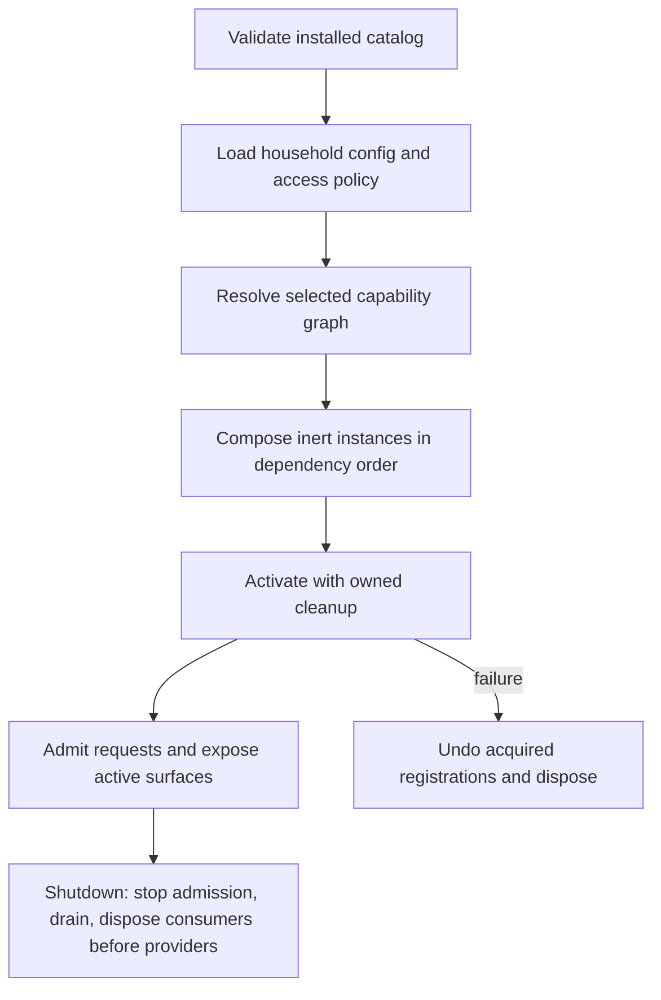

# Application module runtime v0 and Gratitude extraction

**Status:** Deferred runtime exploration; not the structural migration specification.
**Date:** 2026-09-05
**Source baseline:** `2144f762a`
**Parent:** [Full-Stack Application Modules roadmap](../../roadmap/2026-08-31-full-stack-application-modules.md)

**Scope correction:** Follow the
[ownership and behavior-preserving migration plan](2026-09-05-application-module-migration-plan.md)
for the immediate work. The user wants semi-enclosed contributor workspaces and
a filesystem/dependency reorganization with unchanged behavior. The new
enablement, household instance scope, authorization declarations, provider
resolution, availability behavior, and lifecycle machinery below are future
design candidates, not cutover prerequisites. No runtime implementation or
public SDK promise is implied. Gratitude is a branch rehearsal, not a mandated
first production migration.

## 1. Design objective

Make Gratitude independently owned and removable while preserving its launch,
API, administration, records, and integrations with other features. Prove the
boundary by building and testing the application both present and absent.

The repository already has useful factories, application ports, content
adapters, a household config registry, an authorization pipeline, and static
architecture checks. v0 adds a common composition and activation contract around
those facilities. The existing numbered backend layers remain for unmigrated
code. The roadmap's Music, Kitchen, and satellite designs remain later tests of
the model.

This draft chooses defaults that are concrete enough to implement. Changes to
these defaults should identify which pilot case requires the change. No module
loader, capability SDK, new endpoint, or enablement file described below exists
merely because this document names it.

## 2. Decisions proposed for v0

| Decision | Proposed default | Reason and limit |
|---|---|---|
| Installation | Build-generated catalog from selected local manifests | The browser must have statically discoverable imports, and an absent module must not leave server imports behind. No remote installation. |
| Packaging | Plain directories with explicit public entries; retain current package boundaries | Avoid coupling the first ownership extraction to a repository-wide dependency migration. Production dependency resolution is an explicit delivery gate. |
| Manifest format | `daylight.module.mjs` exporting a literal data object | Preserve the roadmap's filename while making metadata validation possible without executing module code. |
| Instance scope | One instance per `(moduleId, householdId)` | The current request pipeline resolves households, and configuration/provider selection is household-specific. A surface does not create another instance. |
| Capability compatibility | Exact positive integer contract revision | Separate interface revision from module release version. Version ranges and negotiation wait for a demonstrated need. |
| Binding lifecycle | Select once during activation; no provider replacement while serving | Consumers retain one coherent object graph. Runtime health can change without selecting a different provider. |
| Enablement | Desired config applied on process restart | Existing feature lifecycles do not yet support reliable hot unmounting. Report pending changes accurately. |
| Access | Every API mount and surface declares its existing app access key | Current authorization is primarily app/role based. Arbitrary fine-grained permission strings would imply enforcement that does not yet exist. |
| Failure | Invalid installed metadata fails validation; household/configuration failures isolate the affected module | A deployment cannot safely tolerate conflicting routes or identifiers. A missing household printer should not stop unrelated applications. |
| Data migration | Preserve pilot paths and record formats | Ownership extraction does not need a data rewrite. Disablement and code removal retain data. |

## 3. Current seams and pilot ownership

The [roadmap review](../../roadmap/2026-08-31-full-stack-application-modules.md#0-codebase-review-and-proposed-first-design)
records the wider integration map and measured audit baseline. The pilot's
specific sources and consumers are:

| Concern | Current source | Proposed owner or treatment |
|---|---|---|
| Domain rules | [`2_domains/gratitude`](../../../backend/src/2_domains/gratitude) | Move to `modules/gratitude/server/domain/`. |
| Use cases and ports | [`3_applications/gratitude`](../../../backend/src/3_applications/gratitude) | Move to the module application layer; inject clock and identity projections. |
| Stored records | [`YamlGratitudeDatastore`](../../../backend/src/1_adapters/persistence/yaml/YamlGratitudeDatastore.mjs) | Module-private adapter; retain the `gratitude/` namespace and hydration/dehydration behavior. |
| Card presentation | [`GratitudeCardRenderer`](../../../backend/src/1_rendering/gratitude/GratitudeCardRenderer.mjs), theme, and `GratitudePrintPresentationService` | Module-owned rendering and presentation. Shared drawing primitives stay shared. |
| Printer bridge | [`TemporaryImagePrintGateway`](../../../backend/src/1_adapters/hardware/thermal-printer/TemporaryImagePrintGateway.mjs) implements `IImagePrintGateway` from Gratitude | Initially move with its port. Extract a public printer integration only when its artifact contract replaces the private port. Do not import the module's port from shared printer code. |
| HTTP and wiring | [`gratitude.mjs`](../../../backend/src/4_api/v1/routers/gratitude.mjs), [`gratitudeApi.mjs`](../../../backend/src/5_composition/modules/gratitudeApi.mjs), and Gratitude sections in [`app.mjs`](../../../backend/src/app.mjs) / [`bootstrap.mjs`](../../../backend/src/5_composition/bootstrap.mjs) | Module API and one module composer. Remove manual registration at cutover. |
| Browser | [`Gratitude.jsx`](../../../frontend/src/modules/AppContainer/Apps/Gratitude/Gratitude.jsx) and stylesheet | One launch surface, usable standalone and inside the current AppContainer shell. |
| Administration | [`GratitudeConfig.jsx`](../../../frontend/src/modules/Admin/Apps/GratitudeConfig.jsx) | Module admin surface, using existing shared admin primitives. Preserve `/admin/apps/gratitude`. |
| Realtime publication | `GratitudeEvents` in [`RealtimePublications.mjs`](../../../backend/src/3_applications/events/RealtimePublications.mjs) | Move the Gratitude facade into its owner; bind it to household-scoped platform transport. |
| Identity consumers | [`appRegistry.js`](../../../frontend/src/lib/appRegistry.js) and [`FamilySelector.jsx`](../../../frontend/src/modules/AppContainer/Apps/FamilySelector/FamilySelector.jsx) use Gratitude bootstrap for member lookup | Replace with a household-identity projection before module removal. These consumers must work without Gratitude installed. |
| Feed | [`GratitudeFeedAdapter`](../../../backend/src/1_adapters/feed/sources/GratitudeFeedAdapter.mjs) directly reads `gratitude/selections.gratitude.yml` | Keep Feed item mapping in Feed; inject a public Gratitude selection query. Stop reading another owner's storage. |
| Homebot | [`AssignItemToUser`](../../../backend/src/3_applications/homebot/usecases/AssignItemToUser.mjs) calls injected `gratitudeService.addSelections` | Provide a narrow Gratitude command adapter and explicit unavailable behavior for that workflow. Preserve unrelated Homebot operations. |

The current card-print service requires a printer registry at construction even
though the renderer is separately optional. The pilot must split these states:
selection and card preview can run without physical output; printing requires
a resolved provider supporting the artifact. A renderer failure gets its own
diagnostic and must not masquerade as a missing printer.

Weekly Review is an alternate later pilot: its composition already brings
together Immich, calendar, weather history, transcription, and file storage.
School is the large comparison case, with separate learning, lifecycle,
printing, calculator, Piano, Fitness, and state-gate wiring. Those dependencies
would obscure the first module-runtime experiment.

## 4. Installed manifest and generated artifacts

### 4.1 One concrete manifest shape

The following is the proposed v0 shape, replacing the roadmap's varying
`version`, dependency-array, and `web.entry` examples for this pilot:

```javascript
// modules/gratitude/daylight.module.mjs — proposed metadata, not executable wiring
export default {
  schemaVersion: 1,
  sdkVersion: 0,
  id: 'gratitude',
  moduleVersion: '0.1.0',
  label: 'Gratitude & Hope',
  defaultEnabled: false,
  scope: 'household',

  requires: { 'household-identity': 1 },
  optional: { 'print-output': 1 },
  provides: { 'gratitude-selections': 1 },

  config: [{
    key: 'gratitude',
    path: 'gratitude/config',
    schema: './config/schema.mjs',
  }],
  storage: [{ namespace: 'gratitude', schemaVersion: 1 }],

  server: { entry: './server/compose.mjs' },
  api: [{
    id: 'main',
    mount: '/api/v1/gratitude',
    access: { app: 'gratitude' },
  }],

  surfaces: [
    {
      id: 'selector',
      label: 'Gratitude & Hope',
      entry: './web/surfaces/Selector.jsx',
      route: '/app/gratitude',
      host: 'app-container',
      access: { app: 'gratitude' },
      legacyAppIds: ['gratitude'],
    },
    {
      id: 'settings',
      label: 'Gratitude',
      entry: './web/surfaces/Settings.jsx',
      route: '/admin/apps/gratitude',
      host: 'admin',
      access: { app: 'admin' },
    },
  ],
};
```

`schemaVersion` versions metadata syntax; `sdkVersion` selects the internal
composition contract; `moduleVersion` identifies the module release; capability
revisions identify public interfaces; storage schema versions describe records.
These values do not advance together by implication.

`gratitude-selections` is a proposed narrow contract justified by Feed and
Homebot, not a general module-service registry. Its contracts live under an
independent public capability owner; Gratitude supplies its implementation.
`host` initially supports only the two shells the pilot already needs. It does
not promise arbitrary embedding or manufacture a new registry for internal
components.

For multi-surface modules, surface `requires` and `optional` use the same
revision maps as module dependencies. Surface-only requirements do not block
server composition. Surface requirement names must be declared in the module's
required or optional set, so no hidden dependency enters through a route.

### 4.2 Discovery and validation

A build-time scanner finds local `modules/*/daylight.module.mjs` files. An
optional build selection lists module IDs to include; absent selection includes
all local modules. Selection is deployment metadata, not household configuration.
Adding a new module requires its directory and manifest, with no handwritten
platform import. Tests can build a catalog that omits Gratitude entirely.

The scanner parses the manifest AST and accepts a literal exported object with
JSON-compatible values. Calls, imports, spreads, computed values, and side
effects are rejected in v0. Schema modules and composers are referenced as
paths and imported only by their appropriate server stage. This is a metadata
discipline, not a sandbox for trusted application code.

Validation rejects:

- duplicate module IDs, namespaced surface IDs, legacy app IDs, and API IDs;
- unsupported schema/SDK revisions, duplicate or conflicting dependency claims;
- missing entry files, owner-escaping relative paths, and server/web confusion;
- collisions with installed or reserved legacy routes and config ownership;
- config paths outside the owner's allowed namespace, auth directories,
  traversal, absolute paths, or overlapping storage ownership;
- API mounts without access declarations and unknown surface hosts;
- selected required providers whose contract revisions cannot satisfy consumers.

Routes use a limited grammar initially: literal prefixes with an optional
terminal wildcard. Module mounts cannot claim `/`, `/api`, or `/api/v1`.
Specific legacy routes such as `/app/:appId` are a declared host fallback;
`/app/gratitude` is its owned child. Other ambiguous overlaps fail validation
instead of depending on registration order. Intentional nested surfaces must
belong to the same owner and have documented host routing.

### 4.3 Outputs and dependency direction

Generate three projections with one deterministic catalog digest:

| Output | Consumer | Contents |
|---|---|---|
| Portable installed metadata | Config bootstrap and catalog projection | Data only: identity, public route/access declarations, config addressing, contract revisions. No household values or runtime imports. |
| Server loader map | Layer 5 module runtime | Literal lazy imports of declared `server/compose.mjs` entries, keyed by module ID. |
| Browser loader map | Frontend shell | Literal lazy imports of surface entries, keyed by `module:surface`; public metadata only. |

The generated server map lives beside layer 5 runtime composition; the browser
map lives under the frontend loader; portable metadata can live under
`shared/module-sdk/generated/`. Generated files are build outputs and must be
regenerated or checked for freshness by dev startup, build, and CI.

These imports are the deliberate exception to "platform never imports an
application." Only generated loader edges may target the manifest's declared
entries. Handwritten platform imports and deep cross-owner imports remain
forbidden. The generator emits imports from validated paths; it does not copy
arbitrary expressions from metadata into JavaScript.

Configuration bootstrap consumes portable metadata before loading household
app files. It must not need an initialized module runtime to discover where
module config lives. That would create a startup dependency cycle.

## 5. Household selection, capabilities, and availability

### 5.1 Scope and desired configuration

Propose one platform-owned config key, `applications`, at the registered
household-relative path `applications/config`:

```yaml
schemaVersion: 1
modules:
  gratitude:
    enabled: true
    surfaces:
      selector: { enabled: true }
      settings: { enabled: true }
```

The platform config registry owns this path. Module settings remain at
`gratitude/config`; provider credentials remain in the existing secret/config
system. Source location under `modules/` never determines a household data path.

During migration, explicitly enable Gratitude for each household that should
retain today's behavior. Do not infer enablement from a nonempty config file:
an existing application can work with defaults. New modules default off. Missing
selection entries use the manifest default; entries for uninstalled modules
produce an admin diagnostic and never trigger installation.

The runtime stores both desired and effective configuration revisions. Edits
to enablement, provider bindings, or composition settings report
`restartRequired: true`; they do not claim the running module has changed.
Existing unmigrated config reload behavior remains outside this first runtime.
Do not mix a freshly reloaded config object into an instance whose dependencies
were selected under an older revision.

### 5.2 Resolution contract

The capability resolver accepts `(householdId, consumerId, capabilityId,
revision)`. An internal successful result contains a bound service, selected
provider identity, contract revision, and health accessor. An unsuccessful
result contains a stable reason and no service:

```javascript
{ status: 'resolved', revision: 1, service, health }
{ status: 'unavailable', reason: 'provider-not-configured' }
```

Provider identity and connection details belong in internal diagnostics; the
client catalog receives only allowed public fields. The resolver adapts existing
`AdapterRegistry`/`IntegrationLoader` objects where their semantics match. It
must not equate legacy capability names such as `media` or `ai` with the entire
new `content-playback` or `ai-completion` contract without a tested adapter.
Legacy no-ops do not satisfy required dependencies.

The binding rules are:

1. Bind only capabilities declared by the consumer, with exact revision checks.
2. Respect an explicit household provider selection. Without one, select a sole
   compatible provider; multiple candidates are `provider-ambiguous`.
3. Build the dependency graph from selected provider owners, not every possible
   provider. Compose and activate providers before consumers.
4. An optional dependency contributes an ordering edge when bound. No provider
   means an explicit `null` binding and the consumer's documented degraded path.
5. Reject selected cycles, including cycles through optional bindings. Report
   the owner/capability chain rather than silently dropping an edge.
6. Freeze bindings for the activation. A later transient outage updates health
   and operation outcomes, not the dependency graph or provider selection.

v0 uses process-scoped platform infrastructure and household-scoped module
services. A household instance never captures a mutable "current household"
global. A provider can share a lower-level connection pool, but its public
service and permissions remain bound to the requesting household.

### 5.3 Contract support is not current device health

Separate three questions: does the provider implement this revision; is it
configured for this household; can it perform this operation now? A configured
printer can go offline after composition. That failure should return a print
outcome and health reason without tearing down selection or preview services.

Browser-local requirements such as MIDI also need a client-specific check. A
server reporting `midi-io` support does not prove that the current device has
permission or a connected keyboard. Server eligibility and client readiness
remain separate projections. The Gratitude pilot does not require implementing
the Music device-capability model.

## 6. Composition, activation, and shutdown

### 6.1 Narrow composition context

The composer receives a frozen, documented context:

| Field | Scope and restriction |
|---|---|
| `moduleId`, `householdId` | Fixed identity of this instance. |
| `config` | Validated snapshot of this owner's config facets. No `ConfigService`. |
| `logger` | Structured child logger carrying module and household context. |
| `clock`, `ids` | Injected runtime primitives for deterministic workflows. |
| `storage` | Handles only for declared storage namespaces, supplied to private adapters. No unrestricted `DataService` or filesystem roots. |
| `events` | Declared, household-scoped publication/subscription transport used to build semantic application ports. No generic bus passed into use cases. |
| `capabilities` | Required resolved services and explicitly nullable optional services. No arbitrary registry lookup. |

Composition binds runtime handles to adapters and semantic services. Domain
objects do not receive this context. External connections, global timers,
process signals, and device commands must not occur at module import or object
construction time. Resource acquisition belongs to activation or a subsequently
authorized operation.

The composer returns an instance with:

```javascript
{
  routers: [{ id: 'main', router }],
  capabilities: { 'gratitude-selections': selectionsFacade },
  start: async (lifecycle) => { /* activate owned background resources */ },
  health: async () => ({ status: 'ready' }),
  dispose: async () => { /* release composed local resources; idempotent */ },
}
```

Router IDs must match manifest API IDs exactly; mounting and access policy come
from metadata. Provided capability keys must match declared providers. A
module cannot return extra routes or services to bypass validation. The actual
Gratitude `start` can be empty; do not invent a recurring job just to exercise
the API. A synthetic fixture proves nontrivial lifecycle behavior.

### 6.2 Runtime sequence



`lifecycle` provides an abort signal and an owned cleanup stack. Every successful
registration records its cleanup immediately, not after the whole `start`
function finishes. If a helper acquires a resource and then throws, that helper
must clean up before throwing. This covers failure halfway through startup,
before a module could return a completed disposer.

Subscriptions and jobs use adapters to existing event/scheduling facilities.
Their identities include household, module, and local registration ID. The
runtime rejects duplicate registrations within an activation; scheduler adapters
must retain existing execution/deployment policy. Starting a second process
is not made safe by adding a module ID. Cross-process leadership or exactly-once
job execution is not promised by v0.

On shutdown, stop request admission and new scheduled work, cancel subscriptions,
drain in-flight work within a configured timeout, then run cleanup and dispose
in reverse dependency order. Cleanup is idempotent; one failure is logged and
does not prevent remaining resources from being released. Modules do not install
their own `SIGTERM`/`SIGINT` handlers. The server owns that integration once.

### 6.3 Failure policy and status

| Failure | Result |
|---|---|
| Invalid manifest, duplicate route/config owner, missing installed entry | Build/validation failure before module execution. |
| Invalid household config, missing required provider, ambiguous binding, dependency cycle | Affected module unavailable for that household; diagnostics include the dependency reason. |
| Required provider fails composition or activation | Roll back its resources and block required dependents. Unrelated modules continue. |
| Optional provider fails before consumer activation | Consumer receives `null` and can start in its documented degraded mode. |
| Module throws during activation | Run acquired cleanup, dispose the instance, and keep its routers inactive. No retry loop in v0. |
| Provider becomes unhealthy while serving | Report health and normalized operation errors; retain bindings. No automatic replay of device commands. |
| Disposal fails or exceeds timeout | Log the resource and outcome; continue cleanup. Process shutdown policy owns the final deadline. |

Suggested reason codes include `module-disabled`, `invalid-config`,
`capability-missing`, `capability-version-mismatch`, `provider-ambiguous`,
`dependency-cycle`, `activation-failed`, `surface-disabled`, and
`client-capability-missing`. Use stable codes with separately localized display
text; do not expose exception stacks or raw config through the catalog.

Lifecycle events include `module.compose.started`, `module.activated`,
`module.activation.failed`, `module.disposed`, and `capability.health.changed`,
with household, module, activation ID, duration, and reason where relevant.

## 7. Request routing, access, and catalogs

Mount one stable platform dispatcher for each declared API prefix. It selects
the active instance using the authorized request household and invokes only
that instance's router. It does not append multiple indistinguishable household
routers to Express and depend on which one was registered first.

Keep the existing household, network-trust, token, and role pipeline. Generated
module declarations supply explicit route access coverage and an additional
module-state guard. A module declaration names the app policy to check; it does
not grant that policy to a role or user. Unknown access keys fail validation
unless they are deliberately declared in the supported policy model.

The current Gratitude router's query/default-household selection must be replaced
with the authorized context. Initially reject a `household` query value that
differs from that context. Cross-household administration, if needed, requires
an explicit authorized selection operation rather than a query-string override.
Internal Feed/Homebot adapters also bind household and actor context; an
in-process call is not an exemption from enablement or authorization.

For ordinary callers: unknown routes return `404`; access denial uses the
existing `401`/`403` policy; an authorized caller reaching an installed but
disabled route receives `404`; an enabled module unable to activate returns
`503` with a safe reason. Check access before returning detailed availability.
No disabled API may still perform work through an old alias or legacy mount.

Proposed catalogs have distinct audiences:

- `GET /api/v1/modules`: a household/user/device projection sufficient to
  render allowed surfaces and their safe availability states.
- `GET /api/v1/admin/modules`: authorized administrative diagnostics, including
  disabled modules, desired/effective revisions, and restart-required changes.

Neither returns secrets, raw config, physical endpoints, filesystem paths, or
server import paths. A launch surface's visibility and an admin settings
surface's visibility are evaluated independently. Admin settings may remain
available for installed but disabled modules so configuration can be repaired;
their data operations use platform config administration, not an inactive
module's router.

A public response can carry:

```json
{
  "schemaVersion": 1,
  "catalogDigest": "build-catalog-digest",
  "activationRevision": "active-config-revision",
  "modules": [{
    "id": "gratitude",
    "enabled": true,
    "available": true,
    "health": "degraded",
    "surfaces": [{
      "id": "gratitude:selector",
      "route": "/app/gratitude",
      "available": true,
      "actions": { "print": false }
    }]
  }]
}
```

`actions` is an owner-defined, permission-filtered projection, not arbitrary
provider DTOs. Catalog responses must be private to the request context and
must not be cached across users, households, or devices. The frontend clears
the projection on identity changes. The server remains authoritative on every
request even when the client has stale metadata.

The client intersects server eligibility with its generated import map. A
catalog digest mismatch yields a recoverable update-required state and bounded
refresh using the existing chunk-recovery behavior. Never load arbitrary paths
received from the server or retry reloads indefinitely. One failed surface
chunk belongs behind a surface error boundary, not a blank global shell.

## 8. Configuration, persistence, and public integrations

### 8.1 Extend the existing config contract

[`shared/contracts/householdConfig.mjs`](../../../shared/contracts/householdConfig.mjs)
already drives read paths and parts of the admin allowlist. The generated module
config contribution must merge into that same contract before
[`configLoader`](../../../backend/src/0_system/config/configLoader.mjs) runs.
`ConfigService.getHouseholdAppConfigPath` remains the shared read/write resolver.

During cutover, a generated `gratitude -> gratitude/config` entry can replace
the identical legacy entry under an explicit migration assertion. A differing
path or a second owner is a validation failure. After cutover remove the legacy
entry rather than retaining two authorities. Preserve `.yml`/`.yaml` resolution
and never write the retired flat `household/config/gratitude.yml` path.

Config discovery and permission to edit a file are distinct. A trusted manifest
may declare an owned path, but admin access still needs role checks, path
validation, schema validation, and existing auth-directory exclusions. Generate
metadata consumed by the existing admin config service; do not expose a generic
module filesystem endpoint. On malformed or deleted config, keep the effective
instance snapshot and report desired-config failure, never present stale cached
values as a successful reload.

### 8.2 Keep record ownership stable

Retain Gratitude's `options.*`, `selections.*`, `discarded.*`, snapshot names,
and stored entity shapes. The module datastore adapts scoped storage handles;
the platform's existing I/O facilities remain responsible for raw filesystem
work. Platform storage primitives do not learn Gratitude record semantics.

The existing [stored-shape characterization test](../../../tests/unit/domains/gratitude/gratitudeStoredShape.char.test.mjs)
is a migration gate. Code removal retains config and data; reinstalling a
compatible module can reuse them. Uninstall is not data deletion. A later
storage-version change requires explicit ordered migrations, backup/recovery,
and a compatibility decision before activation. v0 does not advertise automatic
rollback of data rewritten by a future schema migration.

### 8.3 The first public capability seams

Only extract contracts with a demonstrated pilot consumer:

| Capability | Minimal interface intent | Pilot behavior |
|---|---|---|
| `household-identity@1` | Read allowed member display projections and household timezone | Shared member lookup replaces Family Selector's and the app registry's Gratitude dependency. It confers no authentication authority. |
| `print-output@1` | Submit a supported rendered artifact to a selected output location and report dispatch/verification outcome | Support the current card image format first. Unsupported MIME types fail explicitly. No claim that dispatch means paper was produced. |
| `gratitude-selections@1` | Query public selection values and add attributed selections through narrow operations | Feed maps query values to feed items; Homebot maps its assignment command. Neither imports repositories or reads YAML. |

For printing, define MIME type, bytes/artifact handle, image dimensions when
needed, target location, and normalized outcome. Do not require an application
to pass a concrete printer instance, temporary path, or ESC/POS options across
the capability. During the bridge step the existing private image gateway can
remain inside Gratitude, behind a module-owned operation; completing public
`print-output` replaces that bridge rather than globally registering its
Gratitude-owned port.

The selection contract exposes only fields needed by the two consumers, with
input validation, household/actor attribution, and enablement checks. It need
not expose snapshot restore, all service methods, or internal entities. Contract
definitions remain independently importable when Gratitude is absent; calls
return explicit unavailability. Feed can omit that source with a diagnostic,
and Homebot can report that Gratitude assignment is unavailable while serving
other commands.

Realtime messages require equivalent household scoping. The current
`GratitudeEvents.customItem` publishes a payload without a household field.
Preserve the client event meaning during migration, but route publication and
subscriptions through a household-aware adapter. A process-wide broadcast of
Gratitude content cannot be accepted as the module's cross-household contract.

## 9. Source and production build integration

The proposed module owns `server/{domain,application,adapters,rendering,api}`,
`server/compose.mjs`, `web/`, `config/`, `shared/`, and tests. Omit unused folders.
Public capabilities have their own contract entries; module internals remain
private even when a global alias could technically resolve them.

Before moving source, extend all affected tooling together:

- Layer and filesystem audits must use a common classification for legacy and
  module-local paths, including module ports, rendering, and composition.
  Unknown owned production roots fail classification. Preserve the current
  hard rules and do not baseline new module violations.
- The ESM link scanner currently starts from `backend/src` and `cli`; include
  module/server/shared entries and generated imports. Browser validation also
  requires a real Vite build; link checks must not call a bare package import
  valid merely because it is treated as external.
- The parse gate is already broad; verify generated and moved code remains in
  its scan. Expand owner/import checks to browser JS/JSX, whose existing layer
  scanner coverage is narrower. Classify native satellite source explicitly;
  do not claim JS AST checks validate C++ or Kotlin dependencies.
- Add module test discovery to relevant harnesses and preserve existing
  composition contract coverage. Root Vitest aliases alone are not evidence
  that production Node resolution works.
- Update Vite aliases, permitted source access, and React deduplication as
  needed. `modules/*/web` resolves bare dependencies from the repository root,
  not automatically from `frontend/node_modules`; declare the required root
  dependencies or an explicit supported resolver using the same versions.
- Update dev watchers: the current backend command watches `backend` only.
  Regenerate catalogs when manifests change, and restart on module/server
  changes without creating a second household controller.
- Update [the Dockerfile](../../../docker/Dockerfile) and build context to copy
  selected module code, capability contracts/implementations, required tooling,
  and generated metadata before their build stages. Today those roots are not
  copied. Test module absence in both server and web artifacts.

Required CI needs checked-in workflow jobs plus repository enforcement of the
named checks. The source review found the local hook but no workflow directory;
it did not inspect remote branch-protection settings. A workflow file alone
cannot prove bypass protection. Do not describe that part of the roadmap as
complete until its repository enforcement is confirmed.

## 10. Delivery increments and acceptance evidence

Each increment is a separately reviewable implementation change. The sequence
below refines roadmap Phases 0–6; it is not a new requirement to migrate every
capability or satellite first.

| Increment | Deliverable | Exit evidence |
|---|---|---|
| A. Cover the new layout | Shared source classification, legacy/vertical parity fixtures, owner-entry checks, expanded link coverage, automated CI | A forbidden application-to-adapter edge fails in either layout; an unknown production root fails; existing baseline does not increase. |
| B. Generate metadata without activation | Literal manifest validator, deterministic catalog outputs, config contribution projection, surface loader fixtures | Duplicate route/ID/path and missing-entry cases fail; generation imports no module entry; removing a synthetic manifest removes every generated reference. |
| C. Build the scoped runtime | Household instances, explicit capability resolution, access declarations, stable dispatch, activation cleanup | Two households remain isolated; required/optional dependency and cycle cases hold; a synthetic module failing after its first registration leaves no active resources. |
| D. Untangle Gratitude consumers | Household identity projection, Feed/Homebot public selection contracts, household-scoped events, printer bridge and outcome contract | Family Selector works without Gratitude; Feed/Homebot never read its records or import its implementation; no-printer behavior is explicit. |
| E. Move and connect the full slice | Module-local source, selector/settings surfaces, config migration assertion, single registration, Node/Vite/image integration | Existing routes, IDs, stored shapes, preview, and fake-print flow work through the real module composition. No duplicated legacy registrations. |
| F. Prove removal and operate it | Present/disabled/absent build fixtures, admin state, restart-required changes, authoring notes | The full matrix below passes; no handwritten platform import remains; disabled modules admit no work; installation does not alter remote devices. |

Minimum scenarios for C–F:

| Scenario | Expected observable result |
|---|---|
| Installed, enabled, valid config | Exactly one active instance per household; selector and authorized settings load; API and `app:gratitude` use the same owner metadata. |
| Installed, disabled at startup | Composer/start not invoked for that household; no owned jobs/subscriptions; API work denied; authorized admin settings still usable. |
| Absent from selected build | No server/browser import of Gratitude implementation; no launch/content entry; Family Selector and unrelated Feed/Homebot behavior still work. |
| Two synthetic households | Distinct stores, settings, bindings, and realtime delivery; request cannot select the other household via query parameter. |
| Required identity missing | No activation; safe unavailability reason; unrelated modules stay active. |
| Printer missing/offline | Selections and preview remain useful; physical-print action unavailable or returns a truthful failure; printed state is not advanced on failure. |
| Capability revision mismatch or ambiguous providers | Diagnostic identifies contract/binding issue; no accidental default provider or no-op satisfies the dependency. |
| Activation fails halfway | Already registered work is cleaned up; router never admits traffic; repeated disposal is safe. |
| Access denied or unmapped declaration | No action executes and no private metadata leaks; undeclared access fails validation rather than inheriting unrestricted routing. |
| Desired enablement changes while running | Admin reports pending restart; effective instance stays coherent; next controlled restart applies the change exactly once. |
| Browser/server catalog mismatch | Recoverable update state with bounded reload; no arbitrary runtime import and no infinite blank-screen loop. |
| Code rollback after extraction | Preserved records still readable because the pilot did not change schema; no duplicate old/new composer or scheduler. |

Ordinary verification uses synthetic identities, temporary storage, fake
capability transports, and module composition in an isolated harness. It must
not boot `backend/index.js` as a supposedly passive fixture: the production app
starts household-control activity. Hardware and live provider verification are
separate opt-in tests against a designated target. A real production artifact
build is required, but publishing or deploying it is a separate operation.

## 11. Decisions deliberately left open

The pilot should resolve these before a public module SDK is advertised:

- Whether directory ownership should become workspace packages, once Node,
  Vite, tests, and image dependency resolution have been demonstrated.
- Whether another module needs declared jobs/subscriptions in metadata instead
  of the first owned activation API; add those fields from actual consumers.
- Whether `print-output` needs multiple artifact families and provider routing
  beyond Gratitude's existing card image. Kitchen PDF output is a later case.
- The stable schema of public selection queries/commands and whether retries
  need explicit idempotency keys beyond existing duplicate-selection behavior.
- A migration runner, hot enablement/reload, cross-process job leadership,
  fine-grained permission registration, and general embedding. None is implied
  by the v0 manifest.
- Satellite management, native SDKs, `_extensions/` ownership, and independent
  deployment. These remain the roadmap's separate workstream.

Before implementation, settle the contributor-facing ownership taxonomy and
Piano/Screens/public-component boundaries described in the roadmap discussion.
If this runtime is selected, increment A establishes its executable rules.
Gratitude can prove a small slice within a coordinated migration branch; the
delivery increments do not require separately deploying each intermediate
layout. Directory moves follow the chosen boundaries and their tooling.
