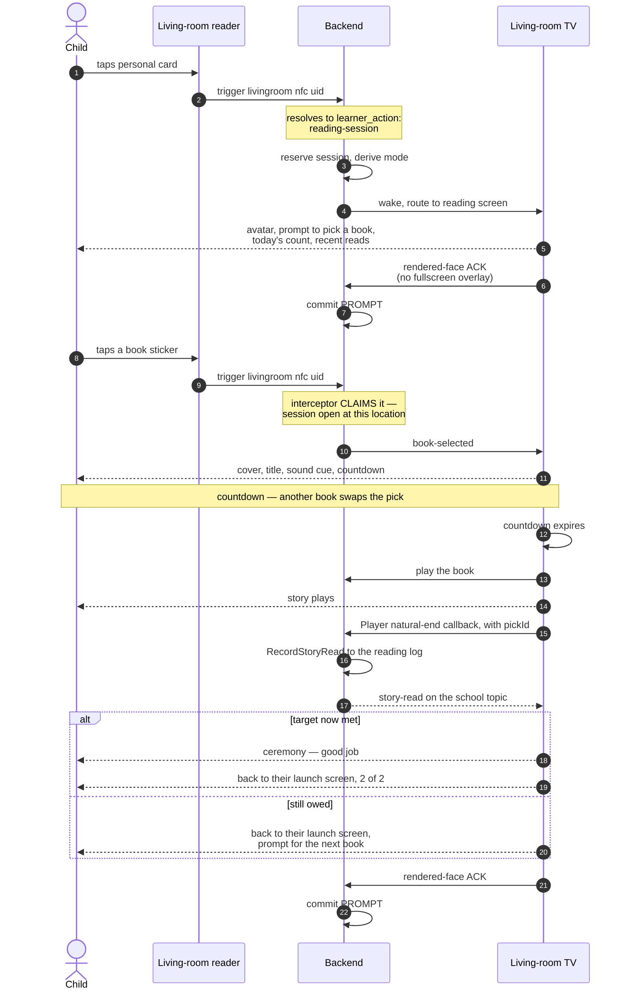
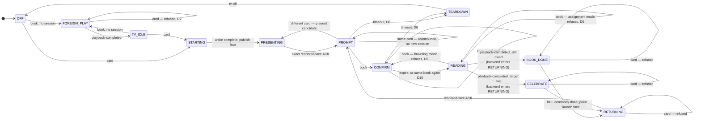
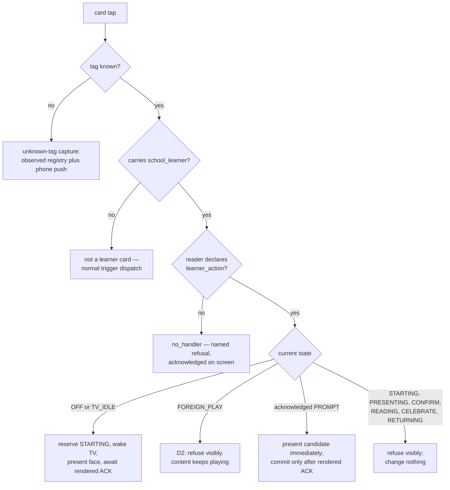
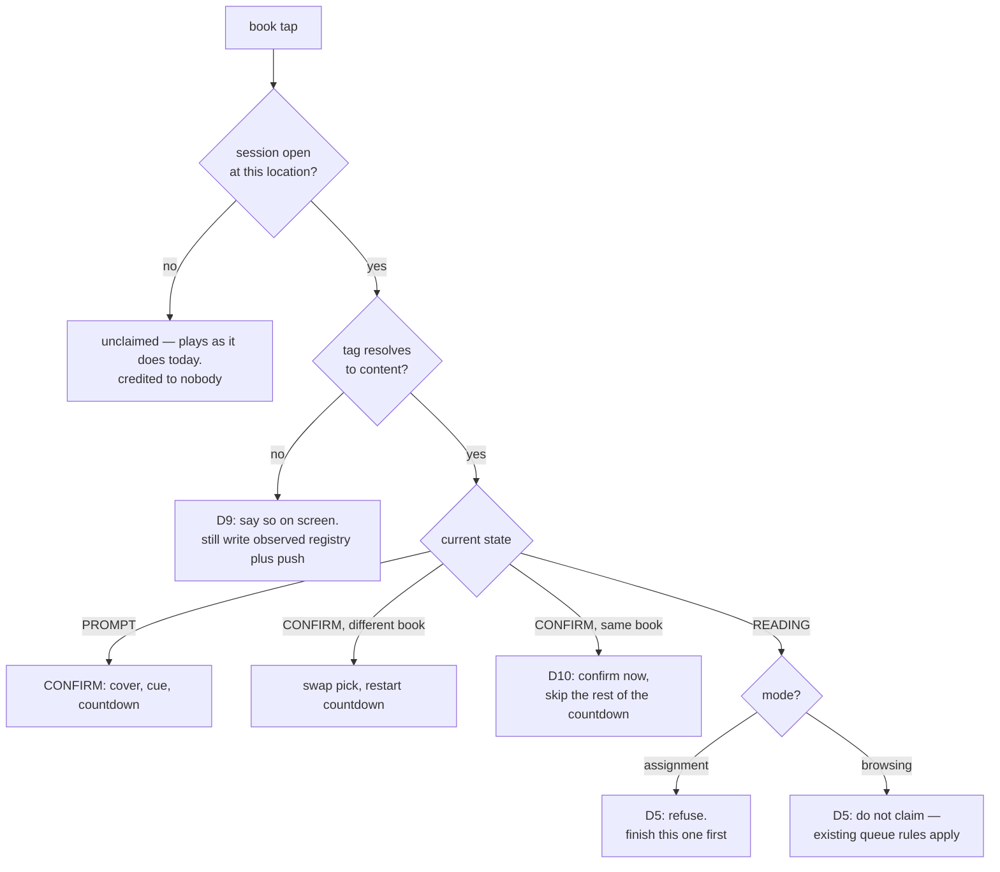
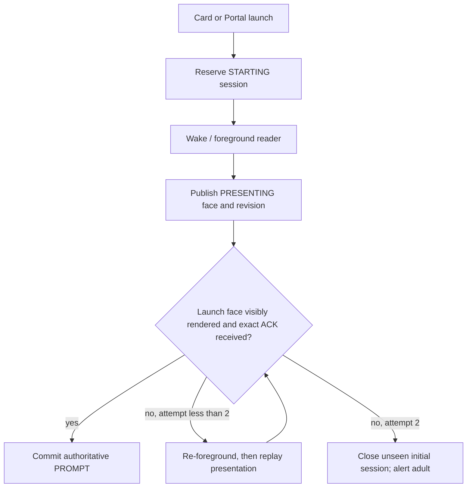
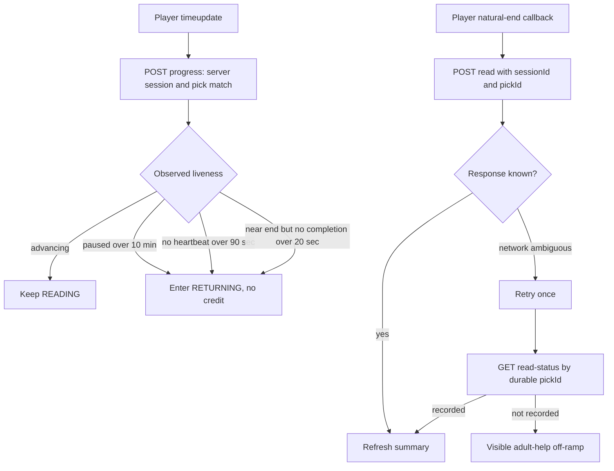

# Living-room reading sessions — lifecycle and state machine

> **Status:** built and wired, 2026-08-26. Cold-wake recovery repaired 2026-08-30.
> Learner hand-off was hardened 2026-09-02 after a card changed the authoritative
> session during playback and caused the finished read to be rejected.
> On 2026-09-11 the idle sweep was caught taking a child's credit — a book card
> landed 1.18 s after a teardown — so a closed session can now be reopened
> inside a grace window (§9), `POST /session/end` gained an allowlist and the
> `end()` it had always been missing, and the launch card was rebuilt around the
> empty slot the next book goes into.
> Implementation plans: `docs/_wip/plans/2026-08-26-preschool-reading-03-livingroom-session-screen.md`,
> `docs/_archive/2026-09-11-reading-launch-card-and-timeout-race.md`.
> This document is the authority on *behaviour*; the plan is the authority on *how*.

A preschooler taps their own NFC card on the living-room reader, the TV opens to a
screen scoped to them, they tap a book sticker, it plays, and finishing it counts
toward that day's reading assignment.

Every state, every input, and every transition is enumerated here. Nine branches
were undecided when this was first mapped. All are now settled; each is marked
with its original **D-number** where it appears, and §8 lists them together.

---

## 1. The alphabet

The whole feature has **three real inputs** and **two ambient facts**. That is small
enough to enumerate exhaustively, which is why this document can claim coverage.

| Input | Source |
|---|---|
| `card` | a personal NFC card, resolving to a learner |
| `book` | a book NFC sticker, resolving to content |
| `playback-completed` | Player reports a semantic natural end, before advancing or clearing |

Derived / internal:

| Input | Source |
|---|---|
| `expire` | the confirm countdown ran out |
| `unknown` | a tag that resolves to nothing |
| `timeout` | the session sat untouched for ~2 minutes |

| Ambient fact | Why it matters |
|---|---|
| TV power | decides whether a tap must wake it |
| Something already playing | decides whether a tap interrupts, queues, or is refused |

---

## 2. Mode — the central concept

**A session is in one of two modes, and the same input means different things in
each.** This is the distinction that makes the machine tractable.

| Mode | When | Posture |
|---|---|---|
| **assignment** | the learner is enrolled in story-time **and** `count < target` | **Hardened.** Finish what you started: a book tapped mid-story is refused. |
| **browsing** | not enrolled, **or** the target is already met | **Relaxed.** Nothing is owed, so mid-story taps behave like the TV normally does. |

**Mode is derived on every evaluation, never stored.** It is a pure function of the
reading log and the enrollment, so it cannot go stale, and it flips by itself the
moment the last required story finishes.

Two consequences worth stating plainly:

- **A non-enrolled card needs no special case.** An older sibling's card opens a
  perfectly ordinary session that happens to be in browsing mode. Their reads are
  still logged; nothing is counted. **[D1]**
- **Browsing mode is also what a child gets after finishing.** Re-tapping their card
  once the target is met reopens the session relaxed.

---

## 3. What already exists — read this before building anything

**The story plays inside a SURROUND FRAME, and it is a direct mount.**
`ReadingSessionScreen` mounts `SurroundFrame` around `Player` in the overlay
slot (`ReadingStage`), with an inline definition placing `reading-credit` in a
left rail: avatar, name, subject, the book's cover, and the same progress pips
the prompt draws. It is NOT a `SurroundHost` mount — the host polls the player
handle for a backend-attached content sidecar, and a reading session's chrome
comes from its SESSION, so there is nothing for that poll to find. Two
consequences the widget owns because `SurroundStage` would otherwise supply
them: it runs the media clock itself, and it side-effect-imports its own module
registrations. See `School/reading/surround/registerReadingSurround.js`, and
`School/lesson/` for the precedent this copies.

Live state reaches the rail through a small external store, not through props:
`showOverlay` captures props once, and re-calling it to deliver a new progress
count would remount the Player and restart the story.

**The queue already has a change-your-mind window, and it is not the one the
requirements describe.**

The living-room NFC source is configured `action: play-next`. That routes through
`ScreenActionHandler.handleMediaQueueOp`
(`frontend/src/screen-framework/actions/ScreenActionHandler.jsx:199`), which branches
on whether a player is mounted:

- **No player mounted** → mount a fresh `Player` overlay. The book plays
  **immediately**. A repeat of the same content inside `MEDIA_DEDUP_WINDOW_MS`
  (**3 s**) is suppressed.
- **Player mounted** → dispatch `player:queue-op` into the running player
  (`frontend/src/modules/Player/Player.jsx:1233`), which then:
  1. refuses if the content is already playing → flashes the on-deck chip;
  2. refuses if the content is already on-deck → flashes;
  3. **if the current item has played for less than `preempt_seconds` (default 15 s,
     `backend/src/4_api/v1/routers/config.mjs:16`) → replaces it in place**;
  4. otherwise → pushes it **on-deck**, to play when the current item ends.

So today, a second book tapped 5 seconds in *swaps*, and one tapped 5 minutes in
*queues*. That is a good design for a grown-up putting on music.

**In assignment mode the session claims the tap and refuses it, so none of the above
runs. In browsing mode the session does not claim it and all of the above applies
unchanged.** That is the whole interaction between the new feature and the existing
queue — one branch, stated once.

**End-of-content teardown already exists, and it is a live hazard.** `end: tv-off` on
the `livingroom` location flows as `endBehavior` + `endLocation` into the content
query (`WakeAndLoadService.mjs:275`), and `sideEffectHandlers['tv-off']`
(`backend/src/3_applications/trigger/sideEffectHandlers.mjs:21`) calls
`tvControlAdapter.turnOff(location)` when content ends. **Left unmodified it would
power the TV off the instant a story ends — before the ceremony could render.** The
session must suppress the location's `end` behaviour while it is open and run
teardown itself. **[D8]**

---

## 4. The happy path

---

## 5. States

| State | Meaning |
|---|---|
| `OFF` | TV off, no session |
| `TV_IDLE` | TV on, no session, nothing playing — menu or art screensaver |
| `FOREIGN_PLAY` | Content playing that no reading session started |
| `STARTING` | Initial card reserved the reader while it wakes |
| `PRESENTING` | A candidate face was sent; authority waits for rendered ACK |
| `PROMPT` | Launch face visibly acknowledged; "what do you want to read?" |
| `CONFIRM` | Book picked; countdown running; nothing playing yet |
| `READING` | The story is playing, attributed to the learner who picked it |
| `BOOK_DONE` | Frontend beat acknowledging ONE finished book, while the backend remains non-switchable |
| `CELEBRATE` | Frontend ceremony for the day's target being met, while the backend remains non-switchable |
| `RETURNING` | Backend has recorded/cleared the story and is waiting for the launch face to become visible again |
| `TEARDOWN` | Closing the session and powering the TV off |

`FOREIGN_PLAY` is deliberately its own state and not a flavour of `READING`. The
distinction — *did a reading session start this?* — decides whether a tap may
interrupt and whether a completion is credited. Collapsing them is how a family
movie ends up logged as somebody's homework.

---

## 6. The two hard inputs

### `card` — who is standing at the reader

### `book` — what to read

---

## 7. Transition matrices

Every state against every input. `—` means the input cannot arrive in that state.
The two modes differ in exactly one cell, which is the point of the distinction.

### Assignment mode — hardened

| State | `card` | `book` | `playback-completed` | `expire` | `timeout` |
|---|---|---|---|---|---|
| `OFF` | wake → `STARTING` | plays → `FOREIGN_PLAY` | — | — | — |
| `TV_IDLE` | → `STARTING` | plays → `FOREIGN_PLAY` | — | — | — |
| `FOREIGN_PLAY` | refuse visibly, stay | existing queue rules | → `TV_IDLE` | — | — |
| `STARTING` / `PRESENTING` | **refuse, stay** | **refuse, stay** | — | — | → `TEARDOWN` |
| `PROMPT` | present learner; commit on rendered ACK | → `CONFIRM` | — | — | → `TEARDOWN` |
| `CONFIRM` | **refuse, keep pick** | swap pick / same book confirms | — | → `READING` | → `TEARDOWN` |
| `READING` | **refuse, keep exact session/pick** | **refuse — finish this one** | backend → `RETURNING`; screen may show `CELEBRATE` first | — | — |
| `CELEBRATE` | **refuse, stay** | **refuse, stay** | — | — | → `TEARDOWN` |
| `RETURNING` | **refuse, stay** | **refuse, stay** | — | — | → `TEARDOWN` |
| `TEARDOWN` | refuse | refuse | — | — | → `OFF` |

### Browsing mode — relaxed

Identical, except:

| State | `book` |
|---|---|
| `READING` | **not claimed** — the existing preempt/on-deck rules apply unchanged |

---

## 8. Settled decisions

| # | Question | Decision |
|---|---|---|
| **D1** | A card not enrolled in story-time | Opens an ordinary session in browsing mode. Reads logged, nothing counted. No special case. |
| **D2** | A card tapped while unrelated content plays | **Refuse, visibly.** Brief on-screen acknowledgement; the content keeps playing. A reading session never seizes the TV from whoever is already watching. **One exemption:** content is not "unrelated" at a reader whose last session the system tore down from THIS learner within `recentlyDeparted`'s window — that is most likely their own orphaned story, and the refusal is non-retryable, so without the exemption the child is locked out by their own book (§9). |
| **D3** | A card during the confirm countdown | **Refuse visibly.** Keep learner, session id, and pick exactly unchanged. |
| **D4** | A card tapped mid-story | **Refuse visibly.** Keep learner, session id, pick, and playback attribution exactly unchanged, so completion cannot expire underneath the story. |
| **D5** | A book tapped mid-story | **Mode-dependent.** Assignment: refuse — finish this one first. Browsing: do not claim; the existing queue applies — and the session records **whose** the queued book is (D11). |
| **D11** | Who a queued book belongs to | **The queue is user-scoped.** A browsing-mode second book goes on deck scoped to the child at the reader now; a card tapped while it waits **re-scopes it** to that child (the playing story keeps its own attribution — D4 holds); the moment it takes the stage it is frozen into the pick, exactly as a countdown pick is. The rail shows the waiting book with the face and name it will be credited to. When the first story is credited the server advances into the on-deck pick instead of returning to the launch card, and the screen commits a fresh attribution for it. Before this, a queued story finished into a completion guard that had already fired and was never credited. |
| **D6** | Nobody picks a book | **~2 minutes quiet → `TEARDOWN` → TV off.** Same teardown as a finished session. The TV never stays on unattended and the next tap always lands in a fresh session. |
| **D7** | A card racing `CELEBRATE` or `RETURNING` | **Refuse visibly.** The next learner may enter after the launch face has returned and its rendered ACK commits `PROMPT`. |
| **D8** | Does the TV always power off? | The session **suppresses the location's `end: tv-off`** while open and owns teardown timing, so the ceremony can render first. Not optional — see §3. |
| **D9** | An unregistered book tag inside a session | Say it on screen — "I don't know that book yet" — **and** still write the observed-registry entry and send the phone push so it can be enrolled. |
| **D10** | The same book tapped again during the countdown | **Confirm immediately**, skipping the rest of the countdown. A child tapping twice is expressing certainty, and the 3 s dedup window would otherwise swallow it. |
| **Repeats** | Re-reading a book already finished today | **Counts every time.** Simplest rule to explain, and no screen has to deliver bad news. Accepted trade-off: the target can be met by re-reading one short book. |
| **Completion** | The target is met mid-session | Ceremony, then the visibly acknowledged launch card returns in browsing mode. The ordinary idle timeout owns later teardown. |

---

## 8a. The wire — events, routes, and where each piece lives

Everything the screen knows arrives on **one WebSocket topic per reader**,
`reading:<location>` (`reading:livingroom`). Everything the backend cannot see
goes back over the HTTP routes below. There is no other channel.

### Events on `reading:<location>`

| Event | Sent by | Payload | The screen does |
|---|---|---|---|
| `session-present` | `ReadingSessionService` | `learnerId, location, sessionId, presentationId, revision, serverEpoch, reason` | render that face immediately; ACK only after the launch card is painted and no fullscreen overlay covers it |
| `session-open` | `ReadingSessionService.acknowledge` | committed session plus presentation identity, including `idleTimeoutMs` | confirm the authoritative prompt; reconnects may safely re-ACK it. The window is drawn on the live empty slot, whose light fades over it |
| `session-update` | `ReadingSessionService.update` | the whole session | **nothing** — the screen owns its own view; the session's mirror is not an instruction |
| `session-close` | `ReadingSessionService.close` | the session, plus `reason` (`timeout`, …) | back to `idle`, unless a story is still playing — that outlives the session |
| `session-refused` | the `reading-session` learner action | `learnerId, location, target, reason: 'content-playing'` | one notice over the running content, and **nothing else moves** (**D2**). NOT sent when the learner is reclaiming a reader their own session was just torn down at — see §9 |
| `session-switch-refused` | the `reading-session` learner action | requested/current learner, current session id/state, reason | keep all session state unchanged; show a toast above Player when necessary |
| `book-selected` | `ReadingSessionInterceptor.claim` | `learnerId, contentId, target, at` | cover, title, countdown. The same `contentId` twice confirms immediately (**D10**) |
| `book-refused` | `ReadingSessionInterceptor.claim` | `learnerId, contentId, reason: 'finish-this-one'` | "Finish this one first" (**D5**, assignment mode) |
| `book-unknown` | `ReadingSessionInterceptor.noteUnknownTag` | `learnerId, tagUid, location, at` | "I don't know that book yet" (**D9**) |
| `session-error` | `ReadingSessionInterceptor.claim` | `learnerId, reason: 'obligation-unreadable'` | "I can't check your reading list" — and the prompt stays usable |

Two of those are worth calling out because they arrive from OUTSIDE the
interceptor, and could not arrive from inside it:

- **`session-refused`** comes from the learner action, before any session
  exists. There is nothing for an interceptor to intercept: the tap was a card,
  not a book, and the answer is that no session opens at all.
- **`book-unknown`** comes from the dispatcher's unknown-tag path. **An
  unresolvable tag never becomes a content `Response`**, so the content
  interceptor is never consulted and never can be. It is an *additional*
  message: the observed-registry write and the `notify_unknown` push happen
  exactly as they always did.

### `enrolled` — three answers, not two

`StoryTimeProgramLauncher.status()` carries `enrolled` so that **"this child owes
nothing" and "nobody could read what they owe" stay different answers**:

| `error` | `enrolled` | Mode | On screen |
|---|---|---|---|
| `false` | `true`, `count < target` | `assignment` | nothing special — the hardened path |
| `false` | `true`, `count >= target` | `browsing` | nothing special — they are finished |
| `false` | `false` | `browsing` | **nothing at all.** Not enrolled is an ordinary state, not a fault (**D1**) |
| `true` | `null` | `browsing`, but reported | `session-error` — relaxed on a guess, and said out loud |

While the last two shared one answer, an unreadable log switched a
mid-assignment child's hardening off with nothing anywhere to say so.

### Routes — `/api/v1/school/reading`

| Route | Body / query | Why it exists |
|---|---|---|
| `GET /session`, `POST /session/ack` | `location`, then `location, learnerId, sessionId, presentationId, revision, serverEpoch` | Snapshot/revision recovery and an exact compare-and-swap. The screen sends the ACK after two paint opportunities, only with the launch card unobscured. A stale proof is `409 stale-presentation`. |
| `GET /events` | `?location=&limit=` | Bounded, restart-safe timeline in `school/runtime/reading-sessions/events.yml`: opening age, ACK/progress ages, server-observed visible state and `displayedSince`, plus timestamped transitions. This is the operator answer to “what has the TV been doing?” |
| `POST /progress` | `location, sessionId, pickId, positionSec, durationSec, paused` | Liveness heartbeat. A stalled player, long pause, or terminal media without Player's completion callback enters `RETURNING` without granting credit. |
| `POST /playing` | `location, learnerId, contentId, pickId` | **Nothing else moves a session to `reading`.** The backend cannot see the first frame; without this, `state` never leaves `confirm`, D5 never fires in the field, and every book tapped during a story is claimed as a fresh prompt. It reports PLAYBACK START, not countdown expiry — they differ by however long the content takes to load, and that gap is exactly when a stray tap misbehaves. |
| `POST /read` | `learnerId, contentId, title, tagUid, location, sessionId, pickId` | The only path that writes evidence. `pickId` is the idempotency key. It performs `READING → RETURNING`; rendered-face ACK performs `RETURNING → PROMPT`. Session/pick conflicts remain `409` and are logged with both request and current identities. |
| `GET /read-status` | `learnerId, studyDay, pickId` | Resolves an ambiguous completion response from the durable idempotency key, without guessing or double-counting. |
| `POST /session/end` | `location`, optional `reason` | The wind-down after the closing ceremony. `reason` is an ALLOWLIST (`day-done` only, and the default), not free text: the interceptor reopens a session closed `timeout` and only the idle sweep, from inside the service, may say that word. Anything else is `400`. **It called a method that did not exist.** `ReadingApiService` had no `end()` while the router called it, so from the day the route shipped until 2026-09-11 every wind-down POST threw `TypeError: readingService.end is not a function` and `500`'d: the screen logged `wind-down-end-failed` and the room died on the two-minute idle timeout — the exact behaviour the route was added to remove. The day-done wind-down has therefore **never been watched working in the field**. It also kept the reopen's `reason === 'timeout'` guard dead code: no `day-done` close was ever recorded for it to refuse. `end()` is now pure delegation to `ReadingSessionService#end`, the single teardown path shared with the idle sweep. **`ok: true` means A SESSION WAS CLOSED, not that the TV went off** — `#end` swallows a failing `#onTimeout` into a `school.reading.teardown-failed` warn and still returns the closed session, so a room that stayed lit answers `200 {ok: true}`. The log line is the only place that failure appears. |
| `GET /summary` | `?learnerId=` | What the prompt puts in front of the child: display name, today's count/target, and the six newest reads across today plus the prior six study days. Every day degrades independently. |

**On deck.** `queueNext` (the interceptor, on an unclaimed browsing-mode tap),
`rescopeOnDeck` (a learner card mid-story) and `advanceToOnDeck` (`POST /read`,
when a book was waiting) are the three moves; they broadcast `on-deck`,
`on-deck-rescoped` and `on-deck-advanced`, and the read response carries the
advanced pick as `next` so a screen that missed the broadcast still commits it.

**Attribution is minted and owned by the server at pick time.** The client carries
`sessionId` and `pickId` back as a capability, but the router takes learner,
content, and study day from the stored pick. No card may change `sessionId`
while that pick is confirming, loading, playing, celebrating, or returning.

### Delivery and recovery loops

The wake is helpful, but it is not the delivery contract. A cold Android/Fully
Kiosk resume may be slow, may reconnect its socket late, or may reload the page
after the command returns. The in-process session snapshot is the authority,
and the screen's ACK of the exact presentation identity is the proof. Receipt
of a WebSocket message is not proof: the face must be committed to the DOM, the
fullscreen overlay slot must be empty, and two animation frames must pass.

For an already-mounted widget, device preparation uses the `broadcast` profile:
`screenOn` plus `toForeground`, with no audio-bridge, microphone, camera, or
`getDeviceInfo` work. Those checks belong to media/call preparation. In the
2026-08-30 incident `getDeviceInfo` alone consumed its full 10-second transport
timeout and full preparation took 29.7 seconds; none of that work could prove
that the Story Time intent had rendered. The rendered-presentation ACK can.

The scheduler and School realtime gateway are required production dependencies.
The scheduler contract is fail-fast: it bounds each ACK wait and advances the
loop to recovery. Production composition supplies one shared gateway for
activation, book selection, and read completion, and the integration tests pin
those publications.

### Where each piece lives

| Piece | Path |
|---|---|
| Session store (in-memory, per location, idle sweep) | `backend/src/3_applications/school/ReadingSessionService.mjs` |
| Content interceptor (claim, `suppressEnd`, `noteUnknownTag`) | `backend/src/3_applications/school/readingSessionInterceptor.mjs` |
| The interceptor seam + D8 suppression | `backend/src/3_applications/trigger/responseHandlers.mjs` (`content`) |
| The unknown-tag observer | `backend/src/3_applications/trigger/TriggerDispatchService.mjs` |
| The `reading-session` learner action (D2 lives here) | `backend/src/5_composition/modules/learnerCardActions.mjs` |
| Evidence | `backend/src/3_applications/school/usecases/RecordStoryRead.mjs` |
| HTTP door | `backend/src/4_api/v1/routers/reading.mjs` (the `END_REASONS` allowlist lives here) |
| What the door calls | `backend/src/3_applications/school/ReadingApiService.mjs` (`summary`, `ack`, `end`, `events`) |
| Launch card, shelf, slots, ceremony | `frontend/src/modules/School/reading/ReadingSessionScreen.jsx` + `.scss` (`reading-slot-breathe`, `reading-slot-idle-out`) |
| Shelf covers, sized and cached | `frontend/src/modules/School/reading/bookCovers.js`, `School/plexImage.js` (`ART_BOX.readingShelf`) |
| Screen state machine | `frontend/src/modules/School/reading/useReadingSession.js` |
| Composition | `backend/src/app.mjs` (search `Living-room reading sessions`) |
| Mount | `data/household/screens/living-room.yml` → `widget: school-reading` |

---

## 9. Failure paths

Not state transitions, but each must land somewhere visible.

| Failure | Behaviour |
|---|---|
| Content lookup fails | The player bails today. In a session: back to `PROMPT` with "that one didn't work" |
| No book is picked | After two minutes, close the session. `end: tv-off` turns the configured display off; otherwise the widget returns to its idle/art surface. The prompt SHOWS that window running: the session publishes its own `idleTimeoutMs` and the live empty slot's amber glow eases to nothing over it (`--slot-idle-ms`, `reading-slot-idle-out`). That is a PICTURE of the sweep, never the sweep itself — the server decides off `lastActivityAt`, which every tap moves and the stylesheet cannot see, so where the two disagree the sweep wins. A `session-open` carrying no window draws no clock. |
| TV wakes slowly, fails to wake, reloads, or misses the event | Reserve before wake; publish `PRESENTING` after the bounded wake result; a client hydrated during `STARTING` polls until the presentation exists. Replay twice. If no rendered ACK arrives, close the unseen initial session and alert an adult. |
| Candidate learner face is not acknowledged | Never commit it. Replay once, then present the prior learner again and alert an adult; all inputs remain blocked until a face is acknowledged. |
| Reading log write fails | The story still played. Surface it; never claim a read that was not recorded |
| Backend restart mid-session | Session state is in-memory and is lost — correct; nobody is at the reader after a restart |
| Player remounts or completion response is lost | Must not double-count. Player suppresses duplicate terminal notifications; `pickId` dedup plus one retry and `read-status` recover transport ambiguity. |
| Native terminal signals repeat | Player dispatches one semantic completion; the same `pickId` also dedups downstream evidence. |
| Teardown suppression fails | The TV powers off before the ceremony. Guard with a test — this is the D8 hazard |
| A book card lands JUST after the idle sweep closed the session | The interceptor reopens it. Scanning a card, walking to the shelf and scanning a book is ONE act and the sweep can land in the middle of it; on 2026-09-11 it closed a session 1.2s before the book arrived, which then dispatched as ordinary content — story played, no pick, no credit. `ReadingSessionService.recentlyClosed()` keeps the last teardown for `REOPEN_GRACE_MS` (45s, clamped to the idle timeout), and `ReadingSessionInterceptor` reopens it for `reason: 'timeout'` ONLY — a `day-done` close is a finished child and a book after it is browsing. The reopen is also the ONLY claim that wakes the screen, via the same `wakeScreen` seam as the learner-card path (power + foreground, never a content load — that would drop the WebSocket carrying `session-open`), fire-and-forget so a slow or dead TV cannot cost the claim. **Residual, NOT closed:** the sweep records the close before running its own `end: tv-off`, so the reopen fires a power-on into a teardown that is still in flight, and the two verify against *different* entities — on 09-11 the power-on reported success against `living_room_tv_power` in 3ms while the teardown's `living_room_tv_state` only reached `off` seven seconds later. So `school.reading.reopen-wake` can log `ok: true` for a room that then goes dark. Whether the child's TV ends up lit is **unverified in the field**; it needs watching the real set through the sequence. A re-wake after the teardown settles is the obvious candidate and is deliberately not built on speculation. |
| The reopen succeeds but the screen cannot be told | The reopen is **rolled back**: `#abandonReopen` closes it again with `reason: 'reopen-abandoned'` and logs `school.reading.reopen-abandoned` at warn, and the book dispatches as ordinary content exactly as it did before the grace existed. The `book-selected` broadcast is the only failure this path can see (the store's own `session-open` send swallows its failures and reports nothing), so it is what the rollback hangs off. It is not cosmetic: a reopened session that outlives its own abandoned claim is a PHANTOM, and `suppressEnd()` asks only whether *a* session is open at this reader — so the phantom would cancel the room's `end: tv-off` for the very dispatch about to play the book, and nothing would be left to turn the living room off. That is the 2026-08-28 fault arriving by a new road. The rollback **spends the grace deliberately**: the `reopen-abandoned` record is not a `timeout`, so a second tap inside the window will not try again. A bus that could not carry `book-selected` cannot carry a launch card either, and a retry would only mint a second phantom. |
| The grace is MISSED — the book lands more than 45s after the sweep, or the reopen was abandoned | The story plays unclaimed (that half is unchanged), but the child's card now gets them back in. Previously the next card tap was refused `content-playing` by the `reading-session` learner action *because the thing playing was their own book*, and that refusal is deliberately non-retryable — on 2026-09-11 the learner tapped at 17:14:01 and 17:15:02 and was refused both times, so recovery needed an adult. **The refusal now exempts the learner whose own session this reader just lost.** `ReadingSessionService.recentlyDeparted()` reads the SAME teardown record as `recentlyClosed()` through a second, longer window, and the handler exempts the tap when the departed learner is this learner AND the close reason is one the SYSTEM imposed — `timeout`, `reopen-abandoned`, `presentation-unacknowledged` (`RECLAIMABLE_CLOSE_REASONS`). A normal session opens, the reader is woken by the usual `wakeScreen` seam, and the child can scan their book again with credit. The exemption logs `school.reading.refusal-exempted` (info, with `closeReason`/`sinceCloseMs`) rather than riding as a field on a refusal line that does not fire; an ordinary refusal now carries `departedLearnerId`/`departedReason` so the field can see why it was not exempted. **What is deliberately NOT exempt:** `day-done`, because a finished day hands the room back and the reader's `end: tv-off` has already run, so content playing after it is new and belongs to whoever started it; and a bare close's `reason: null`, which states no provenance — it is an allow-list so a reason added later must be decided on rather than inherited. Note the exemption rests on a PROXY, not on content identity: `isPlaying` is a bare per-device boolean from `screen.presence` with no `contentId` on it, so "this learner was the last occupant here" is the closest available question and the window is what bounds the guess. |

---

## 10. Invariants

1. **A read is credited only from Player's semantic natural-end callback** — never on pick, play, skip, back, load failure, or explicit clear. **Both ceremony tiers hang off that same credited read**, so neither is a second source of it.
2. **Attribution is decided and stored server-side at pick time**; the client cannot replace it.
3. **No session, no credit.** An unclaimed book tap plays and counts for nobody.
4. **Mode is derived, never stored.** It cannot go stale and it flips by itself.
5. **Every tap is acknowledged on screen** — the same rule the scan ceremony holds.
   A child who taps and sees nothing taps harder.
6. **A reading session never seizes the TV** from content already playing — except at a reader whose last session the system itself tore down from this same learner, inside `recentlyDeparted`'s window. That is the one case where the content playing is most likely the learner's own orphaned story, and where refusing them is a lock-out with no retry (§9, D2).
7. **In assignment mode: one story at a time.** No queue, no on-deck, nothing silent.
8. **Only a visibly acknowledged launch card may hand off learners.** Every
   other state refuses cards without changing learner, session id, pick, or playback.
9. **Every finished book is acknowledged on screen.** The ceremony is TIERED —
   a short beat for the book, the full celebration for the day's target being
   met. It used to fire only on `doneToday`, so finishing story 1 of 2 ended in
   silence moments after the read was credited, which reads as "that did not
   count". A `session-close` arriving mid-ceremony is refused for the same
   reason `READING` refuses it: the ceremony outlives the session.

---

## 11. What is still unverified

Every rule above is pinned by a test. The pre-repair path was watched fail on the
actual living-room TV on 2026-08-30; the repaired cold-resume path has not yet
been watched succeed. Three details cannot be settled any other way:

1. **The ceremony rendering before the TV powers off** (the D8 hazard). A
   passing test proves `endBehavior` was stripped; only the room proves the
   ceremony was seen.
2. **The audible cue.** `playScanCeremonyTone` is a programmatic `Audio.play()`
   on the Shield's WebView. Book taps already start audible playback there with
   no user gesture, so there is no autoplay gate for the CONTENT — whether a
   short synthesized tone behaves the same way is a separate claim, and it has
   not been checked on the hardware. It logs its own failure, so the log store
   will answer it.
3. **The room coming back after a reopen.** A book card that reopens a
   timed-out session asks for the screen back, but it fires that power-on into a
   teardown still in flight, and the two verify against *different* entities
   (`binary_sensor.living_room_tv_power` for the wake,
   `binary_sensor.living_room_tv_state` for the teardown). `school.reading.reopen-wake`
   can therefore log `ok: true` for a room that then goes dark — the log line
   even carries that caveat. **Nobody has watched the actual TV through this
   sequence.** §9's row has the timings. This narrows the window; it does not
   close it, and a re-wake after the teardown settles is deliberately not built
   on speculation about hardware.
4. **The day-done wind-down, at all.** `POST /session/end` `500`'d from the day
   the route shipped until 2026-09-11 (`ReadingApiService` had no `end()`), so
   the ceremony's twenty-second wind-down has never once ended a session in the
   field — every room died on the idle timeout instead. The repair is pinned by
   a suite that composes the real service; the room is unwatched.
5. **Whether the D2 exemption wins the screen back.** A learner reclaiming the
   reader their session was torn down at gets a session and a wake, but
   `wakeScreen` is power + foreground and deliberately not a content load — so
   the orphaned story keeps playing, and whether the launch card comes forward
   over a fullscreen player has not been watched on the real set. The credit
   half is sound either way (the reopened session is what makes the child's
   next book scan a claimed pick), and `school.reading.refusal-exempted` says
   when this fired; what nobody has seen is the TV.
6. **The screensaver.** `living-room.yml` runs ArtMode with `showOnLoad: true`,
   and a screensaver is a fullscreen overlay over the layout this widget renders
   into. The widget dismisses it once on the way out of `idle`; whether that is
   enough on the real screen, at the real idle timings, is a thing to watch.

One known gap remains deliberate:

- **Teardown after the ceremony is the idle timeout, not an explicit step.** The
  screen returns to the prompt after the celebration and the session expires ~2
  minutes later (D6). The TV does power off; it does so on the timeout's clock
  rather than the ceremony's.

## The screens, and what each one is for

The full taxonomy — the jobs, which element owns each, and which are
deliberately absent from which surface — is
[`_wip/plans/2026-09-09-reading-information-taxonomy.md`](../../_wip/plans/2026-09-09-reading-information-taxonomy.md).
The short version:

| Surface | Its question | Carries |
|---|---|---|
| **open** | *What shall I read?* | face, name, the day-partitioned shelf **led by today**, with one empty slot per story still owed (see below). No pips, no streak wall — both moved, 2026-09-11 |
| **picking** | *You picked this — sure?* | the cover, a countdown |
| **rail** (during) | *Whose is this, how far through today?* | subject mark, face, name, pips with a live one, the wall clock |
| **stage** (during) | *Which book is this?* | the cover, and nothing else |
| **ceremony** `book` | *That one counted.* | the cover that landed, the pips |
| **ceremony** `day` | *Here is what you did.* | today's covers with their clock times, the pips, the streak wall |
| **winding-down** | *The room is about to turn off.* | face, a countdown, a way to stay |

### The rules that hold it together

- **One element, one job.** The single sanctioned overload is the live pip,
  which carries both the obligation and the position — allowed because they are
  the same currency: this story fills this pip. No second position indicator may
  exist anywhere, which is why the frame forces the Player's focused shader.
- **The same job wears the same object everywhere.** The obligation is pips on
  every surface that shows it, never a sentence in one place and dots in another.
  The launch card is the one sanctioned exception, and it earns it by saying the
  same thing in the shelf's own notation: an empty slot *is* a story owed,
  drawn in the row the child is already reading. It replaces the pips there
  rather than sitting beside them — two notations for one fact is exactly what
  this rule forbids.
- **A partition and a count on one element share a scope.** The recent shelf
  partitions by DAY and dedupes only inside a day; the repeat badge sits on the
  cover it happened on.
- **The wall clock is never a countdown.** It is on the rail as incidental
  reading practice and nothing depends on it. The moment something does, it has
  stopped being incidental.

## The launch card — the shelf, and the slot the next book goes into

> Rebuilt 2026-09-11. Before this, the screen asked *"What do you want to read
> today?"* and then showed only history: pips a few hundred pixels from the
> shelf, a month-wide streak wall under it, and — on the one day it mattered
> most — a PAST day sitting where the eye lands first, because a child who had
> read nothing today got no today column at all.

**Today always leads the shelf, even empty.** It is the only column the child
can act on. `Recent` synthesises an empty group for `studyDay` when the summary
has none, and past days follow behind it.

**One empty slot per story still owed.** The count is `target - count` from the
summary, floored at zero — the obligation, in the notation the child is already
looking at. It is known before a single cover has loaded, so the shelf's
geometry is settled at first paint and covers landing one by one never move it.

**A slot is a PLACE, not a control.** This panel is a view: no touch, no cursor,
no focus ring, and the only input in the room is the card reader. So the answer
to the screen's own question has to be somewhere a book can go, not something
that looks pressable — a recessed, book-shaped gap in the shelf, lit from
behind. Never a bordered tile, never a hover lift, nothing that has ever been
pressed. Only the FIRST slot is marked `--live` and breathes: the same "this is
the one you are filling next" the live pip drew.

### The live slot carries the idle clock

The session's own `idleTimeoutMs` rides every `session-open`, lands on the live
slot as `--slot-idle-ms`, and its light eases down across that window
(`reading-slot-idle-out`). Until this existed, the picking view had a countdown
and the winding-down view had a countdown, and the one view where the timeout
actually costs a child a read showed nothing at all.

Five things about it are load-bearing:

- **It is a PICTURE of the server's sweep and never the sweep itself.** The
  backend closes off `lastActivityAt`, which every tap moves and a stylesheet
  cannot see. Where the two disagree, the sweep wins, and nothing here may be
  read back as "how long is left".
- **The duration is the backend's number.** Hardcoding 120000 would make the
  screen lie to a child the first time the sweep is tuned. A `session-open`
  carrying no window gets neither the class nor the property, and draws no
  clock: a screen that cannot know the window must not draw a confident one.
- **It dims without going still.** The fade owns `filter`; the breath owns
  `box-shadow`. Written as a second set of `box-shadow` keyframes it would have
  overridden the breath outright — later animation wins the property — and the
  slot would have gone still instead of going dark. The cue that actually lands
  is the RATE: the filter multiplies the breath along with the base glow, so the
  pulse's amplitude collapses with it, and "still pulsing" vs "barely pulsing"
  reads across glances in a way absolute brightness does not.
- **It ends on an ember, not on nothing.** The floor is `brightness(0.25)`. At
  `0.06` the live slot became indistinguishable from the dead slots beside it
  for the last stretch of the window, so the shelf stopped naming the place a
  book goes exactly when the child was closest to losing the session. The slot's
  first duty is that place; the clock is its second job, and the second may not
  eat the first.
- **`prefers-reduced-motion` holds the lit state still** — no fade, no breath.
  Motion is the message here, so when motion is refused the message survives as
  a slot that is plainly lit.

**The fade re-arms on unmount, which is not obvious.** A CSS animation only
restarts on a NEW element. `Recent` returns null while there is nothing to draw,
and every `session-open` clears the summary before refetching it — so the shelf
unmounts and comes back as fresh elements, and the clock starts over. Make that
early return "helpful" by keeping the shelf mounted through a reload and the
fade silently stops restarting: the next child inherits the last one's spent
light. If that changes, key the slot on the session id instead.

### Two smaller repairs on the same shelf

- **Covers are requested at the size they are drawn.** `bookCovers` returned
  `/api/v1/info`'s raw proxied poster — 640x640 to 1336x1920 on this library —
  into a card that caps at 205 CSS px, leaving the browser a 3–9x bilinear
  downscale whose quality tracked each poster's happenstance resolution. That is
  why some covers looked smooth and others blocky in the same row. They now go
  through `sizedPlexImage` with the square `ART_BOX.readingShelf` box, so Plex
  resamples once, server-side and cached. The box is square because these are
  square audiobook sleeves in a square card: the win is the resample, not a crop.
- **The weekday label named the wrong day.** `recentDayLabel` parsed the study
  day at UTC midnight and then formatted it in LOCAL time, so anywhere west of
  Greenwich every heading was a day early — Wednesday's books sat under `TUE`
  while the streak wall six inches below had the same days right. A study day is
  a calendar date, not an instant; it is now formatted in the zone it was parsed
  in (`timeZone: 'UTC'`). The test pins a non-UTC zone, without which the
  assertion cannot fail.

## The streak wall

> **It lives at the close, not on the launch card** (moved 2026-09-11). Eight
> states encoded as colour with no key, no weekday header, and a ragged first
> row — the heaviest thing on the waiting screen after the covers, competing
> with the one element the child is meant to act on. A wall is for lingering
> over, and the waiting screen is the one screen nobody should linger on: it
> asks a question and wants an answer. The close is where there is nothing left
> to do but look, and it is the only moment a child sees today's square turn
> green. The surround rail and both ceremony tiers still mount the pips; only
> the launch card's copies of both are gone.

Four weeks, seven columns, one square per day, oldest first so today is the last
cell. **The number is books; the colour is whether the goal was met** — green
met, amber partial, grey missed, and near-transparent for a day nobody asked
about. An over-target day is the same green as an exactly-met one, deliberately:
a wall that graded volume would teach a child that meeting the goal is not
enough.

Non-school days come from the story-time enrollment's own `schedule`, judged by
`schoolCalendar#isSchoolDay` — the same function the rest of School uses. Reading
on a rest day still counts, so a Saturday story is a green square.

### A day off has its own square, and its own name

The wall had one way to say "nothing was asked of you" and used it for both a
Saturday and Christmas. `rest` recedes on purpose — greying weekends made a
normal week read as a broken streak — but that same near-invisible square then
swallowed Thanksgiving, and a child looking at a blank week in late November was
told nothing about why.

A [named day off](./term-grid.md#a-named-day-off) is now its own state, `exempt`,
drawn blue. `exempt` is the term grid's existing word for the same idea, so the
two surfaces share one state rather than inventing a second name for it, and
blue is neither the green of a met goal nor the amber of a partial one: it reads
as *not scored* rather than as a grade. The square carries the calendar's own
word for the day as its title, so it can say "Thanksgiving" instead of the
generic "a day off".

The name comes from the **household** calendar rather than the story-time
enrollment's schedule. A course may excuse a day for its own reasons; only the
house declares Christmas.

Reading on a holiday still counts. `met` and `partial` are checked before the
holiday, exactly as they already were for a rest day, because the agenda never
un-serves work a child actually did.

**Known limitation:** no historical target is stored, so every past day is judged
against the target as it stands today. A household that changes its daily target
re-colours its own past.

## How a day ends

The closing ceremony runs, and then the room winds down: twenty seconds with a
visible countdown that any tap, any card or any book cancels. If nobody
objects, the panel calls `POST /reading/session/end`, which closes the session
and applies the reader's **own declared end policy** — the same
`ReadingSessionService#onTimeout` path the idle sweep uses, so there is one way
to turn the TV off rather than two.

Before this, a finished day returned the child to the pick screen and the room
stayed lit until a two-minute idle timer noticed.

**And that is what kept happening anyway, until 2026-09-11.** The route called
`readingService.end()`, and `ReadingApiService` had no such method — so every
wind-down POST threw and `500`'d, the panel logged `wind-down-end-failed`, and
the room fell back to the idle timeout it was built to replace. The router suite
drove a recording stub, which is the right unit for "what does the router let
through" and precisely why a missing method on the real class sailed past; a
second suite now composes the production `ReadingApiService` over a real
`ReadingSessionService` and asserts the consequence — the session is gone, the
close is filed `day-done`, and the reader's own end policy ran.

`winding-down` counts as a rendered view for presentation ACK purposes. That is
load-bearing: the ACK is what lets `beginSwitch` accept a sibling's card, so a
wind-down that did not ACK would refuse every sibling until the idle timeout.
