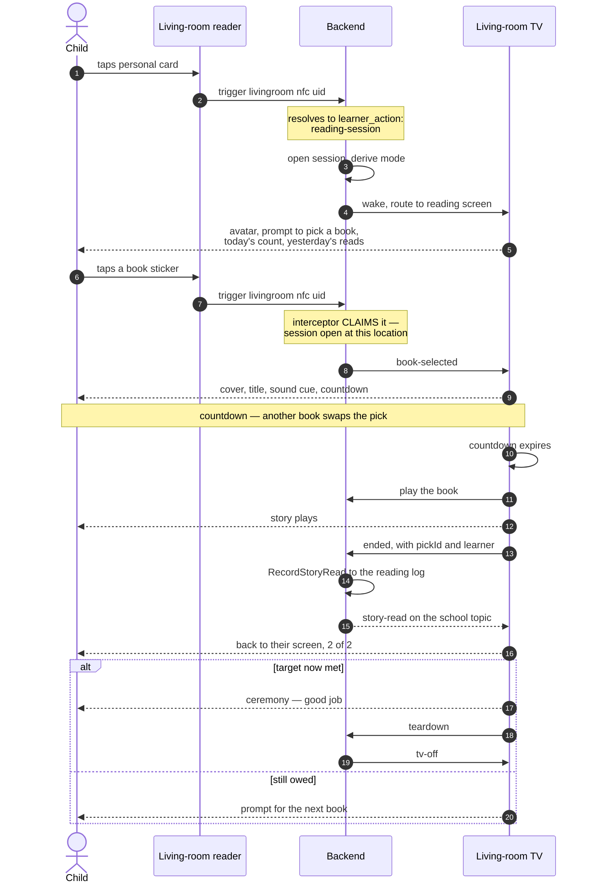
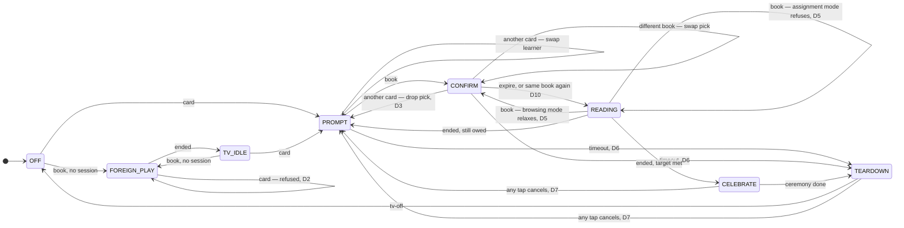
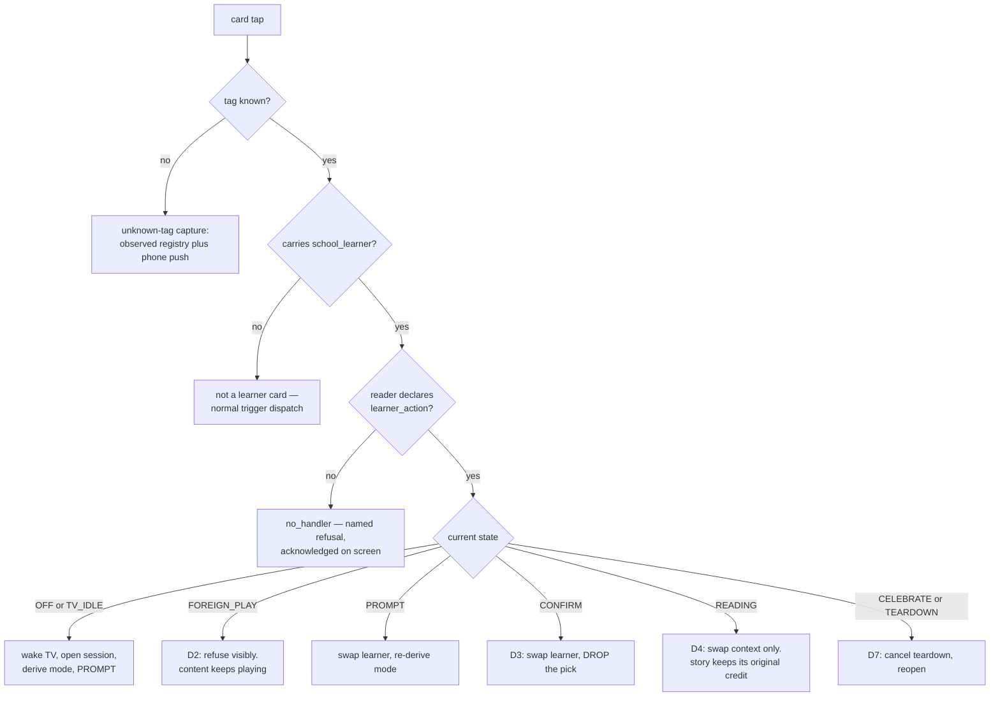
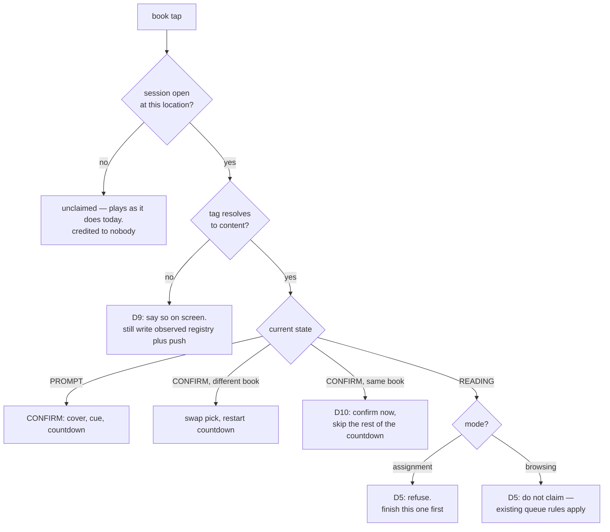
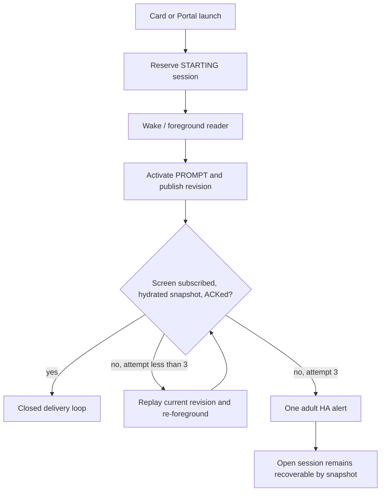
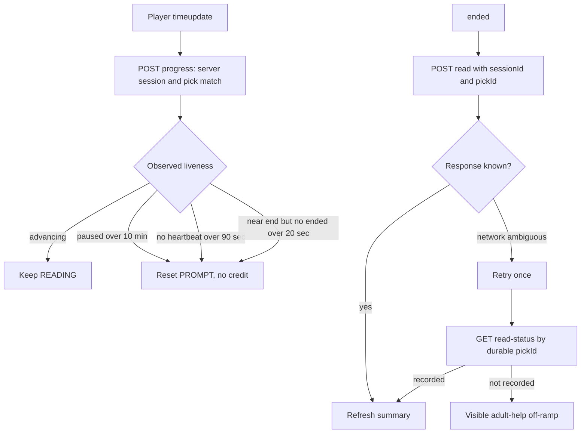

# Living-room reading sessions — lifecycle and state machine

> **Status:** built and wired, 2026-08-26. Not yet verified on the hardware —
> see §11 for what a person still has to watch happen on the actual TV.
> Implementation plan: `docs/_wip/plans/2026-08-26-preschool-reading-03-livingroom-session-screen.md`.
> This document is the authority on *behaviour*; the plan is the authority on *how*.

A preschooler taps their own NFC card on the living-room reader, the TV opens to a
screen scoped to them, they tap a book sticker, it plays, and finishing it counts
toward that day's reading assignment.

Every state, every input, and every transition is enumerated here. Nine branches
were undecided when this was first mapped. All are now settled; each is marked
with its original **D-number** where it appears, and §8 lists them together.

---

## 1. The alphabet

The whole feature has **three real inputs** and **two ambient facts**. That is small
enough to enumerate exhaustively, which is why this document can claim coverage.

| Input | Source |
|---|---|
| `card` | a personal NFC card, resolving to a learner |
| `book` | a book NFC sticker, resolving to content |
| `ended` | the player reports the current item finished |

Derived / internal:

| Input | Source |
|---|---|
| `expire` | the confirm countdown ran out |
| `unknown` | a tag that resolves to nothing |
| `timeout` | the session sat untouched for ~2 minutes |

| Ambient fact | Why it matters |
|---|---|
| TV power | decides whether a tap must wake it |
| Something already playing | decides whether a tap interrupts, queues, or is refused |

---

## 2. Mode — the central concept

**A session is in one of two modes, and the same input means different things in
each.** This is the distinction that makes the machine tractable.

| Mode | When | Posture |
|---|---|---|
| **assignment** | the learner is enrolled in story-time **and** `count < target` | **Hardened.** Finish what you started: a book tapped mid-story is refused. |
| **browsing** | not enrolled, **or** the target is already met | **Relaxed.** Nothing is owed, so mid-story taps behave like the TV normally does. |

**Mode is derived on every evaluation, never stored.** It is a pure function of the
reading log and the enrollment, so it cannot go stale, and it flips by itself the
moment the last required story finishes.

Two consequences worth stating plainly:

- **A non-enrolled card needs no special case.** An older sibling's card opens a
  perfectly ordinary session that happens to be in browsing mode. Their reads are
  still logged; nothing is counted. **[D1]**
- **Browsing mode is also what a child gets after finishing.** Re-tapping their card
  once the target is met reopens the session relaxed.

---

## 3. What already exists — read this before building anything

**The queue already has a change-your-mind window, and it is not the one the
requirements describe.**

The living-room NFC source is configured `action: play-next`. That routes through
`ScreenActionHandler.handleMediaQueueOp`
(`frontend/src/screen-framework/actions/ScreenActionHandler.jsx:199`), which branches
on whether a player is mounted:

- **No player mounted** → mount a fresh `Player` overlay. The book plays
  **immediately**. A repeat of the same content inside `MEDIA_DEDUP_WINDOW_MS`
  (**3 s**) is suppressed.
- **Player mounted** → dispatch `player:queue-op` into the running player
  (`frontend/src/modules/Player/Player.jsx:1233`), which then:
  1. refuses if the content is already playing → flashes the on-deck chip;
  2. refuses if the content is already on-deck → flashes;
  3. **if the current item has played for less than `preempt_seconds` (default 15 s,
     `backend/src/4_api/v1/routers/config.mjs:16`) → replaces it in place**;
  4. otherwise → pushes it **on-deck**, to play when the current item ends.

So today, a second book tapped 5 seconds in *swaps*, and one tapped 5 minutes in
*queues*. That is a good design for a grown-up putting on music.

**In assignment mode the session claims the tap and refuses it, so none of the above
runs. In browsing mode the session does not claim it and all of the above applies
unchanged.** That is the whole interaction between the new feature and the existing
queue — one branch, stated once.

**End-of-content teardown already exists, and it is a live hazard.** `end: tv-off` on
the `livingroom` location flows as `endBehavior` + `endLocation` into the content
query (`WakeAndLoadService.mjs:275`), and `sideEffectHandlers['tv-off']`
(`backend/src/3_applications/trigger/sideEffectHandlers.mjs:21`) calls
`tvControlAdapter.turnOff(location)` when content ends. **Left unmodified it would
power the TV off the instant a story ends — before the ceremony could render.** The
session must suppress the location's `end` behaviour while it is open and run
teardown itself. **[D8]**

---

## 4. The happy path

---

## 5. States

| State | Meaning |
|---|---|
| `OFF` | TV off, no session |
| `TV_IDLE` | TV on, no session, nothing playing — menu or art screensaver |
| `FOREIGN_PLAY` | Content playing that no reading session started |
| `PROMPT` | Session open; "what do you want to read?" |
| `CONFIRM` | Book picked; countdown running; nothing playing yet |
| `READING` | The story is playing, attributed to the learner who picked it |
| `CELEBRATE` | The read just met the daily target |
| `TEARDOWN` | Closing the session and powering the TV off |

`FOREIGN_PLAY` is deliberately its own state and not a flavour of `READING`. The
distinction — *did a reading session start this?* — decides whether a tap may
interrupt and whether a completion is credited. Collapsing them is how a family
movie ends up logged as somebody's homework.

---

## 6. The two hard inputs

### `card` — who is standing at the reader

### `book` — what to read

---

## 7. Transition matrices

Every state against every input. `—` means the input cannot arrive in that state.
The two modes differ in exactly one cell, which is the point of the distinction.

### Assignment mode — hardened

| State | `card` | `book` | `ended` | `expire` | `timeout` |
|---|---|---|---|---|---|
| `OFF` | wake → `PROMPT` | plays → `FOREIGN_PLAY` | — | — | — |
| `TV_IDLE` | → `PROMPT` | plays → `FOREIGN_PLAY` | — | — | — |
| `FOREIGN_PLAY` | refuse visibly, stay | existing queue rules | → `TV_IDLE` | — | — |
| `PROMPT` | swap learner, stay | → `CONFIRM` | — | — | → `TEARDOWN` |
| `CONFIRM` | swap learner, drop pick → `PROMPT` | swap pick / same book confirms | — | → `READING` | → `TEARDOWN` |
| `READING` | swap context, stay | **refuse — finish this one** | target met → `CELEBRATE`; else → `PROMPT` | — | — |
| `CELEBRATE` | cancel → `PROMPT` | cancel → `CONFIRM` | — | — | → `TEARDOWN` |
| `TEARDOWN` | cancel → `PROMPT` | cancel → `CONFIRM` | — | — | → `OFF` |

### Browsing mode — relaxed

Identical, except:

| State | `book` |
|---|---|
| `READING` | **not claimed** — the existing preempt/on-deck rules apply unchanged |

---

## 8. Settled decisions

| # | Question | Decision |
|---|---|---|
| **D1** | A card not enrolled in story-time | Opens an ordinary session in browsing mode. Reads logged, nothing counted. No special case. |
| **D2** | A card tapped while unrelated content plays | **Refuse, visibly.** Brief on-screen acknowledgement; the content keeps playing. A reading session never seizes the TV from whoever is already watching. |
| **D3** | A different card during the confirm countdown | Swap learner and **drop the pick**. A pick belongs to whoever made it; transferring it would credit the wrong child. |
| **D4** | A card tapped mid-story | Context switches; the story keeps playing and is credited to whoever **picked** it. Attribution is decided at pick time. |
| **D5** | A book tapped mid-story | **Mode-dependent.** Assignment: refuse — finish this one first. Browsing: do not claim; the existing queue applies. |
| **D6** | Nobody picks a book | **~2 minutes quiet → `TEARDOWN` → TV off.** Same teardown as a finished session. The TV never stays on unattended and the next tap always lands in a fresh session. |
| **D7** | A tap racing `CELEBRATE` or `TEARDOWN` | **Any tap cancels teardown.** Powering off under a child who just tapped is the worst failure available; being wrong the other way costs one extra timeout. |
| **D8** | Does the TV always power off? | The session **suppresses the location's `end: tv-off`** while open and owns teardown timing, so the ceremony can render first. Not optional — see §3. |
| **D9** | An unregistered book tag inside a session | Say it on screen — "I don't know that book yet" — **and** still write the observed-registry entry and send the phone push so it can be enrolled. |
| **D10** | The same book tapped again during the countdown | **Confirm immediately**, skipping the rest of the countdown. A child tapping twice is expressing certainty, and the 3 s dedup window would otherwise swallow it. |
| **Repeats** | Re-reading a book already finished today | **Counts every time.** Simplest rule to explain, and no screen has to deliver bad news. Accepted trade-off: the target can be met by re-reading one short book. |
| **Completion** | The target is met mid-session | Ceremony, then teardown, then TV off. To read more, re-tap the card — which reopens in browsing mode. |

---

## 8a. The wire — events, routes, and where each piece lives

Everything the screen knows arrives on **one WebSocket topic per reader**,
`reading:<location>` (`reading:livingroom`). Everything the backend cannot see
goes back over **three HTTP routes**. There is no other channel.

### Events on `reading:<location>`

| Event | Sent by | Payload | The screen does |
|---|---|---|---|
| `session-open` | `ReadingSessionService.open` | `learnerId, location, target, state, openedAt` | render the prompt for that child, fetch their summary, clear the screensaver |
| `session-update` | `ReadingSessionService.update` | the whole session | **nothing** — the screen owns its own view; the session's mirror is not an instruction |
| `session-close` | `ReadingSessionService.close` | the session, plus `reason` (`timeout`, …) | back to `idle`, unless a story is still playing — that outlives the session |
| `session-refused` | the `reading-session` learner action | `learnerId, location, target, reason: 'content-playing'` | one notice over the running content, and **nothing else moves** (**D2**) |
| `book-selected` | `ReadingSessionInterceptor.claim` | `learnerId, contentId, target, at` | cover, title, countdown. The same `contentId` twice confirms immediately (**D10**) |
| `book-refused` | `ReadingSessionInterceptor.claim` | `learnerId, contentId, reason: 'finish-this-one'` | "Finish this one first" (**D5**, assignment mode) |
| `book-unknown` | `ReadingSessionInterceptor.noteUnknownTag` | `learnerId, tagUid, location, at` | "I don't know that book yet" (**D9**) |
| `session-error` | `ReadingSessionInterceptor.claim` | `learnerId, reason: 'obligation-unreadable'` | "I can't check your reading list" — and the prompt stays usable |

Two of those are worth calling out because they arrive from OUTSIDE the
interceptor, and could not arrive from inside it:

- **`session-refused`** comes from the learner action, before any session
  exists. There is nothing for an interceptor to intercept: the tap was a card,
  not a book, and the answer is that no session opens at all.
- **`book-unknown`** comes from the dispatcher's unknown-tag path. **An
  unresolvable tag never becomes a content `Response`**, so the content
  interceptor is never consulted and never can be. It is an *additional*
  message: the observed-registry write and the `notify_unknown` push happen
  exactly as they always did.

### `enrolled` — three answers, not two

`StoryTimeProgramLauncher.status()` carries `enrolled` so that **"this child owes
nothing" and "nobody could read what they owe" stay different answers**:

| `error` | `enrolled` | Mode | On screen |
|---|---|---|---|
| `false` | `true`, `count < target` | `assignment` | nothing special — the hardened path |
| `false` | `true`, `count >= target` | `browsing` | nothing special — they are finished |
| `false` | `false` | `browsing` | **nothing at all.** Not enrolled is an ordinary state, not a fault (**D1**) |
| `true` | `null` | `browsing`, but reported | `session-error` — relaxed on a guess, and said out loud |

While the last two shared one answer, an unreadable log switched a
mid-assignment child's hardening off with nothing anywhere to say so.

### Routes — `/api/v1/school/reading`

| Route | Body / query | Why it exists |
|---|---|---|
| `GET /session`, `POST /session/ack` | `location`, then `location, sessionId` | Snapshot/revision recovery for a TV that booted or reloaded after the broadcast. ACK is delivery proof, not merely a WebSocket connection. |
| `GET /events` | `?location=&limit=` | Bounded live timeline: opening age, ACK/progress ages, and timestamped state transitions. This is the operator answer to “what has the TV been doing?” |
| `POST /progress` | `location, sessionId, pickId, positionSec, durationSec, paused` | Liveness heartbeat. A stalled player, long pause, or terminal media without `ended` returns to the prompt without granting credit. |
| `POST /playing` | `location, learnerId, contentId, pickId` | **Nothing else moves a session to `reading`.** The backend cannot see the first frame; without this, `state` never leaves `confirm`, D5 never fires in the field, and every book tapped during a story is claimed as a fresh prompt. It reports PLAYBACK START, not countdown expiry — they differ by however long the content takes to load, and that gap is exactly when a stray tap misbehaves. |
| `POST /read` | `learnerId, contentId, title, tagUid, location, pickId` | The only path that writes evidence. `pickId` is the idempotency key. It also performs `READING → PROMPT`: a session left at `reading` refuses the next book while nothing plays (D5) and never expires (D6), so the TV stays on all night. |
| `GET /read-status` | `learnerId, studyDay, pickId` | Resolves an ambiguous completion response from the durable idempotency key, without guessing or double-counting. |
| `GET /summary` | `?learnerId=` | What the prompt puts in front of the child: display name, today's count, target, and yesterday's books. Every part degrades on its own — the one thing that must never happen is a blank TV in front of a four-year-old. |

**Attribution is minted and owned by the server at pick time.** The client carries
`sessionId` and `pickId` back as a capability, but the router takes learner,
content, and study day from the stored pick. A sibling card can still swap the
prompt context during a story without stealing its credit (**D4**).

### Delivery and recovery loops

### Where each piece lives

| Piece | Path |
|---|---|
| Session store (in-memory, per location, idle sweep) | `backend/src/3_applications/school/ReadingSessionService.mjs` |
| Content interceptor (claim, `suppressEnd`, `noteUnknownTag`) | `backend/src/3_applications/school/readingSessionInterceptor.mjs` |
| The interceptor seam + D8 suppression | `backend/src/3_applications/trigger/responseHandlers.mjs` (`content`) |
| The unknown-tag observer | `backend/src/3_applications/trigger/TriggerDispatchService.mjs` |
| The `reading-session` learner action (D2 lives here) | `backend/src/5_composition/modules/learnerCardActions.mjs` |
| Evidence | `backend/src/3_applications/school/usecases/RecordStoryRead.mjs` |
| HTTP door | `backend/src/4_api/v1/routers/reading.mjs` |
| Screen state machine | `frontend/src/modules/School/reading/useReadingSession.js` |
| Screen | `frontend/src/modules/School/reading/ReadingSessionScreen.jsx` |
| Composition | `backend/src/app.mjs` (search `Living-room reading sessions`) |
| Mount | `data/household/screens/living-room.yml` → `widget: school-reading` |

---

## 9. Failure paths

Not state transitions, but each must land somewhere visible.

| Failure | Behaviour |
|---|---|
| Content lookup fails | The player bails today. In a session: back to `PROMPT` with "that one didn't work" |
| No book is picked | After two minutes, close the session. `end: tv-off` turns the configured display off; otherwise the widget returns to its idle/art surface. |
| TV fails to wake or the screen misses the event | Reserve before wake; replay current snapshot up to three times, then send one adult HA alert. The session remains available to a later snapshot. |
| Reading log write fails | The story still played. Surface it; never claim a read that was not recorded |
| Backend restart mid-session | Session state is in-memory and is lost — correct; nobody is at the reader after a restart |
| Player remounts or completion response is lost | Must not double-count. `pickId` dedup plus one retry and `read-status` recovery. |
| `ended` fires twice | Same `pickId` dedup |
| Teardown suppression fails | The TV powers off before the ceremony. Guard with a test — this is the D8 hazard |

---

## 10. Invariants

1. **A read is credited only on completion** — never on pick, never on play.
2. **Attribution is decided and stored server-side at pick time**; the client cannot replace it.
3. **No session, no credit.** An unclaimed book tap plays and counts for nobody.
4. **Mode is derived, never stored.** It cannot go stale and it flips by itself.
5. **Every tap is acknowledged on screen** — the same rule the scan ceremony holds.
   A child who taps and sees nothing taps harder.
6. **A reading session never seizes the TV** from content already playing.
7. **In assignment mode: one story at a time.** No queue, no on-deck, nothing silent.

---

## 11. What is still unverified

Every rule above is pinned by a test. None of it has been watched happen on the
actual living-room TV, and three of these cannot be settled any other way:

1. **The ceremony rendering before the TV powers off** (the D8 hazard). A
   passing test proves `endBehavior` was stripped; only the room proves the
   ceremony was seen.
2. **The audible cue.** `playScanCeremonyTone` is a programmatic `Audio.play()`
   on the Shield's WebView. Book taps already start audible playback there with
   no user gesture, so there is no autoplay gate for the CONTENT — whether a
   short synthesized tone behaves the same way is a separate claim, and it has
   not been checked on the hardware. It logs its own failure, so the log store
   will answer it.
3. **The screensaver.** `living-room.yml` runs ArtMode with `showOnLoad: true`,
   and a screensaver is a fullscreen overlay over the layout this widget renders
   into. The widget dismisses it once on the way out of `idle`; whether that is
   enough on the real screen, at the real idle timings, is a thing to watch.

One known gap remains deliberate:

- **Teardown after the ceremony is the idle timeout, not an explicit step.** The
  screen returns to the prompt after the celebration and the session expires ~2
  minutes later (D6). The TV does power off; it does so on the timeout's clock
  rather than the ceremony's.
