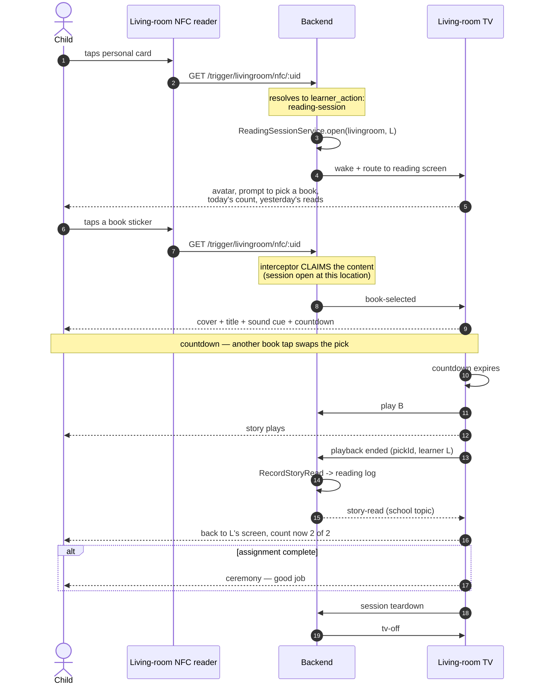
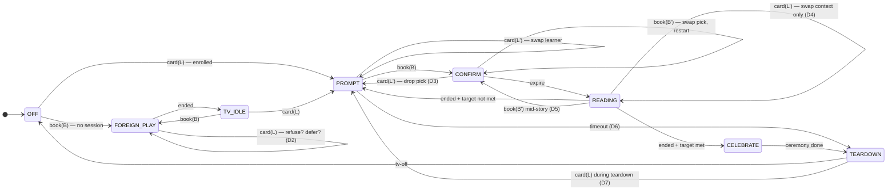
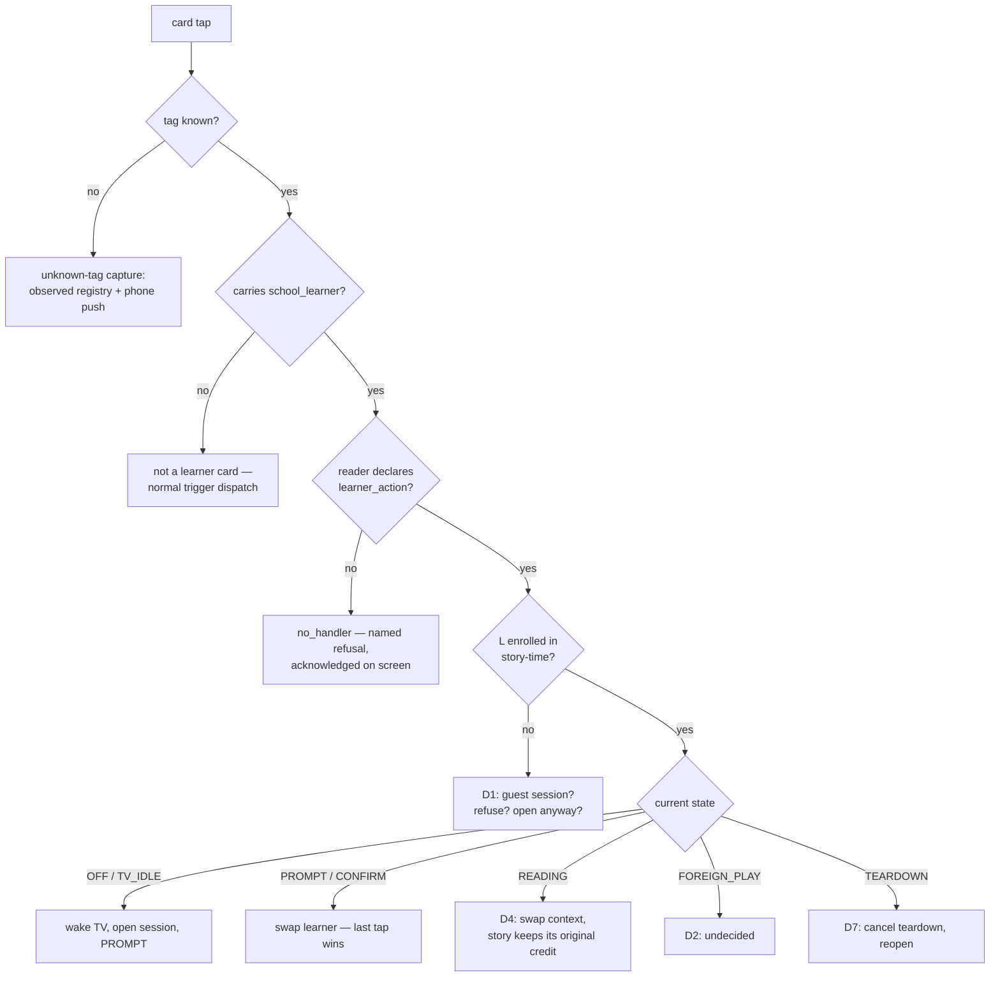
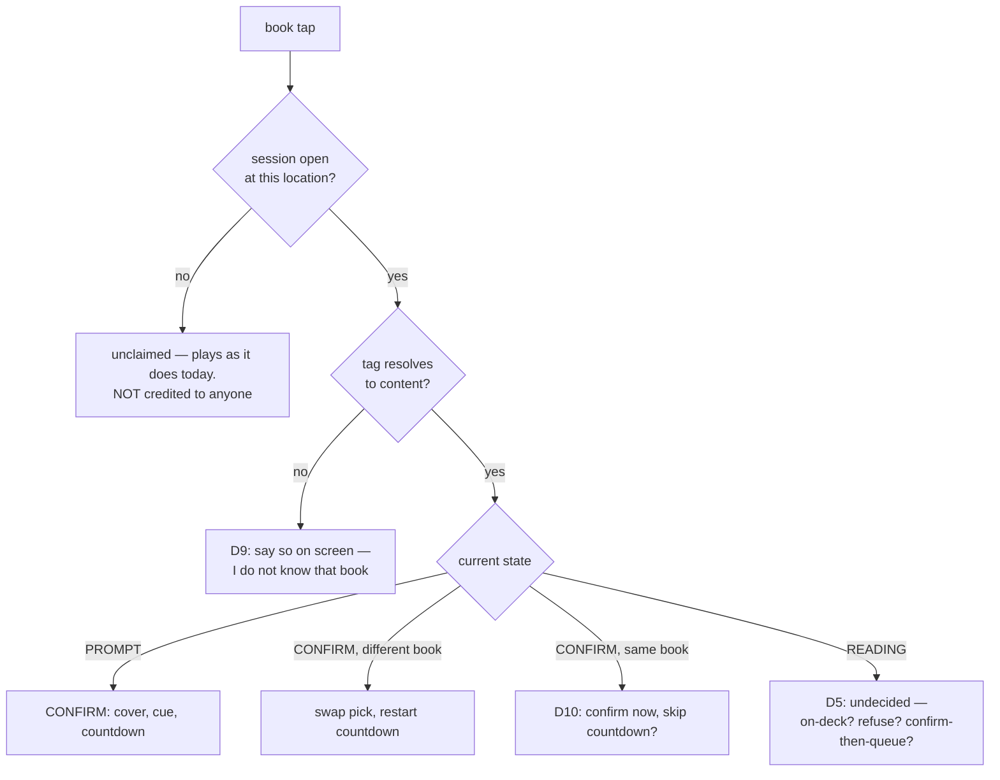

# Living-room reading sessions — lifecycle and state machine

> **Status:** design, not built. Implementation plan:
> `docs/_wip/plans/2026-08-26-preschool-reading-03-livingroom-session-screen.md`.
> This document is the authority on *behaviour*; the plan is the authority on *how*.

A preschooler taps their own NFC card on the living-room reader, the TV opens to a
screen scoped to them, they tap a book sticker, it plays, and finishing it counts
toward that day's reading assignment.

This document maps every state, every input, and — most importantly — the
transitions nobody had specified.

---

## 1. The alphabet

The whole feature has **three inputs** and **two ambient facts**. That is small
enough to enumerate exhaustively, which is why this document can claim coverage.

| Input | Source |
|---|---|
| `card(L)` | a personal NFC card, resolving to learner `L` |
| `book(B)` | a book NFC sticker, resolving to content `B` |
| `ended` | the player reports the current item finished |

Derived / internal:

| Input | Source |
|---|---|
| `expire` | the confirm countdown ran out |
| `unknown` | a tag that resolves to nothing |
| `timeout` | the session sat untouched too long |

| Ambient fact | Why it matters |
|---|---|
| TV power | decides whether a tap must wake it |
| Something already playing | decides whether a tap interrupts, queues, or is refused |

---

## 2. What already exists — read this before designing anything

**The queue already has a change-your-mind window, and it is not the one the
requirements describe.**

The living-room NFC source is configured `action: play-next`. That routes through
`ScreenActionHandler.handleMediaQueueOp` (`frontend/src/screen-framework/actions/ScreenActionHandler.jsx:199`),
which branches on whether a player is mounted:

- **No player mounted** → mount a fresh `Player` overlay. The book plays
  **immediately**. A repeat of the same content inside `MEDIA_DEDUP_WINDOW_MS`
  (**3 s**) is suppressed.
- **Player mounted** → dispatch `player:queue-op` into the running player
  (`frontend/src/modules/Player/Player.jsx:1233`), which then:
  1. refuses if the content is already playing → flashes the on-deck chip;
  2. refuses if the content is already on-deck → flashes;
  3. **if the current item has been playing for less than `preempt_seconds`
     (default 15 s, `backend/src/4_api/v1/routers/config.mjs:16`) → replaces it
     in place**;
  4. otherwise → pushes it **on-deck**, to play when the current item ends.

So today, tapping a second book 5 seconds in *swaps* it, and tapping one 5 minutes
in *queues* it. That is a genuinely good design for a grown-up putting on music.
It is **not** the requirement: the requirement is a countdown **before** anything
plays, during which the pick can be swapped.

**Consequence for this design:** the reading session must claim the book tap
*before* it reaches the queue (the content-interceptor seam, plan 03 Task 2), run
its own confirm countdown, and then hand exactly one item to the player. If it does
not, the confirm window and the preempt window are two competing mechanisms racing
on the same tap.

**The on-deck path is the sharper hazard.** Left unclaimed, a second book tapped
mid-story silently queues, and the child gets two stories with no confirmation and
no screen ever saying so.

**End-of-content teardown already exists.** `end: tv-off` on the location flows as
`endBehavior` + `endLocation` into the content query
(`WakeAndLoadService.mjs:275`), and `sideEffectHandlers['tv-off']`
(`backend/src/3_applications/trigger/sideEffectHandlers.mjs:21`) calls
`tvControlAdapter.turnOff(location)`. Step 8 of the happy path is therefore mostly
wiring, not new machinery — but see decision **D8**.

---

## 3. The happy path

---

## 4. States

| State | Meaning |
|---|---|
| `OFF` | TV off, no session |
| `TV_IDLE` | TV on, no session, nothing playing (menu or screensaver) |
| `FOREIGN_PLAY` | Content playing that no reading session started |
| `PROMPT` | Session open for `L`; "what do you want to read?" |
| `CONFIRM` | Book `B` picked for `L`; countdown running; nothing playing yet |
| `READING` | `B` playing, attributed to `L` |
| `CELEBRATE` | The read just completed `L`'s daily target |
| `TEARDOWN` | Returning to idle and powering the TV off |

`FOREIGN_PLAY` is deliberately its own state and not a flavour of `READING`. The
distinction — *did a reading session start this?* — decides whether a tap may
interrupt and whether a completion is credited. Collapsing them is how a family
movie ends up logged as somebody's homework.

---

## 5. The two hard inputs

### `card(L)` — who is standing at the reader

### `book(B)` — what to read

---

## 6. Transition matrix

Every state × every input. `—` means the input cannot arrive in that state.

| State | `card(L')` | `book(B')` | `ended` | `expire` | `timeout` |
|---|---|---|---|---|---|
| `OFF` | wake → `PROMPT` | plays → `FOREIGN_PLAY` | — | — | — |
| `TV_IDLE` | → `PROMPT` | plays → `FOREIGN_PLAY` | — | — | — |
| `FOREIGN_PLAY` | **D2** | existing queue rules | → `TV_IDLE` | — | — |
| `PROMPT` | swap learner | → `CONFIRM` | — | — | **D6** |
| `CONFIRM` | **D3** | swap pick / **D10** | — | → `READING` | **D6** |
| `READING` | **D4** | **D5** | → `CELEBRATE` or `PROMPT` | — | — |
| `CELEBRATE` | **D7** | **D7** | — | — | → `TEARDOWN` |
| `TEARDOWN` | **D7** | **D7** | — | — | → `OFF` |

Nine cells carry an open decision. They are the dangling branches.

---

## 7. Open decisions

Each needs an answer before plan 03 is built. Recommendations are mine; the
reasoning is stated so disagreeing is cheap.

### D1 — a card that is not enrolled in story-time
An older sibling's card is a valid learner card, and their reader action would
resolve. Options: refuse; open a session that logs reads but counts nothing; open
their normal school agenda instead.
**Recommend:** open a session with no target — reads are logged, nothing is
counted, the screen says "pick a book" without a score. Refusing a child who
correctly tapped their own card teaches the wrong lesson about the system.

### D2 — a card tapped while unrelated content is playing
A family movie is on and a child taps their card.
**Recommend: refuse, and say so.** The reading session must never seize the TV from
whoever is already watching it. Show a brief "not right now" acknowledgement on the
screen. The alternative — opening the session behind the movie — creates an
invisible session whose next book tap hijacks playback with no warning.

### D3 — a *different* card during the confirm countdown
**Recommend:** switch to `L'` and **drop the pick**, returning to `PROMPT`. A pick
belongs to the child who made it; silently transferring it to whoever tapped last
would credit the wrong child.

### D4 — a card tapped mid-story
Settled in conversation: the context switches, the story keeps playing, and it is
credited to the learner who **picked** it. Attribution is decided at pick time.
**Open sub-case:** if a book is *on-deck* when the context switches, whose is it?
**Recommend:** it was picked by the previous learner, so it stays theirs — or, if
D5 removes on-deck entirely, this sub-case disappears.

### D5 — a book tapped mid-story ⚠ the most consequential
Today's unclaimed behaviour: preempt if under 15 s, else on-deck. In a session that
means a child can silently queue a second story with no confirmation screen.
**Recommend: claim it and return to `CONFIRM`** — show the cover and countdown for
the *next* story while the current one plays, then queue exactly one item on
expiry. No silent queueing, one visible mechanism, and the on-deck race disappears.

### D6 — nobody picks a book
A session sitting open holds the TV on indefinitely.
**Recommend:** a visible idle timeout (~2 minutes) → `TEARDOWN`. The screensaver
alone is not enough; the session must actually close, or the next card tap lands in
a stale session belonging to someone who left.

### D7 — a tap during `CELEBRATE` or `TEARDOWN`
A race: teardown is in flight and someone taps.
**Recommend:** any tap **cancels teardown**. Powering the TV off under a child who
just tapped is the worst failure in this list, and the cost of getting it wrong the
other way is one extra idle timeout.

### D8 — does the TV always power off?
`end: tv-off` is configured on the whole `livingroom` location, so it fires for
**every** book tap, session or not. Today that is presumably desired. But teardown
after a reading session and teardown after a grown-up's audiobook may want
different behaviour, and the session needs to decide *when* teardown happens
(after the ceremony, not the instant playback ends).
**Recommend:** the session owns its own teardown and suppresses the location's
`end` behaviour while a session is open.

### D9 — an unregistered book tag inside a session
The Marvin K. Mooney tag was unregistered until 2026-08-26 and answered
`trigger-not-registered` — invisible to the child.
**Recommend:** inside a session, say it on screen — "I don't know that book yet" —
and still write the observed-registry entry and send the phone push so it can be
enrolled.

### D10 — the *same* book tapped again during the countdown
**Recommend:** treat it as "yes, this one" — confirm immediately and skip the rest
of the countdown. A child tapping the same book twice is expressing certainty, and
`MEDIA_DEDUP_WINDOW_MS` (3 s) would otherwise swallow it as a duplicate.

---

## 8. Failure paths

Not state transitions, but each must land somewhere visible.

| Failure | Behaviour |
|---|---|
| Content lookup fails (`api/v1/play/<id>` errors) | Player bails today. In a session: return to `PROMPT` with "that one didn't work" |
| TV fails to wake | The card tap must still answer; log and surface, never fail silent |
| Reading log write fails | The story still played. Surface it; do not claim a read that was not recorded |
| Backend restart mid-session | Session state is in-memory and is lost — correct, nobody is at the reader after a restart |
| Player remounts mid-story | Must not double-count. `pickId` dedup in `RecordStoryRead` (plan 03 Task 6) |
| `ended` fires twice | Same `pickId` dedup |

---

## 9. Invariants

1. **A read is credited only on completion**, never on pick or on play.
2. **Attribution is decided at pick time** and travels with the pick.
3. **No session, no credit.** An unclaimed book tap plays and counts for nobody.
4. **Every tap is acknowledged on screen** — the same rule the scan ceremony holds.
   A child who taps and sees nothing taps harder.
5. **A reading session never seizes the TV** from content already playing.
6. **One pick, one confirmation, one visible countdown.** No silent queueing.
