# Teacher — every flow a grown-up can drive

> **Code map:** [`frontend/src/modules/School/teacher/README.md`](../../../frontend/src/modules/School/teacher/README.md)
> — screen-element → file lookup. Read that when the question starts from
> something on screen. Read *this* when the question starts from a state:
> "the work is sitting in X — what can a teacher do about it?"

This document is the **complete state space of adult intervention** in School.
Every lifecycle a child's work passes through, every state it can rest in,
every transition out of that state, and — for each one — which human decision
reaches it, where that decision lives in the console, and what it costs in
authority.

It is derived from the state machines themselves, not from the feature list:
`sessions/sessionEvents.mjs#TRANSITIONS`, `agenda.mjs`'s obligation ladder,
`learnerDay.js#joinLearnerDay`, and the gate declarations in
`TeacherCapabilitySessions.mjs`. Where the model says a path exists, the path
exists whether or not a button does.

---

## 1. Who a teacher is, and what authority costs

A teacher is **config-declared, never age-derived**: `school.yml` → `teachers:`
lists roster ids, and `GET /teachers` resolves them against the live roster per
request. When the key is absent the gate falls back to any adult — role is
authority, and a pre-console install keeps working.

Three tiers of authority, and every write names its tier.

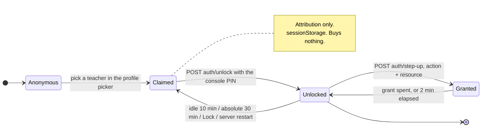

| Tier | Carrier | Lifetime | Buys |
|---|---|---|---|
| **Claim** | `sessionStorage`, client-side | until the tab closes | attribution on writes — nothing else |
| **Capability** | HttpOnly `SameSite=Strict` cookie | 10 min idle, 30 min absolute | every ordinary teacher write |
| **Step-up grant** | `X-Teacher-Step-Up` header | 2 min, **one use**, scoped to one action *and one resource id* | the seven high-consequence actions below |

The PIN exists only inside the prompt. It is never held in shared state, never
in `sessionStorage`, never in a log, and never in an ordinary mutation body; it
exists only in the prompt's own local state while it is being typed, and is
cleared when the prompt closes.

**The seven step-up actions** (`TeacherCapabilitySessions.mjs#STEP_UP_ACTIONS`),
with the resource each is scoped to:

| Action | Scoped to | Why it costs extra |
|---|---|---|
| `agenda.dispatch` | `learnerId` | mints tokens and drives a physical printer |
| `attempts.regrade` | `bankId` | rewrites what a batch of history *means* |
| `sessions.grade-adjust` | `sessionId` | overrides a machine verdict about a child |
| `sessions.grade-adjustment.retract` | `sessionId/adjustmentId` | withdraws that override |
| `sessions.settle` | `sessionId` | writes a mark **no machine produced** |
| `artifact.postview` | `artifactId` | renders a marked-up copy of a child's work |
| `report-card.close` | `learnerId/periodId` — **only when `supersede: true`** | replaces a record a family already has |

A first freeze of a period needs the capability only. Re-closing one needs a
grant, because the record already exists in someone's hands.

The Set and `teacherResource` must **agree**: `requiresTeacherStepUp` is
derived from the resource being non-null, so a name in the Set with no resource
branch requires nothing at all — a step-up that silently buys a free pass looks
exactly like one that works.

**That list is closed, and it is not the same vocabulary as the audit log.**
Every teacher write names an `action` when it calls `teacherGate.assert`, and
most of those names — `artifact.reprint`, `curriculum-exception.apply`,
`curriculum-exception.retract`, `sessions.reassign` — exist only to say what
was attempted in the log. A console that asks `POST auth/step-up` for one of
them is asking the server to mint a grant it has no definition for; the answer
is 403 and the only correct client behaviour is not to ask. Everything outside
the seven runs on the capability cookie, which is the full gate the routes
check.

**A 403 is a loop, not a wall.** `useTeacherWrite` invalidates the capability,
opens the PIN prompt, and replays the blocked call exactly once. A tap made
before any teacher is claimed is stashed and replayed after the picker
resolves; a *cancelled* picker drops the stash rather than firing it later as a
ghost write.

**Every path out of the PIN prompt settles the write that opened it.** A
refused step-up is retryable only while the PIN is still a plausible cause — a
wrong PIN, or a service the browser could not reach — and the dialog stays open
for another attempt. Once the server has accepted that PIN and still refused
the action, no PIN can help: the prompt closes and the caller is settled with
the server's own words, which surface as the panel's error. A refusal that
neither settles nor retries would leave the teacher with a dialog nothing can
close over a write that never resolves, and no error anywhere.

---

## 2. The navigation graph

Every URL is complete workspace state — deep-linkable, refresh-safe,
back-button-safe.

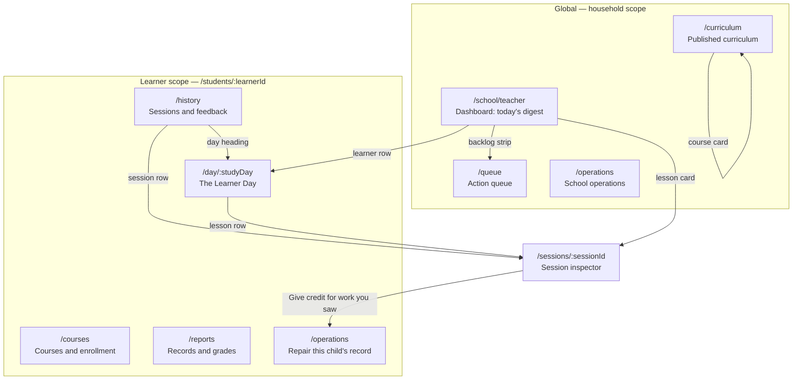

The interventions index renders in two places, and no longer on Curriculum
(trim wave 5.3): **School Operations** shows the four school-scoped entries,
and a student's **Operations** page shows all eight, learner-scoped. Curriculum
inspects published curriculum and links to Operations rather than re-rendering
the index; Operations is one click away via the global nav rail from any page.
The eight-entry chooser drawn in §14 is therefore the *student* Operations
view — School Operations draws the school-scoped four.

`/students/:id` is the canonical short form for the Day; `/students/:id/overview`
is a retired alias that the shell redirects there rather than 404ing (trim
wave 5.6) — the old bookmark still resolves, just at the canonical URL. A
learner id that is no longer on the roster renders a named "Student not found"
screen, not an empty page; an unparseable path renders "Page not found".

**The Learner Day is the organizing unit.** It joins two side-effect-free
reads — the plan (`agenda/preview?format=json&studyDay=…`) and the record
(`teacher/day?studyDay=…`) — through the pure `joinLearnerDay`. Previewing a
day never writes, for today or any other day.

---

## 3. The work-session lifecycle

This is the spine. A work session is an **append-only event log**; its state is
derived on every read, never stored. The transition table below is the closed
map — `TRANSITIONS` in `2_domains/school/sessions/sessionEvents.mjs`.

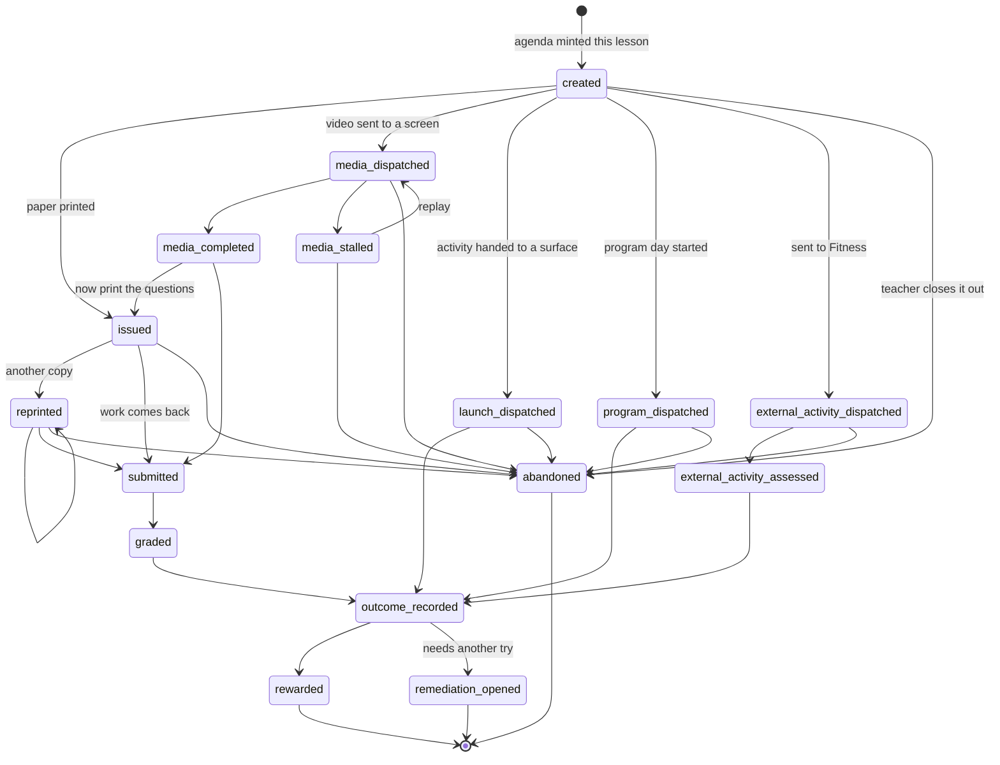

**Three terminal states**: `rewarded`, `remediation_opened`, `abandoned`.
Everything else is non-terminal and, by the reducer's own property test, has a
non-null `nextAction` — a state a child can be stuck in with no printed next
move is the failure this machine exists to forbid.

### Annotations — facts that do not advance the state

| Event | Meaning | Legal at a terminal state? |
|---|---|---|
| `failed` | a print attempt never reached paper | no |
| `reassigned` | the work belongs to a different child | yes |
| `grade_adjusted` / `grade_adjustment_retracted` | a teacher corrected the mark | yes |
| `reward_reconciled` / `reward_reconciliation_failed` | coins follow a corrected grade | yes |
| `result_receipt_captured` / `result_receipt_reprinted` | settlement evidence | yes |

`failed` is deliberately non-advancing: the same ticket stays valid, so the
next scan retries. It does not touch `lastPrintedAt`, so a print that failed is
retryable immediately rather than blocked by the cooldown.

`reassigned` is legal at a terminal state for the same reason `grade_adjusted`
is: it changes **attribution**, never lifecycle position. The wrong child's
name is usually discovered after the coins have been paid, and settled work
must not be the one work that can never be given back.

**Coins do not follow the move, and nothing moves them afterwards.** The ledger
is not rewritten by an attribution change and no code path debits one child to
credit another; a grown-up who wants the coins moved does that by hand. What the
move must not do is make a *later* correction pay the wrong child. So the
session's derived state tracks **who holds the coins** — set by the award, and
updated by any reconciliation that moves them — and a reversal debits that name
rather than whoever the session is credited to now. A balance back at zero is
held by nobody, so the next credit goes to whoever the work belongs to by then.
This applies to sessions rewarded before the field existed too: where the event
does not name a payee the reducer derives one, which is exact, because a
reassignment could not legally follow a reward until it became legal here.

### What a teacher can do, per state

| Session state | Teacher's move | Where | Gate |
|---|---|---|---|
| `created` | abandon with a reason | Operations → Stuck sessions | capability |
| `issued` / `reprinted` | reprint the exact artifact; abandon | Session inspector → Issued materials; Operations | capability |
| `media_dispatched` / `media_stalled` | abandon | Operations | capability |
| `submitted` | resolve the review items that block grading | Queue → Grading and review | capability |
| `graded` / `outcome_recorded`, and `submitted` with every question marked | settle it by hand — see §5 for what it cannot finish | Session inspector → Settle this by hand | **step-up** |
| `graded` | correct the mark; retract a correction | Session inspector → Fix a marked answer | **step-up** |
| `outcome_recorded` (`needs_remediation`), while no retake has been opened | offer another try | Session inspector → Offer another try | capability |
| `rewarded` | correct the mark — the effective grade and its reward reconcile | Session inspector | **step-up** |
| any | give credit for work the tech lost — attest the unit | Student → Operations | capability |
| any | move the work to the right child | Student → Operations | capability |

**Abandonment is not available everywhere.** `abandoned` is legal only from
`created`, `issued`, `reprinted`, `media_dispatched`, `media_stalled`,
`launch_dispatched`, `program_dispatched`, and
`external_activity_dispatched` — work that was handed out and never came back.
Work that came back settles through grading and close, never through
abandonment, and `MarkSessionAbandoned` refuses the difference by name. The
session inspector's **Settle this by hand** is the other half of that split:
*shown* on exactly the states abandonment is not — `submitted`, `graded`,
`outcome_recorded` — and shown as nothing at all elsewhere rather than as a
disabled button. Shown is not the same as guaranteed: whether a settle can
actually finish depends on whether a score can be derived, which only the
grading use case can answer. §5 lists both the cases it finishes and the three
it refuses.

---

## 4. The day: obligation, and what the dashboard says

Two vocabularies sit on one screen and they answer different questions. The
**obligation** is the planner's verdict about a subject. The **row status** is
the dashboard's verdict about a lesson.

### Obligation — per subject, per day

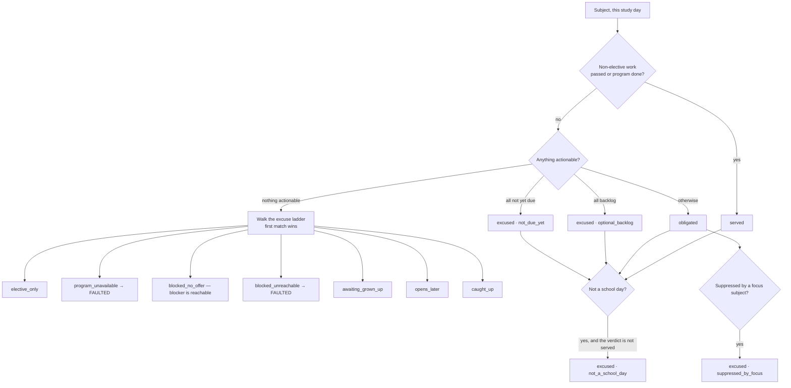

Four obligation states — `served`, `obligated`, `excused`, `faulted` — and the
*reason* is the whole point. `faulted` is reserved for two reasons only:
`program_unavailable` and `blocked_unreachable`. Everything else is an excuse
with a truthful name, because a date arriving on its own and a grown-up who can
be asked are not faults.

**The distinction that exists because of a real incident:** being blocked by a
sibling lesson the child can still reach *excuses* the day; being blocked by
something nothing can reach is a **fault**, and it logs
`school.agenda.blocked-unreachable`. A program that nothing can start is
reported, not planned.

| Obligation state | What it means for the teacher | The move |
|---|---|---|
| `served` | done — nothing owed | none |
| `obligated` | the day still owes this | let the child work it, or excuse/defer the lesson |
| `excused · caught_up` | there is no more of this course | assign more, or accept |
| `excused · awaiting_grown_up` | a dormant unit needs a grown-up to open it | act on the unit |
| `excused · opens_later` | a dated module has not opened | wait, or move the window |
| `excused · optional_backlog` | only catch-up work remains | optional |
| `excused · not_due_yet` | available but not due | optional |
| `excused · elective_only` | only electives are on offer | optional |
| `excused · blocked_no_offer` | locked behind a reachable sibling | clear the blocker, or excuse it |
| **`faulted · blocked_unreachable`** | locked behind something nothing can reach | **curriculum repair** |
| **`faulted · program_unavailable`** | the program itself cannot start | **fix the program** |

### Row status — per lesson, on the dashboard

`joinLearnerDay` decides progress from the planner's verdict, then a recorded
score, then the session state. Provenance is a *flag beside* the status, never
a status value — `status` means progress for every row.

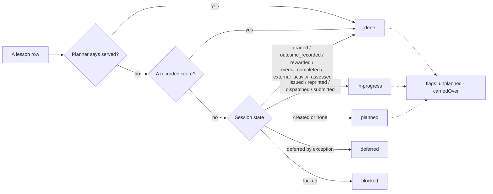

A recorded score outranks a missing `state`: marks exist only for work that
happened. A missing `artifacts` key is not an empty one — the "no worksheet"
sentence fires only when the field is present and both members are empty,
because announcing it on silence would invent a fact.

---

## 5. Grading, review, and correction

Four distinct mechanisms, deliberately not collapsed into one. Each writes a
different kind of evidence.

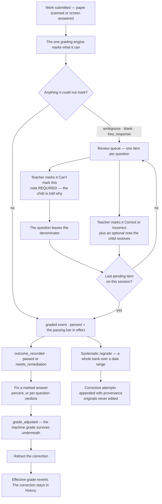

**The review queue.** Items carry the reason the machine gave up
(`ambiguous`, `blank`, `free_response`), the marking guide when the bank
authored one, the child's given answer, and how long they have been waiting. A
verdict plus an optional ≤120-character note — the same cap receipts and
agendas enforce, because the note is delivered to the child.

**Three verdicts, not two.** A teacher who genuinely cannot mark something —
an unreadable scan, a question that needs the child in the room — chooses
**Can't mark this** (`void`). That question leaves the score's **denominator**:
the percent becomes "of the questions we could mark", and the `graded` event
stamps `voidedItemIds` so a later reader can tell a 6-of-8 that was voided down
from nine apart from one that was always eight. A voided item is never counted
wrong, and it resolves its queue row like any other verdict, so it stops
holding the session open. **Its note is mandatory** — a question dropped from a
child's score without a sentence they can read is the silent verb this
household does not allow.

Voiding happens on the **review** lane only, because that is the lane a note
can travel on; a `void` sent to the grading call is refused and told where to
go. Marking a voided question `correct` or `incorrect` later **un-voids** it —
the question returns to the denominator.

If voiding leaves **nothing** markable, the session is not graded at all —
`graded` requires a total of at least one — and a hand-settle **refuses it too**,
for the same reason. **Marking one of those questions is the only way to reopen
the score**: nothing can manufacture a denominator out of nothing, and the
console reports the refusal rather than inventing a `0 of 0`. A session in that
state cannot be settled at all today; closing that needs a domain change.

A **grade correction** honours the same denominator. A question voided at
grading time stays out of the score when a later correction leaves it
`unchanged` — it is not re-scored as wrong — and re-enters the moment a
grown-up marks it `correct` or `incorrect`, which un-voids it exactly as the
grading lane does. The correction form offers no `void` option: `unchanged` is
how a still-unmarkable question is left alone.

With both finishers wired, resolving the **last** pending item of a session
grades and closes it in the same act. Without them, resolve-only.

**Corrections are annotations, never replacement grades.** The original
`graded` event remains machine evidence forever. `gradeAdjustments` accumulate;
the last non-retracted one is the effective interpretation that reports and
gates read. If both an effective percent and a passing bar exist, the *outcome*
re-derives too — a correction can turn `needs_remediation` into `passed`.

**The bar cannot move under a graded child.** `graded` stamps
`passingPercent` — the bar in effect at grading time. A later pass-override
edit is read by `CloseSessionOutcome` only for work not yet graded.

**Regrade is a different animal.** It re-runs the same `gradeAnswer` over
recorded attempts against the bank's *current* content, and appends corrective
attempts with `provenance: { kind: 'regrade', of, by, reason }`. Dry run by
default, reason required, self-graded flashcard rows skipped. Report cards are
**not** re-frozen — the report names the affected sessions so a teacher
supersedes deliberately.

| Correction mechanism | Scope | Writes | Gate |
|---|---|---|---|
| Resolve a review item | one question | queue verdict + child note | capability |
| Fix a marked answer | one session | `grade_adjusted` | **step-up** |
| Retract a correction | one adjustment | `grade_adjustment_retracted` | **step-up** |
| Systematic regrade | one bank × date range | corrective attempts | **step-up** |
| Settle it by hand | one session | `graded` + teacher note + `outcome_recorded` | **step-up** |

Four of the five are preview-first. Resolving a review item as `correct` or
`incorrect` applies on the **first tap** — the mark itself is the whole
decision and there is nothing to preview. `void` is the exception within that
row: it arms first, and will not commit until the note the child will read has
been written.

**Settling by hand** finishes work that came back and stalled on the way to an
outcome. One tap of **Settle it** does three things in this order:

1. `graded`, flagged `settle`, which is what buys it the step-up: a settle
   carries no verdicts, so without that flag it would meet no gate at all;
2. the mandatory reason is delivered **to the child** as a teacher note (the
   agenda's "Notes for you", the student panel);
3. `outcome_recorded`, because grading and stopping there would leave the
   session open and still on the stuck list.

The note is second, not first, and that is deliberate. The write that acts on
the child here is the **grade**, and the grade can refuse. Note-first meant a
child could read a sentence about a settlement that then did not happen — a
false sentence, which this house forbids more strongly than it demands the why
be early. Second still puts it ahead of everything the rule protects: ahead of
`outcome_recorded`, ahead of the printed receipt, ahead of anything that
reaches their day.

**What it can finish**, because these are the states the grade half accepts:

| Stuck at | What the grade half says | Result |
|---|---|---|
| `graded` — marked, never closed out | `duplicate` | closed out |
| `outcome_recorded` — settled, never rewarded | `duplicate` | re-settles, receipt reprints |
| `submitted` with every question already marked | `graded` | marked and closed out |

"Already marked" and "already settled" count as success — they name the state
the form is trying to reach.

**What it cannot finish, and where to go instead.** A settle derives a score;
it cannot invent one. Three stuck sessions land here and are refused, each with
the grading use case's own sentence rather than a generic failure:

| Stuck at | Refused because | The move that works |
|---|---|---|
| `submitted`, questions still pending | `awaiting_review` — a person still owes a verdict | Queue → Grading and review; the last verdict grades and closes it |
| `submitted`, every question voided | `unavailable` — no markable question, so no denominator | mark one voided question `correct`/`incorrect` in the review lane, which un-voids it |
| `submitted`, nothing to mark at all (a scan with no attempts) | `unavailable` — same reason | attest the unit under Student → Operations, which credits the work without a grade |

In every refusal **nothing is written and the child is told nothing**: no
decision was taken, so there is nothing to report to them. A settle that got
partway is never announced as a settle.

---

## 6. Paper — issuing, reprinting, and receipts

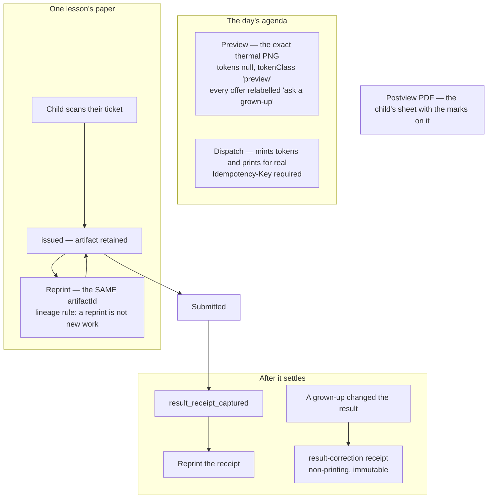

**Preview and dispatch are different verbs and must stay that way.** The
previewed sheet's QR and digit codes are inert *by construction* — nothing is
minted, for today or any day. Dispatch requires an `Idempotency-Key`; reusing
one with a different payload is an `IDEMPOTENCY_CONFLICT`, not a second print.

**A reprint reuses the original `artifactId`.** Reprinting under a fresh id
would make one worksheet look like two pieces of work. Worksheet availability
is `regenerable`: PDF, thumbnail, postview, and reprint are generated from the
artifact YAML by the current renderer while preserving the recorded Student
No. and rows. Historical replay never calls the allocation store.

**The print cooldown arms from confirmed prints only.** A `failed` annotation
never touches it, and an `issued` event carrying `confirmed: false` — a
simulator or preview path saying "I did not send this anywhere" — does not arm
it either. `firstIssuedAt` is set once and never moves, because a week-old
session reprinted this morning is still a week old.

**Answer cards.** A session's answer sheets carry a student number, capacity,
rows used, remaining contiguous slots, and warnings. A lost physical card has a
teacher-authorized recovery path: a 15-minute one-card ticket, then a
replacement that reissues **live allocations only** — settled work stays
immutable evidence, and each replacement prints successfully before the old
allocation is superseded, so a printer failure never destroys the child's only
usable copy.

### Print requests a child files

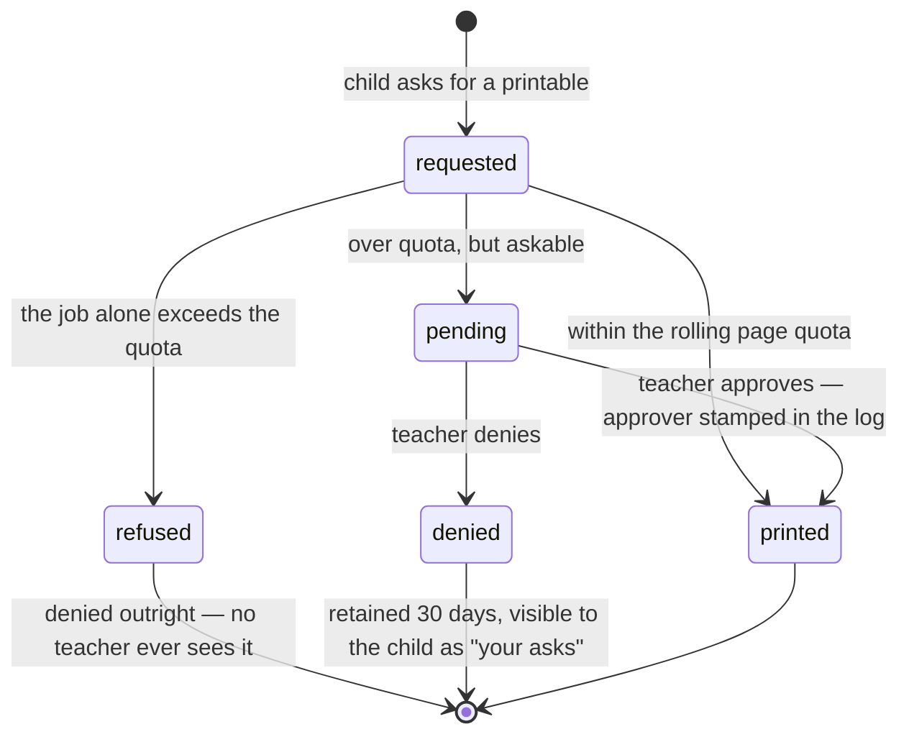

An approver can read the sheet before saying yes: `previewPrintable` is the
same resolve the print path uses, minus every side effect — no quota check, no
print, no log.

---

## 7. Enrollment — what a child is signed up for

Two layers, and conflating them is the classic mistake. **Assignment** is
"this course is on this child's list." **Enrollment** is a materialized
snapshot of a syllabus: module order, optional modules, a frozen `lessonOrder`,
and a copy of the progression policy.

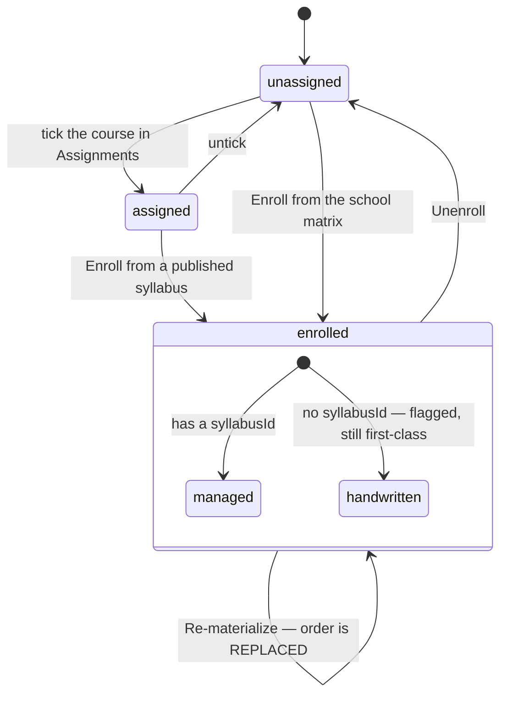

**Materialization is a snapshot, on purpose.** `lessonOrder` is persisted
precisely so a `shuffle_once` order cannot move under a child mid-course —
which means a later syllabus edit does not reach existing enrollments.
Re-materializing is the explicit act.

**Two refusals, same reason.** Re-materializing and unenrolling are both
refused while any session on that course is open: a lesson leaving the
enrollment under an open session strands that session forever, off the agenda
and impossible to finish.

**Structural changes are two-tap.** Enroll, re-materialize, and unenroll each
arm first with a sentence naming the consequence, then act.

**Three pathologies only the whole-school grid can see:**

| Pathology | What it looks like | Why it matters |
|---|---|---|
| **Dead reference** | an assignment naming a course the catalog no longer publishes | the planner silently omits that subject from the child's day |
| **Zero-enrollment course** | a published course no child is assigned | authored work nobody receives |
| **Orphan record** | an assignment record for an id not on the roster | a departed or renamed learner still holding courses |

Editing assignments **round-trips whatever the record already held**: a checked
id that carried an enrollment block keeps the entire object. Flattening it to a
bare id would silently destroy the enrollment. Stale ids the catalog no longer
publishes still render with a checkbox and a "not in catalog" tag — before
that, they were un-untickable and re-saved verbatim forever.

Concurrent-edit guard: the save carries `baseUpdatedAt` from the read the
editor started at, and a stale save is refused with a reload message rather
than clobbering.

---

## 8. Changing the curriculum for a child

Four decisions, one form, and the *effects* differ in exactly the way the names
promise.

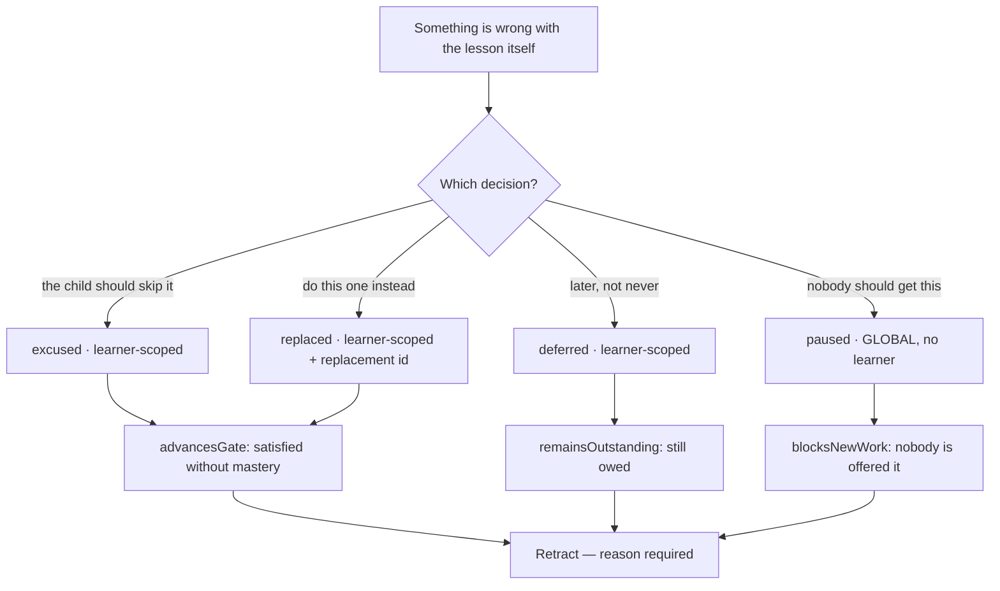

- `paused` is **global and cannot name a learner**, and its reason comes from a
  closed set: `defective`, `garbled`, `missing`, `broken`, `inappropriate`.
  A free-text reason is for the learner-scoped kinds.
- `replaced` requires a replacement lesson that exists in the catalog.
- A target can be a **lesson** or a whole **module**; a module target resolves
  to every published unit in it, optionally narrowed by course.
- **No default is preselected.** The most drastic decision must never be the
  zero-interaction path.
- Preview first, apply second. The preview states the gate effect in one line.

**Nothing here edits authored curriculum.** Exceptions are data with an audit
trail; courses stay reviewed YAML.

---

## 9. Overrides, credit, and the eraser

Three append-only logs, each its own evidence kind, each retractable, and the
differences between them are load-bearing.

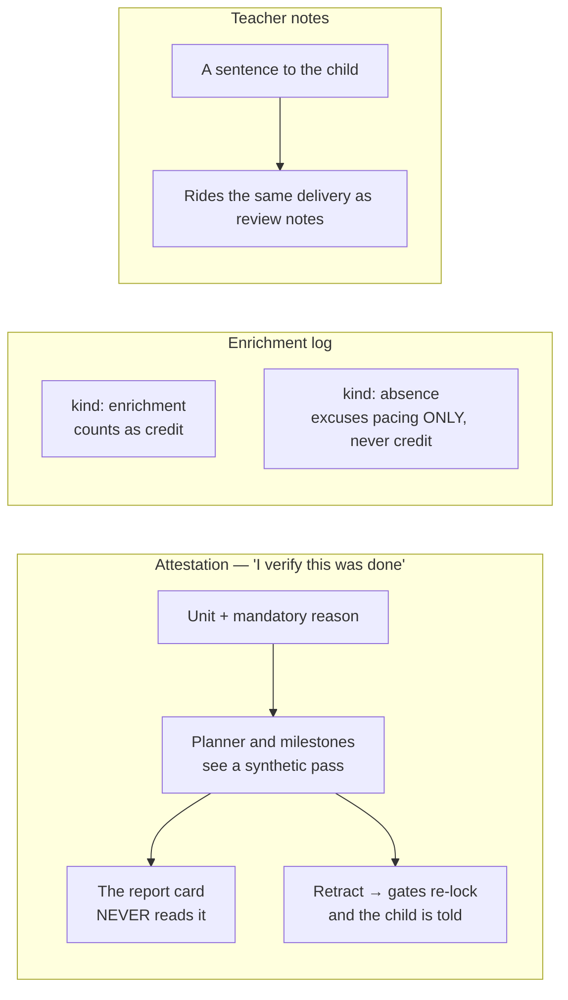

**Attestation is the "the tech failed a child who did the work" tool.** It
unlocks the next lesson for real — `BuildAgenda` and `ResolveSubjectNext` fold
an attested unit into history as a synthetic pass, and milestones count it met.
The report card deliberately never reads it: an override is its own evidence
kind, not an engine grade. And the **daily-serving layer reads raw history**,
so a repair day still offers the work.

Retracting an attestation re-locks the gates it opened *by construction* —
every reader folds retractions out. The child hears about it, rather than
discovering a lock reappeared.

**Pass-criteria overrides** are the fourth override surface: a per-unit bar
that beats the authored `passing.percent`. It is read at **grading** time and
stamped onto the `graded` event (`GradeSubmission`), so the bar cannot move
under a child who has already been graded; the close reads that stamp first and
falls back to the live override only for sessions graded before stamping
existed (`CloseSessionOutcome`). §7 states the same rule. A course-level bar is a bulk write over the same
per-unit store — one concept, not two. Garbage input must never become a
silent *clear* of a real override, so the field validates 1–100 before it
writes.

Two of the four are readable together in **Active overrides** — pass-criteria
overrides and attestations, each as its own group, showing what is overridden
right now, by whom, since when. Enrichment and notes have their own panels.

---

## 10. Attribution repair

The wrong child's name on a lesson is repaired by **moving the evidence
itself**, not by annotating around it. Which evidence there is to move decides
which of the two repairs applies — they are listed separately on Student →
Operations, and a piece of work appears under exactly one of them.

**Recorded answers — the attempt events move.**

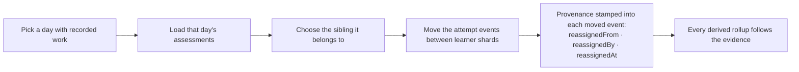

Destination shard is written first and gated: a corrupt destination refuses the
move rather than half-completing it.

**No recorded answers — the session is re-credited.** A program-served lesson,
paper a grown-up marked by hand, a launch outcome: there are no attempts to
move, and this is the only repair that reaches them. One `reassigned` event is
appended to the work session; nothing already written is edited, and every
derived read follows because the reducer takes the credited learner from the
annotation. The reason is **required** and stored in the event itself — a
best-effort audit trail can go missing, the log cannot. Both children are told
in their own feed, and the day's sessions are listed from the same
learner-sessions read the rest of the console uses.

A reassignment to the same learner is rejected outright by either route — it
records no fact and would still rewrite attribution downstream.

---

## 11. Periods and the permanent record

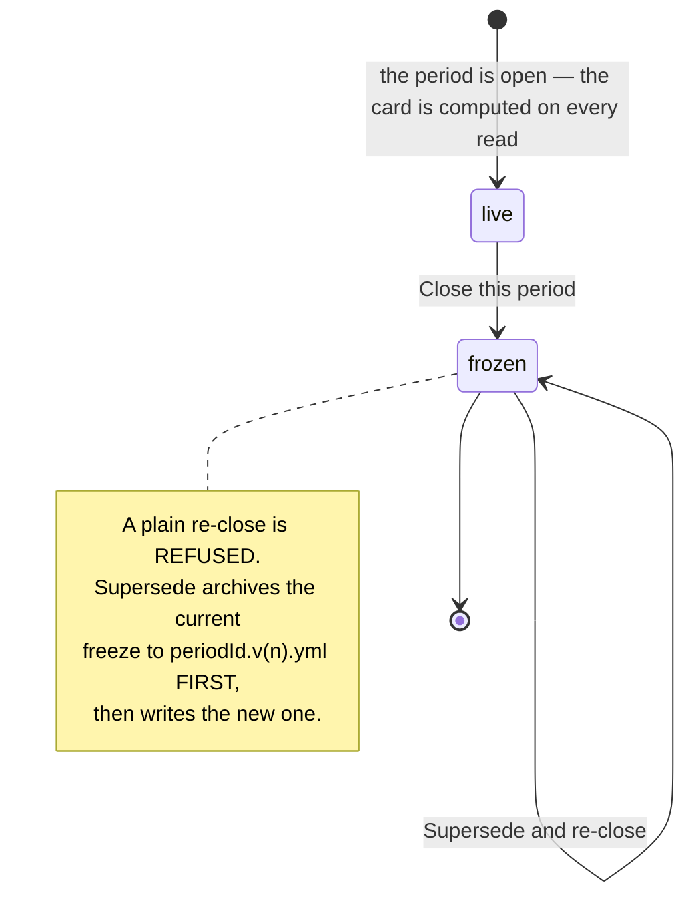

The confirm is honest *before* the act: it names the period and says how many
items still await a mark. Freezing lives below the live card, with the closed
periods — the most destructive verb on the page does not sit above the fold.

**Editing the calendar preserves boundaries.** Period instants carry a
timezone-offset time of day. An untouched date round-trips the original instant
verbatim; an edited date keeps the original time-of-day suffix. A label typo
fix can never shift a period boundary by hours. An existing period's **id is
settled** — renaming the label never silently rekeys the frozen records that
hang on it. Removing a period arms a warning first, because frozen report cards
keyed to it stop resolving.

**Clone forward a year** is next August's admin chore in one tap: dates shift
by a year, ids and labels bump the year where one appears, and paired spans go
`2026-27 → 2027-28`, never `2027-27`.

Documents that fall out of the record: the report card (live and frozen, with
`unresolvedUnits` flagged so catalog drift never erases grades), the transcript
PDF, the progress report where an enrichment-covered milestone reads
**excused — never delinquency**, the syllabus PDF, and a course-completion
certificate that **refuses a course with nothing graded** — no fabricated
diplomas.

---

## 12. What a child can ask for

Children file three kinds of request, and every one of them ends in a sentence
from a grown-up. This is the *no silent verbs about children* contract.

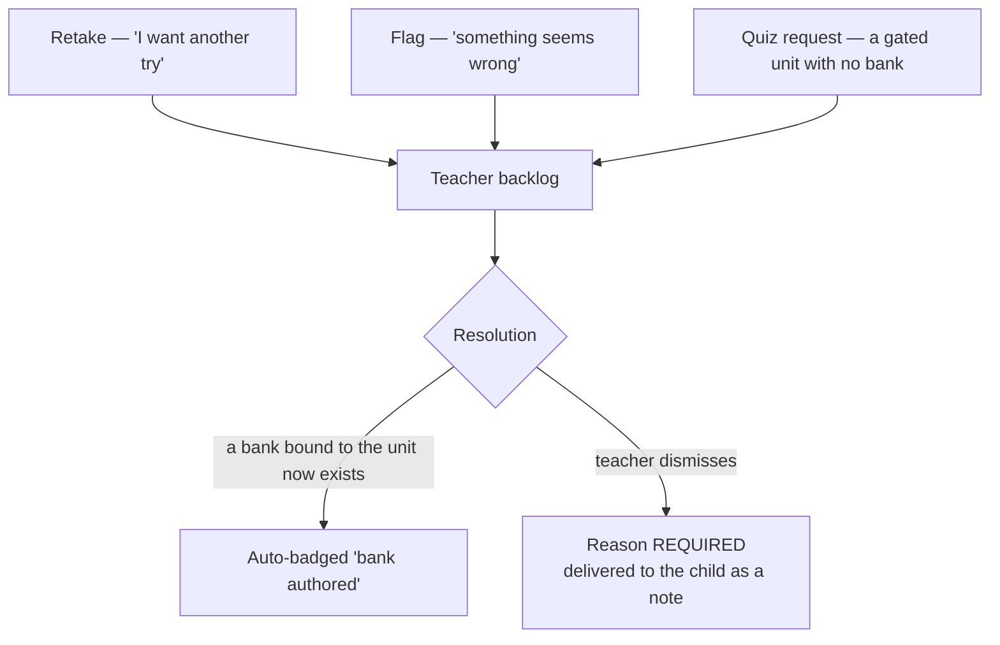

**Granting a retake does not clear the row.** `OpenRemediation` opens the fresh
session but removes nothing from the backlog; a dismissal is the only thing
that removes a row. Pre-existing behaviour, stated here so a row that outlives
its own grant does not read as a bug.

A dismissal without a reason is not possible: the reason *is* the delivery. The
dismissal targets exactly one row — kind and session id ride along, because a
retake ask and a flag on the same bank are different sentences.

---

## 13. Stuck work

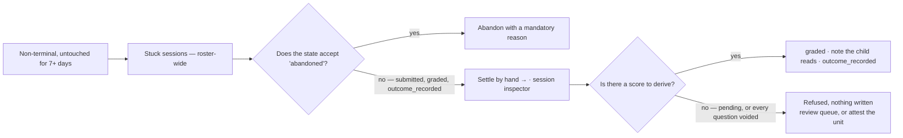

Household-scoped by design, not per-learner: a wedged session is an operational
leak whoever it belongs to, and the point is that somebody finally notices. A
nightly sweep closes out work that was handed to a child and never came back;
before it existed, the threshold on the manual route was never once consulted.

---

## 14. The intervention chooser

The one index of "something went wrong — what do I use?" Every tool has
**exactly one home**; the index is the only thing that lists them.

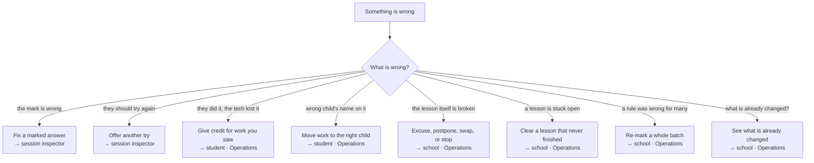

Use the **narrowest intervention that matches what actually happened**. Every
write is attributed and auditable.

---

## 15. Invariants this surface holds to

1. **No silent verbs about children.** Every adult action whose subject is a
   child produces one child-readable sentence. Dismissals, attestation
   retractions, and review verdicts all carry a note that is *delivered*, not
   filed. **Abandonment is the exception:** its reason is mandatory and is
   written into the event log, but nothing delivers it to the child. Closing
   that gap is outstanding — see §16.
2. **Preview before apply, everywhere consequential.** Exceptions, grade
   corrections and their retractions, regrades, agenda dispatch. Nothing
   consequential happens on a first tap. Review verdicts are deliberately not
   in this list (§5): `correct`/`incorrect` is the whole decision. Reprint is
   *documented* as preview-first but its apply half does not work — see §16.
3. **Append-only, always.** Nothing is edited in place. A correction is a new
   fact that outranks an old one; the old one stays readable.
4. **The record is not the presentation.** The machine grade survives under
   every correction. The report card ignores attestations. Regrades do not
   re-freeze report cards.
5. **A stale save is refused, never merged.** Assignments carry
   `baseUpdatedAt`; periods and milestones carry `baseHistoryLength`; grade
   adjustments carry `baseSeq`.
6. **Panels fail alone.** Every panel fetches independently across five states
   — `loading | error | empty | unavailable | ok`. One dead endpoint never
   blanks a page, and a 404 maps per read: a missing lifecycle route is
   `unavailable`, an unassigned learner is `empty`.
7. **Reads never write.** Agenda preview, report-card reads, and the print
   preview are side-effect-free by construction, not by convention.

---

## 16. Known gaps — what this surface does not do

This document is endstate and present-tense everywhere else. This section is
the exception, and it exists so that a gap is never invisible: a reference that
certifies a dead flow as working converts a real problem into one nobody can
find.

**An abandonment's reason is filed, not delivered.** `MarkSessionAbandoned`
requires the reason and writes it into the `abandoned` event, and that is where
it stops: nothing appends a note and nothing reads it back to the child. This
is the one place invariant 1 does not hold. Closing it needs a decision about
what a child should read when their work is abandoned, which has not been
taken.

**A retake that is abandoned strands the parent session** (audit A10). Once a
remediation has been opened, the console does not offer another, because the
server cannot honour one: `OpenRemediation` answers `already_opened` for any
session that has a remediation — live, abandoned, or never scanned — and
`remediation_opened` has no outgoing edge in the domain transition table, so a
second one is refused on append. A child who never scanned their ticket
therefore has no route back and no adult move that creates one. Closing this
requires a `TRANSITIONS` change to admit a second `remediation_opened` (or an
equivalent re-open annotation), plus a decision on how `variant` cycles across
it. Not attempted; the console correctly does not offer a move the domain
refuses.

**An all-voided sheet cannot be settled.** Covered in §5: `graded` requires a
denominator of at least one, so nothing can close the session. The console is
honest about the refusal and names the move that works.

---

## Related

- [`README.md`](README.md) — the school reference index; §"The teacher console"
- [`agenda-and-completion.md`](agenda-and-completion.md) — how sections, `servedToday`, and obligation are derived
- [`print-documents.md`](print-documents.md) — worksheets, receipts, OMR grading
- [`enrollment.md`](enrollment.md) — syllabi, materialization, progression policy
- [`operations.md`](operations.md) — day-to-day running
- [`../../runbooks/school/README.md`](../../runbooks/school/README.md) — troubleshooting, hardware, logs
