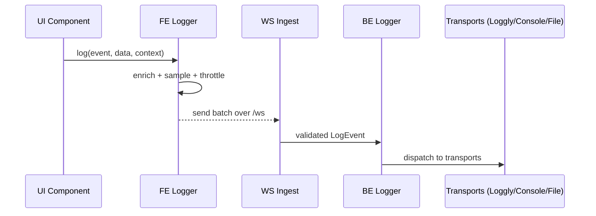
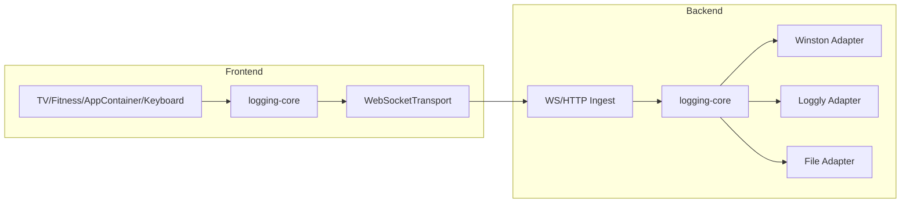

# DaylightLogger Platform

## Findings (current state)
- `playbackLogger` (frontend) offers structured payloads, sampling, throttling, and a WebSocket transport aimed at media events only; no provider abstraction and no shared schema across apps.
- `websocket.js` forwards playback logger traffic to Loggly via winston + optional Loggly transport; other frontend events and backend jobs bypass this path.
- `loggly-cli.js` pulls from Loggly but is not reusable as a transport; it duplicates config loading logic from the backend bootstrap.
- Logging gaps: UI/key interactions (keyboard handlers, TV menu stacks, Fitness kiosk flows) and app-shell transitions (`AppContainer`) are not captured. Backend cron/harvest endpoints rely on `console.log`, lack correlation IDs, and cannot be filtered by domain.
- `console.log` usage is widespread (scripts, backend libs such as harvest, strava, gmail, gcal, plex, infinity, budget, etc.). These should move behind a logger to add context and level control.

## Goals
- Single, provider-agnostic logging API ("DaylightLogger") usable by frontend (browser), backend (node services, cron), and scripts.
- Structured events with consistent schema: level, event name, message, context (component/app, user/session/request/job IDs), tags, data payload, sampling, and correlation IDs.
- Pluggable transports (Loggly today; future: file/stdout, HTTP, OTLP, S3). Minimal code changes when switching providers.
- Unified ingestion path: frontend sends over WebSocket/HTTP; backend dispatches directly to transports.
- Eliminate bare `console.log` in product code; preserve ergonomics for scripts/tests with a "console" sink.

## Proposed architecture
- **Core package (`/frontend/src/lib/logging` & `/backend/lib/logging`)**
  - `createLogger({ name, context, level, transports, formatter, sampling })` returns `{ debug, info, warn, error, child }`.
  - `LoggerContext`: immutable base fields (app, component, sessionId, requestId/jobId, device, user, version, env).
  - `LogEvent` shape: `{ ts, level, event, message?, context, data, tags, error?, sampling?, source }`.
  - `Transports` implement a simple interface: `send(LogEvent[]): Promise<void>` (batchable). Strategy/Adapter pattern isolates providers.
  - `formatters` produce human- and machine-friendly output; JSON is default.
- **Transports**
  - `ConsoleTransport` (dev/local), `BufferingWebSocketTransport` (browser → backend `/ws`), `HttpTransport` (fallback for WS), `WinstonTransportAdapter` (backend → winston), `LogglyTransportAdapter` (backend → Loggly), `FileTransport` (backend ops/cron optional).
- **Ingestion gateway (backend)**
  - Enhance existing `/ws` handler to accept generic `source` and `topic`; validate schema, enrich with server timestamp, and route through backend logger.
  - Provide `/logs` HTTP endpoint (authn limited) for non-WS clients.
- **Config**
  - **Cascading Configuration**: `config/logging.yml` defines a global default level and granular overrides by logger name (e.g., `backend.harvest: debug`, `frontend.player: warn`).
  - **Environment Overrides**: Support specific overrides via env vars (e.g., `LOG_LEVEL_BACKEND_HARVEST=trace`) to change behavior without code deploys.
  - **Runtime Control**: Frontend helper `DaylightLogger.setLevel('frontend.player', 'debug')` for on-the-fly adjustments during support sessions.
  - Shared defaults merged into env at bootstrap (centralized config loader).

### Flow (frontend → backend → provider)


### Component relationships


## Design details
- **Adapter pattern**: Each provider (Loggly, console, file, OTLP) implements `Transport`. Swapping providers means wiring different adapters; event schema stays stable.
- **Hierarchical Logging (Child Loggers)**:
  - Solves "context stuffing" by allowing modules to inherit context from their parent.
  - **Root**: Created at bootstrap with `{ env, app }`.
  - **Module**: `const log = root.child({ module: 'harvest' })`.
  - **Job/Request**: `const jobLog = log.child({ jobId: '123' })`.
  - Developers only log relevant info (`jobLog.info('done')`), but the final event contains the full chain: `{ env, app, module, jobId, msg: 'done' }`.
- **Sampling & throttling**: Keep existing playback throttling; expose per-event sampling (e.g., high-volume fitness sensor pings sampled at 10%).
- **PII/Secrets guard**: Allow a sanitizer hook to strip tokens/emails before emit.
- **Error handling**: `logger.error(event, { err: serialize(error) })` with stack capture. Batch failures fall back to console.
- **Schema** (suggested keys):
  - `ts` (ISO), `level`, `event`, `message`, `context` (app, component, sessionId, userId, requestId/jobId, device, env, version), `data` (structured payload), `tags` (string[]), `source` (frontend/backend/cron), `sampling`.

## Instrumentation plan
- **Keyboard/UI**
  - `useMediaKeyboardHandler`: emit `ui.key.action` with key, action, media id/title, queue position, paused state, and outcome (seek delta, skip direction). Capture ignored keys when paused to debug overlays. Use child logger `logger.child({ component: 'useMediaKeyboardHandler' })`.
  - `getKeyboardConfig`: log `ui.keyboard.config_loaded` (component type, overrides applied, resulting key count) at debug level.
- **TVApp**
  - Log menu navigation (`ui.tv.menu.navigate` with stack depth, selection), autoplay decisions (`ui.tv.autoplay` with source query, playlist/media key), back/escape handling, and WebSocket/playlist fetch errors.
- **FitnessApp**
  - Log mode switches (kiosk vs normal), collection selection, queue mutations, playback handoff to Player, touch/keyboard mix, and WebSocket connectivity used for fitness devices. Add sampling for high-frequency fitness sensor ingest events.
- **AppContainer**
  - Log app open/close (`ui.shell.open`) with app id/param, and wrap `DaylightAPI` actions (`wrapup`, `office_off`) with success/failure + latency.
- **Backend Harvest/Cron (`backend/harvest.js` + individual harvesters)**
  - Replace `console.log` with backend logger. Emit `harvest.start|success|fail` with `guidId`, harvester key, duration, and output size. Add per-harvester child loggers (todoist/gmail/gcal/strava/etc.). Include correlation to caller (if triggered by HTTP) and to cron job names.
- **WebSocket server**
  - Generalize to `logging-ingest`: validate schema, reject malformed messages, annotate source IP/user agent, and fan out to transports. Keep playback logs tagged `topic:fitness/playback/ui`.
- **Other candidates** (based on `console.log` scan)
  - Backend libs: `plex.mjs`, `infinity.js`, `budget.mjs`, `weather.js`, `clickup.js`, `strava.mjs`, etc.—replace printfs with structured job/component loggers.
  - Scripts (`scripts/debug-*.mjs`, `_extensions/fitness/*`): allow `ConsoleTransport` with optional file sink; still benefit from timestamps and levels.

## File impact (initial)
- Frontend: `frontend/src/modules/Player/lib/playbackLogger.js` (extract to generic logger), `frontend/src/lib/logging/index.js` (new), `frontend/src/lib/Player/useMediaKeyboardHandler.js`, `frontend/src/lib/keyboard/keyboardConfig.js`, `frontend/src/Apps/TVApp.jsx`, `frontend/src/Apps/FitnessApp.jsx`, `frontend/src/modules/AppContainer/AppContainer.jsx`.
- Backend: `backend/websocket.js` (ingest), `backend/harvest.js` + `backend/lib/*` harvesters, `backend/index.js` bootstrap for logging config, `scripts/loggly-cli.js` (refactor to reuse transport), cron entrypoints.
- Config: `config/logging.yml` (new), `config.secrets.yml` integration keys.

## Example API (frontend)
```javascript
// 1. Root Logger (App Shell)
import { createLogger } from '../lib/logging';
const rootLogger = createLogger({ 
  name: 'DaylightFrontend', 
  context: { env: 'prod', sessionId: 'sess_123' } 
});

// 2. Module Logger (TV App)
// Inherits: { env, sessionId } -> Adds: { app: 'TV' }
const tvLogger = rootLogger.child({ app: 'TV' });

// 3. Component/Interaction Logger
// Inherits: { env, sessionId, app } -> Adds: { component: 'Menu' }
const menuLogger = tvLogger.child({ component: 'Menu' });

// Usage
menuLogger.info('ui.tv.menu.navigate', { selection: 'settings' });

// Resulting Log Event:
// { 
//   level: 'info', 
//   event: 'ui.tv.menu.navigate', 
//   data: { selection: 'settings' },
//   context: { env: 'prod', sessionId: 'sess_123', app: 'TV', component: 'Menu' } 
// }
```

## Example API (backend)
```javascript
// 1. Root Logger (Bootstrap)
import { createLogger } from './lib/logging';
const rootLogger = createLogger({ 
  name: 'DaylightBackend',
  context: { env: process.env.NODE_ENV }
});

// 2. Module Logger (Harvest System)
const harvestLogger = rootLogger.child({ module: 'harvest' });

export async function runHarvestJob(key, req) {
  // 3. Job Logger (Specific Execution)
  // Inherits: { env, module } -> Adds: { jobId, harvester }
  const jobLogger = harvestLogger.child({ 
    jobId: crypto.randomUUID(), 
    harvester: key 
  });

  const start = Date.now();
  jobLogger.info('harvest.start', { triggeredBy: req ? 'http' : 'cron' });

  try {
    // Pass logger down so sub-functions log with the same jobId
    const result = await harvesters[key](jobLogger); 
    jobLogger.info('harvest.success', { duration: Date.now() - start });
  } catch (err) {
    // Error inherits all context automatically (env, module, jobId, harvester)
    jobLogger.error('harvest.fail', { error: err.message });
    throw err;
  }
}
```

## Implementation Plan

### Phase 1: Core Infrastructure & Ingestion
**Goal**: Establish the logging primitives and the pipeline from frontend to backend.
1.  **Scaffold Core Packages**:
    *   Create `frontend/src/lib/logging/` and `backend/lib/logging/`.
    *   Implement `createLogger` factory, `LoggerContext` merging logic, and `LogEvent` schema validation.
    *   Implement `ConsoleTransport` for local development.
2.  **Backend Transports**:
    *   Implement `WinstonTransportAdapter` to bridge to existing Loggly setup initially.
    *   Implement `LogglyTransportAdapter` for direct Loggly access (removing Winston dependency later).
3.  **Ingestion Gateway**:
    *   Update `backend/websocket.js`: Add handler for `logging` topic.
    *   Validate incoming events, enrich with server timestamp/IP, and dispatch to backend logger.

### Phase 2: Backend Migration (Harvest & Cron)
**Goal**: structured logging for all background jobs.
1.  **Bootstrap**: Initialize `rootLogger` in `backend/index.js`.
2.  **Harvest System**:
    *   Refactor `backend/harvest.js` to create a child logger per request/job.
    *   Update `harvesters[key](req)` signature to `harvesters[key](logger, req)`.
3.  **Library Instrumentation**:
    *   Replace `console.log` in `backend/lib/todoist.js`, `gmail.js`, `gcal.js`, `strava.mjs`, etc., with the passed logger instance.
4.  **Cron Jobs**:
    *   Update `backend/cron.mjs` to use a logger with `{ source: 'cron' }`.

### Phase 3: Frontend Migration (UI & Player)
**Goal**: Capture user interactions and media events.
1.  **Frontend Bootstrap**:
    *   Initialize `DaylightLogger` singleton in `frontend/src/lib/logging/index.js`.
    *   Implement `BufferingWebSocketTransport` to batch send events to `/ws`.
2.  **Player Migration**:
    *   Refactor `playbackLogger.js` to wrap `DaylightLogger`. Maintain backward compatibility for now.
3.  **UI Instrumentation**:
    *   **Keyboard**: Instrument `useMediaKeyboardHandler` to log key presses and actions.
    *   **TV App**: Log menu navigation and autoplay logic in `TVApp.jsx`.
    *   **Fitness**: Log kiosk mode transitions and sensor connection events in `FitnessApp.jsx`.
    *   **App Shell**: Log app switching in `AppContainer.jsx`.

### Phase 4: Advanced Features & Cleanup
**Goal**: Operational maturity.
1.  **Configuration**:
    *   Implement `config/logging.yml` loading and merging.
    *   Add environment variable overrides support.
2.  **HTTP Fallback**:
    *   Add `POST /api/logs` endpoint for clients where WebSocket fails.
3.  **Cleanup**:
    *   Grep for remaining `console.log` and replace or silence.
    *   Deprecate and remove old `playbackLogger` implementation details.
    *   Update `scripts/loggly-cli.js` to use the new shared config/transport logic.
